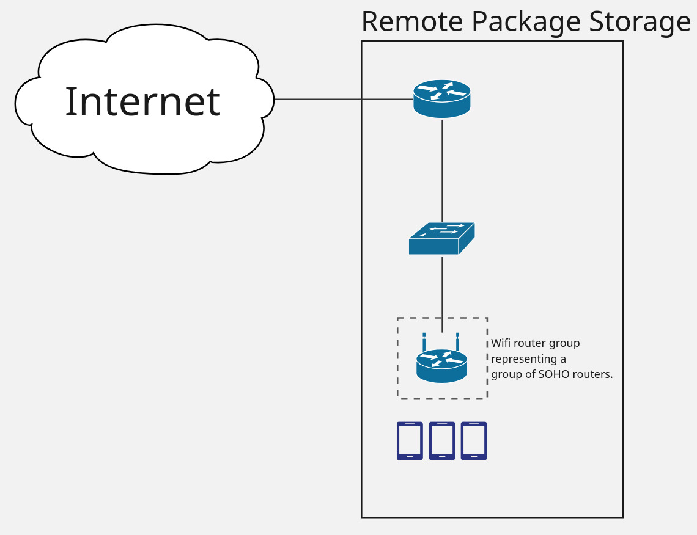
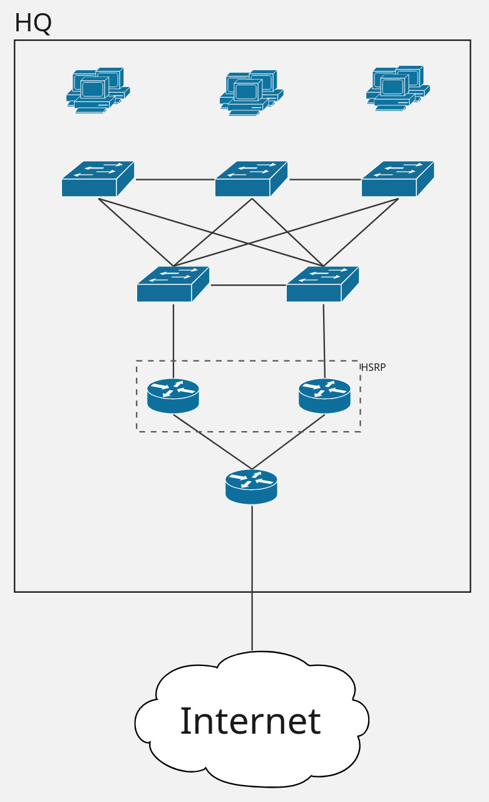
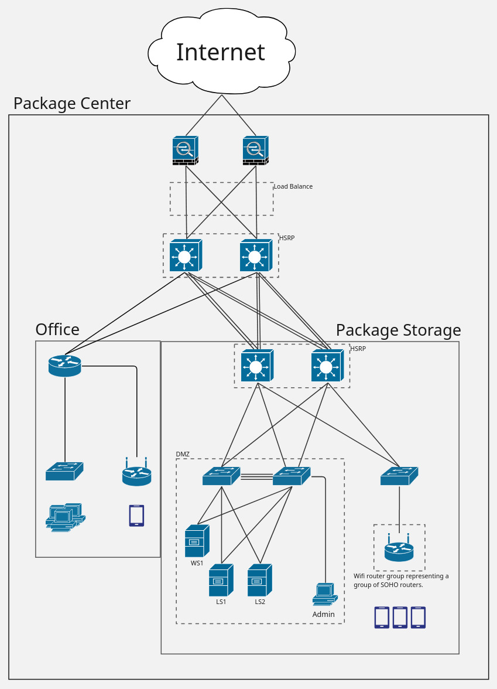

= Final Project
Pászti Tibor Miklós & Póra Dávid
include::utils.adoc[]

== Introduction

In this project we documented the network infrastructure 
of a package delivery company. Like https://gls-group.com/HU/hu/home/[GLS]
and https://www.foxpost.hu/[FOXPOST], this company delivers to 
package lockers.

There are three sites:

Headquarters:: This location is where the company handles acounting and development.
Remote Package Storage:: This location is for long term package storage.
Package Center:: This location houses the packages and the company servers, while also handling customer service
and in person package pick up.

<<<

== Project Management

=== Task Tracking
The task are tracked using https://trello.com/[Trello] with 
each task being assigned to one of three lists.

- *Todo*
- *In Progress*
- *Done*

The task naming convention is: *<category>: <topic>*

These categories are:

- *Documentation*
- *Network*
- *Linux server*
- *Windows server*

==== Automations

===== Labeling

- When a new task is created in the Todo list, this automation
labels the task depending on the category mentioned at the start
of the task name.

- When a task is dragged into the Done list the Done label
is automatically assigned.

===== miscellaneous

- When dragging a task from Todo to In Progress,
it automatically assigns the said person to the task.

=== Documentation
The documentation is written in https://asciidoctor.org/[Asciidoctor]
and converted into PDF. This document is stored on https://github.com/[Github]
for easier teamwork and version control.

Every addition to the documentation is a new branch that has the 
following naming convention:

- *Networking:* network/<site>/<topic>
- *Server:* server/<OS>/<topic>
- *Documentation:* docs/<topic>

When an addition is completed the person assigned to the task has to issue
a pull-request and the other party has to authorize it.
The main branch is protected and thus people can't push directly.

==== Github Actions

There is one workflow that is responsible for converting the 
Asciidoctor file to a PDF file for every branch on push and or pull requests.
This PDF file is uploaded as an artifact and can be downloaded in a zip file.
In the case of the main branch there is an additional feature 
that places the generated PDF file into the latest release.

[source, yaml]
----
name: Build documentation PDF

permissions:
  contents: write

on: [push, pull_request]

jobs:
  build-docs:
    runs-on: ubuntu-latest

    steps:
      - name: Checkout repository
        uses: actions/checkout@v4

      - name: Set up Ruby
        uses: ruby/setup-ruby@v1
        with:
          ruby-version: '3.2'

      - name: Install Asciidoctor PDF
        run: |
          gem install asciidoctor
          gem install asciidoctor-pdf

      - name: Build PDF
        run: |
          asciidoctor-pdf documentation.adoc

      - name: Upload PDF artifact
        uses: actions/upload-artifact@v4
        with:
          name: documentation-pdf
          path: documentation.pdf

      - name: Upload PDF to release
        uses: softprops/action-gh-release@v2
        if: github.event_name == 'push' && github.ref == 'refs/heads/main'
        with:
          tag_name: latest
          name: Latest Documentation
          files: documentation.pdf
----

<<<

== Network

=== Topology

.Remote Package Storage

.HQ

.Package Center

<<<

=== Vlans

[cols="^1,^1,^1""]
.HQ VLANs
|===
|Vlan ID    | Name          | Network 

|Vlan 110   | DEVELOPERS    | 10.1.10.0/24
|Vlan 120   | HR            | 10.1.20.0/25
|Vlan 130   | ACCOUNTING    | 10.1.30.0/26
|Vlan 140   | MARKETING     | 10.1.40.0/26
|Vlan 333   | MANAGEMENT    | 10.255.0.0/23
|Vlan 666   | TRASH         | -------
|===

[cols="^1,^1,^1""]
.Package Center VLANs
|===
|Vlan ID    | Name          | Network 

|Vlan 210   | WORKERS       | 10.2.10.0/23
|Vlan 220   | SERVERS       | 10.2.20.0/28
|Vlan 230   | FRONT_DESK    | 10.2.30.0/27
|Vlan 240   | GUEST         | 10.2.40.0/26
|Vlan 333   | MANAGEMENT    | 10.255.0.0/23
|Vlan 666   | TRASH         | -------
|===

[cols="^1,^1,^1""]
.Remote Package Storage VLANs
|===
|Vlan ID    | Name          | Network 

|Vlan 310   | WORKERS       | 10.3.10.0/23
|Vlan 333   | MANAGEMENT    | 10.255.0.0/23
|Vlan 666   | TRASH         | -------
|===

- In this network design, we have implemented VLANs 
to segment the network into different logical groups.

- Each VLAN has its own unique network address range, 
allowing for better organization and security.

- The VLANs are categorized based on their function. 
We use Vlan 333 for management purposes across all sites, 
and Vlan 666 is reserved for any unused ports for security reasons. 
This design helps to improve network performance and security 
by isolating different types of traffic and reducing broadcast domains.

- The vlan ids are following the network address 
numbering scheme for easier identification.

- The vlan ids are also following a pattern where the first digit 
represents the site (1 for HQ, 2 for Package Center, and 
3 for Remote Package Storage) and the last two digits represent the 
specific function of the vlan. This makes it easier to identify 
the purpose of each vlan at a glance.

=== IPv4 Addressing

[cols="^1,^1,^1,^1""]
.HQ IPv4 Addressing
|===
| Device    | Interface | Network Address   | Connected To 

| HQ-R1     | G0/2      | 58.29.102.53      | ISP1
|           | G0/0      | 10.200.3.1/30     | HQ-R3
|           | G0/1      | 10.200.3.5/30     | HQ-R2
|           | Lo0/1     | 10.255.1.1/23     | HQ-R2

| HQ-R2     | G0/1      | 10.200.3.6/30     | HQ-R1
|           | G0/0.10   | 10.1.10.1/24      | HQ-S1
|           | G0/0.20   | 10.1.20.1/25      | HQ-S1
|           | G0/0.30   | 10.1.30.1/26      | HQ-S1
|           | G0/0.40   | 10.1.40.1/26      | HQ-S1
|           | G0/0.333  | 10.255.1.2/23     | HQ-S1

| HQ-R3     | G0/1      | 10.200.3.2/30     | HQ-R1
|           | G0/0.10   | 10.1.10.2/24      | HQ-S2
|           | G0/0.20   | 10.1.20.2/25      | HQ-S2
|           | G0/0.30   | 10.1.30.2/26      | HQ-S2
|           | G0/0.40   | 10.1.40.2/26      | HQ-S2
|           | G0/0.333  | 10.255.1.3/23     | HQ-S2

| HQ-S1     | Vlan 333  | 10.255.1.4/23     | ----
| HQ-S2     | Vlan 333  | 10.255.1.5/23     | ----
| HQ-S3     | Vlan 333  | 10.255.1.6/23     | ----
| HQ-S4     | Vlan 333  | 10.255.1.7/23     | ----
| HQ-S5     | Vlan 333  | 10.255.1.8/23     | ----
|===

<<<

[cols="^1,^1,^1,^1""]
.Package Center IPv4 Addressing
|===
| Device    | Interface | Network Address   | Connected To 

| PC-ASA1   | G1/8      | 58.29.102.51      | ISP1
|           | G1/1      | 10.200.1.2/29     | PC-CORE-MLS1
|           | G1/2      | 10.200.2.2/29     | PC-CORE-MLS2
|           | Lo1/1     | 10.255.2.1/23     | ----
| PC-ASA2   | G1/8      | 58.29.102.52      | ISP2
|           | G1/1      | 10.200.1.3/29     | PC-CORE-MLS1
|           | G1/2      | 10.200.2.3/29     | PC-CORE-MLS2
|           | Lo1/1     | 10.255.2.2/23     | ----

| PC-CORE-MLS1  | Vlan 333 | 10.255.2.3/23  | ----
|               | Vlan 710 | 10.200.1.1/29  | ----
| PC-CORE-MLS2  | Vlan 333 | 10.255.2.4/23  | ----
|               | Vlan 720 | 10.200.2.1/29  | ----

| PC-O-R1   | G0/1      | 10.200.1.4/29 | MLS1 
|           | G0/2      | 10.200.2.4/29 | MLS2
|           | G0/0.30   | 10.2.30.1/27  | PC-O-S1  
|           | G0/0.40   | 10.2.40.1/26  | PC-O-S1
|           | Lo0/1     | 10.255.2.5/23 | ---- 

| PC-O-S1   | Vlan 333  | 10.255.2.6/23 | ----

| PC-O-WR1  | Internet  | 10.2.40.2/26  | PC-O-S1

| PC-S-MLS1 | Vlan 333  | 10.255.2.7/23 | ----
|           | Vlan 210  | 10.2.10.1/23  | ----
|           | Vlan 220  | 10.2.20.1/28  | ----
|           | Vlan 710  | 10.200.1.5/29 | ----
| PC-S-MLS2 | Vlan 333  | 10.255.2.8/23 | ----
|           | Vlan 210  | 10.2.10.2/23  | ----
|           | Vlan 220  | 10.2.20.2/28  | ----
|           | Vlan 720  | 10.200.2.5/29 | ----

| PC-S-S1   | Vlan 333  | 10.255.2.9/23 | ----
| PC-S-S2   | Vlan 333  | 10.255.2.10/23| ----
| PC-S-S3   | Vlan 333  | 10.255.2.11/23| ----

| PC-S-WR1  | Internet  | 10.2.10.1/23  | PC-S-S3 
| PC-S-WR2  | Internet  | 10.2.10.2/23  | PC-S-S3

| PC-Server1    | Fa0   | 10.2.20.10/23 | PC-S-S1
|               | Fa1   | 10.2.20.11/23 | PC-S-S2
| PC-Server2    | Fa0   | 10.2.20.20/23 | PC-S-S1
|               | Fa1   | 10.2.20.21/23 | PC-S-S2
| PC-Server3    | Fa0   | 10.2.20.30/23 | PC-S-S1
|               | Fa1   | 10.2.20.31/23 | PC-S-S2

| PC-Server3    | Fa0   | 10.2.20.100/23 | PC-S-S2
|===

[cols="^1,^1,^1,^1"]
.Remote Package Storage IPv4 Addressing
|===
| Device    | Interface | Network Address   | Connected To 

| RS-R1     | G0/2      | 58.29.102.54      | ISP1
|           | G0/0.310  | 10.3.10.1/23      | RS-S1
|           | G0/0.333  | 10.255.3.1/23     | RS-S1

| RS-S1     | Vlan 333  | 10.255.3.2/23     | ----

| RS-WR1    | Internet  | 10.3.10.2/23      | RS-S1
| RS-WR2    | Internet  | 10.3.10.2/23      | RS-S1
|===

=== IPv6 Addressing

.HQ IPv6 Addressing
[cols="^1,^1,^3,^2"]
|===
| Device | Interface | Network Address | Connected To

| HQ-R1
| G0/0
| 2020:2026:ACAD:1900::1/64
| HQ-R3

|
| G0/1
| 2020:2026:ACAD:1901::1/64
| HQ-R2

| 
| Lo0
| 2020:2026:ACAD:1333::1/64
| --

| HQ-R2
| G0/1
| 2020:2026:ACAD:1901::2/64
| HQ-R1

|
| G0/0.110
| 2020:2026:ACAD:1110::1/64
| HQ-S1

|
| G0/0.120
| 2020:2026:ACAD:1120::1/64
| HQ-S1

|
| G0/0.130
| 2020:2026:ACAD:1130::1/64
| HQ-S1

|
| G0/0.140
| 2020:2026:ACAD:1140::1/64
| HQ-S1

|
| G0/0.333
| 2020:2026:ACAD:1333::2/64
| HQ-S1

| HQ-R3
| G0/1
| 2020:2026:ACAD:1901::3/64
| HQ-R1

|
| G0/0.110
| 2020:2026:ACAD:1110::2/64
| HQ-S2

|
| G0/0.120
| 2020:2026:ACAD:1120::2/64
| HQ-S2

|
| G0/0.130
| 2020:2026:ACAD:1130::2/64
| HQ-S2

|
| G0/0.140
| 2020:2026:ACAD:1140::2/64
| HQ-S2

|
| G0/0.333
| 2020:2026:ACAD:1333::3/64
| HQ-S2

| HQ-S1
| Vlan333
| 2020:2026:ACAD:1333::10/64
| --

| HQ-S2
| Vlan333
| 2020:2026:ACAD:1333::11/64
| --

| HQ-S3
| Vlan333
| 2020:2026:ACAD:1333::12/64
| --

| HQ-S4
| Vlan333
| 2020:2026:ACAD:1333::13/64
| --

| HQ-S5
| Vlan333
| 2020:2026:ACAD:1333::14/64
| --
|===

.Package Center IPv6 Addressing
[cols="^1,^1,^3,^2"]
|===
| Device | Interface | IPv6 Address | Connected To

| PC-ASA1
| G1/1
| 2020:2026:ACAD:2710::2/64
| PC-CORE-MLS1

| 
| G1/2
| 2020:2026:ACAD:2720::2/64
| PC-CORE-MLS2

|
| Lo1
| 2020:2026:ACAD:2333::1/64
| --

| PC-ASA2
| G1/1
| 2020:2026:ACAD:2710::3/64
| PC-CORE-MLS1

|
| G1/2
| 2020:2026:ACAD:2720::3/64
| PC-CORE-MLS2

|
| Lo1
| 2020:2026:ACAD:2333::2/64
| --

| PC-CORE-MLS1
| Vlan333
| 2020:2026:ACAD:2333::10/64
| --

|
| Vlan210
| 2020:2026:ACAD:2210::1/64
| --

|
| Vlan220
| 2020:2026:ACAD:2220::1/64
| --

| PC-CORE-MLS2
| Vlan333
| 2020:2026:ACAD:2333::11/64
| --

|
| Vlan210
| 2020:2026:ACAD:2210::2/64
| --

|
| Vlan220
| 2020:2026:ACAD:2220::2/64
| --

| PC-O-R1
| G0/0.230
| 2020:2026:ACAD:2230::1/64
| PC-O-S1

|
| G0/0.240
| 2020:2026:ACAD:2240::1/64
| PC-O-S1

|
| Lo0
| 2020:2026:ACAD:2333::20/64
| --

| PC-O-S1
| Vlan333
| 2020:2026:ACAD:2333::12/64
| --

| PC-S-MLS1
| Vlan210
| 2020:2026:ACAD:2210::10/64
| --

|
| Vlan220
| 2020:2026:ACAD:2220::10/64
| --

| PC-S-MLS2
| Vlan210
| 2020:2026:ACAD:2210::11/64
| --

| 
| Vlan220
| 2020:2026:ACAD:2220::11/64
| --

| PC-S-S1
| Vlan333
| 2020:2026:ACAD:2333::13/64
| --

| PC-S-S2
| Vlan333
| 2020:2026:ACAD:2333::14/64
| --

| PC-S-S3
| Vlan333
| 2020:2026:ACAD:2333::15/64
| --
|===

.Remote Package Storage IPv6 Addressing
[cols="^1,^1,^3,^2"]
|===
| Device | Interface | IPv6 Address | Connected To

| RS-R1
| G0/0.310
| 2020:2026:ACAD:3310::1/64
| RS-S1

|
| G0/0.333
| 2020:2026:ACAD:3333::1/64
| RS-S1

| RS-S1
| Vlan333
| 2020:2026:ACAD:3333::10/64
| --
|===
