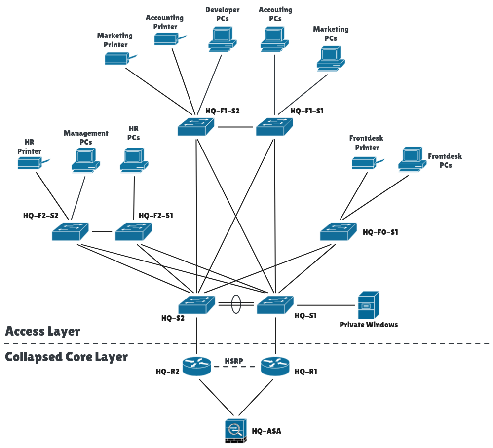

= Final Project
Pászti Tibor Miklós & Póra Dávid
include::utils.adoc[]

== Introduction

In this project we documented the network infrastructure 
of a package delivery company. Like https://gls-group.com/HU/hu/home/[GLS]
and https://www.foxpost.hu/[FOXPOST], this company delivers to 
package lockers.

There are three sites:

Headquarters:: This location is where the company handles acounting and development.
Remote Package Storage:: This location is for long term package storage.
Package Center:: This location houses the packages and the company servers, while also handling customer service
and in person package pick up.

<<<

== Project Management

=== Task Tracking
The task are tracked using https://trello.com/[Trello] with 
each task being assigned to one of three lists.

- *Todo*
- *In Progress*
- *Under Review*
- *Done*

The task naming convention is: *<category>: <topic>*

These categories are:

- *Documentation*
- *Network*
- *Linux server*
- *Windows server*

==== Automations

===== Labeling

- When a new task is created in the Todo list, this automation
labels the task depending on the category mentioned at the start
of the task name.

- When a task is dragged into the Done list the Done label
is automatically assigned.

===== miscellaneous

- When dragging a task from Todo to In Progress,
it automatically assigns the said person to the task.

<<<

=== Documentation
The documentation is written in https://asciidoctor.org/[Asciidoctor]
and converted into PDF. This document is stored on https://github.com/[Github]
for easier teamwork and version control.

Every addition to the documentation is a new branch that has the 
following naming convention:

- *Networking:* network/<site>/<topic>
- *Server:* server/<OS>/<topic>
- *Documentation:* docs/<topic>

When an addition is completed the person assigned to the task has to issue
a pull-request and the other party has to authorize it.
The main branch is protected and thus people can't push directly.

==== Github Actions

There is one workflow that is responsible for converting the 
Asciidoctor file to a PDF file for every branch on push and or pull requests.
This PDF file is uploaded as an artifact and can be downloaded in a zip file.
In the case of the main branch there is an additional feature 
that places the generated PDF file into the latest release.

<<<

== General

General configurations apply to all devices specified
in the given section across all sites.

=== Port-security Policies

.Port-security Policies
[cols="3,^1",options="header"]
|===
|Policy 
|Upon Violation

|All connections leading to host devices should
allow atmost 2 MAC addresses
|Restrict

|All connections leading to printers should
allow atmost 1 MAC address with the sticky setting
.2+.^|Shutdown

|All connections leading to servers should
allow atmost 1 static MAC address

|All unused ports should be shutdown and
placedinto the TRASH VLAN
|Null
|===

=== Duplex Connection Policies

.Duplex Connection Policies
[cols="3,^1",options="header"]
|===
|Devices                
|Duplex Mode

|Host/Printer devices   
|Half-duplex

|Server/Network devices 
|Full-duplex
|===

<<<

== HQ

=== Network

==== Topology

<<<

==== Vlans

[cols="1,1,1",options="header"]
.VLANs
|===
|Vlan ID    
|Name          
|Network 

|Vlan 110   
|DEVELOPERS    
|10.1.10.0/27

|Vlan 120   
|HR            
|10.1.20.0/26

|Vlan 130   
|ACCOUNTING    
|10.1.30.0/27

|Vlan 140   
|MARKETING     
|10.1.40.0/28

|Vlan 150   
|SERVER        
|10.1.50.0/29

|Vlan 160   
|FRONTDESK     
|10.1.60.0/28

|Vlan 333   
|MANAGEMENT    
|10.1.255.0/27

|Vlan 666   
|TRASH         
|Null
|===

===== VTP

VTP version 2 is configured between all switches, with
*HQ-S1 being the server* and all other switches 
taking up the client role.

.VTP Settings
[cols="1h,1",options="header"]
|===
|Setting    
|Parameter

|Domain     
|hq.vtp

|Password   
|vtppa55

|Version    
|2
|===

==== Etherchannel

Etherchannel is set up between HQ-S1 and HQ-S2, with LACP

.Etherchannel Connections and Roles
[cols="1,1,1",options="header"]
|===
|From (Active)  
|To (Passive)   
|Interfaces

|HQ-S1          
|HQ-S2          
|Fa0/23-24
|===

<<<

==== Rapid-PVST

Rapid-PVST is used between all the switches in the network.

switches, with HQ-S1 being the primary and 
HQ-S2 being the secondary root bridge in all VLANs.

[cols="1h,2",options="header"]
.Rapid-PVST Roles
|===
|Role       
|Device

|Primary    
|HQ-S1

|Secondary  
|HQ-S2
|===

==== HSRP

HSRP is set up between HQ-R1 and HQ-R2, with the 
HSRP address being the last host IP address in the
given network.

HQ-R1 is the active, with HQ-R2 being the standby device.

This is achieved through the following parameters:

.HSRP Parameters
[cols="1,1,1,1",options="header"]
|===
|Device 
|Priority   
|Version    
|Preempt

|HQ-R1  
|200        
.2+.^|2          
|True

|HQ-R2  
|100        
|False
|===

[cols="1,1",options="header"]
.HSRP IPv4 Addresses
|===
|VLAN       
|Address

|DEVELOPERS 
|10.1.10.30 

|HR         
|10.1.20.62 

|ACCOUTING  
|10.1.30.30 

|MARKETING  
|10.1.40.14 

|SERVER     
|10.1.50.6  

|FRONTDESK  
|10.1.60.14 

|MANAGEMENT 
|10.1.255.30
|===

<<<

==== IPv4 DHCP

The DHCP server is *Private Windows* host, 
providing IPv4 addresses for the following networks:

Both HQ-R1 and HQ-R2 are configured 
with *ip helper-address 10.1.50.5 (Private Windows server)*
on the following virtual interfaces:

* Gig0/1.110
* Gig0/1.120
* Gig0/1.130
* Gig0/1.140
* Gig0/1.160
* Gig0/1.333

[cols="1,1,1,1,1",options="header"]
.IPv4 DHCP Addressing
|===
|VLAN       
|Addressing Range   
|Number Of Hosts
|DNS    
|Default-gateway

|DEVELOPERS 
|10.1.10.3-29       
|28             
.6+.^|8.8.8.8
|10.1.10.30

|HR         
|10.1.20.3-60       
|58             
|10.1.20.62

|ACCOUNTING 
|10.1.30.3-28       
|26             
|10.1.30.30

|MARKETING  
|10.1.40.3-12       
|10             
|10.1.40.14

|FRONTDESK  
|10.1.60.3-12       
|10             
|10.1.60.14

|MANAGEMENT 
|10.1.255.15-29     
|15             
|10.1.255.30
|===

<<<

==== IPv4 Addressing

[cols="1,1,1,1",options="header"]
.IPv4 Addressing
|===
|Device             
|Interface  
|Address    
|Default Gateway

.2+.^|HQ-ASA             
|Gig1/1     
|172.16.0.2 
|Null

|Gig1/2     
|172.16.0.6 
|Null

.8+.^|HQ-R1              
|Gig0/1.110 
|10.1.10.1  
|Null        

|Gig0/1.120 
|10.1.20.1  
|Null        

|Gig0/1.130 
|10.1.30.1  
|Null        

|Gig0/1.140 
|10.1.40.1  
|Null        

|Gig0/1.150 
|10.1.50.1  
|Null        

|Gig0/1.160 
|10.1.60.1  
|Null        

|Gig0/1.333 
|10.1.255.1 
|Null        

|Gig0/2     
|172.16.0.1 
|Null        

.8+.^|HQ-R2              
|Gig0/1.110 
|10.1.10.2  
|Null        

|Gig0/1.120 
|10.1.20.2  
|Null        

|Gig0/1.130 
|10.1.30.2  
|Null        

|Gig0/1.140 
|10.1.40.2  
|Null        

|Gig0/1.150 
|10.1.50.2  
|Null        

|Gig0/1.160 
|10.1.60.2  
|Null        

|Gig0/1.333 
|10.1.255.2 
|Null        

|Gig0/2     
|172.16.0.5 
|Null        

.7+.^|HQ-R1:HQ-R2 HSRP   
|Gig0/1.110 
|10.1.10.30 
|Null        

|Gig0/1.120 
|10.1.20.62 
|Null        

|Gig0/1.130 
|10.1.30.30 
|Null        

|Gig0/1.140 
|10.1.40.14 
|Null        

|Gig0/1.150 
|10.1.50.6  
|Null        

|Gig0/1.160 
|10.1.60.14 
|Null        

|Gig0/1.333 
|10.1.255.30
|Null        

|HQ-S1              
.7+.^|VLAN 333   
|10.1.255.3 
|10.1.255.30

|HQ-S2              
|10.1.255.4 
|10.1.255.30

|HQ-F0-S1           
|10.1.255.5 
|10.1.255.30

|HQ-F1-S1           
|10.1.255.6 
|10.1.255.30

|HQ-F1-S2           
|10.1.255.7 
|10.1.255.30

|HQ-F2-S1           
|10.1.255.8 
|10.1.255.30

|HQ-F2-S2           
|10.1.255.9 
|10.1.255.30

|Private Windows    
|Gig0       
|10.1.50.5  
|10.1.50.6

|HR Printer         
.4+.^|Fa0        
|10.1.20.61 
|10.1.20.62

|Accounting Printer 
|10.1.30.29 
|10.1.30.30

|Marketing Printer  
|10.1.40.13 
|10.1.40.14

|Frontdesk Printer  
|10.1.60.13 
|10.1.60.14
|===

<<<

== Package Center

=== Network

==== Topology

<<<

==== Vlans

[cols="1,1,1"]
.VLANs
|===
|Vlan ID    
|Name              
|Network 

|Vlan 210   
|WORKERS           
|10.2.10.0/23

|Vlan 220   
|SERVER           
|10.2.20.0/28

|Vlan 230   
|FRONTDESK        
|10.2.30.0/27

|Vlan 331   
|CORE-MANAGEMENT   
|10.2.255.0/25

|Vlan 332   
|PS-MANAGEMENT     
|10.2.255.128/26

|Vlan 333   
|O-MANAGEMENT      
|10.2.255.192/26

|Vlan 666   
|TRASH             
|Null 
|===

==== Etherchannel

Etherchannel is set up between *PC-CORE-MLS1*, 
*PC-CORE-MLS2*, *PC-PS-MLS1* and *PC-PS-MLS2* with *LACP*
in the following ways:

.Etherchannel Connections and Roles
[cols="1,1,1,1",options="header"]
|===
|From (Active)  
|To (Passive)   
|Interfaces     
|Group

.2+.^|PC-CORE-MLS1   
|PC-PS-MLS1     
|Gig1/0/11-12   
|1

|PC-PS-MLS2     
|Gig1/0/13-14   
|2

.2+.^|PC-CORE-MLS2   
|PC-PS-MLS1     
|Gig1/0/21-22   
|3

|PC-PS-MLS2     
|Gig1/0/23-24   
|4
|===

==== Access Points

One access point is placed in the Office for the frontdesk
workers and two are placed in the Package Storage for the
storage workers, with the following configurations:

.Access Points
[cols="1,1,1,1,1,1",options="header"]
|===
|Device         
|SSID               
|Password 
|Authentication   
|Encryption
|Channel

|PC-O-AC1
|PC-Office
|officepa55
.3+.^|WPA2-PSK
.3+.^|AES
|6

|PC-PS-AC1
.2+.^|PC-Package-Storage
.2+.^|storagepa55
|4

|PC-PS-AC2
|8
|===

==== HSRP

HSRP is set up between PC-CORE-MLS1 and PC-CORE-MLS2, 
and PC-PS-MLS1 and PC-PS-MLS2 with the 
HSRP address being the last host IP address in the
given network.

PC-CORE-MLS1 and PC-PS-MLS1 is the active, 
with PC-CORE-MLS2 and PC-PS-MLS2 being the standby device.

This is achieved through the following parameters:

.HSRP Parameters
[cols="1,1,1,1",options="header"]
|===
|Device         
|Priority   
|Version    
|Preempt

|PC-CORE-MLS1   
|200        
.4+.^|2          
|True

|PC-CORE-MLS2   
|100        
|False

|PC-PS-MLS1     
|200        
|True

|PC-PS-MLS2     
|100        
|False
|===

// TODO
[cols="1,1",options="header"]
.HSRP IPv4 Addresses In CORE
|===
|VLAN       
|Address
|===

[cols="1,1",options="header"]
.HSRP IPv4 Addresses In Package Storage
|===
|VLAN           
|Address

|WORKERS        
|10.2.11.254 

|SERVER         
|10.2.20.14 

|PS-MANAGEMENT  
|10.2.255.190 
|===

<<<

== Remote Package Storage

=== Network

==== Topology

// image::images/remote_package_storage.jpg[align="center"]

<<<

==== Vlans

[cols="1,1,1",options="header"]
.VLANs
|===
|Vlan ID    
|Name          
|Network 

|Vlan 310   
|WORKERS       
|10.3.10.0/23

|Vlan 333   
|MANAGEMENT    
|10.3.255.0/24

|Vlan 666   
|TRASH         
|Null
|===
