= Final Project
Pászti Tibor Miklós & Póra Dávid
include::utils.adoc[]

== Introduction

In this project we documented the network infrastructure 
of a package delivery company called BitBox. Like https://gls-group.com/HU/hu/home/[GLS]
and https://www.foxpost.hu/[FOXPOST], this company delivers to 
package lockers.

There are three sites:

Headquarters:: This location is where the company handles acounting and development.
Remote Package Storage:: This location is for long term package storage.
Package Center:: This location houses the packages and the company webserver, while also handling customer service
and in person package pick up.

<<<

== Project Management

=== Task Tracking
The task are tracked using https://trello.com/[Trello] with 
each task being assigned to one of three lists.

- *Todo*
- *In Progress*
- *Under Review*
- *Done*

The task naming convention is: *<category>: <topic>*

These categories are:

- *Documentation*
- *Programming*
- *Network*
- *Linux server*
- *Windows server*

==== Automations

===== Labeling

- When a new task is created in the Todo list, this automation
labels the task depending on the category mentioned at the start
of the task name.

- When a task is dragged into the Done list the Done label
is automatically assigned.

===== miscellaneous

- When dragging a task from Todo to In Progress,
it automatically assigns the said person to the task.

<<<

=== Documentation
The documentation is written in https://asciidoctor.org/[Asciidoctor]
and converted into PDF. This document is stored on https://github.com/[Github]
for easier teamwork and version control.

Every addition to the documentation is a new branch that has the 
following naming convention:

- *Networking:* network/<site>/<topic>
- *Programming:* prog/<topic>
- *Server:* server/<OS>/<topic>
- *Documentation:* docs/<topic>

When an addition is completed the person assigned to the task has to issue
a pull-request and the other party has to authorize it.
The main branch is protected and thus people can't push directly.

==== Github Actions

There is one workflow that is responsible for converting the 
Asciidoctor file to a PDF file for every branch on push and or pull requests.
This PDF file is uploaded as an artifact and can be downloaded in a zip file.
In the case of the main branch there is an additional feature 
that places the generated PDF file into the latest release.

<<<

== General

General configurations apply to all devices specified
in the given section across all sites.

=== User and Password Policies

All network devices must handle login attempts through AAA in
the following ways (configured as the default list):

==== Login

. AAA should check the given RADIUS server
. AAA Should check the local user database

==== Dot1x

. AAA should check the given RADIUS server

More specific AAA configurations are specified within the given site.

NOTE: All sites must use RADIUS as their AAA server.

==== Passwords

All network devices must be configured with the following passwords:

.Device Passwords
[cols="1h,1,1",options="header"]
|===
|Place
|Password
|Applied As

|Priviliged 
|enpa55
|Secret

|Console
|conpa55
|Password

|Aux
|auxpa55
|Password
|===

==== Users

All network devices must be configured with the following user:

* *Username*: `admin`
* *Password*: `adminpa55`

.Users
[cols="1h,1,1",options="header"]
|===
|Place
|Username
|Password

|Local
|admin
|adminpa55

|AAA
|AAAadmin
|AAAadminpa55

|AAA
|user
|userpa55
|===

=== Remote Access Policy

Remote access is achieved through the SSH protocol,
available on all available VTY lines on the given device, using
the default AAA configuration.

SSH is configured with the following parameters:

.SSH Parameters
[cols="1h,1",options="header"]
|===
|Setting
|Parameter

|Version
|2

|Key Modulus
|2048

|Auth-retries
|2

|Timeout
|30sec
|===

NOTE: Only the MANAGEMENT Vlan and the like (in the case of the Package Center site)
can access the vty lines. This is controlled by the `SSH` ACL placed on all
vty lines inward. For further information, refer to <<hq_ssh, HQ SSH>> and
<<pc_ssh, Package Cetner SSH>>

=== Port-security Policies

==== General

.Port-security Policy
[cols="3,^.^1",options="header"]
|===
|Policy 
|Upon Violation

|All connections leading to host devices must
allow atmost 2 MAC addresses
|Restrict

|All connections leading to printers or access points 
must allow atmost 1 MAC address with the sticky setting
.2+.^|Shutdown

|All connections leading to servers must
allow atmost 1 static MAC address

|All unused interfaces must be shutdown and
placedinto the TRASH Vlan
|Null
|===

All access interfaces must be configured with an
aging time of 5 minutes.

==== Dot1x

All switch interfaces connecting to a
PC, laptop or server must use Dot1x port authentication
through the given AAA RADIUS server.

==== IP Source Guard

* IP source guard must be configured on all switches and 
multi-layer switches with connections to end devices.

* All printer and servers must be statically configured
with it's given MAC and IP address.

NOTE: For further information, refer to 
<<hq_ip_sg, HQ IP Source Guard>> and
<<pc_ip_sg, Package Center IP Source Guard>>

=== DHCP Snooping Policy

DHCP snooping must me configured on all switches globally with
a rate limit of `20` on untrusted interfaces.

NOTE: For further information, refer to 
<<hq_dhcp_snooping, HQ DHCP Snooping>> and 
<<pc_dhcp_snooping, Package Center DHCP Snooping>>

=== Dynamic ARP Inspection Policy

All interfaces leading to host, printer or server devices, 
should be treated as, untrusted (this applies to unused interfaces too).

Interfaces leading to other network devies should be treated as trusted.

ARP packets must be validated through the source and destination
MAC addresses. This is achieved with the following command:

.ARP Inspection
[source]
----
ip arp inspection validate src-mac dst-mac
----

NOTE: For further information, refer to 
<<hq_arp_inspection, HQ ARP Inspection>> and 
<<pc_arp_inspection, Package Center ARP Inspection>>

=== Duplex Connection Policy

As all of the devices are IEEE 802.3u/ab compliant,
all interfaces are set to `auto`, as industry standard.

NOTE: IEEE 802.3u defines FastEthernet, while IEEE 802.3ab defines GigabitEthernet

=== Miscellaneous Policies

. All network devices/servers must be configured with the correct hostname
stated in the documentation, found at the given site's topology section.

. All network devices must be configured with `no ip domain-lookup`
to avoid accidental DNS lookup while configuring the given device.

. All switch and multi-layer switch interfaces (in switch-port mode)
must be configured with `switchport nonegotiation`.

. All network devices must be configured with `service password-encryption`.

. All network devices must be configured with `no cdp run`.

<<<

== HQ

=== Network

==== Topology

image::images/hq.png[align="center"]

<<<

[#hq-vlans]
==== Vlans

[cols="1,1,1",options="header"]
.Vlans
|===
|Vlan ID    
|Name          
|Network 

|Vlan 110   
|DEVELOPERS    
|10.1.10.0/27

|Vlan 120   
|HR            
|10.1.20.0/26

|Vlan 130   
|ACCOUNTING    
|10.1.30.0/27

|Vlan 140   
|MARKETING     
|10.1.40.0/28

|Vlan 150   
|SERVER        
|10.1.50.0/29

|Vlan 160   
|FRONTDESK     
|10.1.60.0/28

|Vlan 333   
|MANAGEMENT    
|10.1.255.0/27

|Vlan 666   
|TRASH         
|Null
|===

===== VTP

VTP version 2 is configured between all switches, with
`HQ-S1` being the server and all other switches 
taking up the client role.

.VTP Settings
[cols="1h,1",options="header"]
|===
|Setting    
|Parameter

|Domain     
|hq.vtp

|Password   
|vtppa55

|Version    
|2
|===

[#hq-etherchannel]
==== Etherchannel

Etherchannel is set up between `HQ-S1` and `HQ-S2`, with LACP

.Etherchannel Connections and Roles
[cols="1,1,1",options="header"]
|===
|From (Active)  
|To (Passive)   
|Interfaces

|HQ-S1          
|HQ-S2          
|Fa0/23-24
|===

<<<

[#hq-rpvst]
==== Rapid-PVST

Rapid-PVST is used between all the switches in the network.

Switches, with `HQ-S1` being the primary and 
`HQ-S2` being the secondary root bridge in all Vlans.

[cols="1h,2",options="header"]
.Rapid-PVST Roles
|===
|Role       
|Device

|Primary    
|HQ-S1

|Secondary  
|HQ-S2
|===

===== BPDU Guard and Portfast

BPDU guard and portfast options are applied to
all end device facing interfaces.

These are:

.BPDU Guard and Portfast
[cols="1,1",options="header"]
|===
|Device
|Interface

|HQ-S1
|Gig0/2

.4+.^|HQ-F0-S1
|Fa0/10
|Fa0/11
|Fa0/20
|Fa0/24

.2+.^|HQ-F1-S1
|Fa0/10
|Fa0/16

.3+.^|HQ-F1-S2
|Fa0/10
|Fa0/20
|Fa0/24

|HQ-F2-S1
|Fa0/10

.2+.^|HQ-F2-S2
|Fa0/10
|Fa0/24
|===

===== Loop Guard

Loop guard is configured on all switches and multi-layer switches
globally in the case of a link's partial failure.

The interfaces configured with loop guard is as follows:

.Loop Guard Interfaces
[cols="1,1",options="header"]
|===
|Device
|Interface

.2+.^|HQ-S1
|Fa0/23
|Fa0/24

.2+.^|HQ-S2
|Fa0/23
|Fa0/24

.2+.^|HQ-F0-S1
|Fa0/1
|Fa0/2

.3+.^|HQ-F1-S1
|Fa0/1
|Fa0/2
|Gig0/1

.3+.^|HQ-F1-S2
|Fa0/1
|Fa0/2
|Gig0/1

.3+.^|HQ-F2-S1
|Fa0/1
|Fa0/2
|Gig0/1

.3+.^|HQ-F2-S2
|Fa0/1
|Fa0/2
|Gig0/1
|===

===== Root Guard

Only the switches `HQ-S1` and `HQ-S2` should 
participate in the root election process, and so
root guard are placed on the following interfaces:

.Root Guarded Interfaces
[cols="1,1",options="header"]
|===
|Device
|Interface

.5+.^|HQ-S1
|Fa0/1
|Fa0/11
|Fa0/12
|Fa0/21
|Fa0/22

.5+.^|HQ-S2
|Fa0/1
|Fa0/11
|Fa0/12
|Fa0/21
|Fa0/22
|===

[[hq_ip_sg]]
==== IP Source Guard

NOTE: IP source guard is paired with switchport port-security,
so that MAC addresses will also be checked.

===== Dynamic

Dynamic IP source guard is configured as follows:

.Dynamic IP Source Guard
[cols="1,1"]
|===
|Device
|Interface

|HQ-S1
|Gig0/2

.3+.^|HQ-F0-S1
|Fa0/10
|Fa0/11
|Fa0/24

.2+.^|HQ-F1-S1
|Fa0/10
|Fa0/16

.3+.^|HQ-F1-S2
|Fa0/10
|Fa0/20
|Fa0/24

|HQ-F2-S1
|Fa0/10

.2+.^|HQ-F2-S2
|Fa0/10
|Fa0/24
|===

===== Static

Static IP source guard is configured as follows:

.Static IP Source Guard
[cols="1,1,1,2,2",options="header"]
|===
|Device
|Interface
|IP
|MAC
|Name

|HQ-S1
|Gig0/2
|10.1.50.5
|00D0.9756.36C6
|Private Windows

|HQ-F0-S1
|Fa0/24
|10.1.60.13
|0003.E4D8.BC6D
|Frontdesk Printer

.2+.^|HQ-F1-S2
|Fa0/20
|10.1.30.29
|0010.1199.6748
|Accounting Printer

|Fa0/24
|10.1.40.13
|0010.1166.7675
|Marketing Printer

|HQ-F2-S2
|Fa0/24
|10.1.20.61
|0006.2ACE.3B8A
|HR Printer
|===

==== HSRP

HSRP is set up between `HQ-R1` and `HQ-R2`, with the 
HSRP address being the last host IP address in the
given network.

`HQ-R1` is the active, with `HQ-R2` being the standby device.

This is achieved through the following parameters:

.HSRP Parameters
[cols="1,1,1,1",options="header"]
|===
|Device 
|Priority   
|Version    
|Preempt

|HQ-R1  
|200        
.2+.^|2          
|True

|HQ-R2  
|100        
|False
|===

[cols="1,1",options="header"]
.HSRP IPv4 Addresses
|===
|Vlan       
|Address

|DEVELOPERS 
|10.1.10.30 

|HR         
|10.1.20.62 

|ACCOUTING  
|10.1.30.30 

|MARKETING  
|10.1.40.14 

|SERVER     
|10.1.50.6  

|FRONTDESK  
|10.1.60.14 

|MANAGEMENT 
|10.1.255.30
|===

<<<

==== DHCPv4

The DHCP server is the `Private Windows` host, 
providing IPv4 addresses for the following networks:

[cols="1,1,1,1,1",options="header"]
.IPv4 DHCP Addressing
|===
|Vlan       
|Addressing Range   
|Number Of Hosts
|DNS    
|Default-gateway

|DEVELOPERS 
|10.1.10.3-29       
|28             
.6+.^|10.2.20.10
|10.1.10.30

|HR         
|10.1.20.3-60       
|58             
|10.1.20.62

|ACCOUNTING 
|10.1.30.3-28       
|26             
|10.1.30.30

|MARKETING  
|10.1.40.3-12       
|10             
|10.1.40.14

|FRONTDESK  
|10.1.60.3-12       
|10             
|10.1.60.14

|MANAGEMENT 
|10.1.255.15-29     
|15             
|10.1.255.30
|===

<<<

[[#hq_dhcp_snooping]]
==== DHCP Snooping

DHCP snooping is configuration is illustrated with the 
following diagram:

image::images/hq-dhcp-snooping.png[align="center"]

This state is achieved with the following table of trusted ports:

.DHCP Snooping Trusted Interfaces
[cols="1,1",options="header"]
|===
|Device
|Interface

.9+.^|HQ-S1
|Fa0/1
|Fa0/11
|Fa0/12
|Fa0/21
|Fa0/22
|Fa0/23
|Fa0/24
|Gig0/1
|Gig0/2

.9+.^|HQ-S2
|Fa0/1
|Fa0/11
|Fa0/12
|Fa0/21
|Fa0/22
|Fa0/23
|Fa0/24
|Gig0/1
|Gig0/2

.2+.^|HQ-F0-S1
|Fa0/1
|Fa0/2

.3+.^|HQ-F1-S1
|Fa0/1
|Fa0/2
|Gig0/1

.3+.^|HQ-F1-S2
|Fa0/1
|Fa0/2
|Gig0/1

.3+.^|HQ-F2-S1
|Fa0/1
|Fa0/2
|Gig0/1

.3+.^|HQ-F2-S2
|Fa0/1
|Fa0/2
|Gig0/1
|===

NOTE: `HQ-R1` and `HQ-R2` are trusted devices because they use
the `Private Windows` server as the helper-address.

[[hq_arp_inspection]]
==== Dynamic ARP Inspection

ARP inspection is configured on the following devices:

.ARP Inspected Devices
[cols="1,1",options="header"]
|===
|Device
|Vlans

|HQ-S1
|150

|HQ-F0-S1
|160

|HQ-F1-S1
.2+.^|110,130,140

|HQ-F1-S2

|HQ-F2-S1
.2+.^|120,333

|HQ-F2-S2
|===

The trusted interfaces for these devices are:

.ARP Trusted Interfaces
[cols="1,1",options="header"]
|===
|Device
|Interface

.8+.^|HQ-S1
|Fa0/1
|Fa0/11
|Fa0/12
|Fa0/21
|Fa0/22
|Fa0/23
|Fa0/24
|Gig0/1

.2+.^|HQ-F0-S1
|Fa0/1
|Fa0/2

.3+.^|HQ-F1-S1
|Fa0/1
|Fa0/2
|Gig0/1

.3+.^|HQ-F1-S2
|Fa0/1
|Fa0/2
|Gig0/1

.3+.^|HQ-F2-S1
|Fa0/1
|Fa0/2
|Gig0/1

.3+.^|HQ-F2-S2
|Fa0/1
|Fa0/2
|Gig0/1
|===

==== OSPF

Network advertisement is achieved through single-area OSPF
illustrated by the following diagram:

image::images/hq-ospf.png[align="center"]

===== Default Route

`PC-ASA` is responsable for advertising the default route, 
wich is `11.11.11.1`.

===== Router-ID

The router-ids are created according to the following naming convention:

* The first three octets contain the OSPF area number repeated.

* The last octet contains the device's id withing the given OSPF area.

[cols="1,1",options="header"]
.Router-IDs
|===
|Device     
|Router-ID

|HQ-ASA
|0.0.0.3

|HQ-R1
|0.0.0.1

|HQ-R2
|0.0.0.2
|===

===== Passive Interfaces

All interfaces on all devices running an OSPF process, has 
all it's interfaces configured as passive with the following
command `passive-interface default`.

From that point on only the needed interfaces are selected 
to be allowed to participate in OSPF advertising.

These interfaces are:

[cols="1,1",options="header"]
.Active OSPF Interfaces
|===
|Device
|Interface

.2+.^|HQ-ASA
|Gig1/1
|Gig1/2

|HQ-R1
|Gig0/2

|HQ-R2
|Gig0/2
|===

==== AAA

The AAA RADIUS server is `Private Windows` (`10.1.50.5`) with the following clients:

* HQ-R1
* HQ-R2
* HQ-S1
* HQ-S2
* HQ-F0-S1
* HQ-F1-S1
* HQ-F1-S2
* HQ-F2-S1
* HQ-F2-S2

The passkey for all clients is `aaapa55`.

==== Access List

[[hq_ssh]]
===== SSH

All network devices serving SSH, must have an ACL
configured so that only the `MANAGEMENT` Vlan can 
connect to the VTY line.

This is achieved with the following ACL

.SSH Access
[source]
----
ip access-list standard SSH
    permit 10.1.255.0 0.0.0.31
----

This ACL must be applied onto all the VTY lines for all incoming messages.

===== VPN

The following ACL is configured to identify, which packets
should be routed within the VPN tunnel.

.VPN Traffic
[source]
----
access-list VPN-TRAFFIC extended permit ip object LOCAL object REMOTE
----

NOTE: For further information regarding these objects,
refer to <<hq_network_objects>>

==== Firewall

For the firewall we are using the ASA 5506, because of it's 
Gigabit capabilities.

===== Zones

The firewall is split into for zones, which is as follows:

[cols="1,1,1,1,2",options="header"]
|===
|Interface
|Zone
|Security-level
|Address
|Description

|Gig1/1
|INSIDE1
|100
|10.2.200.1
|Link to HQ-R1

|Gig1/2
|INSIDE2
|100
|10.2.200.5
|Link to HQ-R2

|Gig1/8
|OUTSIDE
|0
|11.11.11.2
|Link to ISP
|===

[[hq_network_objects]]
===== Network Objects

There are two network object, for easier ACL
creation and PAT configuration.

These are:

[cols="1,1,1",options="header"]
|===
|Name
|Network
|Mask

|LAN1
|10.1.0.0 
|255.255.0.0

|LAN2
|10.1.0.0 
|255.255.0.0

|LOCAL
|10.1.0.0
|255.255.0.0

|REMOTE
|10.2.0.0
|255.255.0.0
|===

NOTE: `LAN1` and `LAN2` are separated because NAT configuration
occurs inside the given network object which is dependent
on the zone, so `INSIDE1` and `INSIDE2` both needed a dedicated
network object.

===== PAT

PAT was set up for the zones, `INSIDE1` and `INSIDE2`.
The network objects responsible for them are `LAN1` and `LAN2`.

These two PAT configurations are used by the whole network
across two different uplinks (This is why the same configuration
is duplicated), and so they use the same address, which is `11.11.11.2`.

==== VPN

Site-to-site VPN is set up between `HQ-ASA` and `PC-ASA` with the 
following parameters:

[cols="1h,1",options="header"]
|===
|Setting
|Parameter

|Key Exchange
|IKEv1

|IPsec Protocol
|ESP

|Confidentiality
|AES

|Integrity
|SHA256

|Authentication
|PSK

|Pre-shared-key
|vpnpa55

|Diffie-Hellman
|DH2

|Lifetime
|1 Hour

|Peer
|12.12.12.2
|===

===== Transform-set

The transfrom-set is configured as such:

.VPN Transform Set
[source]
----
crypto ipsec ikev1 transform-set VPN-SET esp-aes 256 esp-sha-hmac
----

===== ACL

To detect the interesting traffic for the VPN connection
the following ACL is configured, named as `VPN-TRAFFIC`:

.VPN Traffic
[source]
----
access-list VPN-TRAFFIC extended permit ip object LOCAL object REMOTE
----

NOTE: For further information about the network objects, `LOCAL` and
`REMOTE`, refer to <<hq_network_objects>>

<<<

==== IPv4 Addressing

[cols="1,1,1,1",options="header"]
.IPv4 Addressing
|===
|Device             
|Interface  
|Address    
|Default Gateway

.2+.^|HQ-ASA             
|Gig1/1     
|10.1.200.1
|Null

|Gig1/2     
|10.1.200.5 
|Null

.8+.^|HQ-R1              
|Gig0/1.110 
|10.1.10.1  
|Null        

|Gig0/1.120 
|10.1.20.1  
|Null        

|Gig0/1.130 
|10.1.30.1  
|Null        

|Gig0/1.140 
|10.1.40.1  
|Null        

|Gig0/1.150 
|10.1.50.1  
|Null        

|Gig0/1.160 
|10.1.60.1  
|Null        

|Gig0/1.333 
|10.1.255.1 
|Null        

|Gig0/2     
|10.1.200.2 
|Null        

.8+.^|HQ-R2              
|Gig0/1.110 
|10.1.10.2  
|Null        

|Gig0/1.120 
|10.1.20.2  
|Null        

|Gig0/1.130 
|10.1.30.2  
|Null        

|Gig0/1.140 
|10.1.40.2  
|Null        

|Gig0/1.150 
|10.1.50.2  
|Null        

|Gig0/1.160 
|10.1.60.2  
|Null        

|Gig0/1.333 
|10.1.255.2 
|Null        

|Gig0/2     
|10.1.200.6 
|Null        

|HQ-S1              
|Vlan 333   
|10.1.255.3 
|10.1.255.30

|HQ-S2              
|Vlan 333   
|10.1.255.4 
|10.1.255.30

|HQ-F0-S1           
|Vlan 333   
|10.1.255.5 
|10.1.255.30

|HQ-F1-S1           
|Vlan 333   
|10.1.255.6 
|10.1.255.30

|HQ-F1-S2           
|Vlan 333   
|10.1.255.7 
|10.1.255.30

|HQ-F2-S1           
|Vlan 333   
|10.1.255.8 
|10.1.255.30

|HQ-F2-S2           
|Vlan 333   
|10.1.255.9 
|10.1.255.30

|Private Windows    
|Gig0       
|10.1.50.5  
|10.1.50.6

|HR Printer         
|Fa0        
|10.1.20.61 
|10.1.20.62

|Accounting Printer 
|Fa0        
|10.1.30.29 
|10.1.30.30

|Marketing Printer  
|Fa0        
|10.1.40.13 
|10.1.40.14

|Frontdesk Printer  
|Fa0        
|10.1.60.13 
|10.1.60.14

|Developer PCs
|Fa0        
.6+.^|DHCP
|10.1.10.30

|HR PCs
|Fa0        
|10.1.20.62

|Accounting PCs
|Fa0        
|10.1.30.30

|Marketing PCs
|Fa0        
|10.1.40.14

|Frontdesk PCs
|Fa0        
|10.1.60.14

|Management PCs
|Fa0        
|10.1.255.30
|===

<<<

== Package Center

=== Network

==== Topology

image::images/package_center.png[align="center"]

<<<

==== Vlans

[cols="1,1,1",options="header"]
.Vlans
|===
|Vlan ID    
|Name              
|Network 

|Vlan 210   
|WORKERS           
|10.2.10.0/24

|Vlan 220   
|SERVER           
|10.2.20.0/28

|Vlan 230   
|FRONTDESK        
|10.2.30.0/27

|Vlan 331   
|CORE-MANAGEMENT   
|10.2.255.0/25

|Vlan 332   
|PS-MANAGEMENT     
|10.2.255.128/26

|Vlan 333   
|O-MANAGEMENT      
|10.2.255.192/26

|Vlan 291
|INTER-LAYER-1
|10.2.200.0/29

|Vlan 292
|INTER-LAYER-2
|10.2.200.8/29

|Vlan 666   
|TRASH             
|Null 
|===

NOTE: The Vlans `INTER-LAYER-1` and `INTER-LAYER-2` are needed to
connect the distribution and core layer devices as they don't have 
a shared network.

==== Etherchannel

Etherchannel is set up between `PC-CORE-MLS1`, 
`PC-CORE-MLS2`, `PC-PS-MLS1` and `PC-PS-MLS2` with *LACP*
in the following ways:

.Etherchannel Connections and Roles
[cols="1,1,1,1",options="header"]
|===
|From (Active)  
|To (Passive)   
|Interfaces     
|Group

.2+.^|PC-CORE-MLS1   
|PC-PS-MLS1     
|Gig1/0/11-12   
|1

|PC-PS-MLS2     
|Gig1/0/13-14   
|2

.2+.^|PC-CORE-MLS2   
|PC-PS-MLS1     
|Gig1/0/21-22   
|3

|PC-PS-MLS2     
|Gig1/0/23-24   
|4
|===

==== Access Points

One access point is placed in the Office for the frontdesk
workers and two are placed in the Package Storage for the
storage workers, with the following configurations:

.Access Points
[cols="1,2,1,1,1,1",options="header"]
|===
|Device         
|SSID               
|Password 
|Auth   
|Encryption
|Channel

|PC-O-AC1
|PC-Office
|officepa55
.3+.^|WPA2-PSK
.3+.^|AES
|6

|PC-PS-AC1
.2+.^|PC-Package-Storage
.2+.^|storagepa55
|4

|PC-PS-AC2
|8
|===

NOTE: All access points are configured with a frequency
of 2.4GHz.

[[pc_ip_sg]]
==== IP Source Guard

NOTE: IP source guard is paired with switchport port-security,
so that MAC addresses will also be checked.

===== Dynamic

Dynamic IP source guard is configured as follows:

.Dynamic IP Source Guard
[cols="1,1",options="header"]
|===
|Device
|Interface

.2+.^|PC-PS-S1
|Fa0/1
|Fa0/24

.2+.^|PC-O-S1
|Fa0/1
|Fa0/24
|===

===== Static

Static IP source guard is configured as follows:

.Static IP Source Guard
[cols="1,1,1,2,2",options="header"]
|===
|Device
|Interface
|IP
|MAC
|Name

|PC-PS-S1
|Fa0/24
|10.2.20.10
|0060.7035.2DB1
|Private Linux

|PC-O-S1
|Fa0/24
|10.2.30.2
|00D0.BA5B.5C07
|Frontdesk Printer
|===

==== HSRP

HSRP is set up between `PC-PS-MLS1` and `PC-PS-MLS2` with the 
HSRP address being the last host IP address in the
given network.

`PC-PS-MLS1` is the active, with `PC-PS-MLS2` being the standby device.

This is achieved through the following parameters:

.HSRP Parameters
[cols="1,1,1,1",options="header"]
|===
|Device         
|Priority   
|Version    
|Preempt

|PC-PS-MLS1     
|200        
.2+.^|2          
|True

|PC-PS-MLS2     
|100        
|False
|===

[cols="1,1,1",options="header"]
.HSRP IPv4 Addresses In Package Storage
|===
|Vlan           
|Address
|Group Number

|WORKERS        
|10.2.10.254 
|0

|SERVER         
|10.2.20.14 
|1

|PS-MANAGEMENT  
|10.2.255.190 
|2
|===

==== DHCPv4
The DHCP server is the `Private Linux` host, 
providing IPv4 addresses for the following networks:

[cols="1,1,1,1,1",options="header"]
.IPv4 DHCP Addressing
|===
|Vlan       
|Addressing Range   
|Number Of Hosts
|DNS    
|Default-gateway

|WORKERS
|10.2.10.3-253       
|251             
.3+.^|10.2.20.10
|10.2.10.254

|FRONTDESK
|10.1.30.2-30
|29             
|10.2.30.1

|PS-MANAGEMENT 
|10.2.255.133-189
|57
|10.2.255.190
|===

<<<

[[pc_dhcp_snooping]]
==== DHCP Snooping

DHCP snooping is configuration is illustrated with the 
following diagram:

image::images/pc-dhcp-snooping.png[align="center"]

This state is achieved with the following table of trusted ports:

.DHCP Snooping Trusted Interfaces
[cols="1,1",options="header"]
|===
|Device
|Interface

.4+.^|PC-CORE-MLS1
|Gig1/0/11
|Gig1/0/12
|Gig1/0/13
|Gig1/0/14

.4+.^|PC-CORE-MLS2
|Gig1/0/11
|Gig1/0/12
|Gig1/0/13
|Gig1/0/14

|PC-O-S1
|Gig0/1

.6+.^|PC-PS-MLS1
|Gig1/0/1
|Gig1/0/2
|Gig1/0/11
|Gig1/0/12
|Gig1/0/21
|Gig1/0/22

.6+.^|PC-PS-MLS2
|Gig1/0/1
|Gig1/0/2
|Gig1/0/13
|Gig1/0/14
|Gig1/0/23
|Gig1/0/24

.3+.^|PC-PS-S1
|Fa0/24
|Gig0/1
|Gig0/2

.2+.^|PC-PS-S2
|Gig0/1
|Gig0/2
|===

[[pc_arp_inspection]]
==== Dynamic ARP Inspection

ARP inspection is configured on the following devices:

.ARP Inspected Devices
[cols="1,1",options="header"]
|===
|Device
|Vlans

|PC-PS-S1
|220,332

|PC-O-S1
|230
|===

The trusted interfaces for these devices are:

.ARP Trusted Interfaces
[cols="1,1",options="header"]
|===
|Device
|Interface

.2+.^|PC-PS-S1
|Gig0/1
|Gig0/2

|PC-O-S1
|Gig0/1
|===

<<<

==== OSPF

Network advertisement is achieved through multi-area OSPF
illustrated by the following diagram:

image::images/pc-ospf.png[align="center"]

NOTE: Etherchannels are simplified into one logical connection.

===== Default Route

`PC-ASA` is responsable for advertising the default route, 
wich is `12.12.12.1`.

<<<

===== Router-ID

The router-ids are created according to the following naming convention:

* The first three octets contain the OSPF area number repeated.

* The last octet contains the device's id withing the given OSPF area.

[cols="1,1,1",options="header"]
.Router-IDs
|===
|Device     
|Area   
|Router-ID

|PC-ASA
.3+.^|0
|0.0.0.3

|PC-CORE-MLS1
|0.0.0.1

|PC-CORE-MLS2
|0.0.0.2

|PC-PS-MLS1
.2+.^|1
|1.1.1.1

|PC-PS-MLS2
|1.1.1.2

|PC-O-R1
|2
|2.2.2.1
|===

===== Passive Interfaces

All interfaces on all devices running an OSPF process, has 
all it's interfaces configured as passive with the following
command `passive-interface default`.

From that point on only the needed interfaces are selected 
to be allowed to participate in OSPF advertising.

These interfaces are:

[cols="1,1",options="header"]
.Active OSPF Interfaces
|===
|Device
|Interface

.5+.^|PC-CORE-MLS1
|Gig1/0/1
|Gig1/0/5
|Vlan 291
|Vlan 292
|Vlan 331

.5+.^|PC-CORE-MLS2
|Gig1/0/1
|Gig1/0/5
|Vlan 291
|Vlan 292
|Vlan 331

|PC-PS-MLS1
|Vlan 291

|PC-PS-MLS2
|Vlan 292

.2+.^|PC-O-R1
|Gig0/1
|Gig0/2

|===

==== Access List

[[pc_ssh]]
===== SSH

All network devices serving SSH, must have an ACL
configured so that only the `MANAGEMENT` Vlan can 
connect to the VTY line.

The Package Center site is split into three
`MANAGEMENT` Vlans due to seperate broadcast domains,
so the ACL will accept the traffic if it is from
any of the three `MANAGEMENT` Vlans.

.SSH Access
[source]
----
ip access-list standard SSH
    permit 10.2.255.0 0.0.0.255
----

NOTE: This ACL must be applied onto all the VTY 
lines for all incoming messages.

===== DMZ

The following ACL is configured to allow outside requests
to enter the DMZ, and thus the the `Public Linux` server.

.Inward Access
[[source]]
----
access-list OUTSIDE-IN extended permit object-group DMZ-SERVICES any object DMZ-PUBLIC-IP
access-list OUTSIDE-IN extended permit object-group DMZ-SERVICES any object DMZ-NETWORK-IPV6
----

NOTE: For further information regarding these objects,
refer to <<pc_service_objects>> and <<pc_network_objects>>.

===== VPN

The following ACL is configured to identify, which packets
should be routed within the VPN tunnel.

.VPN Traffic
[source]
----
access-list VPN-TRAFFIC extended permit ip object LOCAL object REMOTE
----

NOTE: For further information regarding these objects,
refer to <<pc_network_objects>>.

==== Firewall

For the firewall we are using the ASA 5506, because of it's 
Gigabit capabilities.

===== Zones

The firewall is split into for zones, which is as follows:

[cols="1,1,1,1,2",options="header"]
|===
|Interface
|Zone
|Security-level
|Address
|Description

|Gig1/1
|INSIDE1
|100
|10.2.200.25
|Link to PC-CORE-MLS1

|Gig1/2
|INSIDE2
|100
|10.2.200.29
|Link to PC-CORE-MLS2

|Gig1/5
|DMZ
|50
|10.2.250.1
|Link to Public Linux

|Gig1/8
|OUTSIDE
|0
|12.12.12.2
|Link to ISP
|===

[[pc_service_objects]]
===== Service Objects

There is one service object needed
allowed to enter the DMZ, containing the webserver, named
`DMZ-SERVICES`.

The allowed services are as follows:

* Destination port 80 for HTTP
* Destination port 443 for HTTPS

[[pc_network_objects]]
===== Network Objects

There are four network object, for easier ACL
creation and PAT configuration.

These are:

[cols="1,1,1",options="header"]
|===
|Name
|Network
|Mask

|DMZ-NETWORK
|10.2.250.2
|Host

|DMZ-NETWORK-IPV6
|2001:DB8:ACAD:CC01::100
|Host

|DMZ-PUBLIC-IP
|12.12.12.3
|Host

|LAN1
|10.2.0.0 
|255.255.0.0

|LAN2
|10.2.0.0 
|255.255.0.0

|LOCAL
|10.2.0.0
|255.255.0.0

|REMOTE
|10.1.0.0
|255.255.0.0
|===

NOTE: `LAN1` and `LAN2` are separated because NAT configuration
occurs inside the given network object which is dependent
on the zone, so `INSIDE1` and `INSIDE2` both needed a dedicated
network object.

===== Policy Map

The default policy map is additionally configured to inspect
HTTP traffic as well.

Thus the default policy map will be the following:

.Policy Map
[source]
----
policy-map global_policy
 class inspection_default
  inspect dns preset_dns_map
  inspect ftp 
  inspect http 
  inspect tftp
----

===== NAT

====== PAT

PAT was set up for the zones, `INSIDE1` and `INSIDE2`.
The network objects responsible for them are `LAN1` and `LAN2`.

These two PAT configurations are used by the whole network
across two different uplinks (This is why the same configuration
is duplicated), and so they use the same address, which is `12.12.12.2`.

====== SNAT

SNAT is set up specifically for the `DMZ`, with the 
responsible network object being named `DMZ-NETWORK`.

The server's address (`10.2.250.2`) is being staticly 
translated to `12.12.12.3`

==== VPN

Site-to-site VPN is set up between `HQ-ASA` and `PC-ASA` with the 
following parameters:

[cols="1h,1",options="header"]
|===
|Setting
|Parameter

|Key Exchange
|IKEv1

|IPsec Protocol
|ESP

|Confidentiality
|AES

|Integrity
|SHA256

|Authentication
|PSK

|Pre-shared-key
|vpnpa55

|Diffie-Hellman
|DH2

|Lifetime
|1 Hour

|Peer
|11.11.11.2
|===

===== Transform-set

The transfrom-set is configured as such:

.VPN Transform Set
[source]
----
crypto ipsec ikev1 transform-set VPN-SET esp-aes 256 esp-sha-hmac
----

===== ACL

To detect the interesting traffic for the VPN connection
the following ACL is configured, named as `VPN-TRAFFIC`:

.VPN Traffic
[source]
----
access-list VPN-TRAFFIC extended permit ip object LOCAL object REMOTE
----

NOTE: For further information about the network objects, `LOCAL` and
`REMOTE`, refer to <<pc_network_objects>>

<<<

[#pc-ip-addressing]
==== IPv4 Addressing

[cols="1,1,1,1",options="header"]
.IPv4 Addressing
|===
|Device             
|Interface  
|Address    
|Default Gateway

.3+.^|PC-ASA
|Gig1/1
|10.2.200.25
|Null

|Gig1/2
|10.2.200.29
|Null

|Gig1/8
|12.12.12.2
|Null

.5+.^|PC-CORE-MLS1
|Gig1/0/1
|10.2.200.26
|Null

|Gig1/0/5
|10.2.200.17
|Null

|Vlan291
|10.2.200.1
|Null

|Vlan292
|10.2.200.9
|Null

|Vlan331
|10.2.255.1
|Null

.5+.^|PC-CORE-MLS2
|Gig1/0/1
|10.2.200.30
|Null

|Gig1/0/5
|10.2.200.21
|Null

|Vlan291
|10.2.200.2
|Null

|Vlan292
|10.2.200.10
|Null

|Vlan331
|10.2.255.2
|Null

.4+.^|PC-PS-MLS1
|Vlan210
|10.2.10.1
|Null

|Vlan220
|10.2.20.1
|Null

|Vlan291
|10.2.200.3
|Null

|VLAN332
|10.2.255.129
|Null

.4+.^|PC-PS-MLS2
|Vlan210
|10.2.10.2
|Null

|Vlan220
|10.2.20.2
|Null

|Vlan292
|10.2.200.11
|Null

|Vlan332
|10.2.255.130
|Null

.4+.^|PC-O-R1
|Gig0/0.230
|10.2.30.1
|Null

|Gig0/0.333
|10.2.255.193
|Null

|Gig0/1
|10.2.200.18
|Null

|Gig0/2
|10.2.200.22
|Null

|PC-PS-S1
|Vlan332
|10.2.255.131
|10.2.255.190

|PC-PS-S2
|Vlan332
|10.2.255.132
|10.2.255.190

|PC-O-S1
|Vlan333
|10.2.255.194
|10.2.255.193

|Public Linux
|Gig0
|10.2.250.2
|10.2.250.1

|Private Linux
|Fa0
|10.2.20.10
|10.2.20.14

|Frontdesk Printer
|Fa0
|10.2.30.2
|10.2.30.1

|Management PCs
|Fa0
.4+.^|DHCP
|10.2.255.190

|Frontdesk PCs
|Fa0
|10.2.30.1

|Frontdesk Phones
|Wifi
|10.2.30.1

|Worker Phones
|Wifi
|10.2.10.254
|===

<<<

==== IPv6 Addressing

IPv6 addressing is implemented only for the `Public Linux`
webserver and `PC-ASA` firewall for the sake of alternative addressing. 

Through the use of IPv6 GUA addresses, there is no need
to configure NAT66.

[cols="1,1,2,1,1",options="header"]
.IPv6 Addressing
|===
|Device             
|Interface  
|Address    
|Type
|Default Gateway

.2+.^|PC-ASA
|Gig1/8
|2001:DB8:ACAD:CC00::2/56
|GUA
|Null

|Gig1/5
|FE80::1
|Link-Local
|Null

|Public Linux
|Gig0
|2001:DB8:ACAD:CC01::100/64
|GUA
|FE80::1
|===

== Private Windows Server in Package Center
This windows server provides the package center office with an active directory, DNS, DHCP, printer sharing and AAA capebilities.

=== Active Directory

==== Domain Name
The domain name for the active directory is 
`bitbox.com`.

==== Organizational Units
The organizational units are as follows:

.Organizational Units
[cols="1,1,1",options="header"]
|===
|Name
|Description
|Groups

|FRONTDESK
|Contains all the frontdesk users and devices
|Frontdesk Users

|PS-MANAGEMENT
|Contains all the PS-MANAGEMENT users and devices
|PS-MANAGEMENT Users

|WORKERS
|Contains all the WORKERS users and devices
|WORKERS Users
|===

==== Frontdesk Group policy
This policy is applied to all users and devices in the `FRONTDESK` organizational unit.

User Configuration:

Automatic software installation:

* Install the company system software on all frontdesk PCs and keep it updated

Printers: 

* Allow access to the frontdesk printer only
* Disable adding new printers
* Disable removing printers

Start Menu & Taskbar:

* Remove access to:
    ** Control Panel
    ** Settings
    ** Run
* Lock Start Menu Layout(predefined by the administrator)
* Disable taskbar context menu

Browser Restrictions:

* Set homepage to the company system
* Disable access to the following websites:
    ** Social media
    ** Entertainment
* Disable extensions and plugins
* Disable downloading files

Control panel & CMD:

* Disable access to command prompt
* Disable access to powershell
* Disable access to registry editor
* Disable access to task manager

Windows Settings:

* Disable changing desktop background
* Disable access to settings

Computer Configuration:

Removeable Media:

* Disable usb storage device reading and writing

Application Control:

* Package management software
* Browser

* Disable local admin access for users
* Minimum password requirements:
    ** Minimum length of 12 characters
    ** Must contain uppercase letters, lowercase letters, numbers and special characters
    ** Password expiration every 90 days
    ** Account lockout after 5 failed login attempts
    ** Any failed attempts are all audited

Updates:

* Disable user access to updates
* All updates are automatically installed outside of working hours

Auditing & Monitoring:

* Audit account lockout
* Audit failed login attempts
* Audit successful logins
* Audit file share access
* Audit file system access
* At logon wait for the network before allowing the user to log in, to ensure that the latest policies are applied and that the user is not logging in with cached credentials, which may be a security risk if the user is using a different device or if their account has been compromised.

==== Workers Group policy

This policy is applied to all users and devices in the `WORKERS` organizational unit.

User Configuration:

* Allow access to removable media but it is monitored and audited
* Remove Run menu from start menu
* Disable access to control panel and settings
* Enable only certain control panel items such as devices nad Printers, network
* Disable access to command prompt, powershell, registry editor and task manager.
Browser Restrictions:

* Set homepage to the company system
* Disable access to the following websites:
    ** Social media
    ** Entertainment
* Allow only whitelisted extensions and plugins
* Download directory is set to a monitored and audited folder
* Print access is only allowed to the shared printer in the storage area
* Only users in the `WORKERS` organizational unit have access to the shared printer in the storage area
*At startup run the package management software and scanner software

Computer Configuration:

* Application control:
    *** Allowed:
        ** Package management software
        ** Scanner software
        ** Label printing software
        ** Browser
    *** Denied:
        ** Deny unknown applications not explicitly allowed
* Windows Updates:
    *** Disable user access to updates
    *** All updates are automatically installed outside of working hours
 * At logon wait for the network before allowing the user to log in, to ensure that the latest policies are applied and that the user is not logging in with cached credentials, which may be a security risk if the user is using a different device or if their account has been compromised.
 * Auditing & Monitoring:
    *** Audit account lockout
    *** Audit failed login attempts
    *** Audit successful logins
    *** Audit file share access
    *** Audit file system access
    *** Audit removable media access
    *** Audit browser download folder activity
    *** Audit printer access

==== PS-MANAGEMENT Group policy

User Configuration:

* Browser Control:
    ** Set homepage to the company system
    ** Allow access to all websites but monitor and audit access
    ** Allow extensions and plugins but monitor and audit access
    ** Allow downloading files but set the download directory to a monitored and audited folder

* Printer Access:
    ** Allow access to all printers but monitor and audit access
    ** Allow adding and removing printers but monitor and audit access

Computer Configuration:

* Application control:
    *** Allowed:
        ** Allow only the necessary management software for the PS-MANAGEMENT team, such as remote desktop software, monitoring software and management consoles.
    *** Denied:
        ** Deny unknown applications not explicitly allowed
* Remote Desktop Access:
    *** Only allow remote desktop access to devices in the `PS-MANAGEMENT` organizational unit
    *** Only allow users in the `PS-MANAGEMENT` organizational unit to initiate remote desktop sessions
* Removable Media:
    *** Allow access to removable media but it is monitored and audited
* Windows Updates:
    *** Allow user to schedule updates but all updates must be installed outside of working hours
    *** However updates are configured automatically
* Security Hardening:
    *** Enable User Account Control:
        ** Run all administrators in Admin Approval Mode
        ** Prompt for creditials when ther is an elevation request
        ** Prompt for credentials on the secure desktop
* Credintial Guard:
    *** Enable Credential Guard to protect against credential theft attacks, such as Pass-the-Hash and Pass-the-Ticket, by isolating and protecting user credentials in a secure environment.
    *** Disallow storage of passwords local device to prevent credential theft in case of device compromise.
* Auditing & Monitoring:
    *** Audit account lockout
    *** Audit failed login attempts
    *** Audit successful logins
    *** Audit file share access
    *** Audit file system access
    *** Audit removable media access
    *** Audit browser download folder activity
    *** Audit printer access
    *** Audit privileged User activity, such as access to sensitive files and folders, use of administrative tools and changes to user accounts and group memberships.

=== DHCP

The DHCP serves the `WORKERS`, `FRONTDESK` and `PS-MANAGEMENT` Vlans,.

==== DHCP Configurations

Configurations for the DHCP scopes for each Vlan are as follows:

.DHCP Configurations
[cols="1,1,1,1,1",options="header"]
|===
|Name
|Addressing Range
|DNS server
|Domain Name
|Default Gateway

|Frontdesk
|10.1.30.2 - 10.1.30.30
|10.2.20.10
|bitbox.com
|10.2.30.1

|WORKERS
|10.2.10.3 - 10.2.10.253
|10.2.20.10
|bitbox.com
|10.2.10.254

|PS-MANAGEMENT
|10.2.255.133 - 10.2.255.189
|10.2.20.10
|bitbox.com
|10.2.255.190
|===

=== File Backup

There is a seperate drive for file backup in the server, which is shared across the network and only accessible to users in the Administrators group, to ensure that only authorized personnel have access to sensitive data.

Every shared folder in the server is backed up to this drive, and the backup is scheduled to run every day outside of working hours, to minimize disruption to users.

=== File Sharing

File sharing is achieved through shared folders on the server, with access permissions set according to the organizational units and groups in Active Directory.

Users in the `FRONTDESK` organizational unit have a maxiumum 2GB of storage space, users in the `WORKERS` organizational unit have a maximum of 5GB of storage space and users in the `PS-MANAGEMENT` organizational unit have a maximum of 10GB of storage space, to ensure that storage resources are allocated efficiently and to prevent any one user from consuming excessive amounts of storage.

=== AAA

AAA is configured on the server to provide centralized authentication, authorization and accounting for users accessing network resources.

The RADIUS server has the following RADIUS clients:

* PC-CORE-MLS1
* PC-CORE-MLS2
* PC-O-R1
* PC-O-S1
* PC-PS-MLS1
* PC-PS-MLS2
* PC-PS-S1
* PC-PS-S2

The passkey for all clients is `Passw0rd`.

== Private Windows Server in HQ office

This windows server provides the HQ office with an active directory, DNS, DHCP, printer/file sharing and AAA capebilities.

=== Active Directory

==== Domain Name
The domain name for the active directory is `bitbox.com`.

==== Organizational Units
The organizational units are as follows:

.Organizational Units
[cols="1,1,1",options="header"]
|===
|Name
|Description
|Groups

|Accounting
|Contains all the accounting users and devices
|Accounting Users

|Developers
|Contains all the developers users and devices
|Developer Users

|Frontdesk
|Contains all the frontdesk users and devices
|Frontdesk Users

|HR
|Contains all the HR users and devices
|HR Users

|Management
|Contains all the management users and devices
|Management Users

|Marketing
|Contains all the marketing users and devices
|Marketing Users
|===

==== Accounting Group policy
This policy is applied to all users and devices in the `Accounting` organizational unit.

User Configuration:

* Start Menu & Taskbar:
    ** Remove access to Run menu From start menu
    ** Disable changes to the taskbar and start menu

* Disable access to control panel and settings

* Enable only certain control panel items such as devices and Printers and Programs and Features

* Disable access to command prompt, powershell, registry editor and task manager.

* Browser Restrictions:
    ** Set homepage to the company system
    ** Allow access to all websites but monitor and audit access
    ** Allow only whitelisted extensions and plugins
    ** Disable downloading files
    ** Disable access to developer tools in the browser

* Printer Access:
    ** Allow access to the shared printer in the accounting area only
    ** Disable adding and removing printers

Computer Configuration:

* Application control:
    *** Allowed:
        ** Accounting software
        ** Browser
    *** Denied:
        ** Deny unknown applications not explicitly allowed

* Removable media:
    ** Disallow all removable storage class access to prevent data exfiltration and malware introduction through USB devices.

* Windows Updates:
    ** Disable user access to updates
    ** All updates are automatically installed outside of working hours

* Security Hardening:
    ** Enable User Account Control:
        *** Run all administrators in Admin Approval Mode
        *** Prompt for credentials when there is an elevation request

* Credential Guard:
    ** Enable Credential Guard to protect against credential theft attacks, such as Pass-the-Hash and Pass-the-Ticket, by isolating and protecting user credentials in a secure environment.
    ** Disallow storage of passwords local device to prevent credential theft in case of device compromise.

* Auditing & Monitoring:
    ** Audit account lockout
    ** Audit failed login attempts
    ** Audit successful logins
    ** Audit file share access
    ** Audit file system access
    ** Audit Privileged User activity, such as access to sensitive files and folders, use of administrative tools.

=== Frontdesk Group policy

This policy is applied to all users and devices in the `FRONTDESK` organizational unit.

User Configuration:

Automatic software installation:

* Install the company system software on all frontdesk PCs and keep it updated

Printers: 

* Allow access to the frontdesk printer only
* Disable adding new printers
* Disable removing printers

Start Menu & Taskbar:

* Remove access to:
    ** Control Panel
    ** Settings
    ** Run
* Lock Start Menu Layout(predefined by the administrator)
* Disable taskbar context menu

Browser Restrictions:

* Set homepage to the company system
* Disable access to the following websites:
    ** Social media
    ** Entertainment
* Disable extensions and plugins
* Disable downloading files

Control panel & CMD:

* Disable access to command prompt
* Disable access to powershell
* Disable access to registry editor
* Disable access to task manager

Windows Settings:

* Disable changing desktop background
* Disable access to settings

Computer Configuration:

Removeable Media:

* Disable usb storage device reading and writing

Application Control:

* Package management software
* Browser

* Disable local admin access for users
* Minimum password requirements:
    ** Minimum length of 12 characters
    ** Must contain uppercase letters, lowercase letters, numbers and special characters
    ** Password expiration every 90 days
    ** Account lockout after 5 failed login attempts
    ** Any failed attempts are all audited

Updates:

* Disable user access to updates
* All updates are automatically installed outside of working hours

Auditing & Monitoring:

* Audit account lockout
* Audit failed login attempts
* Audit successful logins
* Audit file share access
* Audit file system access
* At logon wait for the network before allowing the user to log in, to ensure that the latest policies are applied and that the user is not logging in with cached credentials, which may be a security risk if the user is using a different device or if their account has been compromised.

=== Management Group policy

This policy is applied to all users and devices in the `Management` organizational unit.

User Configuration:

* Browser Control:
    ** Set homepage to the company system
    ** Allow access to all websites but monitor and audit access
    ** Allow extensions and plugins but monitor and audit access
    ** Allow downloading files but set the download directory to a monitored and audited folder

* Printer Access:
    ** Allow access to all printers but monitor and audit access
    ** Allow adding and removing printers but monitor and audit access

Computer Configuration:

* Application control:
    *** Allowed:
        ** Allow only the necessary management software for the MANAGEMENT team, such as remote desktop software, monitoring software and management consoles.
    *** Denied:
        ** Deny unknown applications not explicitly allowed
* Remote Desktop Access:
    *** Only allow remote desktop access to devices in the `MANAGEMENT` organizational unit
    *** Only allow users in the `MANAGEMENT` organizational unit to initiate remote desktop sessions
* Removable Media:
    *** Allow access to removable media but it is monitored and audited
* Windows Updates:
    *** Allow user to schedule updates but all updates must be installed outside of working hours
    *** However updates are configured automatically
* Security Hardening:
    *** Enable User Account Control:
        ** Run all administrators in Admin Approval Mode
        ** Prompt for creditials when ther is an elevation request
        ** Prompt for credentials on the secure desktop
* Credintial Guard:
    *** Enable Credential Guard to protect against credential theft attacks, such as Pass-the-Hash and Pass-the-Ticket, by isolating and protecting user credentials in a secure environment.
    *** Disallow storage of passwords local device to prevent credential theft in case of device compromise.
* Auditing & Monitoring:
    *** Audit account lockout
    *** Audit failed login attempts
    *** Audit successful logins
    *** Audit file share access
    *** Audit file system access
    *** Audit removable media access
    *** Audit browser download folder activity
    *** Audit printer access
    *** Audit privileged User activity, such as access to sensitive files and folders, use of administrative tools and changes to user accounts and group memberships.

=== Developers Group policy

This policy is applied to all users and devices in the `Developers` organizational unit.

User Configuration:

* Allow access to Control Panel and Settings to allow developers to change necessary settings for development purposes, but monitor and audit access to sensitive settings such as user accounts and group memberships.

* Allow access to command prompt, powershell and registry editor for development purposes, but monitor and audit access to sensitive commands and registry keys.

* Task manager is enabled for developers to allow them to monitor their applications and processes, but access is monitored and audited.

* Browser Control:
    ** Set homepage to the company system
    ** Allow access to all websites but monitor and audit access
    ** Allow extensions and plugins but monitor and audit access
    ** Allow downloading files but set the download directory to a monitored and audited folder

Computer Configuration:

* Application control:
    *** Allowed:
        ** Allow necessary development software, such as IDEs, code editors, version control software and testing tools.
    *** Denied:
        ** Deny unknown applications not explicitly allowed

* Removable Media:
    ** Allow access to removable media but it is monitored and audited to prevent data exfiltration and malware introduction through USB devices.

* Powershell Control:
    Powershell Script Block logging is enabled to monitor and audit powershell activity, which can be used by attackers for malicious purposes.

* Windows Updates:
    ** Updates are automatically configured.
    ** Users are notified before install.
    ** Updates are scheduled to be installed outside of working hours to minimize disruption.

* Security Hardening:
    ** Enable User Account Control:
        *** Run all administrators in Admin Approval Mode
        *** Prompt for credentials when there is an elevation request

* Credential Guard:
    ** Enable Credential Guard to protect against credential theft attacks, such as Pass-the-Hash and Pass-the-Ticket, by isolating and protecting user credentials in a secure environment.
    ** Disallow storage of passwords local device to prevent credential theft in case of device compromise.

* Auditing & Monitoring:
    ** Audit account lockout
    ** Audit failed login attempts
    ** Audit successful logins
    ** Audit file share access
    ** Audit file system access
    ** Audit process creation and termination
    ** Audit powershell activity through script block logging
    *Audit control panel and settings access, with special attention to sensitive settings such as user accounts and group memberships.

=== Marketing Group policy

This policy is applied to all users and devices in the `Marketing` organizational unit.

User Configuration:

* Allow access to Control Panel and Settings to allow marketing team to change necessary settings for their work, but monitor and audit access to sensitive settings such as user accounts and group memberships.

* Allow access to command prompt and powershell for marketing purposes, but monitor and audit access to sensitive commands.

* Disable access to registry editor and task manager to prevent unauthorized changes and monitoring of processes.

* Browser Control:
    ** Set homepage to the company system
    ** Allow access to all websites but monitor and audit access
    ** Allow extensions and plugins but monitor and audit access
    ** Allow downloading files but set the download directory to a monitored and audited folder
    ** Allow access to developer tools in the browser to allow marketing team to analyze web pages and troubleshoot issues, but monitor and audit access.

* Printer Access:
    ** Allow access to all printers in the `MARKETING` organizational unit.
    ** Allow adding and removing printers but monitor and audit access

Computer Configuration:

* Application control:
    *** Allowed:
        ** Allow necessary marketing software, such as graphic design software, video editing software and social media management tools.
    *** Denied:
        ** Deny unknown applications not explicitly allowed

* Removable Media:
    ** Allow access to removable media but it is monitored and audited to prevent data exfiltration and malware introduction through USB devices.

* Windows Updates:
    ** Updates are configured automatically and they are installed outside of work hours to not disrupt the marketing team during their work.

* Security Hardening:
    ** Enable User Account Control:
        *** Run all administrators in Admin Approval Mode
        *** Prompt for credentials when there is an elevation request

* Credential Guard:
    ** Enable Credential Guard to protect against credential theft attacks, such as Pass-the-Hash and Pass-the-Ticket, by isolating and protecting user credentials in a secure environment.
    ** Disallow storage of passwords local device to prevent credential theft in case of device compromise.

* Auditing & Monitoring:
    ** Audit account lockout
    ** Audit failed login attempts
    ** Audit successful logins
    ** Audit file share access
    ** Audit file system access
    ** Audit process creation and termination
    ** Audit powershell activity through script block logging
    *Audit control panel and settings access, with special attention to sensitive settings such as user accounts and group memberships.

=== HR Group policy

This policy is applied to all users and devices in the `HR` organizational unit.

User Configuration:

* Start Menu & Taskbar:
    ** Remove access to Run menu From start menu
    ** Disable changes to the taskbar and start menu

* Control panel:
    ** Disable access to control panel and settings
    ** Enable only certain control panel items such as devices and Printers and Programs and Features

* Disable access to command prompt, powershell, registry editor and task manager.

* Browser Restrictions:
    ** Set homepage to the company system
    ** Allow access to all websites but monitor and audit access
    ** Allow only whitelisted extensions and plugins
    ** Disable downloading files
    ** Disable access to developer tools in the browser

* Printer Access:
    ** Allow access to the shared printer in the HR area only
    ** Disable adding and removing printers

Computer Configuration:

* Application control:
    *** Allowed:
        ** HR software
        ** Browser
    *** Denied:
        ** Deny unknown applications not explicitly allowed

* Removable media:
    ** Disallow all removable storage class access to prevent data exfiltration and malware introduction through USB devices.

* Windows Updates:
    ** Disable user access to updates
    ** All updates are automatically installed outside of working hours

* Security Hardening:
    ** Enable User Account Control:
        *** Run all administrators in Admin Approval Mode
        *** Prompt for credentials when there is an elevation request

* Credential Guard:
    ** Enable Credential Guard to protect against credential theft attacks, such as Pass-the-Hash and Pass-the-Ticket, by isolating and protecting user credentials in a secure environment.
    ** Disallow storage of passwords local device to prevent credential theft in case of device compromise.

* Auditing & Monitoring:
    ** Audit account lockout
    ** Audit failed login attempts
    ** Audit successful logins
    ** Audit file share access
    ** Audit file system access
    * At logon wait for the network before allowing the user to log in, to ensure that the latest policies are applied and that the user is not logging in with cached credentials, which may be a security risk if the user is using a different device or if their account has been compromised.

=== DHCP

The DHCP serves the `Accounting`, `Frontdesk`, `HR`, `Management`, `Marketing` and `Developers` Vlans,.

==== DHCP Configurations

Configurations for the DHCP scopes for each Vlan are as follows:

.DHCP Configurations
[cols="1,1,1,1,1",options="header"]
|===
|Name
|Addressing Range
|DNS server
|Domain Name
|Default Gateway

|HQ-DEVELOPERS
|10.1.10.3 - 10.1.10.29
|10.2.20.10
|bitbox.com
|10.1.10.30

|HQ-HR
|10.1.20.3 - 10.1.20.60
|10.2.20.10
|bitbox.com
|10.1.20.62

|HQ-ACCOUNTING
|10.1.30.3 - 10.1.30.28
|10.2.20.10
|bitbox.com
|10.1.30.30

|HQ-MARKETING
|10.1.40.3 - 10.1.40.12
|10.2.20.10
|bitbox.com
|10.1.40.14

|HQ-FRONTDESK
|10.1.60.3 - 10.1.60.12
|10.2.20.10
|bitbox.com
|10.1.60.14

|HQ-MANAGEMENT
|10.1.255.17 - 10.1.255.29
|10.2.20.10
|bitbox.com
|10.1.255.30
|===

=== File Backup

There is a seperate drive for file backup in the server, which is shared across the network and only accessible to users in the Administrators group, to ensure that only authorized personnel have access to sensitive data.

Every shared folder in the server is backed up to this drive, and the backup is scheduled to run every day outside of working hours, to minimize disruption to users.

=== File Sharing

File sharing is achieved through shared folders on the server, with access permissions set according to the organizational units and groups in Active Directory.

Users in the `Accounting` organizational unit have a maxiumum 5GB of storage space, users in the `HR` organizational unit have a maximum of 5GB of storage space, users in the `MARKETING` organizational unit have a maximum of 10GB of storage space, users in the `DEVELOPERS` organizational unit have a maximum of 20GB of storage space, users in the `MANAGEMENT` organizational unit have a maximum of 20GB of storage space and users in the `FRONTDESK` organizational unit have a maximum of 2GB of storage space, to ensure that storage resources are allocated efficiently and to prevent any one user from consuming excessive amounts of storage.

=== AAA

AAA is set up on the server to provide centralized authentication, authorization and accounting for users accessing network resources.

The RADIUS server has the following RADIUS clients:

* HQ-CORE-MLS1
* HQ-CORE-MLS2
* HQ-O-R1
* HQ-O-S1
* HQ-PS-MLS1
* HQ-PS-MLS2
* HQ-PS-S1
* HQ-PS-S2

The passkey for all clients is `Passw0rd`.

== Public Linux Server in HQ office

This server's purpose is to host a the company webpage using nginx web server. It is accessible from the internet and it is protected by the `HQ-ASA` firewall. Only the the management and developers can modify the webpage. 
The website uses the company domain bitbox.com. 

<<<

== Remote Package Storage

=== Network

The remote package storage site consists on a 
`SOHO Router` serving WIFI to storage workers and
directly connecting to the ISP.

==== Topology

image::images/rps-topology.png[align="center"]

==== LAN

This site only serves one lan, which is `10.3.0.0/24`.

==== Wifi

.Wifi
[cols="1,1,1,1",options="header"]
|===
|SSID               
|Password 
|Auth   
|Encryption

|Warehouse
|warehousepa55
|WPA2 Personal
|AES
|===

==== DHCPv4

The DHCP server is the `SOHO Router`, 
providing IPv4 addresses for the following networks:

[cols="1,1,1,1",options="header"]
.IPv4 DHCP Addressing
|===
|Addressing Range   
|Number Of Hosts
|DNS    
|Default-gateway

|10.3.0.2-254       
|253             
|8.8.8.8
|10.3.0.1
|===

==== IPv4 Addressing

[cols="1,1,1,1",options="header"]
.IPv4 Addressing
|===
|Device             
|Interface  
|Address    
|Default Gateway

.2+.^|SOHO Router
|Internet
|13.13.13.2
|Null

|LAN
|10.3.0.1
|Null

|Worker Phones
|Wifi
|DHCP
|10.3.0.1
|===

<<<

== Network Programming (Necop)
For the automatic network configuration section, we developed a TUI
program that can login to registered devices and save the running-configuration
to a certain TFTP server.

[#device_response]
=== Device Responses
The buttons corresponding to the given device has four states 
shown by the border's color. 
These are:

- *Gray*: Default
- *Orange*: Loading
- *Green*: Success
- *Red*: Error

NOTE: When an action is being performed on a certain device
a loading indicator will also appear with orange color.

The interface is split into two tabs, which are `Devices` and `TFTP`.

=== Devices Tab
The `Devices` tab is responsible for testing the registered devices 
by pinging the given ip address with 2 counts.

=== TFTP Tab
The `TFTP` tab is responsible for saving the running-configuration 
of the given device to a certain TFTP server.

==== Action Response
In addition to the repsonses already stated in <<device_response>>,
the `TFTP` tab introduces a label that shows the amount of bytes written in the
case that the device successfully copied the running-configuration to the TFTP server.

<<<

=== Device Registration
Devices can be registered by adding it's details into the `resources/devices.txt` file,
separated by a `,` character.

The following details must be stated:

- *Location*
- *Hostname*
- *IPv4 Address*

*Format:* `<Location>,<Hostname>,<IPv4 Address>`

WARNING: The ASA devices don't have ip addresses in the management vlan
so if you want to add an ASA device to the list you must choose an ip address
from the already configured non-management ip addresses.
For further information, refer to <<hq-ip-addressing, HQ IPv4 Addressing>>
and <<pc-ip-addressing, Package Center IPv4 Addressing>>.
 
=== Exit Screen
If the user wants to exit while network actions like pings or SSH connections
are still active, a loading screen will appear that will wait for the worker threads
to finnish.

[appendix]
== Testing
=== Network
==== DHCP, Vlan and IPv4 (`HQ`)
The following test will show how to different PCs will get
IPv4 addresses in different networks.

The tested PCs are the following:

[cols="1h,1,1",options="header"]
|===
|Device
|Vlan
|Expected Network

|Frontdesk PC
|FRONTDESK (V160)
|10.1.60.0/28

|Management PC
|MANAGEMENT (V333)
|10.1.255.0/27
|===

.Frontdesk PC
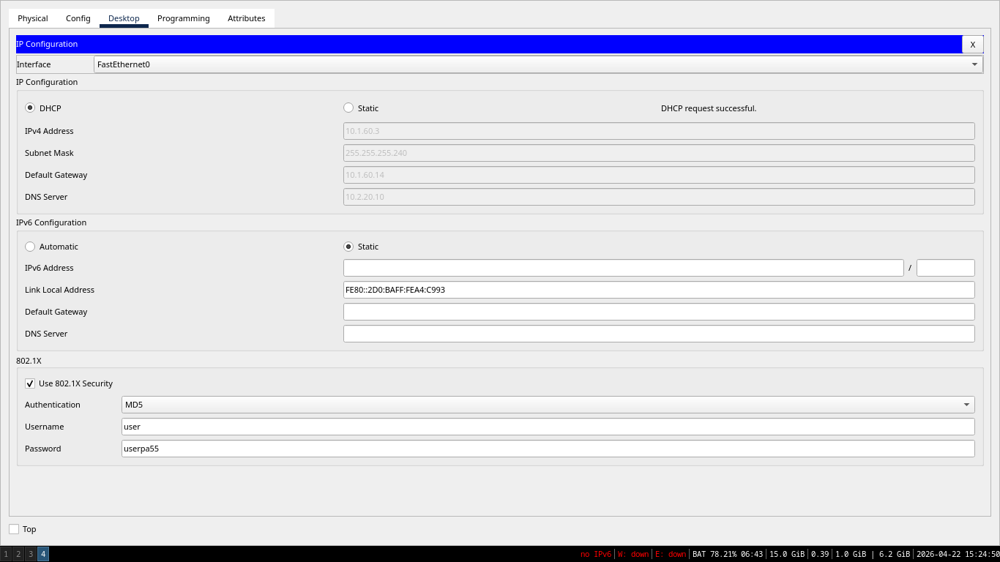

.Management PC

==== Wifi (`Package Center`)
The following test will show how a any device can access
the network via an access point.

The given phone should connect to the `PC-Package-Storage` wifi 
with the `storagepa55` password and receive an IPv4 address.

.Wifi Connection
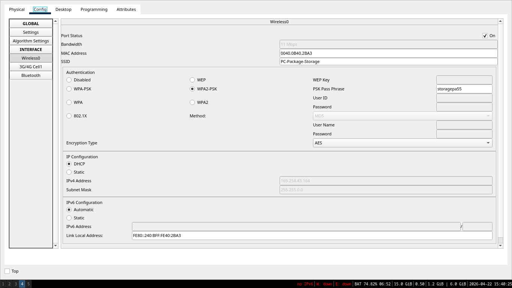

.DHCP Showcase
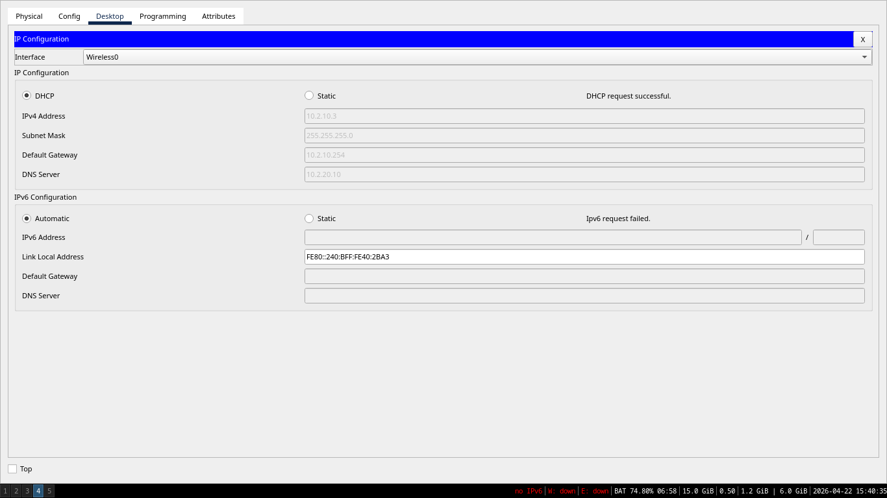

==== HSRP (`HQ`)
The following test will show how when a router fails, the other
takes up the role of the active router and continue routing.

.HQ-R1 On
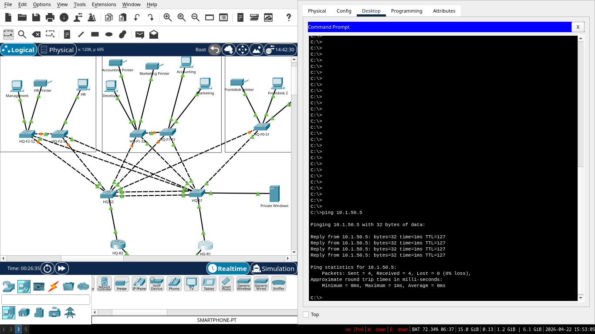

.HQ-R1 Off
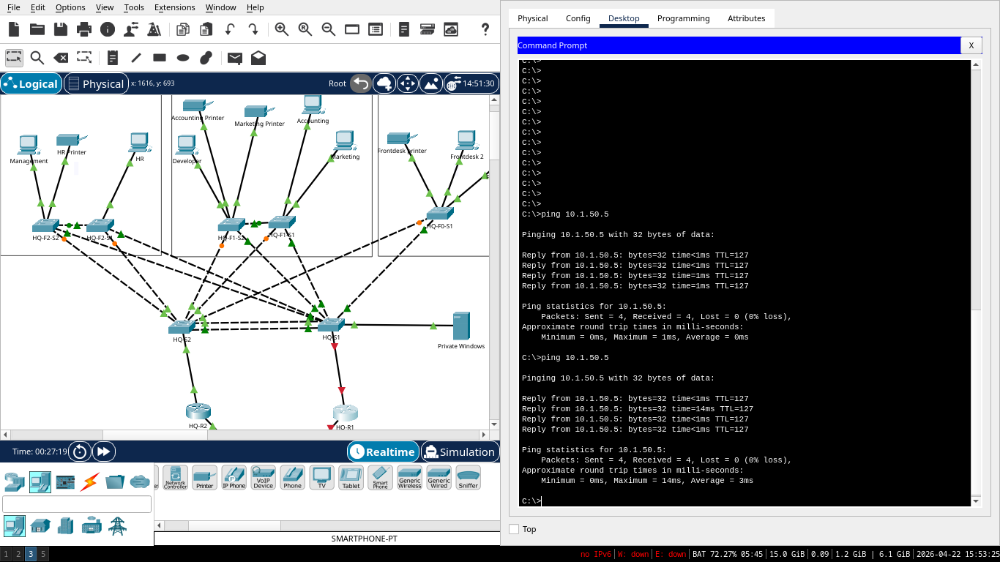

==== ACL (`Package Center`)
The following test will show how only the `MANAGEMENT` Vlan
has access to the SSH configured on the network devices.

.MANAGEMENT Vlan
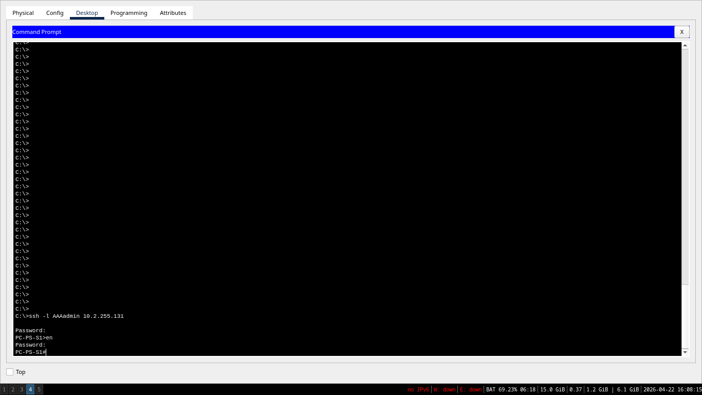

.FRONTDESK Vlan
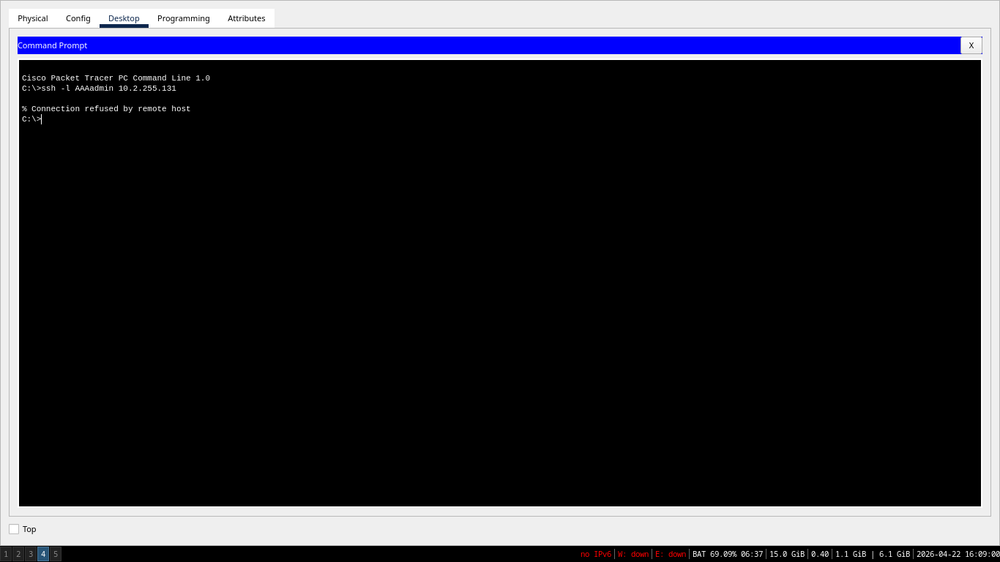

==== R-PVST+ and Etherchannel (`HQ`)
The following test will show that even after shutting down
multiple cables, connection is still possible.

Connection is tested by pinging the `HQ-R1` router from `Management PC`.

.Standard
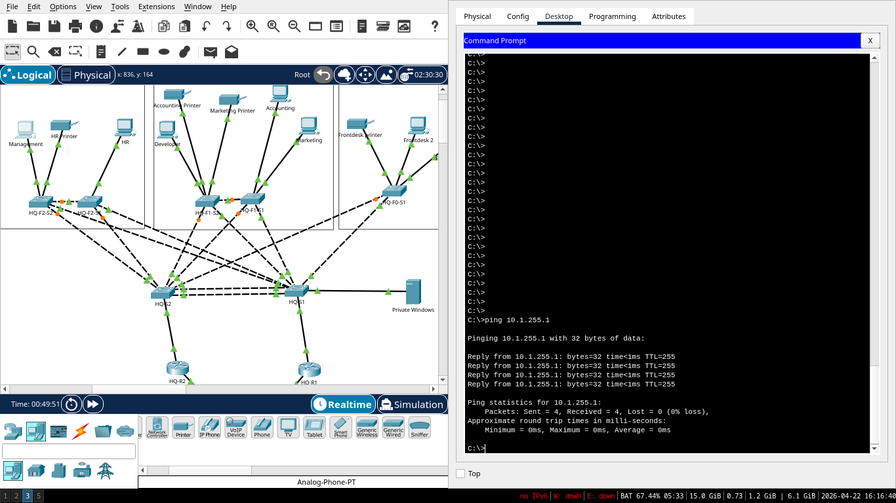

.HQ-F2-S2 Fa0/1 Off
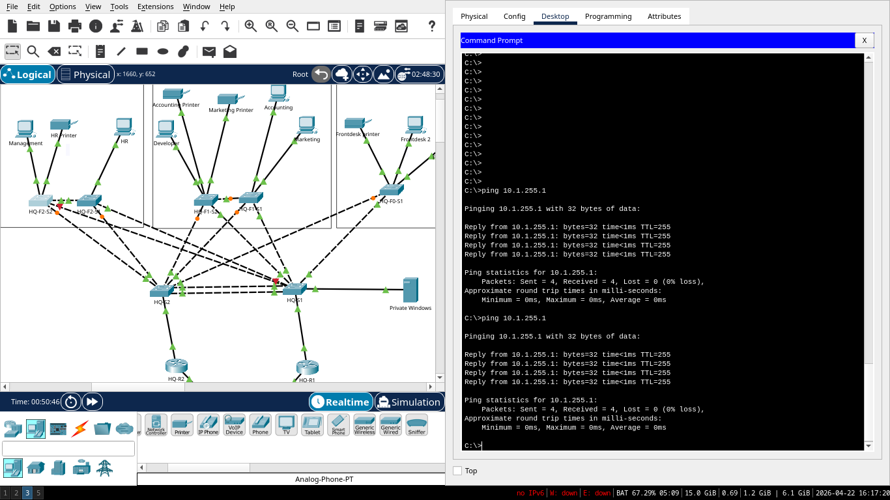

.HQ-F2-S2 Gig0/1 Off
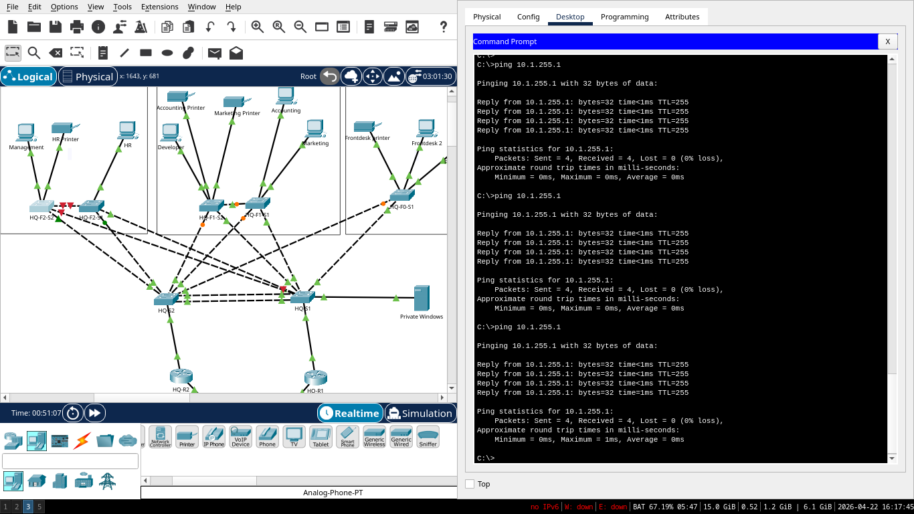

.HQ-S2 Fa0/24 Off

==== PAT, SNAT and Static Routing (`Package Center`)
The following test will show that the `Public Linux` will get translated
to a static ip address of `12.12.12.3` and the `PC-CORE-MLS1` will get
translated to the ip address `12.12.12.2` with a dynamic port number.

Static routing is proved by the `PC-ASA` successfully forwarding the packet
to the ISP after not seeing the destination network in it's routing table.

.SNAT
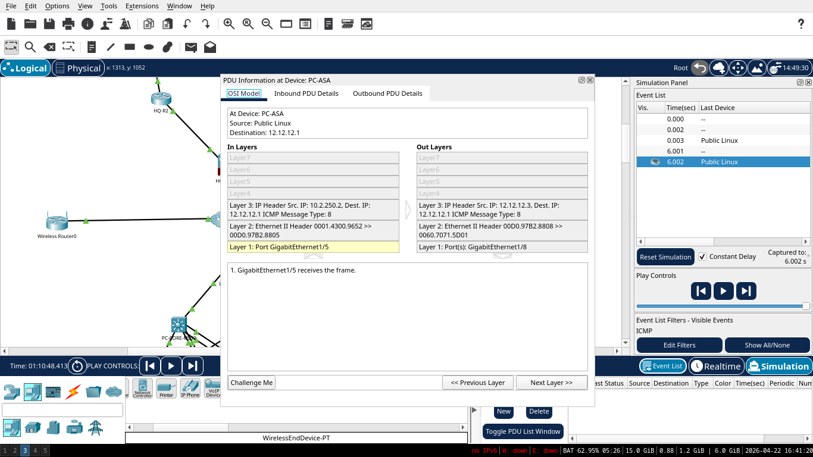

.PAT
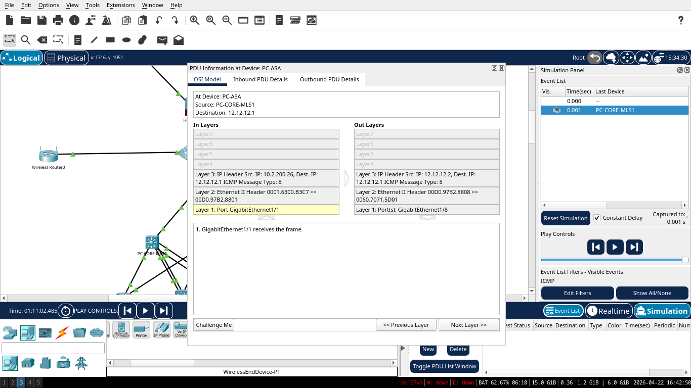

==== Dynamic Routing (`HQ`)
The following test will show that the `HQ-ASA` has multiple
paths into the LAN.

.HQ-R1 On
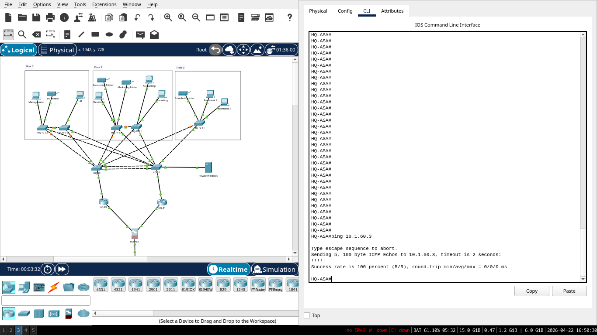

.HQ-R1 Off
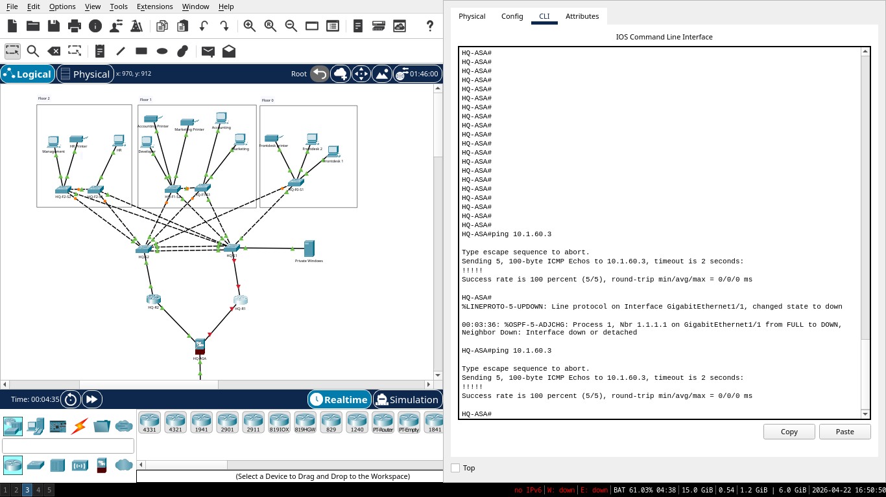

==== WAN (`HQ` & `Package Center`)
The following test will show that sites can communicate with
eachother through a WAN connection witch is the ISP.

.WAN
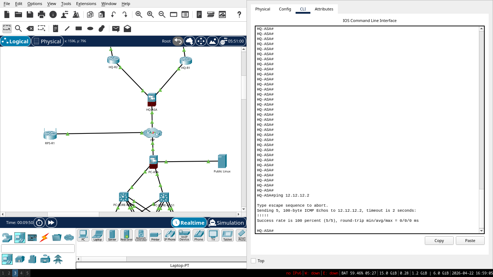

==== VPN (`HQ` & `Package Center`)
The following test will show that communication can 
occur between two sites, in a way that looks like a 
local connection.

.VPN
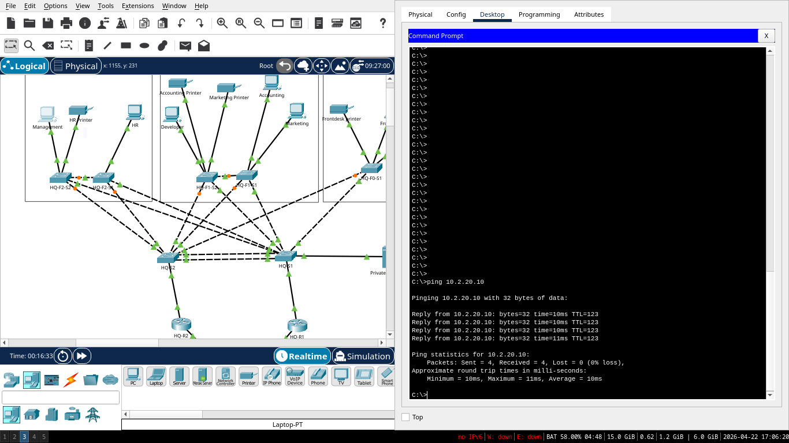

==== Firewall (`Remote Package Storage` & `Package Center`)
The following test will show that `PC-ASA` will only let through
HTTP and HTTPS traffic into the DMZ.

.HTTP
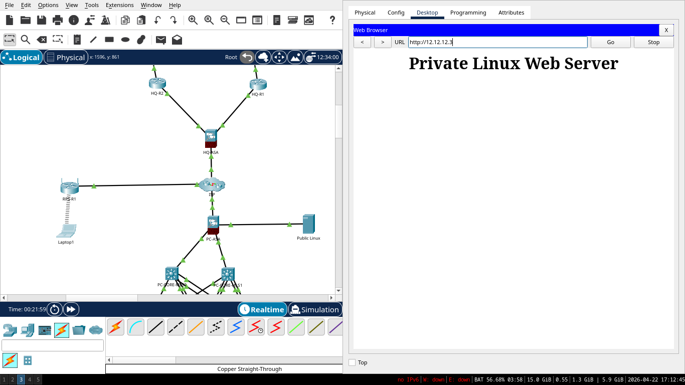

.Ping
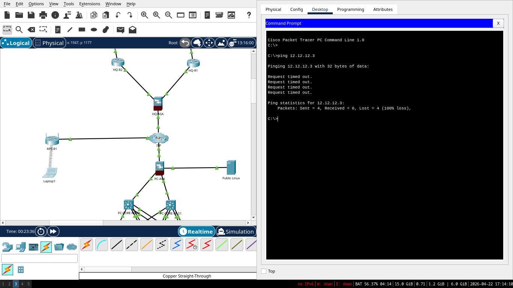

=== Server
==== HQ
==== Package Center

=== Network Programming

[appendix]
== Network Device Configurations
=== HQ
==== HQ-ASA
.Configuration
[source]
----
: Saved
:
ASA Version 9.6(1)
!
hostname HQ-ASA
enable password DzaLrtot/vx63hrf encrypted
names
!
interface GigabitEthernet1/1
 nameif INSIDE1
 security-level 100
 ip address 10.1.200.1 255.255.255.252
!
interface GigabitEthernet1/2
 nameif INSIDE2
 security-level 100
 ip address 10.1.200.5 255.255.255.252
!
interface GigabitEthernet1/3
 no nameif
 no security-level
 no ip address
 shutdown
!
interface GigabitEthernet1/4
 no nameif
 no security-level
 no ip address
 shutdown
!
interface GigabitEthernet1/5
 no nameif
 no security-level
 no ip address
 shutdown
!
interface GigabitEthernet1/6
 no nameif
 no security-level
 no ip address
 shutdown
!
interface GigabitEthernet1/7
 no nameif
 no security-level
 no ip address
 shutdown
!
interface GigabitEthernet1/8
 nameif OUTSIDE
 security-level 0
 ip address 11.11.11.2 255.255.255.252
!
interface Management1/1
 management-only
 no nameif
 no security-level
 no ip address
 shutdown
!
object network LAN1
 subnet 10.1.0.0 255.255.0.0
 nat (INSIDE1,OUTSIDE) dynamic interface
object network LAN2
 subnet 10.1.0.0 255.255.0.0
 nat (INSIDE2,OUTSIDE) dynamic interface
object network LOCAL
 subnet 10.1.0.0 255.255.0.0
object network REMOTE
 subnet 10.2.0.0 255.255.0.0
!
route OUTSIDE 0.0.0.0 0.0.0.0 11.11.11.1 1
!
access-list VPN-TRAFFIC extended permit ip object LOCAL object REMOTE
access-list OUTSIDE-IN extended permit ip object REMOTE object LOCAL
!
!
access-group OUTSIDE-IN in interface OUTSIDE
!
!
class-map inspection_default
 match default-inspection-traffic
!
policy-map type inspect dns preset_dns_map
 parameters
  message-length maximum 512
policy-map global_policy
 class inspection_default
  inspect dns preset_dns_map
  inspect ftp 
  inspect tftp 
!
service-policy global_policy global
!
telnet timeout 5
ssh timeout 5
!
!
crypto ipsec ikev1 transform-set VPN-SET esp-aes 256 esp-sha-hmac
!
crypto map omap 10 match address VPN-TRAFFIC
crypto map omap 10 set peer 12.12.12.2 
crypto map omap 10 set ikev1 transform-set VPN-SET 
crypto map omap interface OUTSIDE
crypto ikev1 enable OUTSIDE
crypto ikev1 policy 10
 encr aes
 authentication pre-share
 group 2
 lifetime 3600
!
tunnel-group 12.12.12.2 type ipsec-l2l
tunnel-group 12.12.12.2 ipsec-attributes
 ikev1 pre-shared-key vpnpa55
!
router ospf 1
 router-id 0.0.0.1
 log-adjacency-changes
 network 10.1.200.0 255.255.255.252 area 0
 network 10.1.200.4 255.255.255.252 area 0
 default-information originate
!
----

==== HQ-R1
.Configuration
[source]
----
Building configuration...

Current configuration : 3211 bytes
!
version 15.1
no service timestamps log datetime msec
no service timestamps debug datetime msec
service password-encryption
!
hostname HQ-R1
!
!
!
enable secret 5 $1$mERr$STCVvBm3rx8XD5gcSxKFC/
!
!
!
!
!
aaa new-model
!
aaa authentication login default group radius local-case 
!
!
!
!
!
!
!
ip cef
no ipv6 cef
!
!
!
username admin privilege 15 secret 5 $1$mERr$YDWMoxSY4R79.r8uptM1C0
!
!
license udi pid CISCO2911/K9 sn FTX1524DDFG-
!
!
!
!
!
!
!
!
!
ip ssh version 2
ip ssh authentication-retries 2
ip ssh time-out 30
no ip domain-lookup
ip domain-name bitbox.hu
!
!
spanning-tree mode pvst
!
!
!
!
!
!
interface GigabitEthernet0/0
 no ip address
 duplex auto
 speed auto
 shutdown
!
interface GigabitEthernet0/1
 no ip address
 duplex auto
 speed auto
!
interface GigabitEthernet0/1.110
 encapsulation dot1Q 110
 ip address 10.1.10.1 255.255.255.224
 ip helper-address 10.1.50.5
 standby version 2
 standby 0 ip 10.1.10.30
 standby priority 200
 standby preempt
!
interface GigabitEthernet0/1.120
 encapsulation dot1Q 120
 ip address 10.1.20.1 255.255.255.192
 ip helper-address 10.1.50.5
 standby version 2
 standby 0 ip 10.1.20.62
 standby priority 200
 standby preempt
!
interface GigabitEthernet0/1.130
 encapsulation dot1Q 130
 ip address 10.1.30.1 255.255.255.224
 ip helper-address 10.1.50.5
 standby version 2
 standby 0 ip 10.1.30.30
 standby priority 200
 standby preempt
!
interface GigabitEthernet0/1.140
 encapsulation dot1Q 140
 ip address 10.1.40.1 255.255.255.240
 ip helper-address 10.1.50.5
 standby version 2
 standby 0 ip 10.1.40.14
 standby priority 200
 standby preempt
!
interface GigabitEthernet0/1.150
 encapsulation dot1Q 150
 ip address 10.1.50.1 255.255.255.248
 ip helper-address 10.1.50.5
 standby version 2
 standby 0 ip 10.1.50.6
 standby priority 200
 standby preempt
!
interface GigabitEthernet0/1.160
 encapsulation dot1Q 160
 ip address 10.1.60.1 255.255.255.240
 ip helper-address 10.1.50.5
 standby version 2
 standby 0 ip 10.1.60.14
 standby priority 200
 standby preempt
!
interface GigabitEthernet0/1.333
 encapsulation dot1Q 333
 ip address 10.1.255.1 255.255.255.224
 ip helper-address 10.1.50.5
 standby version 2
 standby 0 ip 10.1.255.30
 standby priority 200
 standby preempt
!
interface GigabitEthernet0/2
 ip address 10.1.200.2 255.255.255.252
 duplex auto
 speed auto
!
interface Vlan1
 no ip address
 shutdown
!
router ospf 1
 router-id 1.1.1.1
 log-adjacency-changes
 passive-interface default
 no passive-interface GigabitEthernet0/2
 network 10.1.10.0 0.0.0.31 area 0
 network 10.1.20.0 0.0.0.63 area 0
 network 10.1.30.0 0.0.0.31 area 0
 network 10.1.40.0 0.0.0.15 area 0
 network 10.1.50.0 0.0.0.7 area 0
 network 10.1.60.0 0.0.0.15 area 0
 network 10.1.255.0 0.0.0.31 area 0
 network 10.1.200.0 0.0.0.31 area 0
!
ip classless
!
ip flow-export version 9
!
!
ip access-list standard SSH
 permit 10.1.255.0 0.0.0.31
!
no cdp run
!
!
radius server 10.1.50.5
 address ipv4 10.1.50.5 auth-port 1645
 key aaapa55
!
!
!
line con 0
 login authentication default
!
line aux 0
!
line vty 0 4
 access-class SSH in
 login authentication default
 transport input ssh
line vty 5 15
 access-class SSH in
 login authentication default
 transport input ssh
!
!
!
end
----

==== HQ-R2
.Configuration
[source]
----
Building configuration...

Current configuration : 2937 bytes
!
version 15.1
no service timestamps log datetime msec
no service timestamps debug datetime msec
service password-encryption
!
hostname HQ-R2
!
!
!
enable secret 5 $1$mERr$STCVvBm3rx8XD5gcSxKFC/
!
!
!
!
!
aaa new-model
!
aaa authentication login default group radius local-case 
!
!
!
!
!
!
!
ip cef
no ipv6 cef
!
!
!
username admin privilege 15 secret 5 $1$mERr$YDWMoxSY4R79.r8uptM1C0
!
!
license udi pid CISCO2911/K9 sn FTX1524M1OR-
!
!
!
!
!
!
!
!
!
ip ssh version 2
ip ssh authentication-retries 2
ip ssh time-out 30
no ip domain-lookup
ip domain-name bitbox.hu
!
!
spanning-tree mode pvst
!
!
!
!
!
!
interface GigabitEthernet0/0
 no ip address
 duplex auto
 speed auto
 shutdown
!
interface GigabitEthernet0/1
 no ip address
 duplex auto
 speed auto
!
interface GigabitEthernet0/1.110
 encapsulation dot1Q 110
 ip address 10.1.10.2 255.255.255.224
 ip helper-address 10.1.50.5
 standby version 2
 standby 0 ip 10.1.10.30
!
interface GigabitEthernet0/1.120
 encapsulation dot1Q 120
 ip address 10.1.20.2 255.255.255.192
 ip helper-address 10.1.50.5
 standby version 2
 standby 0 ip 10.1.20.62
!
interface GigabitEthernet0/1.130
 encapsulation dot1Q 130
 ip address 10.1.30.2 255.255.255.224
 ip helper-address 10.1.50.5
 standby version 2
 standby 0 ip 10.1.30.30
!
interface GigabitEthernet0/1.140
 encapsulation dot1Q 140
 ip address 10.1.40.2 255.255.255.240
 ip helper-address 10.1.50.5
 standby version 2
 standby 0 ip 10.1.40.14
!
interface GigabitEthernet0/1.150
 encapsulation dot1Q 150
 ip address 10.1.50.2 255.255.255.248
 ip helper-address 10.1.50.5
 standby version 2
 standby 0 ip 10.1.50.6
!
interface GigabitEthernet0/1.160
 encapsulation dot1Q 160
 ip address 10.1.60.2 255.255.255.240
 ip helper-address 10.1.50.5
 standby version 2
 standby 0 ip 10.1.60.14
!
interface GigabitEthernet0/1.333
 encapsulation dot1Q 333
 ip address 10.1.255.2 255.255.255.224
 ip helper-address 10.1.50.5
 standby version 2
 standby 0 ip 10.1.255.30
!
interface GigabitEthernet0/2
 ip address 10.1.200.6 255.255.255.252
 duplex auto
 speed auto
!
interface Vlan1
 no ip address
 shutdown
!
router ospf 1
 router-id 1.1.1.2
 log-adjacency-changes
 passive-interface default
 no passive-interface GigabitEthernet0/2
 network 10.1.200.4 0.0.0.3 area 0
 network 10.1.10.0 0.0.0.31 area 0
 network 10.1.20.0 0.0.0.63 area 0
 network 10.1.30.0 0.0.0.31 area 0
 network 10.1.40.0 0.0.0.15 area 0
 network 10.1.50.0 0.0.0.7 area 0
 network 10.1.60.0 0.0.0.15 area 0
 network 10.1.255.0 0.0.0.31 area 0
!
ip classless
!
ip flow-export version 9
!
!
ip access-list standard SSH
 permit 10.1.255.0 0.0.0.31
!
no cdp run
!
!
radius server 10.1.50.5
 address ipv4 10.1.50.5 auth-port 1645
 key aaapa55
!
!
!
line con 0
 login authentication default
!
line aux 0
!
line vty 0 4
 access-class SSH in
 login authentication default
 transport input ssh
line vty 5 15
 access-class SSH in
 login authentication default
 transport input ssh
!
!
!
end
----

==== HQ-S1
.Configuration
[source]
----
Building configuration...

Current configuration : 5917 bytes
!
version 15.0
no service timestamps log datetime msec
no service timestamps debug datetime msec
service password-encryption
!
hostname HQ-S1
!
enable secret 5 $1$mERr$STCVvBm3rx8XD5gcSxKFC/
!
!
!
!
!
aaa new-model
!
aaa authentication dot1x default group radius 
aaa authentication login default group radius local-case 
!
!
!
!
ip ssh version 2
ip ssh authentication-retries 2
ip ssh time-out 30
no ip domain-lookup
ip domain-name bitbox.hu
!
username admin secret 5 $1$mERr$YDWMoxSY4R79.r8uptM1C0
!
ip arp inspection vlan 150
ip arp inspection validate src-mac dst-mac ip
!
ip source binding 00D0.9756.36C6 vlan 150 10.1.50.5 interface gigabitethernet0/2
!
ip dhcp snooping
!
dot1x system-auth-control
spanning-tree mode rapid-pvst
spanning-tree extend system-id
spanning-tree vlan 110,120,130,140,150,160,333,666 priority 24576
spanning-tree loopguard default
!
interface Port-channel1
 switchport trunk native vlan 666
 switchport trunk allowed vlan 110,120,130,140,150,160,333
 switchport mode trunk
 switchport nonegotiate
!
interface FastEthernet0/1
 switchport trunk native vlan 666
 switchport trunk allowed vlan 110,120,130,140,150,160,333
 ip arp inspection trust
 ip dhcp snooping trust
 ip dhcp snooping limit rate 20
 switchport mode trunk
 switchport nonegotiate
 spanning-tree guard root
!
interface FastEthernet0/2
 switchport access vlan 666
 switchport mode access
 switchport nonegotiate
 shutdown
!
interface FastEthernet0/3
 switchport access vlan 666
 switchport mode access
 switchport nonegotiate
 shutdown
!
interface FastEthernet0/4
 switchport access vlan 666
 switchport mode access
 switchport nonegotiate
 shutdown
!
interface FastEthernet0/5
 switchport access vlan 666
 switchport mode access
 switchport nonegotiate
 shutdown
!
interface FastEthernet0/6
 switchport access vlan 666
 switchport mode access
 switchport nonegotiate
 shutdown
!
interface FastEthernet0/7
 switchport access vlan 666
 switchport mode access
 switchport nonegotiate
 shutdown
!
interface FastEthernet0/8
 switchport access vlan 666
 switchport mode access
 switchport nonegotiate
 shutdown
!
interface FastEthernet0/9
 switchport access vlan 666
 switchport mode access
 switchport nonegotiate
 shutdown
!
interface FastEthernet0/10
 switchport access vlan 666
 switchport mode access
 switchport nonegotiate
 shutdown
!
interface FastEthernet0/11
 switchport trunk native vlan 666
 switchport trunk allowed vlan 110,120,130,140,150,160,333
 ip arp inspection trust
 ip dhcp snooping trust
 ip dhcp snooping limit rate 20
 switchport mode trunk
 switchport nonegotiate
 spanning-tree guard root
!
interface FastEthernet0/12
 switchport trunk native vlan 666
 switchport trunk allowed vlan 110,120,130,140,150,160,333
 ip arp inspection trust
 ip dhcp snooping trust
 ip dhcp snooping limit rate 20
 switchport mode trunk
 switchport nonegotiate
 spanning-tree guard root
!
interface FastEthernet0/13
 switchport access vlan 666
 switchport mode access
 switchport nonegotiate
 shutdown
!
interface FastEthernet0/14
 switchport access vlan 666
 switchport mode access
 switchport nonegotiate
 shutdown
!
interface FastEthernet0/15
 switchport access vlan 666
 switchport mode access
 switchport nonegotiate
 shutdown
!
interface FastEthernet0/16
 switchport access vlan 666
 switchport mode access
 switchport nonegotiate
 shutdown
!
interface FastEthernet0/17
 switchport access vlan 666
 switchport mode access
 switchport nonegotiate
 shutdown
!
interface FastEthernet0/18
 switchport access vlan 666
 switchport mode access
 switchport nonegotiate
 shutdown
!
interface FastEthernet0/19
 switchport access vlan 666
 switchport mode access
 switchport nonegotiate
 shutdown
!
interface FastEthernet0/20
 switchport access vlan 666
 switchport mode access
 switchport nonegotiate
 shutdown
!
interface FastEthernet0/21
 switchport trunk native vlan 666
 switchport trunk allowed vlan 110,120,130,140,150,160,333
 ip arp inspection trust
 ip dhcp snooping trust
 ip dhcp snooping limit rate 20
 switchport mode trunk
 switchport nonegotiate
 spanning-tree guard root
!
interface FastEthernet0/22
 switchport trunk native vlan 666
 switchport trunk allowed vlan 110,120,130,140,150,160,333
 ip arp inspection trust
 ip dhcp snooping trust
 ip dhcp snooping limit rate 20
 switchport mode trunk
 switchport nonegotiate
 spanning-tree guard root
!
interface FastEthernet0/23
 switchport trunk native vlan 666
 switchport trunk allowed vlan 110,120,130,140,150,160,333
 ip arp inspection trust
 ip dhcp snooping trust
 ip dhcp snooping limit rate 20
 switchport mode trunk
 switchport nonegotiate
 channel-group 1 mode active
 spanning-tree link-type point-to-point
!
interface FastEthernet0/24
 switchport trunk native vlan 666
 switchport trunk allowed vlan 110,120,130,140,150,160,333
 ip arp inspection trust
 ip dhcp snooping trust
 ip dhcp snooping limit rate 20
 switchport mode trunk
 switchport nonegotiate
 channel-group 1 mode active
 spanning-tree link-type point-to-point
!
interface GigabitEthernet0/1
 switchport trunk native vlan 666
 switchport trunk allowed vlan 110,120,130,140,150,160,333
 ip arp inspection trust
 ip dhcp snooping trust
 ip dhcp snooping limit rate 20
 switchport mode trunk
 switchport nonegotiate
 spanning-tree portfast
 spanning-tree bpduguard enable
!
interface GigabitEthernet0/2
 switchport access vlan 150
 ip dhcp snooping trust
 ip dhcp snooping limit rate 20
 switchport mode access
 switchport nonegotiate
 switchport port-security aging time 5
 spanning-tree portfast
 spanning-tree bpduguard enable
 ip verify source port-security
!
interface Vlan1
 no ip address
 shutdown
!
interface Vlan333
 ip address 10.1.255.3 255.255.255.224
!
ip default-gateway 10.1.255.30
!
no cdp run
!
radius-server host 10.1.50.5 auth-port 1645 key aaapa55
!
!
!
ip access-list standard SSH
 permit 10.1.255.0 0.0.0.31
line con 0
 login authentication default
!
line vty 0 4
 access-class SSH in
 login authentication default
 transport input ssh
line vty 5 15
 access-class SSH in
 login authentication default
 transport input ssh
!
!
!
!
end
----

==== HQ-S2
.Configuration
[source]
----
Building configuration...

Current configuration : 5557 bytes
!
version 15.0
no service timestamps log datetime msec
no service timestamps debug datetime msec
service password-encryption
!
hostname HQ-S2
!
enable secret 5 $1$mERr$STCVvBm3rx8XD5gcSxKFC/
!
!
!
!
!
aaa new-model
!
aaa authentication login default group radius local-case 
!
!
!
!
ip ssh version 2
ip ssh authentication-retries 2
ip ssh time-out 30
ip domain-name bitbox.hu
!
username admin secret 5 $1$mERr$YDWMoxSY4R79.r8uptM1C0
!
!
ip dhcp snooping
!
spanning-tree mode rapid-pvst
spanning-tree extend system-id
spanning-tree vlan 110,120,130,140,150,160,333,666 priority 28672
spanning-tree loopguard default
!
interface Port-channel1
 switchport trunk native vlan 666
 switchport trunk allowed vlan 110,120,130,140,150,160,333
 switchport mode trunk
 switchport nonegotiate
!
interface FastEthernet0/1
 switchport trunk native vlan 666
 switchport trunk allowed vlan 110,120,130,140,150,160,333
 ip dhcp snooping trust
 ip dhcp snooping limit rate 20
 switchport mode trunk
 switchport nonegotiate
 spanning-tree guard root
!
interface FastEthernet0/2
 switchport access vlan 666
 switchport trunk native vlan 666
 switchport trunk allowed vlan 110,120,130,140,150,333
 switchport mode access
 switchport nonegotiate
 shutdown
!
interface FastEthernet0/3
 switchport access vlan 666
 switchport mode access
 switchport nonegotiate
 shutdown
!
interface FastEthernet0/4
 switchport access vlan 666
 switchport mode access
 switchport nonegotiate
 shutdown
!
interface FastEthernet0/5
 switchport access vlan 666
 switchport mode access
 switchport nonegotiate
 shutdown
!
interface FastEthernet0/6
 switchport access vlan 666
 switchport mode access
 switchport nonegotiate
 shutdown
!
interface FastEthernet0/7
 switchport access vlan 666
 switchport mode access
 switchport nonegotiate
 shutdown
!
interface FastEthernet0/8
 switchport access vlan 666
 switchport mode access
 switchport nonegotiate
 shutdown
!
interface FastEthernet0/9
 switchport access vlan 666
 switchport mode access
 switchport nonegotiate
 shutdown
!
interface FastEthernet0/10
 switchport access vlan 666
 switchport mode access
 switchport nonegotiate
 shutdown
!
interface FastEthernet0/11
 switchport trunk native vlan 666
 switchport trunk allowed vlan 110,120,130,140,150,160,333
 ip dhcp snooping trust
 ip dhcp snooping limit rate 20
 switchport mode trunk
 switchport nonegotiate
 spanning-tree guard root
!
interface FastEthernet0/12
 switchport trunk native vlan 666
 switchport trunk allowed vlan 110,120,130,140,150,160,333
 ip dhcp snooping trust
 ip dhcp snooping limit rate 20
 switchport mode trunk
 switchport nonegotiate
 spanning-tree guard root
!
interface FastEthernet0/13
 switchport access vlan 666
 switchport mode access
 switchport nonegotiate
 shutdown
!
interface FastEthernet0/14
 switchport access vlan 666
 switchport mode access
 switchport nonegotiate
 shutdown
!
interface FastEthernet0/15
 switchport access vlan 666
 switchport mode access
 switchport nonegotiate
 shutdown
!
interface FastEthernet0/16
 switchport access vlan 666
 switchport mode access
 switchport nonegotiate
 shutdown
!
interface FastEthernet0/17
 switchport access vlan 666
 switchport mode access
 switchport nonegotiate
 shutdown
!
interface FastEthernet0/18
 switchport access vlan 666
 switchport mode access
 switchport nonegotiate
 shutdown
!
interface FastEthernet0/19
 switchport access vlan 666
 switchport mode access
 switchport nonegotiate
 shutdown
!
interface FastEthernet0/20
 switchport access vlan 666
 switchport mode access
 switchport nonegotiate
 shutdown
!
interface FastEthernet0/21
 switchport trunk native vlan 666
 switchport trunk allowed vlan 110,120,130,140,150,160,333
 ip dhcp snooping trust
 ip dhcp snooping limit rate 20
 switchport mode trunk
 switchport nonegotiate
 spanning-tree guard root
!
interface FastEthernet0/22
 switchport trunk native vlan 666
 switchport trunk allowed vlan 110,120,130,140,150,160,333
 ip dhcp snooping trust
 ip dhcp snooping limit rate 20
 switchport mode trunk
 switchport nonegotiate
 spanning-tree guard root
!
interface FastEthernet0/23
 switchport trunk native vlan 666
 switchport trunk allowed vlan 110,120,130,140,150,160,333
 ip dhcp snooping trust
 ip dhcp snooping limit rate 20
 switchport mode trunk
 switchport nonegotiate
 channel-group 1 mode passive
 spanning-tree link-type point-to-point
!
interface FastEthernet0/24
 switchport trunk native vlan 666
 switchport trunk allowed vlan 110,120,130,140,150,160,333
 ip dhcp snooping trust
 ip dhcp snooping limit rate 20
 switchport mode trunk
 switchport nonegotiate
 channel-group 1 mode passive
 spanning-tree link-type point-to-point
!
interface GigabitEthernet0/1
 switchport trunk native vlan 666
 switchport trunk allowed vlan 110,120,130,140,150,160,333
 ip dhcp snooping trust
 ip dhcp snooping limit rate 20
 switchport mode trunk
 switchport nonegotiate
 spanning-tree portfast
 spanning-tree bpduguard enable
!
interface GigabitEthernet0/2
 switchport access vlan 666
 ip dhcp snooping trust
 ip dhcp snooping limit rate 20
 switchport mode access
 switchport nonegotiate
 shutdown
!
interface Vlan1
 no ip address
 shutdown
!
interface Vlan333
 ip address 10.1.255.4 255.255.255.224
!
ip default-gateway 10.1.255.30
!
no cdp run
!
radius-server host 10.1.50.5 auth-port 1645 key aaapa55
!
!
!
ip access-list standard SSH
 permit 10.1.255.0 0.0.0.31
line con 0
 login authentication default
!
line vty 0 4
 access-class SSH in
 login authentication default
 transport input ssh
line vty 5 15
 access-class SSH in
 login authentication default
 transport input ssh
!
!
!
!
end
----

==== HQ-F0-S1
.Configuration
[source]
----
Building configuration...

Current configuration : 5159 bytes
!
version 15.0
no service timestamps log datetime msec
no service timestamps debug datetime msec
service password-encryption
!
hostname HQ-F0-S1
!
enable secret 5 $1$mERr$STCVvBm3rx8XD5gcSxKFC/
!
!
!
!
!
aaa new-model
!
aaa authentication dot1x default group radius 
aaa authentication login default group radius local-case 
!
!
!
!
ip ssh version 2
ip ssh authentication-retries 2
ip ssh time-out 30
no ip domain-lookup
ip domain-name bitbox.hu
!
username admin secret 5 $1$mERr$YDWMoxSY4R79.r8uptM1C0
!
ip arp inspection vlan 160
ip arp inspection validate src-mac dst-mac ip
!
ip source binding 0003.E4D8.BC6D vlan 160 10.1.60.13 interface fastethernet0/24
!
ip dhcp snooping
!
dot1x system-auth-control
spanning-tree mode rapid-pvst
spanning-tree extend system-id
spanning-tree loopguard default
!
interface FastEthernet0/1
 switchport trunk native vlan 666
 switchport trunk allowed vlan 110,120,130,140,150,160,333
 ip arp inspection trust
 ip dhcp snooping trust
 ip dhcp snooping limit rate 20
 switchport mode trunk
 switchport nonegotiate
!
interface FastEthernet0/2
 switchport trunk native vlan 666
 switchport trunk allowed vlan 110,120,130,140,150,160,333
 ip arp inspection trust
 ip dhcp snooping trust
 ip dhcp snooping limit rate 20
 switchport mode trunk
 switchport nonegotiate
!
interface FastEthernet0/3
 switchport access vlan 666
 switchport mode access
 switchport nonegotiate
 shutdown
!
interface FastEthernet0/4
 switchport access vlan 666
 switchport mode access
 switchport nonegotiate
 shutdown
!
interface FastEthernet0/5
 switchport access vlan 666
 switchport mode access
 switchport nonegotiate
 shutdown
!
interface FastEthernet0/6
 switchport access vlan 666
 switchport mode access
 switchport nonegotiate
 shutdown
!
interface FastEthernet0/7
 switchport access vlan 666
 switchport mode access
 switchport nonegotiate
 shutdown
!
interface FastEthernet0/8
 switchport access vlan 666
 switchport mode access
 switchport nonegotiate
 shutdown
!
interface FastEthernet0/9
 switchport access vlan 666
 switchport mode access
 switchport nonegotiate
 shutdown
!
interface FastEthernet0/10
 switchport access vlan 160
 switchport mode access
 switchport nonegotiate
 switchport port-security
 switchport port-security maximum 2
 switchport port-security violation restrict 
 switchport port-security aging time 5
 authentication port-control auto
 dot1x pae authenticator
 spanning-tree portfast
 spanning-tree bpduguard enable
 ip verify source port-security
!
interface FastEthernet0/11
 switchport access vlan 160
 switchport mode access
 switchport nonegotiate
 switchport port-security
 switchport port-security maximum 2
 switchport port-security violation restrict 
 switchport port-security aging time 5
 authentication port-control auto
 dot1x pae authenticator
 spanning-tree portfast
 spanning-tree bpduguard enable
 ip verify source port-security
!
interface FastEthernet0/12
 switchport access vlan 666
 switchport mode access
 switchport nonegotiate
 shutdown
!
interface FastEthernet0/13
 switchport access vlan 666
 switchport mode access
 switchport nonegotiate
 shutdown
!
interface FastEthernet0/14
 switchport access vlan 666
 switchport mode access
 switchport nonegotiate
 shutdown
!
interface FastEthernet0/15
 switchport access vlan 666
 switchport mode access
 switchport nonegotiate
 shutdown
!
interface FastEthernet0/16
 switchport access vlan 666
 switchport mode access
 switchport nonegotiate
 shutdown
!
interface FastEthernet0/17
 switchport access vlan 666
 switchport mode access
 switchport nonegotiate
 shutdown
!
interface FastEthernet0/18
 switchport access vlan 666
 switchport mode access
 switchport nonegotiate
 shutdown
!
interface FastEthernet0/19
 switchport access vlan 666
 switchport mode access
 switchport nonegotiate
 shutdown
!
interface FastEthernet0/20
 switchport access vlan 666
 switchport mode access
 switchport nonegotiate
 shutdown
!
interface FastEthernet0/21
 switchport access vlan 666
 switchport mode access
 switchport nonegotiate
 shutdown
!
interface FastEthernet0/22
 switchport access vlan 666
 switchport mode access
 switchport nonegotiate
 shutdown
!
interface FastEthernet0/23
 switchport access vlan 666
 switchport mode access
 switchport nonegotiate
 shutdown
!
interface FastEthernet0/24
 switchport access vlan 160
 switchport mode access
 switchport nonegotiate
 switchport port-security
 switchport port-security mac-address sticky 
 switchport port-security aging time 5
 spanning-tree portfast
 spanning-tree bpduguard enable
 ip verify source port-security
!
interface GigabitEthernet0/1
 switchport access vlan 666
 switchport trunk native vlan 666
 switchport trunk allowed vlan 110,120,130,140,333
 switchport mode access
 switchport nonegotiate
 shutdown
!
interface GigabitEthernet0/2
 switchport access vlan 666
 switchport mode access
 switchport nonegotiate
 shutdown
!
interface Vlan1
 no ip address
 shutdown
!
interface Vlan333
 ip address 10.1.255.5 255.255.255.224
!
ip default-gateway 10.1.255.30
!
no cdp run
!
radius-server host 10.1.50.5 auth-port 1645 key aaapa55
!
!
!
ip access-list standard SSH
 permit 10.1.255.0 0.0.0.31
line con 0
 login authentication default
!
line vty 0 4
 access-class SSH in
 login authentication default
 transport input ssh
line vty 5 15
 access-class SSH in
 login authentication default
 transport input ssh
!
!
!
!
end
----

==== HQ-F1-S1
.Configuration
[source]
----
Building configuration...

Current configuration : 5060 bytes
!
version 15.0
no service timestamps log datetime msec
no service timestamps debug datetime msec
service password-encryption
!
hostname HQ-F1-S1
!
enable secret 5 $1$mERr$STCVvBm3rx8XD5gcSxKFC/
!
!
!
!
!
aaa new-model
!
aaa authentication dot1x default group radius 
aaa authentication login default group radius local-case 
!
!
!
!
ip ssh version 2
ip ssh authentication-retries 2
ip ssh time-out 30
no ip domain-lookup
ip domain-name bitbox.hu
!
username admin secret 5 $1$mERr$YDWMoxSY4R79.r8uptM1C0
!
ip arp inspection vlan 110,130,140
ip arp inspection validate src-mac dst-mac ip
!
ip dhcp snooping
!
dot1x system-auth-control
spanning-tree mode rapid-pvst
spanning-tree extend system-id
spanning-tree loopguard default
!
interface FastEthernet0/1
 switchport trunk native vlan 666
 switchport trunk allowed vlan 110,120,130,140,150,160,333
 ip arp inspection trust
 ip dhcp snooping trust
 ip dhcp snooping limit rate 20
 switchport mode trunk
 switchport nonegotiate
!
interface FastEthernet0/2
 switchport trunk native vlan 666
 switchport trunk allowed vlan 110,120,130,140,150,160,333
 ip arp inspection trust
 ip dhcp snooping trust
 ip dhcp snooping limit rate 20
 switchport mode trunk
 switchport nonegotiate
!
interface FastEthernet0/3
 switchport access vlan 666
 switchport mode access
 switchport nonegotiate
 shutdown
!
interface FastEthernet0/4
 switchport access vlan 666
 switchport mode access
 switchport nonegotiate
 shutdown
!
interface FastEthernet0/5
 switchport access vlan 666
 switchport mode access
 switchport nonegotiate
 shutdown
!
interface FastEthernet0/6
 switchport access vlan 666
 switchport mode access
 switchport nonegotiate
 shutdown
!
interface FastEthernet0/7
 switchport access vlan 666
 switchport mode access
 switchport nonegotiate
 shutdown
!
interface FastEthernet0/8
 switchport access vlan 666
 switchport mode access
 switchport nonegotiate
 shutdown
!
interface FastEthernet0/9
 switchport access vlan 666
 switchport mode access
 switchport nonegotiate
 shutdown
!
interface FastEthernet0/10
 switchport access vlan 140
 switchport mode access
 switchport nonegotiate
 switchport port-security
 switchport port-security maximum 2
 switchport port-security violation restrict 
 switchport port-security aging time 5
 authentication port-control auto
 dot1x pae authenticator
 spanning-tree portfast
 spanning-tree bpduguard enable
 ip verify source port-security
!
interface FastEthernet0/11
 switchport access vlan 666
 switchport mode access
 switchport nonegotiate
 shutdown
!
interface FastEthernet0/12
 switchport access vlan 666
 switchport mode access
 switchport nonegotiate
 shutdown
!
interface FastEthernet0/13
 switchport access vlan 666
 switchport mode access
 switchport nonegotiate
 shutdown
!
interface FastEthernet0/14
 switchport access vlan 666
 switchport mode access
 switchport nonegotiate
 shutdown
!
interface FastEthernet0/15
 switchport access vlan 666
 switchport mode access
 switchport nonegotiate
 shutdown
!
interface FastEthernet0/16
 switchport access vlan 130
 switchport mode access
 switchport nonegotiate
 switchport port-security
 switchport port-security maximum 2
 switchport port-security violation restrict 
 switchport port-security aging time 5
 authentication port-control auto
 dot1x pae authenticator
 spanning-tree portfast
 spanning-tree bpduguard enable
 ip verify source port-security
!
interface FastEthernet0/17
 switchport access vlan 666
 switchport mode access
 switchport nonegotiate
 shutdown
!
interface FastEthernet0/18
 switchport access vlan 666
 switchport mode access
 switchport nonegotiate
 shutdown
!
interface FastEthernet0/19
 switchport access vlan 666
 switchport mode access
 switchport nonegotiate
 shutdown
!
interface FastEthernet0/20
 switchport access vlan 666
 switchport mode access
 switchport nonegotiate
 shutdown
!
interface FastEthernet0/21
 switchport access vlan 666
 switchport mode access
 switchport nonegotiate
 shutdown
!
interface FastEthernet0/22
 switchport access vlan 666
 switchport mode access
 switchport nonegotiate
 shutdown
!
interface FastEthernet0/23
 switchport access vlan 666
 switchport mode access
 switchport nonegotiate
 shutdown
!
interface FastEthernet0/24
 switchport access vlan 666
 switchport mode access
 switchport nonegotiate
 shutdown
!
interface GigabitEthernet0/1
 switchport trunk native vlan 666
 switchport trunk allowed vlan 110,120,130,140,150,160,333
 ip arp inspection trust
 ip dhcp snooping trust
 ip dhcp snooping limit rate 20
 switchport mode trunk
 switchport nonegotiate
!
interface GigabitEthernet0/2
 switchport access vlan 666
 switchport mode access
 switchport nonegotiate
 shutdown
!
interface Vlan1
 no ip address
 shutdown
!
interface Vlan333
 ip address 10.1.255.6 255.255.255.224
!
ip default-gateway 10.1.255.30
!
no cdp run
!
radius-server host 10.1.50.5 auth-port 1645 key aaapa55
!
!
!
ip access-list standard SSH
 permit 10.1.255.0 0.0.0.31
line con 0
 login authentication default
!
line vty 0 4
 access-class SSH in
 login authentication default
 transport input ssh
line vty 5 15
 access-class SSH in
 login authentication default
 transport input ssh
!
!
!
!
end
----

==== HQ-F1-S2
.Configuration
[source]
----
Building configuration...

Current configuration : 5044 bytes
!
version 15.0
no service timestamps log datetime msec
no service timestamps debug datetime msec
service password-encryption
!
hostname HQ-F1-S2
!
enable secret 5 $1$mERr$STCVvBm3rx8XD5gcSxKFC/
!
!
!
!
!
aaa new-model
!
aaa authentication dot1x default group radius 
aaa authentication login default group radius local-case 
!
!
!
!
ip ssh version 2
ip ssh authentication-retries 2
ip ssh time-out 30
no ip domain-lookup
ip domain-name bitbox.hu
!
username admin secret 5 $1$mERr$YDWMoxSY4R79.r8uptM1C0
!
ip arp inspection vlan 110,130,140
ip arp inspection validate src-mac dst-mac ip
!
ip source binding 0010.1199.6748 vlan 130 10.1.30.29 interface fastethernet0/20
ip source binding 0010.1166.7675 vlan 140 10.1.40.13 interface fastethernet0/24
!
ip dhcp snooping
!
dot1x system-auth-control
spanning-tree mode rapid-pvst
spanning-tree extend system-id
spanning-tree loopguard default
!
interface FastEthernet0/1
 switchport trunk native vlan 666
 switchport trunk allowed vlan 110,120,130,140,150,160,333
 ip arp inspection trust
 ip dhcp snooping trust
 ip dhcp snooping limit rate 20
 switchport mode trunk
 switchport nonegotiate
!
interface FastEthernet0/2
 switchport trunk native vlan 666
 switchport trunk allowed vlan 110,120,130,140,150,160,333
 ip arp inspection trust
 ip dhcp snooping trust
 ip dhcp snooping limit rate 20
 switchport mode trunk
 switchport nonegotiate
!
interface FastEthernet0/3
 switchport access vlan 666
 switchport mode access
 switchport nonegotiate
 shutdown
!
interface FastEthernet0/4
 switchport access vlan 666
 switchport mode access
 switchport nonegotiate
 shutdown
!
interface FastEthernet0/5
 switchport access vlan 666
 switchport mode access
 switchport nonegotiate
 shutdown
!
interface FastEthernet0/6
 switchport access vlan 666
 switchport mode access
 switchport nonegotiate
 shutdown
!
interface FastEthernet0/7
 switchport access vlan 666
 switchport mode access
 switchport nonegotiate
 shutdown
!
interface FastEthernet0/8
 switchport access vlan 666
 switchport mode access
 switchport nonegotiate
 shutdown
!
interface FastEthernet0/9
 switchport access vlan 666
 switchport mode access
 switchport nonegotiate
 shutdown
!
interface FastEthernet0/10
 switchport access vlan 110
 switchport mode access
 switchport nonegotiate
 switchport port-security maximum 2
 switchport port-security violation restrict 
 switchport port-security aging time 5
 authentication port-control auto
 dot1x pae authenticator
 spanning-tree portfast
 spanning-tree bpduguard enable
 ip verify source port-security
!
interface FastEthernet0/11
 switchport access vlan 666
 switchport mode access
 switchport nonegotiate
 shutdown
!
interface FastEthernet0/12
 switchport access vlan 666
 switchport mode access
 switchport nonegotiate
 shutdown
!
interface FastEthernet0/13
 switchport access vlan 666
 switchport mode access
 switchport nonegotiate
 shutdown
!
interface FastEthernet0/14
 switchport access vlan 666
 switchport mode access
 switchport nonegotiate
 shutdown
!
interface FastEthernet0/15
 switchport access vlan 666
 switchport mode access
 switchport nonegotiate
 shutdown
!
interface FastEthernet0/16
 switchport access vlan 666
 switchport mode access
 switchport nonegotiate
 shutdown
!
interface FastEthernet0/17
 switchport access vlan 666
 switchport mode access
 switchport nonegotiate
 shutdown
!
interface FastEthernet0/18
 switchport access vlan 666
 switchport mode access
 switchport nonegotiate
 shutdown
!
interface FastEthernet0/19
 switchport access vlan 666
 switchport mode access
 switchport nonegotiate
 shutdown
!
interface FastEthernet0/20
 switchport access vlan 130
 switchport mode access
 switchport nonegotiate
 switchport port-security mac-address sticky 
 switchport port-security aging time 5
 spanning-tree portfast
 spanning-tree bpduguard enable
 ip verify source port-security
!
interface FastEthernet0/21
 switchport access vlan 666
 switchport mode access
 switchport nonegotiate
 shutdown
!
interface FastEthernet0/22
 switchport access vlan 666
 switchport mode access
 switchport nonegotiate
 shutdown
!
interface FastEthernet0/23
 switchport access vlan 666
 switchport mode access
 switchport nonegotiate
 shutdown
!
interface FastEthernet0/24
 switchport access vlan 140
 switchport mode access
 switchport nonegotiate
 switchport port-security mac-address sticky 
 switchport port-security aging time 5
 spanning-tree portfast
 spanning-tree bpduguard enable
 ip verify source port-security
!
interface GigabitEthernet0/1
 switchport trunk native vlan 666
 switchport trunk allowed vlan 110,120,130,140,150,160,333
 ip arp inspection trust
 ip dhcp snooping trust
 ip dhcp snooping limit rate 20
 switchport mode trunk
 switchport nonegotiate
!
interface GigabitEthernet0/2
 switchport access vlan 666
 switchport mode access
 switchport nonegotiate
 shutdown
!
interface Vlan1
 no ip address
 shutdown
!
interface Vlan333
 ip address 10.1.255.7 255.255.255.224
!
ip default-gateway 10.1.255.30
!
no cdp run
!
radius-server host 10.1.50.5 auth-port 1645 key aaapa55
!
!
!
ip access-list standard SSH
 permit 10.1.255.0 0.0.0.31
line con 0
 login authentication default
!
line vty 0 4
 access-class SSH in
 login authentication default
 transport input ssh
line vty 5 15
 access-class SSH in
 login authentication default
 transport input ssh
!
!
!
!
end

----

==== HQ-F2-S1
.Configuration
[source]
----
Building configuration...

Current configuration : 4778 bytes
!
version 15.0
no service timestamps log datetime msec
no service timestamps debug datetime msec
service password-encryption
!
hostname HQ-F2-S1
!
enable secret 5 $1$mERr$STCVvBm3rx8XD5gcSxKFC/
!
!
!
!
!
aaa new-model
!
aaa authentication dot1x default group radius 
aaa authentication login default group radius local-case 
!
!
!
!
ip ssh version 2
ip ssh authentication-retries 2
ip ssh time-out 30
no ip domain-lookup
ip domain-name bitbox.hu
!
username admin secret 5 $1$mERr$YDWMoxSY4R79.r8uptM1C0
!
ip arp inspection vlan 120,333
ip arp inspection validate src-mac dst-mac ip
!
ip dhcp snooping
!
dot1x system-auth-control
spanning-tree mode rapid-pvst
spanning-tree extend system-id
spanning-tree loopguard default
!
interface FastEthernet0/1
 switchport trunk native vlan 666
 switchport trunk allowed vlan 110,120,130,140,150,160,333
 ip arp inspection trust
 ip dhcp snooping trust
 ip dhcp snooping limit rate 20
 switchport mode trunk
 switchport nonegotiate
!
interface FastEthernet0/2
 switchport trunk native vlan 666
 switchport trunk allowed vlan 110,120,130,140,150,160,333
 ip arp inspection trust
 ip dhcp snooping trust
 ip dhcp snooping limit rate 20
 switchport mode trunk
 switchport nonegotiate
!
interface FastEthernet0/3
 switchport access vlan 666
 switchport mode access
 switchport nonegotiate
 shutdown
!
interface FastEthernet0/4
 switchport access vlan 666
 switchport mode access
 switchport nonegotiate
 shutdown
!
interface FastEthernet0/5
 switchport access vlan 666
 switchport mode access
 switchport nonegotiate
 shutdown
!
interface FastEthernet0/6
 switchport access vlan 666
 switchport mode access
 switchport nonegotiate
 shutdown
!
interface FastEthernet0/7
 switchport access vlan 666
 switchport mode access
 switchport nonegotiate
 shutdown
!
interface FastEthernet0/8
 switchport access vlan 666
 switchport mode access
 switchport nonegotiate
 shutdown
!
interface FastEthernet0/9
 switchport access vlan 666
 switchport mode access
 switchport nonegotiate
 shutdown
!
interface FastEthernet0/10
 switchport access vlan 120
 switchport mode access
 switchport nonegotiate
 switchport port-security maximum 2
 switchport port-security violation restrict 
 switchport port-security aging time 5
 authentication port-control auto
 dot1x pae authenticator
 spanning-tree portfast
 spanning-tree bpduguard enable
 ip verify source port-security
!
interface FastEthernet0/11
 switchport access vlan 666
 switchport mode access
 switchport nonegotiate
 shutdown
!
interface FastEthernet0/12
 switchport access vlan 666
 switchport mode access
 switchport nonegotiate
 shutdown
!
interface FastEthernet0/13
 switchport access vlan 666
 switchport mode access
 switchport nonegotiate
 shutdown
!
interface FastEthernet0/14
 switchport access vlan 666
 switchport mode access
 switchport nonegotiate
 shutdown
!
interface FastEthernet0/15
 switchport access vlan 666
 switchport mode access
 switchport nonegotiate
 shutdown
!
interface FastEthernet0/16
 switchport access vlan 666
 switchport mode access
 switchport nonegotiate
 shutdown
!
interface FastEthernet0/17
 switchport access vlan 666
 switchport mode access
 switchport nonegotiate
 shutdown
!
interface FastEthernet0/18
 switchport access vlan 666
 switchport mode access
 switchport nonegotiate
 shutdown
!
interface FastEthernet0/19
 switchport access vlan 666
 switchport mode access
 switchport nonegotiate
 shutdown
!
interface FastEthernet0/20
 switchport access vlan 666
 switchport mode access
 switchport nonegotiate
 shutdown
!
interface FastEthernet0/21
 switchport access vlan 666
 switchport mode access
 switchport nonegotiate
 shutdown
!
interface FastEthernet0/22
 switchport access vlan 666
 switchport mode access
 switchport nonegotiate
 shutdown
!
interface FastEthernet0/23
 switchport access vlan 666
 switchport mode access
 switchport nonegotiate
 shutdown
!
interface FastEthernet0/24
 switchport access vlan 666
 switchport mode access
 switchport nonegotiate
 shutdown
!
interface GigabitEthernet0/1
 switchport trunk native vlan 666
 switchport trunk allowed vlan 110,120,130,140,150,160,333
 ip arp inspection trust
 ip dhcp snooping trust
 ip dhcp snooping limit rate 20
 switchport mode trunk
 switchport nonegotiate
!
interface GigabitEthernet0/2
 switchport access vlan 666
 switchport mode access
 switchport nonegotiate
 shutdown
!
interface Vlan1
 no ip address
 shutdown
!
interface Vlan333
 ip address 10.1.255.8 255.255.255.224
!
ip default-gateway 10.1.255.30
!
no cdp run
!
radius-server host 10.1.50.5 auth-port 1645 key aaapa55
!
!
!
ip access-list standard SSH
 permit 10.1.255.0 0.0.0.31
line con 0
 login authentication default
!
line vty 0 4
 access-class SSH in
 login authentication default
 transport input ssh
line vty 5 15
 access-class SSH in
 login authentication default
 transport input ssh
!
!
!
!
end

----

==== HQ-F2-S2
.Configuration
[source]
----
Building configuration...

Current configuration : 4925 bytes
!
version 15.0
no service timestamps log datetime msec
no service timestamps debug datetime msec
service password-encryption
!
hostname HQ-F2-S2
!
enable secret 5 $1$mERr$STCVvBm3rx8XD5gcSxKFC/
!
!
!
!
!
aaa new-model
!
aaa authentication dot1x default group radius 
aaa authentication login default group radius local-case 
!
!
!
!
ip ssh version 2
ip ssh authentication-retries 2
ip ssh time-out 30
no ip domain-lookup
ip domain-name bitbox.hu
!
username admin secret 5 $1$mERr$YDWMoxSY4R79.r8uptM1C0
!
ip arp inspection vlan 120,333
ip arp inspection validate src-mac dst-mac ip
!
ip source binding 0006.2ACE.3B8A vlan 120 10.1.20.61 interface fastethernet0/24
!
ip dhcp snooping
!
dot1x system-auth-control
spanning-tree mode rapid-pvst
spanning-tree extend system-id
spanning-tree loopguard default
!
interface FastEthernet0/1
 switchport trunk native vlan 666
 switchport trunk allowed vlan 110,120,130,140,150,160,333
 ip arp inspection trust
 ip dhcp snooping trust
 ip dhcp snooping limit rate 20
 switchport mode trunk
 switchport nonegotiate
!
interface FastEthernet0/2
 switchport trunk native vlan 666
 switchport trunk allowed vlan 110,120,130,140,150,160,333
 ip arp inspection trust
 ip dhcp snooping trust
 ip dhcp snooping limit rate 20
 switchport mode trunk
 switchport nonegotiate
!
interface FastEthernet0/3
 switchport access vlan 666
 switchport mode access
 switchport nonegotiate
 shutdown
!
interface FastEthernet0/4
 switchport access vlan 666
 switchport mode access
 switchport nonegotiate
 shutdown
!
interface FastEthernet0/5
 switchport access vlan 666
 switchport mode access
 switchport nonegotiate
 shutdown
!
interface FastEthernet0/6
 switchport access vlan 666
 switchport mode access
 switchport nonegotiate
 shutdown
!
interface FastEthernet0/7
 switchport access vlan 666
 switchport mode access
 switchport nonegotiate
 shutdown
!
interface FastEthernet0/8
 switchport access vlan 666
 switchport mode access
 switchport nonegotiate
 shutdown
!
interface FastEthernet0/9
 switchport access vlan 666
 switchport mode access
 switchport nonegotiate
 shutdown
!
interface FastEthernet0/10
 switchport access vlan 333
 switchport mode access
 switchport nonegotiate
 switchport port-security maximum 2
 switchport port-security violation restrict 
 switchport port-security aging time 5
 authentication port-control auto
 dot1x pae authenticator
 spanning-tree portfast
 spanning-tree bpduguard enable
 ip verify source port-security
!
interface FastEthernet0/11
 switchport access vlan 666
 switchport mode access
 switchport nonegotiate
 shutdown
!
interface FastEthernet0/12
 switchport access vlan 666
 switchport mode access
 switchport nonegotiate
 shutdown
!
interface FastEthernet0/13
 switchport access vlan 666
 switchport mode access
 switchport nonegotiate
 shutdown
!
interface FastEthernet0/14
 switchport access vlan 666
 switchport mode access
 switchport nonegotiate
 shutdown
!
interface FastEthernet0/15
 switchport access vlan 666
 switchport mode access
 switchport nonegotiate
 shutdown
!
interface FastEthernet0/16
 switchport access vlan 666
 switchport mode access
 switchport nonegotiate
 shutdown
!
interface FastEthernet0/17
 switchport access vlan 666
 switchport mode access
 switchport nonegotiate
 shutdown
!
interface FastEthernet0/18
 switchport access vlan 666
 switchport mode access
 switchport nonegotiate
 shutdown
!
interface FastEthernet0/19
 switchport access vlan 666
 switchport mode access
 switchport nonegotiate
 shutdown
!
interface FastEthernet0/20
 switchport access vlan 666
 switchport mode access
 switchport nonegotiate
!
interface FastEthernet0/21
 switchport access vlan 666
 switchport mode access
 switchport nonegotiate
 shutdown
!
interface FastEthernet0/22
 switchport access vlan 666
 switchport mode access
 switchport nonegotiate
 shutdown
!
interface FastEthernet0/23
 switchport access vlan 666
 switchport mode access
 switchport nonegotiate
 shutdown
!
interface FastEthernet0/24
 switchport access vlan 120
 switchport mode access
 switchport nonegotiate
 switchport port-security
 switchport port-security mac-address sticky 
 switchport port-security aging time 5
 spanning-tree portfast
 spanning-tree bpduguard enable
 ip verify source port-security
!
interface GigabitEthernet0/1
 switchport trunk native vlan 666
 switchport trunk allowed vlan 110,120,130,140,150,160,333
 ip arp inspection trust
 ip dhcp snooping trust
 ip dhcp snooping limit rate 20
 switchport mode trunk
 switchport nonegotiate
!
interface GigabitEthernet0/2
 switchport access vlan 666
 switchport mode access
 switchport nonegotiate
 shutdown
!
interface Vlan1
 no ip address
 shutdown
!
interface Vlan333
 ip address 10.1.255.9 255.255.255.224
!
ip default-gateway 10.1.255.30
!
no cdp run
!
radius-server host 10.1.50.5 auth-port 1645 key aaapa55
!
!
!
ip access-list standard SSH
 permit 10.1.255.0 0.0.0.31
line con 0
 login authentication default
!
line vty 0 4
 access-class SSH in
 login authentication default
 transport input ssh
line vty 5 15
 access-class SSH in
 login authentication default
 transport input ssh
!
!
!
!
end
----

=== Package Center
==== PC-ASA
.Configuration
[source]
----
: Saved
:
ASA Version 9.6(1)
!
hostname PC-ASA
enable password DzaLrtot/vx63hrf encrypted
names
!
interface GigabitEthernet1/1
 nameif INSIDE1
 security-level 100
 ip address 10.2.200.25 255.255.255.252
!
interface GigabitEthernet1/2
 nameif INSIDE2
 security-level 100
 ip address 10.2.200.29 255.255.255.252
!
interface GigabitEthernet1/3
 no nameif
 no security-level
 no ip address
 shutdown
!
interface GigabitEthernet1/4
 no nameif
 no security-level
 no ip address
 shutdown
!
interface GigabitEthernet1/5
 nameif DMZ
 security-level 50
 ip address 10.2.250.1 255.255.255.252
 ipv6 enable
!
interface GigabitEthernet1/6
 no nameif
 no security-level
 no ip address
 shutdown
!
interface GigabitEthernet1/7
 no nameif
 no security-level
 no ip address
 shutdown
!
interface GigabitEthernet1/8
 nameif OUTSIDE
 security-level 0
 ip address 12.12.12.2 255.255.255.248
 ipv6 address 2001:DB8:ACAD:CC00::2/56
 ipv6 enable
!
interface Management1/1
 management-only
 no nameif
 no security-level
 no ip address
 shutdown
!
object network DMZ-NETWORK
 host 10.2.250.2
 nat (DMZ,OUTSIDE) static 12.12.12.3
object network DMZ-NETWORK-IPV6
 host 2001:DB8:ACAD:CC01::100
object network DMZ-PUBLIC-IP
 host 12.12.12.3
object-group service DMZ-SERVICES
 description SERVICES ALLOWED TO ENTER THE DMZ
 service-object tcp destination eq 80
 service-object tcp destination eq 443
object network LAN1
 subnet 10.2.0.0 255.255.0.0
 nat (INSIDE1,OUTSIDE) dynamic interface
 description LAN THROUGH PC-CORE-MLS1
object network LAN2
 subnet 10.2.0.0 255.255.0.0
 nat (INSIDE2,OUTSIDE) dynamic interface
 description LAN THROUGH PC-CORE-MLS2
object network LOCAL
 subnet 10.2.0.0 255.255.0.0
object network REMOTE
 subnet 10.1.0.0 255.255.0.0
!
route OUTSIDE 0.0.0.0 0.0.0.0 12.12.12.1 1
!
access-list OUTSIDE-IN extended permit object-group DMZ-SERVICES any object DMZ-PUBLIC-IP
access-list OUTSIDE-IN extended permit object-group DMZ-SERVICES any object DMZ-NETWORK-IPV6
access-list OUTSIDE-IN extended permit ip object REMOTE object LOCAL
access-list VPN-TRAFFIC extended permit ip object LOCAL object REMOTE
!
!
access-group OUTSIDE-IN in interface OUTSIDE
!
!
class-map inspection_default
 match default-inspection-traffic
!
policy-map type inspect dns preset_dns_map
 parameters
  message-length maximum 512
policy-map global_policy
 class inspection_default
  inspect dns preset_dns_map
  inspect ftp 
  inspect http 
  inspect tftp 
!
service-policy global_policy global
!
telnet timeout 5
ssh timeout 5
!
!
crypto ipsec ikev1 transform-set VPN-SET esp-aes 256 esp-sha-hmac
!
crypto map omap 10 match address VPN-TRAFFIC
crypto map omap 10 set peer 11.11.11.2 
crypto map omap 10 set ikev1 transform-set VPN-SET 
crypto map omap interface OUTSIDE
crypto ikev1 enable OUTSIDE
crypto ikev1 policy 10
 encr aes
 authentication pre-share
 group 2
 lifetime 3600
!
tunnel-group 11.11.11.2 type ipsec-l2l
tunnel-group 11.11.11.2 ipsec-attributes
 ikev1 pre-shared-key vpnpa55
!
router ospf 1
 router-id 0.0.0.3
 log-adjacency-changes
 network 10.2.200.24 255.255.255.252 area 0
 network 10.2.200.28 255.255.255.252 area 0
 default-information originate
!
----

==== PC-CORE-MLS1
.Configuration
[source]
----
Building configuration...

Current configuration : 5620 bytes
!
version 16.3.2
no service timestamps log datetime msec
no service timestamps debug datetime msec
service password-encryption
!
hostname PC-CORE-MLS1
!
!
enable secret 5 $1$mERr$STCVvBm3rx8XD5gcSxKFC/
!
!
!
!
!
aaa new-model
!
aaa authentication login default group radius local-case 
!
!
!
!
!
!
!
no ip cef
ip routing
!
no ipv6 cef
!
!
!
username admin privilege 15 secret 5 $1$mERr$YDWMoxSY4R79.r8uptM1C0
!
!
!
!
!
!
!
!
!
ip dhcp snooping
!
ip ssh version 2
ip ssh authentication-retries 2
ip ssh time-out 30
no ip domain-lookup
ip domain-name bitbox.hu
!
!
spanning-tree mode pvst
!
!
!
!
!
!
interface Port-channel1
 switchport access vlan 291
 switchport mode access
 switchport nonegotiate
!
interface Port-channel2
 switchport access vlan 292
 switchport mode access
 switchport nonegotiate
!
interface GigabitEthernet1/0/1
 no switchport
 ip address 10.2.200.26 255.255.255.252
 duplex auto
 speed auto
!
interface GigabitEthernet1/0/2
 switchport access vlan 666
 switchport mode access
 switchport nonegotiate
 shutdown
!
interface GigabitEthernet1/0/3
 switchport access vlan 666
 switchport mode access
 switchport nonegotiate
 shutdown
!
interface GigabitEthernet1/0/4
 switchport access vlan 666
 switchport mode access
 switchport nonegotiate
 shutdown
!
interface GigabitEthernet1/0/5
 no switchport
 ip address 10.2.200.17 255.255.255.252
 duplex auto
 speed auto
!
interface GigabitEthernet1/0/6
 switchport access vlan 666
 switchport mode access
 switchport nonegotiate
 shutdown
!
interface GigabitEthernet1/0/7
 switchport access vlan 666
 switchport mode access
 switchport nonegotiate
 shutdown
!
interface GigabitEthernet1/0/8
 switchport access vlan 666
 switchport mode access
 switchport nonegotiate
 shutdown
!
interface GigabitEthernet1/0/9
 switchport access vlan 666
 switchport mode access
 switchport nonegotiate
 shutdown
!
interface GigabitEthernet1/0/10
 switchport access vlan 666
 switchport mode access
 switchport nonegotiate
 shutdown
!
interface GigabitEthernet1/0/11
 ip dhcp snooping trust
 ip dhcp snooping limit rate 20
 switchport access vlan 291
 switchport mode access
 switchport nonegotiate
 channel-group 1 mode active
!
interface GigabitEthernet1/0/12
 ip dhcp snooping trust
 ip dhcp snooping limit rate 20
 switchport access vlan 291
 switchport mode access
 switchport nonegotiate
 channel-group 1 mode active
!
interface GigabitEthernet1/0/13
 ip dhcp snooping trust
 ip dhcp snooping limit rate 20
 switchport access vlan 292
 switchport mode access
 switchport nonegotiate
 channel-group 2 mode active
!
interface GigabitEthernet1/0/14
 ip dhcp snooping trust
 ip dhcp snooping limit rate 20
 switchport access vlan 292
 switchport mode access
 switchport nonegotiate
 channel-group 2 mode active
!
interface GigabitEthernet1/0/15
 switchport access vlan 666
 switchport mode access
 switchport nonegotiate
 shutdown
!
interface GigabitEthernet1/0/16
 switchport access vlan 666
 switchport mode access
 switchport nonegotiate
 shutdown
!
interface GigabitEthernet1/0/17
 switchport access vlan 666
 switchport mode access
 switchport nonegotiate
 shutdown
!
interface GigabitEthernet1/0/18
 switchport access vlan 666
 switchport mode access
 switchport nonegotiate
 shutdown
!
interface GigabitEthernet1/0/19
 switchport access vlan 666
 switchport mode access
 switchport nonegotiate
 shutdown
!
interface GigabitEthernet1/0/20
 switchport access vlan 666
 switchport mode access
 switchport nonegotiate
 shutdown
!
interface GigabitEthernet1/0/21
 switchport access vlan 666
 switchport mode access
 switchport nonegotiate
 shutdown
!
interface GigabitEthernet1/0/22
 switchport access vlan 666
 switchport mode access
 switchport nonegotiate
 shutdown
!
interface GigabitEthernet1/0/23
 switchport access vlan 666
 switchport mode access
 switchport nonegotiate
 shutdown
!
interface GigabitEthernet1/0/24
 switchport access vlan 666
 switchport mode access
 switchport nonegotiate
 shutdown
!
interface GigabitEthernet1/1/1
 switchport access vlan 666
 switchport mode access
 switchport nonegotiate
 shutdown
!
interface GigabitEthernet1/1/2
 switchport access vlan 666
 switchport mode access
 switchport nonegotiate
 shutdown
!
interface GigabitEthernet1/1/3
 switchport access vlan 666
 switchport mode access
 switchport nonegotiate
 shutdown
!
interface GigabitEthernet1/1/4
 switchport access vlan 666
 switchport mode access
 switchport nonegotiate
 shutdown
!
interface Vlan1
 no ip address
 shutdown
!
interface Vlan291
 mac-address 0001.4317.b501
 ip address 10.2.200.1 255.255.255.248
!
interface Vlan292
 mac-address 0001.4317.b502
 ip address 10.2.200.9 255.255.255.248
!
interface Vlan331
 mac-address 0001.4317.b503
 ip address 10.2.255.1 255.255.255.128
!
router ospf 1
 router-id 0.0.0.1
 log-adjacency-changes
 passive-interface default
 no passive-interface GigabitEthernet1/0/1
 no passive-interface GigabitEthernet1/0/5
 no passive-interface Vlan291
 no passive-interface Vlan292
 no passive-interface Vlan331
 network 10.2.200.0 0.0.0.7 area 0
 network 10.2.200.8 0.0.0.7 area 0
 network 10.2.200.16 0.0.0.3 area 0
 network 10.2.200.24 0.0.0.3 area 0
 network 10.2.255.0 0.0.0.127 area 0
!
ip classless
!
ip flow-export version 9
!
!
ip access-list standard SSH
 permit 10.2.255.0 0.0.0.255
!
no cdp run
!
!
radius server RADIUS
 address ipv4 10.2.20.10 auth-port 1645
 key aaapa55
!
!
!
line con 0
 login authentication default
!
line aux 0
!
line vty 0 4
 access-class SSH in
 login authentication default
 transport input ssh
line vty 5 15
 access-class SSH in
 login authentication default
 transport input ssh
!
!
!
!
end
----

==== PC-CORE-MLS2
.Configuration
[source]
----
Building configuration...

Current configuration : 5621 bytes
!
version 16.3.2
no service timestamps log datetime msec
no service timestamps debug datetime msec
service password-encryption
!
hostname PC-CORE-MLS2
!
!
enable secret 5 $1$mERr$STCVvBm3rx8XD5gcSxKFC/
!
!
!
!
!
aaa new-model
!
aaa authentication login default group radius local-case 
!
!
!
!
!
!
!
no ip cef
ip routing
!
no ipv6 cef
!
!
!
username admin privilege 15 secret 5 $1$mERr$YDWMoxSY4R79.r8uptM1C0
!
!
!
!
!
!
!
!
!
ip dhcp snooping
!
ip ssh version 2
ip ssh authentication-retries 2
ip ssh time-out 30
no ip domain-lookup
ip domain-name bitbox.hu
!
!
spanning-tree mode pvst
!
!
!
!
!
!
interface Port-channel3
 switchport access vlan 291
 switchport mode access
 switchport nonegotiate
!
interface Port-channel4
 switchport access vlan 292
 switchport mode access
 switchport nonegotiate
!
interface GigabitEthernet1/0/1
 no switchport
 ip address 10.2.200.30 255.255.255.252
 duplex auto
 speed auto
!
interface GigabitEthernet1/0/2
 switchport access vlan 666
 switchport mode access
 switchport nonegotiate
 shutdown
!
interface GigabitEthernet1/0/3
 switchport access vlan 666
 switchport mode access
 switchport nonegotiate
 shutdown
!
interface GigabitEthernet1/0/4
 switchport access vlan 666
 switchport mode access
 switchport nonegotiate
 shutdown
!
interface GigabitEthernet1/0/5
 no switchport
 ip address 10.2.200.21 255.255.255.252
 duplex auto
 speed auto
!
interface GigabitEthernet1/0/6
 switchport access vlan 666
 switchport mode access
 switchport nonegotiate
 shutdown
!
interface GigabitEthernet1/0/7
 switchport access vlan 666
 switchport mode access
 switchport nonegotiate
 shutdown
!
interface GigabitEthernet1/0/8
 switchport access vlan 666
 switchport mode access
 switchport nonegotiate
 shutdown
!
interface GigabitEthernet1/0/9
 switchport access vlan 666
 switchport mode access
 switchport nonegotiate
 shutdown
!
interface GigabitEthernet1/0/10
 switchport access vlan 666
 switchport mode access
 switchport nonegotiate
 shutdown
!
interface GigabitEthernet1/0/11
 ip dhcp snooping trust
 ip dhcp snooping limit rate 20
 switchport access vlan 666
 switchport mode access
 switchport nonegotiate
 shutdown
!
interface GigabitEthernet1/0/12
 ip dhcp snooping trust
 ip dhcp snooping limit rate 20
 switchport access vlan 666
 switchport mode access
 switchport nonegotiate
 shutdown
!
interface GigabitEthernet1/0/13
 ip dhcp snooping trust
 ip dhcp snooping limit rate 20
 switchport access vlan 666
 switchport mode access
 switchport nonegotiate
 shutdown
!
interface GigabitEthernet1/0/14
 ip dhcp snooping trust
 ip dhcp snooping limit rate 20
 switchport access vlan 666
 switchport mode access
 switchport nonegotiate
 shutdown
!
interface GigabitEthernet1/0/15
 switchport access vlan 666
 switchport mode access
 switchport nonegotiate
 shutdown
!
interface GigabitEthernet1/0/16
 switchport access vlan 666
 switchport mode access
 switchport nonegotiate
 shutdown
!
interface GigabitEthernet1/0/17
 switchport access vlan 666
 switchport mode access
 switchport nonegotiate
 shutdown
!
interface GigabitEthernet1/0/18
 switchport access vlan 666
 switchport mode access
 switchport nonegotiate
 shutdown
!
interface GigabitEthernet1/0/19
 switchport access vlan 666
 switchport mode access
 switchport nonegotiate
 shutdown
!
interface GigabitEthernet1/0/20
 switchport access vlan 666
 switchport mode access
 switchport nonegotiate
 shutdown
!
interface GigabitEthernet1/0/21
 switchport access vlan 291
 switchport mode access
 switchport nonegotiate
 channel-group 3 mode active
!
interface GigabitEthernet1/0/22
 switchport access vlan 291
 switchport mode access
 switchport nonegotiate
 channel-group 3 mode active
!
interface GigabitEthernet1/0/23
 switchport access vlan 292
 switchport mode access
 switchport nonegotiate
 channel-group 4 mode active
!
interface GigabitEthernet1/0/24
 switchport access vlan 292
 switchport mode access
 switchport nonegotiate
 channel-group 4 mode active
!
interface GigabitEthernet1/1/1
 switchport access vlan 666
 switchport mode access
 switchport nonegotiate
 shutdown
!
interface GigabitEthernet1/1/2
 switchport access vlan 666
 switchport mode access
 switchport nonegotiate
 shutdown
!
interface GigabitEthernet1/1/3
 switchport access vlan 666
 switchport mode access
 switchport nonegotiate
 shutdown
!
interface GigabitEthernet1/1/4
 switchport access vlan 666
 switchport mode access
 switchport nonegotiate
 shutdown
!
interface Vlan1
 no ip address
 shutdown
!
interface Vlan291
 mac-address 0001.6459.5201
 ip address 10.2.200.2 255.255.255.248
!
interface Vlan292
 mac-address 0001.6459.5202
 ip address 10.2.200.10 255.255.255.248
!
interface Vlan331
 mac-address 0001.6459.5203
 ip address 10.2.255.2 255.255.255.128
!
router ospf 1
 router-id 0.0.0.2
 log-adjacency-changes
 passive-interface default
 no passive-interface GigabitEthernet1/0/1
 no passive-interface GigabitEthernet1/0/5
 no passive-interface Vlan291
 no passive-interface Vlan292
 no passive-interface Vlan331
 network 10.2.200.0 0.0.0.7 area 0
 network 10.2.200.8 0.0.0.7 area 0
 network 10.2.200.20 0.0.0.3 area 0
 network 10.2.200.28 0.0.0.3 area 0
 network 10.2.255.0 0.0.0.127 area 0
!
ip classless
!
ip flow-export version 9
!
!
ip access-list standard SSH
 permit 10.2.255.0 0.0.0.255
!
no cdp run
!
!
radius server RADIUS
 address ipv4 10.2.20.10 auth-port 1645
 key aaapa55
!
!
!
line con 0
 login authentication default
!
line aux 0
!
line vty 0 4
 access-class SSH in
 login authentication default
 transport input ssh
line vty 5 15
 access-class SSH in
 login authentication default
 transport input ssh
!
!
!
!
end
----

==== PC-PS-MLS1
.Configuration
[source]
----
Building configuration...

Current configuration : 6031 bytes
!
version 16.3.2
no service timestamps log datetime msec
no service timestamps debug datetime msec
service password-encryption
!
hostname PC-PS-MLS1
!
!
enable secret 5 $1$mERr$STCVvBm3rx8XD5gcSxKFC/
!
!
!
!
!
aaa new-model
!
aaa authentication login default group radius local-case 
!
!
!
!
!
!
!
no ip cef
ip routing
!
no ipv6 cef
!
!
!
username admin privilege 15 secret 5 $1$mERr$YDWMoxSY4R79.r8uptM1C0
!
!
!
!
!
!
!
!
!
ip dhcp snooping
!
ip ssh version 2
ip ssh authentication-retries 2
ip ssh time-out 30
no ip domain-lookup
ip domain-name bitbox.hu
!
!
spanning-tree mode pvst
!
!
!
!
!
!
interface Port-channel1
 switchport access vlan 291
 switchport mode access
 switchport nonegotiate
!
interface Port-channel3
 switchport access vlan 291
 switchport mode access
 switchport nonegotiate
!
interface GigabitEthernet1/0/1
 ip dhcp snooping trust
 ip dhcp snooping limit rate 20
 switchport trunk native vlan 666
 switchport trunk allowed vlan 210,220,332
 switchport mode trunk
 switchport nonegotiate
!
interface GigabitEthernet1/0/2
 ip dhcp snooping trust
 ip dhcp snooping limit rate 20
 switchport trunk native vlan 666
 switchport trunk allowed vlan 210,220,332
 switchport mode trunk
 switchport nonegotiate
!
interface GigabitEthernet1/0/3
 switchport access vlan 666
 switchport mode access
 switchport nonegotiate
 shutdown
!
interface GigabitEthernet1/0/4
 switchport access vlan 666
 switchport mode access
 switchport nonegotiate
 shutdown
!
interface GigabitEthernet1/0/5
 switchport access vlan 666
 switchport mode access
 switchport nonegotiate
 shutdown
!
interface GigabitEthernet1/0/6
 switchport access vlan 666
 switchport mode access
 switchport nonegotiate
 shutdown
!
interface GigabitEthernet1/0/7
 switchport access vlan 666
 switchport mode access
 switchport nonegotiate
 shutdown
!
interface GigabitEthernet1/0/8
 switchport access vlan 666
 switchport mode access
 switchport nonegotiate
 shutdown
!
interface GigabitEthernet1/0/9
 switchport access vlan 666
 switchport mode access
 switchport nonegotiate
 shutdown
!
interface GigabitEthernet1/0/10
 switchport access vlan 666
 switchport mode access
 switchport nonegotiate
 shutdown
!
interface GigabitEthernet1/0/11
 ip dhcp snooping trust
 ip dhcp snooping limit rate 20
 switchport access vlan 291
 switchport mode access
 switchport nonegotiate
 channel-group 1 mode passive
!
interface GigabitEthernet1/0/12
 ip dhcp snooping trust
 ip dhcp snooping limit rate 20
 switchport access vlan 291
 switchport mode access
 switchport nonegotiate
 channel-group 1 mode passive
!
interface GigabitEthernet1/0/13
 switchport access vlan 666
 switchport mode access
 switchport nonegotiate
 shutdown
!
interface GigabitEthernet1/0/14
 switchport access vlan 666
 switchport mode access
 switchport nonegotiate
 shutdown
!
interface GigabitEthernet1/0/15
 switchport access vlan 666
 switchport mode access
 switchport nonegotiate
 shutdown
!
interface GigabitEthernet1/0/16
 switchport access vlan 666
 switchport mode access
 switchport nonegotiate
 shutdown
!
interface GigabitEthernet1/0/17
 switchport access vlan 666
 switchport mode access
 switchport nonegotiate
 shutdown
!
interface GigabitEthernet1/0/18
 switchport access vlan 666
 switchport mode access
 switchport nonegotiate
 shutdown
!
interface GigabitEthernet1/0/19
 switchport access vlan 666
 switchport mode access
 switchport nonegotiate
 shutdown
!
interface GigabitEthernet1/0/20
 switchport access vlan 666
 switchport mode access
 switchport nonegotiate
 shutdown
!
interface GigabitEthernet1/0/21
 ip dhcp snooping trust
 ip dhcp snooping limit rate 20
 switchport access vlan 291
 switchport mode access
 switchport nonegotiate
 channel-group 3 mode passive
!
interface GigabitEthernet1/0/22
 ip dhcp snooping trust
 ip dhcp snooping limit rate 20
 switchport access vlan 291
 switchport mode access
 switchport nonegotiate
 channel-group 3 mode passive
!
interface GigabitEthernet1/0/23
 switchport access vlan 666
 switchport mode access
 switchport nonegotiate
 shutdown
!
interface GigabitEthernet1/0/24
 switchport access vlan 666
 switchport mode access
 switchport nonegotiate
 shutdown
!
interface GigabitEthernet1/1/1
 switchport access vlan 666
 switchport mode access
 switchport nonegotiate
 shutdown
!
interface GigabitEthernet1/1/2
 switchport access vlan 666
 switchport mode access
 switchport nonegotiate
 shutdown
!
interface GigabitEthernet1/1/3
 switchport access vlan 666
 switchport mode access
 switchport nonegotiate
 shutdown
!
interface GigabitEthernet1/1/4
 switchport access vlan 666
 switchport mode access
 switchport nonegotiate
 shutdown
!
interface Vlan1
 no ip address
 shutdown
!
interface Vlan210
 mac-address 0003.e417.c201
 ip address 10.2.10.1 255.255.255.0
 ip helper-address 10.2.20.10
 standby version 2
 standby 0 ip 10.2.10.254
 standby 0 priority 200
 standby 0 preempt
!
interface Vlan220
 mac-address 0003.e417.c202
 ip address 10.2.20.1 255.255.255.240
 standby version 2
 standby 1 ip 10.2.20.14
 standby 1 priority 200
 standby 1 preempt
!
interface Vlan291
 mac-address 0003.e417.c203
 ip address 10.2.200.3 255.255.255.248
!
interface Vlan332
 mac-address 0003.e417.c204
 ip address 10.2.255.129 255.255.255.192
 ip helper-address 10.2.20.10
 standby version 2
 standby 2 ip 10.2.255.190
 standby 2 priority 200
 standby 2 preempt
!
router ospf 1
 log-adjacency-changes
 passive-interface default
 no passive-interface Vlan291
 network 10.2.10.0 0.0.0.255 area 1
 network 10.2.20.0 0.0.0.15 area 1
 network 10.2.255.128 0.0.0.63 area 1
 network 10.2.200.0 0.0.0.7 area 0
!
ip classless
!
ip flow-export version 9
!
!
ip access-list standard SSH
 permit 10.2.255.0 0.0.0.255
!
no cdp run
!
!
radius server RADIUS
 address ipv4 10.2.20.10 auth-port 1645
 key aaapa55
!
!
!
line con 0
 login authentication default
!
line aux 0
!
line vty 0 4
 access-class SSH in
 login authentication default
 transport input ssh
line vty 5 15
 access-class SSH in
 login authentication default
 transport input ssh
!
!
!
!
end
----

==== PC-PS-MLS2
.Configuration
[source]
----
Building configuration...

Current configuration : 5862 bytes
!
version 16.3.2
no service timestamps log datetime msec
no service timestamps debug datetime msec
service password-encryption
!
hostname PC-PS-MLS2
!
!
enable secret 5 $1$mERr$STCVvBm3rx8XD5gcSxKFC/
!
!
!
!
!
aaa new-model
!
aaa authentication login default group radius local-case 
!
!
!
!
!
!
!
no ip cef
ip routing
!
no ipv6 cef
!
!
!
username admin privilege 15 secret 5 $1$mERr$YDWMoxSY4R79.r8uptM1C0
!
!
!
!
!
!
!
!
!
ip dhcp snooping
!
ip ssh version 2
ip ssh authentication-retries 2
ip ssh time-out 30
no ip domain-lookup
ip domain-name bitbox.hu
!
!
spanning-tree mode pvst
!
!
!
!
!
!
interface Port-channel2
 switchport access vlan 292
 switchport mode access
 switchport nonegotiate
!
interface Port-channel4
 switchport access vlan 292
 switchport mode access
 switchport nonegotiate
!
interface GigabitEthernet1/0/1
 ip dhcp snooping trust
 ip dhcp snooping limit rate 20
 switchport trunk native vlan 666
 switchport trunk allowed vlan 210,220,332
 switchport mode trunk
 switchport nonegotiate
!
interface GigabitEthernet1/0/2
 ip dhcp snooping trust
 ip dhcp snooping limit rate 20
 switchport trunk native vlan 666
 switchport trunk allowed vlan 210,220,332
 switchport mode trunk
 switchport nonegotiate
!
interface GigabitEthernet1/0/3
 switchport access vlan 666
 switchport mode access
 switchport nonegotiate
 shutdown
!
interface GigabitEthernet1/0/4
 switchport access vlan 666
 switchport mode access
 switchport nonegotiate
 shutdown
!
interface GigabitEthernet1/0/5
 switchport access vlan 666
 switchport mode access
 switchport nonegotiate
 shutdown
!
interface GigabitEthernet1/0/6
 switchport access vlan 666
 switchport mode access
 switchport nonegotiate
 shutdown
!
interface GigabitEthernet1/0/7
 switchport access vlan 666
 switchport mode access
 switchport nonegotiate
 shutdown
!
interface GigabitEthernet1/0/8
 switchport access vlan 666
 switchport mode access
 switchport nonegotiate
 shutdown
!
interface GigabitEthernet1/0/9
 switchport access vlan 666
 switchport mode access
 switchport nonegotiate
 shutdown
!
interface GigabitEthernet1/0/10
 switchport access vlan 666
 switchport mode access
 switchport nonegotiate
 shutdown
!
interface GigabitEthernet1/0/11
 switchport access vlan 666
 switchport mode access
 switchport nonegotiate
 shutdown
!
interface GigabitEthernet1/0/12
 switchport access vlan 666
 switchport mode access
 switchport nonegotiate
 shutdown
!
interface GigabitEthernet1/0/13
 ip dhcp snooping trust
 ip dhcp snooping limit rate 20
 switchport access vlan 292
 switchport mode access
 switchport nonegotiate
 channel-group 2 mode passive
!
interface GigabitEthernet1/0/14
 ip dhcp snooping trust
 ip dhcp snooping limit rate 20
 switchport access vlan 292
 switchport mode access
 switchport nonegotiate
 channel-group 2 mode passive
!
interface GigabitEthernet1/0/15
 switchport access vlan 666
 switchport mode access
 switchport nonegotiate
 shutdown
!
interface GigabitEthernet1/0/16
 switchport access vlan 666
 switchport mode access
 switchport nonegotiate
 shutdown
!
interface GigabitEthernet1/0/17
 switchport access vlan 666
 switchport mode access
 switchport nonegotiate
 shutdown
!
interface GigabitEthernet1/0/18
 switchport access vlan 666
 switchport mode access
 switchport nonegotiate
 shutdown
!
interface GigabitEthernet1/0/19
 switchport access vlan 666
 switchport mode access
 switchport nonegotiate
 shutdown
!
interface GigabitEthernet1/0/20
 switchport access vlan 666
 switchport mode access
 switchport nonegotiate
 shutdown
!
interface GigabitEthernet1/0/21
 switchport access vlan 666
 switchport mode access
 switchport nonegotiate
 shutdown
!
interface GigabitEthernet1/0/22
 switchport access vlan 666
 switchport mode access
 switchport nonegotiate
 shutdown
!
interface GigabitEthernet1/0/23
 ip dhcp snooping trust
 ip dhcp snooping limit rate 20
 switchport access vlan 292
 switchport mode access
 switchport nonegotiate
 channel-group 4 mode passive
!
interface GigabitEthernet1/0/24
 ip dhcp snooping trust
 ip dhcp snooping limit rate 20
 switchport access vlan 292
 switchport mode access
 switchport nonegotiate
 channel-group 4 mode passive
!
interface GigabitEthernet1/1/1
 switchport access vlan 666
 switchport mode access
 switchport nonegotiate
 shutdown
!
interface GigabitEthernet1/1/2
 switchport access vlan 666
 switchport mode access
 switchport nonegotiate
 shutdown
!
interface GigabitEthernet1/1/3
 switchport access vlan 666
 switchport mode access
 switchport nonegotiate
 shutdown
!
interface GigabitEthernet1/1/4
 switchport access vlan 666
 switchport mode access
 switchport nonegotiate
 shutdown
!
interface Vlan1
 no ip address
 shutdown
!
interface Vlan210
 mac-address 00e0.a353.3501
 ip address 10.2.10.2 255.255.255.0
 standby version 2
 standby 0 ip 10.2.10.254
!
interface Vlan220
 mac-address 00e0.a353.3502
 ip address 10.2.20.2 255.255.255.240
 standby version 2
 standby 1 ip 10.2.20.14
!
interface Vlan292
 mac-address 00e0.a353.3503
 ip address 10.2.200.11 255.255.255.248
!
interface Vlan332
 mac-address 00e0.a353.3504
 ip address 10.2.255.130 255.255.255.192
 standby version 2
 standby 2 ip 10.2.255.190
!
router ospf 1
 router-id 1.1.1.2
 log-adjacency-changes
 passive-interface default
 no passive-interface Vlan292
 network 10.2.10.0 0.0.0.255 area 1
 network 10.2.20.0 0.0.0.15 area 1
 network 10.2.255.128 0.0.0.63 area 1
 network 10.2.200.8 0.0.0.7 area 0
!
ip classless
!
ip flow-export version 9
!
!
ip access-list standard SSH
 permit 10.2.255.0 0.0.0.255
!
no cdp run
!
!
radius server RADIUS
 address ipv4 10.2.20.10 auth-port 1645
 key aaapa55
!
!
!
line con 0
 login authentication default
!
line aux 0
!
line vty 0 4
 access-class SSH in
 login authentication default
 transport input ssh
line vty 5 15
 access-class SSH in
 login authentication default
 transport input ssh
!
!
!
!
end
----

==== PC-O-R1
.Configuration
[source]
----
Building configuration...

Current configuration : 1895 bytes
!
version 15.1
no service timestamps log datetime msec
no service timestamps debug datetime msec
service password-encryption
!
hostname PC-O-R1
!
!
!
enable secret 5 $1$mERr$STCVvBm3rx8XD5gcSxKFC/
!
!
!
!
!
aaa new-model
!
aaa authentication login default group radius local-case 
!
!
!
!
!
!
!
ip cef
no ipv6 cef
!
!
!
username admin privilege 15 secret 5 $1$mERr$YDWMoxSY4R79.r8uptM1C0
!
!
license udi pid CISCO2911/K9 sn FTX1524D2T4-
!
!
!
!
!
!
!
!
!
ip ssh version 2
ip ssh authentication-retries 2
ip ssh time-out 30
no ip domain-lookup
ip domain-name bitbox.hu
!
!
spanning-tree mode pvst
!
!
!
!
!
!
interface GigabitEthernet0/0
 no ip address
 duplex auto
 speed auto
!
interface GigabitEthernet0/0.230
 encapsulation dot1Q 230
 ip address 10.2.30.1 255.255.255.224
 ip helper-address 10.2.20.10
!
interface GigabitEthernet0/0.333
 encapsulation dot1Q 333
 ip address 10.2.255.193 255.255.255.192
!
interface GigabitEthernet0/1
 ip address 10.2.200.18 255.255.255.252
 duplex auto
 speed auto
!
interface GigabitEthernet0/2
 ip address 10.2.200.22 255.255.255.252
 duplex auto
 speed auto
!
interface Vlan1
 no ip address
 shutdown
!
router ospf 1
 router-id 2.2.2.1
 log-adjacency-changes
 passive-interface default
 no passive-interface GigabitEthernet0/1
 no passive-interface GigabitEthernet0/2
 network 10.2.200.16 0.0.0.3 area 0
 network 10.2.200.20 0.0.0.3 area 0
 network 10.2.255.192 0.0.0.63 area 2
 network 10.2.30.0 0.0.0.31 area 2
!
ip classless
!
ip flow-export version 9
!
!
ip access-list standard SSH
 permit 10.2.255.0 0.0.0.255
!
no cdp run
!
!
radius server 10.2.20.10
 address ipv4 10.2.20.10 auth-port 1645
 key aaapa55
!
!
!
line con 0
 login authentication default
!
line aux 0
!
line vty 0 4
 access-class SSH in
 login authentication default
 transport input ssh
line vty 5 15
 access-class SSH in
 login authentication default
 transport input ssh
!
!
!
end
----

==== PC-O-S1
.Configuration
[source]
----
Building configuration...

Current configuration : 4542 bytes
!
version 15.0
no service timestamps log datetime msec
no service timestamps debug datetime msec
service password-encryption
!
hostname PS-O-S1
!
enable secret 5 $1$mERr$STCVvBm3rx8XD5gcSxKFC/
!
!
!
!
!
aaa new-model
!
aaa authentication dot1x default group radius 
aaa authentication login default group radius local-case 
!
!
!
!
ip ssh version 2
ip ssh authentication-retries 2
ip ssh time-out 30
no ip domain-lookup
ip domain-name bitbox.hu
!
username admin secret 5 $1$mERr$YDWMoxSY4R79.r8uptM1C0
!
ip arp inspection vlan 230
ip arp inspection validate src-mac dst-mac ip
!
ip source binding 00D0.BA5B.5C07 vlan 230 10.2.30.2 interface fastethernet0/24
!
ip dhcp snooping
!
dot1x system-auth-control
spanning-tree mode pvst
spanning-tree extend system-id
!
interface FastEthernet0/1
 switchport access vlan 230
 switchport mode access
 switchport nonegotiate
 switchport port-security maximum 2
 switchport port-security violation restrict 
 switchport port-security aging time 5
 authentication port-control auto
 dot1x pae authenticator
 ip verify source port-security
!
interface FastEthernet0/2
 switchport access vlan 666
 switchport mode access
 switchport nonegotiate
 shutdown
!
interface FastEthernet0/3
 switchport access vlan 666
 switchport mode access
 switchport nonegotiate
 shutdown
!
interface FastEthernet0/4
 switchport access vlan 666
 switchport mode access
 switchport nonegotiate
 shutdown
!
interface FastEthernet0/5
 switchport access vlan 666
 switchport mode access
 switchport nonegotiate
 shutdown
!
interface FastEthernet0/6
 switchport access vlan 666
 switchport mode access
 switchport nonegotiate
 shutdown
!
interface FastEthernet0/7
 switchport access vlan 666
 switchport mode access
 switchport nonegotiate
 shutdown
!
interface FastEthernet0/8
 switchport access vlan 666
 switchport mode access
 switchport nonegotiate
 shutdown
!
interface FastEthernet0/9
 switchport access vlan 666
 switchport mode access
 switchport nonegotiate
 shutdown
!
interface FastEthernet0/10
 switchport access vlan 666
 switchport mode access
 switchport nonegotiate
 shutdown
!
interface FastEthernet0/11
 switchport access vlan 666
 switchport mode access
 switchport nonegotiate
 shutdown
!
interface FastEthernet0/12
 switchport access vlan 666
 switchport mode access
 switchport nonegotiate
 shutdown
!
interface FastEthernet0/13
 switchport access vlan 666
 switchport mode access
 switchport nonegotiate
 shutdown
!
interface FastEthernet0/14
 switchport access vlan 666
 switchport mode access
 switchport nonegotiate
 shutdown
!
interface FastEthernet0/15
 switchport access vlan 666
 switchport mode access
 switchport nonegotiate
 shutdown
!
interface FastEthernet0/16
 switchport access vlan 666
 switchport mode access
 switchport nonegotiate
 shutdown
!
interface FastEthernet0/17
 switchport access vlan 666
 switchport mode access
 switchport nonegotiate
 shutdown
!
interface FastEthernet0/18
 switchport access vlan 666
 switchport mode access
 switchport nonegotiate
 shutdown
!
interface FastEthernet0/19
 switchport access vlan 666
 switchport mode access
 switchport nonegotiate
 shutdown
!
interface FastEthernet0/20
 switchport access vlan 666
 switchport mode access
 switchport nonegotiate
 shutdown
!
interface FastEthernet0/21
 switchport access vlan 666
 switchport mode access
 switchport nonegotiate
 shutdown
!
interface FastEthernet0/22
 switchport access vlan 666
 switchport mode access
 switchport nonegotiate
 shutdown
!
interface FastEthernet0/23
 switchport access vlan 666
 switchport mode access
 switchport nonegotiate
 shutdown
!
interface FastEthernet0/24
 switchport access vlan 230
 switchport mode access
 switchport nonegotiate
 switchport port-security mac-address sticky 
 switchport port-security aging time 5
 ip verify source port-security
!
interface GigabitEthernet0/1
 switchport trunk native vlan 666
 switchport trunk allowed vlan 230,333
 ip arp inspection trust
 ip dhcp snooping trust
 ip dhcp snooping limit rate 20
 switchport mode trunk
 switchport nonegotiate
!
interface GigabitEthernet0/2
 switchport access vlan 230
 switchport mode access
 switchport nonegotiate
 switchport port-security mac-address sticky 
 switchport port-security aging time 5
!
interface Vlan1
 no ip address
 shutdown
!
interface Vlan333
 ip address 10.2.255.194 255.255.255.192
!
no cdp run
!
radius-server host 10.2.20.10 auth-port 1645 key aaapa55
!
!
!
ip access-list standard SSH
 permit 10.2.255.0 0.0.0.255
line con 0
 login
!
line vty 0 4
 access-class SSH in
 login authentication default
 transport input ssh
line vty 5 15
 access-class SSH in
 login authentication default
 transport input ssh
!
!
!
!
end
----

==== PC-PS-S1
.Configuration
[source]
----
Building configuration...

Current configuration : 4684 bytes
!
version 15.0
no service timestamps log datetime msec
no service timestamps debug datetime msec
service password-encryption
!
hostname PC-PS-S1
!
enable secret 5 $1$mERr$STCVvBm3rx8XD5gcSxKFC/
!
!
!
!
!
aaa new-model
!
aaa authentication dot1x default group radius 
aaa authentication login default group radius local-case 
!
!
!
!
ip ssh version 2
ip ssh authentication-retries 2
ip ssh time-out 30
no ip domain-lookup
ip domain-name bitbox.hu
!
username admin secret 5 $1$mERr$YDWMoxSY4R79.r8uptM1C0
!
ip arp inspection vlan 220,332
ip arp inspection validate src-mac dst-mac ip
!
ip source binding 0060.7035.2DB1 vlan 220 10.2.20.10 interface fastethernet0/24
!
ip dhcp snooping
!
dot1x system-auth-control
spanning-tree mode pvst
spanning-tree extend system-id
!
interface FastEthernet0/1
 switchport access vlan 332
 switchport mode access
 switchport nonegotiate
 switchport port-security maximum 2
 switchport port-security violation restrict 
 switchport port-security aging time 5
 authentication port-control auto
 dot1x pae authenticator
 ip verify source port-security
!
interface FastEthernet0/2
 switchport access vlan 666
 switchport mode access
 switchport nonegotiate
 shutdown
!
interface FastEthernet0/3
 switchport access vlan 666
 switchport mode access
 switchport nonegotiate
 shutdown
!
interface FastEthernet0/4
 switchport access vlan 666
 switchport mode access
 switchport nonegotiate
 shutdown
!
interface FastEthernet0/5
 switchport access vlan 666
 switchport mode access
 switchport nonegotiate
 shutdown
!
interface FastEthernet0/6
 switchport access vlan 666
 switchport mode access
 switchport nonegotiate
 shutdown
!
interface FastEthernet0/7
 switchport access vlan 666
 switchport mode access
 switchport nonegotiate
 shutdown
!
interface FastEthernet0/8
 switchport access vlan 666
 switchport mode access
 switchport nonegotiate
 shutdown
!
interface FastEthernet0/9
 switchport access vlan 666
 switchport mode access
 switchport nonegotiate
 shutdown
!
interface FastEthernet0/10
 switchport access vlan 666
 switchport mode access
 switchport nonegotiate
 shutdown
!
interface FastEthernet0/11
 switchport access vlan 666
 switchport mode access
 switchport nonegotiate
 shutdown
!
interface FastEthernet0/12
 switchport access vlan 666
 switchport mode access
 switchport nonegotiate
 shutdown
!
interface FastEthernet0/13
 switchport access vlan 666
 switchport mode access
 switchport nonegotiate
 shutdown
!
interface FastEthernet0/14
 switchport access vlan 666
 switchport mode access
 switchport nonegotiate
 shutdown
!
interface FastEthernet0/15
 switchport access vlan 666
 switchport mode access
 switchport nonegotiate
 shutdown
!
interface FastEthernet0/16
 switchport access vlan 666
 switchport mode access
 switchport nonegotiate
 shutdown
!
interface FastEthernet0/17
 switchport access vlan 666
 switchport mode access
 switchport nonegotiate
 shutdown
!
interface FastEthernet0/18
 switchport access vlan 666
 switchport mode access
 switchport nonegotiate
 shutdown
!
interface FastEthernet0/19
 switchport access vlan 666
 switchport mode access
 switchport nonegotiate
 shutdown
!
interface FastEthernet0/20
 switchport access vlan 666
 switchport mode access
 switchport nonegotiate
 shutdown
!
interface FastEthernet0/21
 switchport access vlan 666
 switchport mode access
 switchport nonegotiate
 shutdown
!
interface FastEthernet0/22
 switchport access vlan 666
 switchport mode access
 switchport nonegotiate
 shutdown
!
interface FastEthernet0/23
 switchport access vlan 666
 switchport mode access
 switchport nonegotiate
 shutdown
!
interface FastEthernet0/24
 switchport access vlan 220
 ip dhcp snooping trust
 ip dhcp snooping limit rate 20
 switchport mode access
 switchport nonegotiate
 switchport port-security mac-address 0060.7035.2DB1
 switchport port-security aging time 5
 ip verify source port-security
!
interface GigabitEthernet0/1
 switchport trunk native vlan 666
 switchport trunk allowed vlan 220,332
 ip arp inspection trust
 ip dhcp snooping trust
 ip dhcp snooping limit rate 20
 switchport mode trunk
 switchport nonegotiate
!
interface GigabitEthernet0/2
 switchport trunk native vlan 666
 switchport trunk allowed vlan 220,332
 ip arp inspection trust
 ip dhcp snooping trust
 ip dhcp snooping limit rate 20
 switchport mode trunk
 switchport nonegotiate
!
interface Vlan1
 no ip address
 shutdown
!
interface Vlan332
 ip address 10.2.255.131 255.255.255.192
!
ip default-gateway 10.2.255.190
!
no cdp run
!
radius-server host 10.2.20.10 auth-port 1645 key aaapa55
!
!
!
ip access-list standard SSH
 permit 10.2.255.0 0.0.0.255
line con 0
 login
!
line vty 0 4
 access-class SSH in
 login authentication default
 transport input ssh
line vty 5 15
 access-class SSH in
 login authentication default
 transport input ssh
!
!
!
!
end
----

==== PC-PS-S2
.Configuration
[source]
----
Building configuration...

Current configuration : 4449 bytes
!
version 15.0
no service timestamps log datetime msec
no service timestamps debug datetime msec
service password-encryption
!
hostname PC-PS-S2
!
enable secret 5 $1$mERr$STCVvBm3rx8XD5gcSxKFC/
!
!
!
!
!
aaa new-model
!
aaa authentication login default group radius local-case 
!
!
!
!
ip ssh version 2
ip ssh authentication-retries 2
ip ssh time-out 30
no ip domain-lookup
ip domain-name bitbox.hu
!
username admin secret 5 $1$mERr$YDWMoxSY4R79.r8uptM1C0
!
ip arp inspection vlan 210
ip arp inspection validate src-mac dst-mac ip
!
ip dhcp snooping
!
spanning-tree mode pvst
spanning-tree extend system-id
!
interface FastEthernet0/1
 switchport access vlan 210
 switchport mode access
 switchport nonegotiate
 switchport port-security mac-address sticky 
 switchport port-security aging time 5
!
interface FastEthernet0/2
 switchport access vlan 210
 switchport mode access
 switchport nonegotiate
 switchport port-security mac-address sticky 
 switchport port-security aging time 5
!
interface FastEthernet0/3
 switchport access vlan 666
 switchport mode access
 switchport nonegotiate
 shutdown
!
interface FastEthernet0/4
 switchport access vlan 666
 switchport mode access
 switchport nonegotiate
 shutdown
!
interface FastEthernet0/5
 switchport access vlan 666
 switchport mode access
 switchport nonegotiate
 shutdown
!
interface FastEthernet0/6
 switchport access vlan 666
 switchport mode access
 switchport nonegotiate
 shutdown
!
interface FastEthernet0/7
 switchport access vlan 666
 switchport mode access
 switchport nonegotiate
 shutdown
!
interface FastEthernet0/8
 switchport access vlan 666
 switchport mode access
 switchport nonegotiate
 shutdown
!
interface FastEthernet0/9
 switchport access vlan 666
 switchport mode access
 switchport nonegotiate
 shutdown
!
interface FastEthernet0/10
 switchport access vlan 666
 switchport mode access
 switchport nonegotiate
 shutdown
!
interface FastEthernet0/11
 switchport access vlan 666
 switchport mode access
 switchport nonegotiate
 shutdown
!
interface FastEthernet0/12
 switchport access vlan 666
 switchport mode access
 switchport nonegotiate
 shutdown
!
interface FastEthernet0/13
 switchport access vlan 666
 switchport mode access
 switchport nonegotiate
 shutdown
!
interface FastEthernet0/14
 switchport access vlan 666
 switchport mode access
 switchport nonegotiate
 shutdown
!
interface FastEthernet0/15
 switchport access vlan 666
 switchport mode access
 switchport nonegotiate
 shutdown
!
interface FastEthernet0/16
 switchport access vlan 666
 switchport mode access
 switchport nonegotiate
 shutdown
!
interface FastEthernet0/17
 switchport access vlan 666
 switchport mode access
 switchport nonegotiate
 shutdown
!
interface FastEthernet0/18
 switchport access vlan 666
 switchport mode access
 switchport nonegotiate
 shutdown
!
interface FastEthernet0/19
 switchport access vlan 666
 switchport mode access
 switchport nonegotiate
 shutdown
!
interface FastEthernet0/20
 switchport access vlan 666
 switchport mode access
 switchport nonegotiate
 shutdown
!
interface FastEthernet0/21
 switchport access vlan 666
 switchport mode access
 switchport nonegotiate
 shutdown
!
interface FastEthernet0/22
 switchport access vlan 666
 switchport mode access
 switchport nonegotiate
 shutdown
!
interface FastEthernet0/23
 switchport access vlan 666
 switchport mode access
 switchport nonegotiate
 shutdown
!
interface FastEthernet0/24
 switchport access vlan 666
 switchport mode access
 switchport nonegotiate
 shutdown
!
interface GigabitEthernet0/1
 switchport trunk native vlan 666
 switchport trunk allowed vlan 210,332
 ip arp inspection trust
 ip dhcp snooping trust
 ip dhcp snooping limit rate 20
 switchport mode trunk
 switchport nonegotiate
!
interface GigabitEthernet0/2
 switchport trunk native vlan 666
 switchport trunk allowed vlan 210,332
 ip arp inspection trust
 ip dhcp snooping trust
 ip dhcp snooping limit rate 20
 switchport mode trunk
 switchport nonegotiate
!
interface Vlan1
 no ip address
 shutdown
!
interface Vlan332
 ip address 10.2.255.132 255.255.255.192
!
ip default-gateway 10.2.255.190
!
no cdp run
!
radius-server host 10.2.20.10 auth-port 1645 key aaapa55
!
!
!
ip access-list standard SSH
 permit 10.2.255.0 0.0.0.255
line con 0
 login
!
line vty 0 4
 access-class SSH in
 login authentication default
 transport input ssh
line vty 5 15
 access-class SSH in
 login authentication default
 transport input ssh
!
!
!
!
end
----

[appendix]
== Network Programming (Necop)
=== Files
==== main.py

*Location*: `necop/main.py`

Responsable for starting the frontend modules.

.Source Code
[source, python]
----
"""Main file responsable for program init."""

from modules.frontend.base import Base

def main():
    app = Base()
    app.run()

if __name__ == "__main__":
    main()
----

==== Resources
===== devices.txt
*Location*: `necop/resources/devices.txt`

Stores registered devices.

.Registered Devices
[source]
----
Head Quarters,HQ-R1,10.1.255.1
Head Quarters,HQ-R2,10.1.255.2
Head Quarters,HQ-S1,10.1.255.3
Head Quarters,HQ-S2,10.1.255.4
Head Quarters,HQ-F0-S1,10.1.255.5
Head Quarters,HQ-F1-S1,10.1.255.6
Head Quarters,HQ-F1-S2,10.1.255.7
Head Quarters,HQ-F2-S1,10.1.255.8
Head Quarters,HQ-F2-S2,10.1.255.9
Package Center,PC-CORE-MLS1,10.2.255.1
Package Center,PC-CORE-MLS2,10.2.255.2
Package Center,PC-PS-MLS1,10.2.255.129
Package Center,PC-PS-MLS2,10.2.255.130
Package Center,PC-PS-S1,10.2.255.131
Package Center,PC-PS-S2,10.2.255.132
Package Center,PC-O-R1,10.2.255.193
Package Center,PC-O-R1,10.2.255.194
----

==== Modules

===== resources.py

*Location*: `necop/modules/resources.py`

Responsable for data storage to avoid unnecessary read operations.

.Source Code
[source, python]
----
"""Responsable for data storage to avoid unnecessary read operations."""

from . import files

class Resources:
    def __init__(
            self, 
            user = {
                "username": "AAAadmin",
                "password": "AAAadminpa55",
            },
            enable_password = "enpa55"
        ):

        self.update_devices()
        self.user = user
        self.enable_password = enable_password
        self.tftp_server = "10.1.50.5"

    def update_devices(self):
        """Calls the file reader from the files module."""
        self.devices = files.read_devices()

    def gen_conn_infos(self):
        """Generates the necessary connection information and returns it."""
        conn_infos = []

        for device in self.devices:
            conn_infos.append({
                "general_info": device,
                "thread_info": {
                    "device_type": "cisco_ios",
                    "host": device["ip"],
                    "username": self.user["username"],
                    "password": self.user["password"]
                }
            })

        return conn_infos

    def update_user(self, username, password):
        """Updates the user."""
        self.user["username"] = username
        self.user["password"] = password

    def update_enable_password(self, enable_password):
        """Updates the enable password."""
        self.enable_password = enable_password

resources = Resources()
----

===== files.py

*Location*: `necop/modules/files.py`

Responsable for handling file reading and writing.

.Source Code
[source, python]
----
"""This module is responsable for handling file reading and writing."""

def read_devices():
    """Read all the device informations out into a dictionary.
    Returns: Dict containing the names and ip addresses
    """

    devices = []
    file = open('resources/devices.txt', 'r') 

    lines = file.read().splitlines()

    for line in lines:
        location, name, ip = line.split(',')

        device = {
            "location": location,
            "name": name,
            "ip": ip,
        }

        devices.append(device)

    file.close()

    return devices
----

===== network.py

*Location*: `necop/modules/network.py`

Responsable for network related tasks like pinging and SSH.

.Source Code
[source, python]
----
"""Network device connection and configuration handling."""

from netmiko.exceptions import NetmikoTimeoutException
from ..resources import resources

import os
from netmiko import ConnectHandler

async def save_to_tftp(hostname, ip):
    device = {
            "device_type": "cisco_ios",
            "host": ip,
            "username": resources.user["username"],
            "password": resources.user["password"],
            "secret": resources.enable_password
    }

    try:
        conn = ConnectHandler(**device)
    except NetmikoTimeoutException:
        return (False, "Null")

    conn.enable()

    response = conn.send_command_timing(
        command_string="copy running-config tftp:",
        strip_command=False,
        strip_prompt=False
    )

    if "Address or name of remote host" in response:
        response = conn.send_command_timing(
            command_string=resources.tftp_server,
            strip_command=False,
            strip_prompt=False
        )

    if "Destination filename" in response:
        response = conn.send_command_timing(
            command_string=f"{hostname.lower()}-confg",
            strip_command=False,
            strip_prompt=False,
            last_read=5.0,
            read_timeout=120.0
        )

    conn.disconnect()

    if "!" in response:
        bytes_uploaded = str(response)\
                            .splitlines()[2]\
                            .split()[0]

        return (True, bytes_uploaded)

    return (False, "Null")

async def is_up(count, host):
    response = os.system(f"ping -c {count} {host} >/dev/null")

    return not bool(response)
----

===== frontend/base.py

*Location*: `necop/modules/frontend/base.py`

Responsable for the base screen.

.Source Code
[source, python]
----
"""File responsable for frontend"""

from .devices import Devices
from .tftp import TFTP

from textual.app import (
    App,
    ComposeResult,
)
from textual.widgets import (
    Footer, 
    Header,
    Static, 
    TabbedContent,
    TabPane,
    Label,
    LoadingIndicator
)
from textual.worker import WorkerCancelled
from textual.compose import compose
import asyncio

class Base(App):
    """A Textual app to manage network configurations."""

    BINDINGS = [("q", "quit", "Quit")]
    
    CSS_PATH = "style.tcss"

    """
    def get_system_commands(self, screen: Screen) -> Iterable[SystemCommand]:
        yield from super().get_system_commands(screen)  
        yield SystemCommand(
            "Devices",
            "Show currently registered devices",
            self.devices
        )
    """
        
    def compose(self) -> ComposeResult:
        """Create child widgets for the app."""
            
        yield Header()
        yield Footer()

        with TabbedContent():
            with TabPane("Devices", id="devices",):
                yield Devices()
            with TabPane("TFTP", id="tftp"):
                yield TFTP()

    def on_mount(self) -> None:
        self.theme = "catppuccin-frappe"

    async def action_quit(self) -> None:
        widgets = compose(self, self.cleanup_screen())
        await self.mount_all(widgets)

        await self.workers.wait_for_complete()
        
        self.exit()

    def cleanup_screen(self) -> ComposeResult:
        with Static(classes="cleanup-container default-bg"):
            yield Static()
            yield LoadingIndicator()
            with Static():
                yield Label("Waiting for worker completion")
----

===== frontend/devices.py

*Location*: `necop/modules/frontend/devices.py`

Responsable for the device testing screen.

.Source Code
[source, python]
----
"""Responsable for the Devices panel"""

from ..resources import resources
from ..network import is_up

from textual.app import ComposeResult
from textual.containers import (
    Container,
    Horizontal,
    Vertical
)
from textual.widgets import (
    Label,
    Button,
    LoadingIndicator,
    Static
)
from textual import work
 
class Devices(Container):
    CSS_PATH = "style.tcss"

    def compose(self) -> ComposeResult:
        with Vertical(id="device-base-container"):
            with Horizontal(classes="device-container lighter-default-border"):
                yield Label("Location", classes="device-info")
                yield Label("Hostname", classes="device-info")
                yield Label("IPv4 address", classes="device-info")
                yield Static(classes="device-indicator-container")
                yield Button(
                    "Test All",
                    classes="device-test",
                    id=f"all",
                )
            for id, device in enumerate(resources.devices):
                with Horizontal(classes="device-container light-default-border", id=f"device-{id}-container"):
                    yield Label(device["location"], classes="device-info", id=f"device-{id}-location")
                    yield Label(device["name"], classes="device-info", id=f"device-{id}-hostname")
                    yield Label(device["ip"], classes="device-info", id=f"device-{id}-ip")
                    with Static(classes="device-indicator-container"):
                        yield LoadingIndicator(classes="device-test-indicator display-off", id=f"device-{id}-indicator")
                    yield Button(
                        "Test",
                        classes="device-test",
                        id=f"device-{id}-button",
                    )

    async def on_button_pressed(self, event: Button.Pressed) -> None:
        button_id = str(event.button.id)

        if button_id != "all":
            id = button_id.split("-")[1]
            self.test_device(id)
        else:
            for id in range(len(resources.devices)):
                self.test_device(id)

    @work(thread=True)
    async def test_device(self, id):
        container = self.query_one(f"#device-{id}-container", Horizontal)
        indicator = self.query_one(f"#device-{id}-indicator", LoadingIndicator)
        ip = self.query_one(f"#device-{id}-ip", Label).content

        container.set_classes("device-container warning-border")
        indicator.set_classes("device-test-indicator display-on")

        if await is_up(2, ip):
            container.add_class("success-border")
        else:
            container.add_class("error-border")

        indicator.set_classes("test-indicator display-off")
----

===== frontend/tftp.py

*Location*: `necop/modules/frontend/devices.py`

Responsable for saving running configurations onto a given tftp server.

.Source Code
[source, python]
----
"""Responsable for the TFTP"""

from ..resources import resources
from ..network import save_to_tftp

from textual.app import ComposeResult
from textual.containers import (
    Container,
    Horizontal,
    Vertical
)
from textual.widgets import (
    Label,
    Button,
    LoadingIndicator,
    Static
)
from textual import work
 
class TFTP(Container):
    CSS_PATH = "style.tcss"

    def compose(self) -> ComposeResult:
        with Vertical(id="device-base-container"):
            with Horizontal(classes="device-container lighter-default-border"):
                yield Label("Location", classes="device-info")
                yield Label("Hostname", classes="device-info")
                yield Label("IPv4 address", classes="device-info")
                yield Static(classes="device-indicator-container")
                yield Button(
                    "Save All",
                    classes="device-test",
                    id=f"all",
                )
            for id, device in enumerate(resources.devices):
                with Horizontal(classes="device-container light-default-border", id=f"tftp-{id}-container"):
                    yield Label(device["location"], classes="device-info", id=f"tftp-{id}-location")
                    yield Label(device["name"], classes="device-info", id=f"tftp-{id}-hostname")
                    yield Label(device["ip"], classes="device-info", id=f"tftp-{id}-ip")
                    with Static(classes="device-indicator-container"):
                        yield Label(classes=f"display-off byte-info", id=f"tftp-{id}-bytes")
                        yield LoadingIndicator(classes="device-test-indicator display-off", id=f"tftp-{id}-indicator")
                    yield Button(
                        "Save",
                        classes="device-test",
                        id=f"tftp-{id}-button",
                    )

    async def on_button_pressed(self, event: Button.Pressed) -> None:
        button_id = str(event.button.id)

        if button_id != "all":
            id = button_id.split("-")[1]
            self.save_device(id)
        else:
            for id in range(len(resources.devices)):
                self.save_device(id)

    @work(thread=True)
    async def save_device(self, id):
        container = self.query_one(f"#tftp-{id}-container", Horizontal)
        indicator = self.query_one(f"#tftp-{id}-indicator", LoadingIndicator)
        bytes_label = self.query_one(f"#tftp-{id}-bytes", Label)
        hostname = self.query_one(f"#tftp-{id}-hostname", Label).content

        ip = resources.devices[int(id)]["ip"]

        container.set_classes("device-container warning-border")
        indicator.set_classes("device-test-indicator display-on")
        bytes_label.set_classes("display-off byte-info")

        status, bytes_str = await save_to_tftp(hostname, ip)

        indicator.set_classes("device-test-indicator display-off")

        if status:
            bytes_label.update(bytes_str+" Bytes")
            bytes_label.set_classes("display-on byte-info")

            container.add_class("success-border")
        else:
            container.add_class("error-border")
----

===== frontend/style.tcss

*Location*: `necop/modules/frontend/style.tcss`

Stores style settings for all frontend related files.

.CSS
[source, scss]
----
$warning: #e5c890;
$success: #a6d189;
$error: #ea999c;
$blue: #81c8be;
$default: #303446;
$light-default: #414559;
$lighter-default: #51576d;

#device-base-container {
    height: 100%;
    width: 100%;
    overflow-y: auto;
}

#device-base-container:first-child>Static {
    height: 100%;
    width: 2fr;
}

.device-indicator-container {
    height: 100%;
    width: 1fr;
}

.device-indicator-container>LoadingIndicator {
    color: $warning;
}

.cleanup-container {
    position: absolute;
    offset-y: 1;
    height: 100h;
    width: 100w;
}

.cleanup-container>Static {
    height: 2fr;
    width: 100%;
}

.cleanup-container>Static>Label {
    height: 100%;
    width: 100%;
    text-style: bold;
    content-align: center top;
}

.cleanup-container>LoadingIndicator {
    height: 1fr;
    width: 100%;
    color: $blue;
}

.device-container {
    height: 5;
    width: 100%;

    border: solid #df8e1d;

    margin: 0 1;
    padding: 0 1;
}

.device-info {
    height: 1;
    width: 1fr;

    margin: 1 0;
}

.byte-info {
    margin: 1 0;
}

.device-test {
    height: 3;
    min-width: 1;
    width: 12; 
}

.warning-bg {
    background: $warning;
}

.success-bg {
    background: $success;
}

.error-bg {
    background: $error;
}

.default-bg {
    background: $default;
}

.light-default-bg {
    background: $light-default;
}

.lighter-default-bg {
    background: $lighter-default;
}

.warning-border {
    border: solid $warning;
}

.success-border {
    border: solid $success;
}

.error-border {
    border: solid $error;
}

.default-border {
    border: solid $default;
}

.light-default-border {
    border: solid $light-default;
}

.lighter-default-border {
    border: solid $lighter-default;
}

.display-on {
    display: block;
}

.display-off {
    display: none;
}
----
