= Vizsgaremek
Pászti Tibor Miklós & Póra Dávid
include::utils.adoc[]

== Bevezetés

Ez a Dokumentáció a BitBox csomagszállító cég hálózati 
és szerver infrastruktújáról szól.
Ez a cég, mint a https://gls-group.com/HU/hu/home/[GLS]
és https://www.foxpost.hu/[FOXPOST], egy csomagszállító cég.

Az alábbi telephelyek lettek kiépítve:

Headquarters:: Cég vezetési, bérszámlálási és fejlesztési telephely
Remote Package Storage:: Hosszú távú csomag tárolás és feldolgozás
Package Center:: Rövid távú csomag tárolás és átadás, illetve web szerver
futtatása és tárolása

== Projektmenedzsment

=== Feladat Követés
A feladatokat a https://trello.com/[Trello] oldalon követjük.
Minden feladat az alábbi négy listán kell hogy átmenjen:

- *Todo*
- *In Progress*
- *Under Review*
- *Done*

Feladatok elnevezési szabálya: *<category>: <topic>*

Kategóriák:

- *Documentation*
- *Programming*
- *Network*
- *Linux server*
- *Windows server*

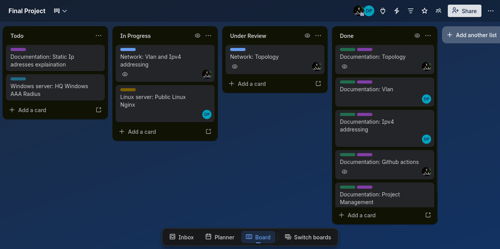

==== Autómatizációk 

===== Bélyegezés

- Amikor egy új feladat a `TODO` listába kerül, ez az autómatizáió
meg bélyegezi az elöbb említett kategóriák alapján.

- Amikoe egy feladat átkerül a `DONE` listába, 
rákerül a Done bélyeg.

===== Egyéb

- Amikoe egy feladat átkerül az `In Progress` listába,
az adott személy automatikusan említve lesz a feladatban.

=== Dokumentáció
A dokumentáció https://asciidoctor.org/[Asciidoctor] leíró nyelvben
van írva, ami késöbb PDF formátumba lesz konvertálva. 
Ez a dokumentáció a https://github.com/[Github] felületen van 
tárolva, könnyebb csapatmunka és verzió követés érdekében.

Amikor egy új ág készül, az alábbi elnevezési szabályokat kell követni:

- *Hálózat:* network/<telephely>/<téma>
- *Programozás:* prog/<téma>
- *Szerver:* server/<OS>/<téma>
- *Dokumentáció:* docs/<téma>

Amikor egy feladat kész van, az adott személy létrehoz egy 
pull-requestet és a másik személynek ezt jóvá kell hagynia.

A main ág védett állapotvan van, így nem lehet direkt módosítani.

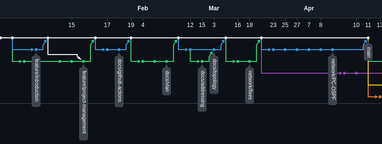

==== Github Actions

Egy workflow létezik a repository-ban. Ez a workflow az asciidoctor
fájl-t, PDF-re konvertálja és a main ág esetében ez a PDF fájl kikerül
a latest release fül alá.

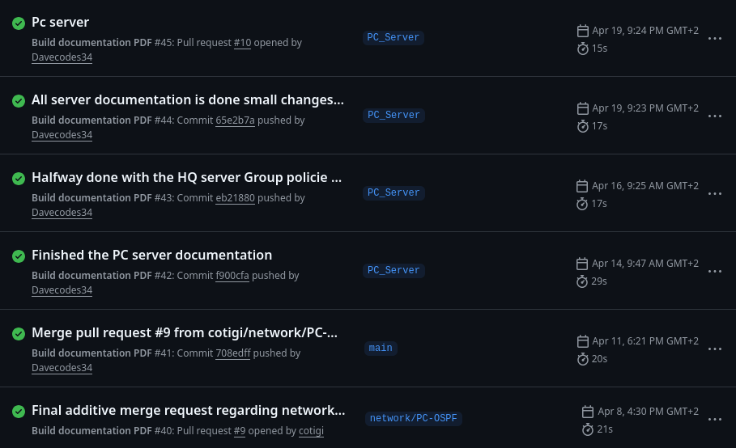

== Általános

Általános konfigurációk minden telephelyre vonatkoznak.

=== Felhasználó és Jelszó Szabályok

Minden hálózati eszköznek a AAA protokolon keresztül kell
hitelesítenie, az alábbi módon.

==== Bejelentkezés

. AAA megnézi az adott RADIUS szervert
. AAA megnézi a lokális felhasználókat

==== Dot1x

. AAA megnézi a RADIUS szervert

Pontosabb AAA konfigurációk az adott telephelyen belül találhatók

NOTE: Minden telephelynek a RADIUS protokolt kell használnia
AAA hitelesítésre

==== Jelszavak

Minden hálózati eszközt el kell látni a `enpa55` enable secret
jelszóval

==== Felhasználók

Minden hálózati eszközt el kell látni az alábbi felhasználóval:

* *Név*: `admin`
* *Jelszó*: `adminpa55`

.Felhasználók
[cols="1h,1,1",options="header"]
|===
|Hely
|Név
|Jelszó

|Lokális
|admin
|adminpa55

|AAA
|AAAadmin
|AAAadminpa55

|AAA
|user
|userpa55
|===

=== Távoli Elérés Szabályzat

SSH protokolon keresztül érünk el távoli elérést, ami minden
VTY vonalon be kell hogy legyen kapcsolva és az alapértelmezett
AAA beállítással ellátva.

SSH az alábbi paraméterekkel van ellátva:

.SSH Paraméterek 
[cols="1h,1",options="header"]
|===
|Beállítás
|Paraméter

|Verzió
|2

|Kulcs Hossz
|2048

|Hitelesítés Próbák
|2

|Tiltás
|30 Másodperc
|===

NOTE: Csak a `MANAGEMENT` és hasonló (a `Package Center` esetében) 
vlanok érhetik el a VTY vonalakat. További információért, lásd <<hq_ssh, HQ SSH>> és
<<pc_ssh, Package Cetner SSH>>

=== Port-security Szabályzat

==== Általános

.Port-security Szabályzat
[cols="3,^.^1",options="header"]
|===
|Szabály
|Megsértés esetén

|Minden kapcsolat ami felhasználói eszközökhöz tart, 
maximum 2 MAC címet engedhet meg
|Korlátozás

|Minden kapcsolat ami nyomtatókhoz vagy access pointokhoz tart,
maximum 1 MAC címet engedélyezhet, a sticky beállítással
.2+.^|Lekapcsolás

|Minden kapcsolat ami szerverhez tart,
maximum 1 statikus MAC címet engedhet meg

|Minden nem használt portot le kell kapcsolni és
a TRASH vlan ba kell helyezni
|Null
|===

Minden access porton az aging time beállítást 5 percre kell állítani

==== Dot1x

Minden switch portot ami felhasználói eszközhöz vezet, el kell 
látni a Dot1x port hitelesítés beállítással, a AAA RADIUS szerveren keresztül

==== IP Source Guard
* IP Source Guard protokolt minden switchen és multi-layer switchen
be kell állítani, ahol van végeszköz kapcsolat.

* Minden nyomtató és szerver esetében a MAC és IP cím párt
statikusan be kell állítani

NOTE: További információért, lásd
<<hq_ip_sg, HQ IP Source Guard>> és
<<pc_ip_sg, Package Center IP Source Guard>>

=== DHCP Snooping Szabályzat

DHCP Snooping minden switchen globálisan be kell állítani és
ellátni egy 20 csomag/másodperc beállítással, a DHCP szerver
irányába.

NOTE: További információért, lásd
<<hq_dhcp_snooping, HQ DHCP Snooping>> és 
<<pc_dhcp_snooping, Package Center DHCP Snooping>>

=== Dynamic ARP Inspection Szabályzat

. Minden vég eszközhöz csatlakozó port nem megbízottként kell
hogy legyen tekintve (ez a nem használt portokra is igaz).

. Minden hálózati eszközhöz csatlakozó port megbízott

. ARP csomagokat validálni kell a forrás és cél MAC cím, illetve 
az IP cím alapján

.ARP Inspection
[source]
----
ip arp inspection validate src-mac dst-mac ip
----

NOTE: További információért, lásd
<<hq_arp_inspection, HQ ARP Inspection>> és
<<pc_arp_inspection, Package Center ARP Inspection>>

=== Egyébb Szabályzatok 

. Minden hálózati eszközt és szervert el kell látni az 
topológiában említett névvel.

. Minden hálózati eszközt el kell látni a `no ip domain-lookup`
parancsal.

. Minden switch és multi-layer switch portot el kell látni a `switchport nonegotiation`
parancsal.

. Minden hálózati eszközt el kell látni a `service password-encryption`
parancsal.

. Minden hálózati eszközt el kell látni a `no cdp run` parancsal.

. Minden switch portot el kell látni a `duplex auto` parancsal.

. Minden ASA eszközt csak konzolos módon szabad konfigurálni.

<<<

== HQ

=== Hálózat

==== Topológia

image::images/hq.png[align="center"]

==== Eszköz Specifikáció

[cols="1h,1",options="header"]
|===
|Név
|Modell

|HQ-ASA
|Cisco ASA 5506-X

|HQ-R1
|Cisco 2911

|HQ-R2
|Cisco 2911

|HQ-S1
|Cisco 2960

|HQ-S2
|Cisco 2960

|HQ-F0-S1
|Cisco 2960

|HQ-F1-S1
|Cisco 2960

|HQ-F1-S2
|Cisco 2960

|HQ-F2-S1
|Cisco 2960

|HQ-F2-S2
|Cisco 2960
|===

[#hq-vlans]
==== Vlanok

[cols="1,1,1",options="header"]
.Vlans
|===
|Vlan ID    
|Név
|Hálózat

|Vlan 110   
|DEVELOPERS    
|10.1.10.0/27

|Vlan 120   
|HR            
|10.1.20.0/26

|Vlan 130   
|ACCOUNTING    
|10.1.30.0/27

|Vlan 140   
|MARKETING     
|10.1.40.0/28

|Vlan 150   
|SERVER        
|10.1.50.0/29

|Vlan 160   
|FRONTDESK     
|10.1.60.0/28

|Vlan 333   
|MANAGEMENT    
|10.1.255.0/27

|Vlan 666   
|TRASH         
|Null
|===

===== VTP

A VTPv2 protokol minden switchen be van állítva és a `HQ-S1`
a szerver, míg minden más switch kliens módban van.

.VTP Beállítások
[cols="1h,1",options="header"]
|===
|Beállítás 
|Pareméter

|Domain     
|hq.vtp

|Jelszó   
|vtppa55

|Verzió
|2
|===

[#hq-etherchannel]
==== Etherchannel

Etherchannel protokol be van állítva a `HQ-S1` és `HQ-S2` eszközök
között, az LACP protokol segítségével.

.Etherchannel Kapcsolatok és Szerepek
[cols="1,1,1",options="header"]
|===
|Honnan (Aktív)  
|Hova (Passzív)   
|Portok

|HQ-S1          
|HQ-S2          
|Fa0/23-24
|===

[#hq-rpvst]
==== Rapid-PVST

Rapid-PVST+ protokol van beállítva minden switch között.

`HQ-S1` a fő, míg `HQ-S2` a mellék gyökér bridge, miden vlanban. 

[cols="1h,2",options="header"]
.Rapid-PVST Szerepek
|===
|Szerep
|Eszköz

|Fő
|HQ-S1

|Mellék
|HQ-S2
|===

===== BPDU Guard és Portfast

BPDU Guard és portfast beállítások minden vég eszköz 
irányába be van állítva.

.BPDU Guard és Portfast
[cols="1,1",options="header"]
|===
|Eszköz
|Port

|HQ-S1
|Gig0/2

.3+.^|HQ-F0-S1
|Fa0/10
|Fa0/11
|Fa0/24

.2+.^|HQ-F1-S1
|Fa0/10
|Fa0/16

.3+.^|HQ-F1-S2
|Fa0/10
|Fa0/20
|Fa0/24

|HQ-F2-S1
|Fa0/10

.2+.^|HQ-F2-S2
|Fa0/10
|Fa0/24
|===

===== Loop Guard

Loop Guard minden switchen globálisan be van konfigurálva.

===== Root Guard

Csak az eszközök, `HQ-S1` és `HQ-S2`, vehetnek részt
a gyökér bridge választásban, így az alábbi portokon
lett Root Guard konfigurálva.

.Root Guard Portok
[cols="1,1",options="header"]
|===
|Eszköz
|Port

.5+.^|HQ-S1
|Fa0/1
|Fa0/11
|Fa0/12
|Fa0/21
|Fa0/22

.5+.^|HQ-S2
|Fa0/1
|Fa0/11
|Fa0/12
|Fa0/21
|Fa0/22
|===

[[hq_ip_sg]]
==== IP Source Guard

NOTE: IP Source Guard, a port-security protokollal van párosítva,
így a MAC cím szerint is szűrve lesz.

===== Dinamikus

Dinamikus IP Source Guard az alábbi módon van konfigurálva:

.Dinamikus IP Source Guard
[cols="1,1"]
|===
|Eszköz
|Port

|HQ-S1
|Gig0/2

.3+.^|HQ-F0-S1
|Fa0/10
|Fa0/11
|Fa0/24

.2+.^|HQ-F1-S1
|Fa0/10
|Fa0/16

.3+.^|HQ-F1-S2
|Fa0/10
|Fa0/20
|Fa0/24

|HQ-F2-S1
|Fa0/10

.2+.^|HQ-F2-S2
|Fa0/10
|Fa0/24
|===

===== Statikus

Statikus IP Source Guard az alábbi módon van konfigurálva:

.Statikus IP Source Guard
[cols="1,1,1,2,2",options="header"]
|===
|Eszköz
|Port
|IP
|MAC
|Név

|HQ-S1
|Gig0/2
|10.1.50.5
|00D0.9756.36C6
|Private Windows

|HQ-F0-S1
|Fa0/24
|10.1.60.13
|0003.E4D8.BC6D
|Frontdesk Printer

.2+.^|HQ-F1-S2
|Fa0/20
|10.1.30.29
|0010.1199.6748
|Accounting Printer

|Fa0/24
|10.1.40.13
|0010.1166.7675
|Marketing Printer

|HQ-F2-S2
|Fa0/24
|10.1.20.61
|0006.2ACE.3B8A
|HR Printer
|===

==== HSRP

HSRP protokol van beállítva a `HQ-R1` és `HQ-R2` eszközök
között. Minden hálózatvan az utolsó IP cím a virtuális router
címe.

`HQ-R1` az aktív, míg `HQ-R2` a passzív.

Ez az alábbi konfigurációkkal lett elérve:

.HSRP Paraméterek
[cols="1,1,1,1",options="header"]
|===
|Eszköz
|Prioritás
|Verzió
|Kezdeményezés

|HQ-R1  
|200        
.2+.^|2          
|Igen

|HQ-R2  
|100        
|Nem
|===

[cols="1,1",options="header"]
.HSRP IPv4 Címek
|===
|Vlan       
|Cím

|DEVELOPERS 
|10.1.10.30 

|HR         
|10.1.20.62 

|ACCOUTING  
|10.1.30.30 

|MARKETING  
|10.1.40.14 

|SERVER     
|10.1.50.6  

|FRONTDESK  
|10.1.60.14 

|MANAGEMENT 
|10.1.255.30
|===

==== DHCPv4

Minden hálózatnak a `Private Windows` eszköz
a DHCP szervere.

[cols="1,1,1,1,1",options="header"]
.IPv4 DHCP Címzés
|===
|Vlan       
|Cím Tartomány
|Címek száma
|DNS    
|Default-gateway

|DEVELOPERS 
|10.1.10.3-29       
|28             
.6+.^|10.2.20.10
|10.1.10.30

|HR         
|10.1.20.3-60       
|58             
|10.1.20.62

|ACCOUNTING 
|10.1.30.3-28       
|26             
|10.1.30.30

|MARKETING  
|10.1.40.3-12       
|10             
|10.1.40.14

|FRONTDESK  
|10.1.60.3-12       
|10             
|10.1.60.14

|MANAGEMENT 
|10.1.255.15-29     
|15             
|10.1.255.30
|===

[[hq_dhcp_snooping]]
==== DHCP Snooping

DHCP Snooping a kép által illusztrált módon lett konfigurálva:

image::images/hq-dhcp-snooping.png[align="center"]

Ez az állapot az alábbi megbízott portokkal lett elérve:

.DHCP Snooping Megbízott Portok
[cols="1,1",options="header"]
|===
|Eszköz
|Port

.9+.^|HQ-S1
|Fa0/1
|Fa0/11
|Fa0/12
|Fa0/21
|Fa0/22
|Fa0/23
|Fa0/24
|Gig0/1
|Gig0/2

.9+.^|HQ-S2
|Fa0/1
|Fa0/11
|Fa0/12
|Fa0/21
|Fa0/22
|Fa0/23
|Fa0/24
|Gig0/1
|Gig0/2

.2+.^|HQ-F0-S1
|Fa0/1
|Fa0/2

.3+.^|HQ-F1-S1
|Fa0/1
|Fa0/2
|Gig0/1

.3+.^|HQ-F1-S2
|Fa0/1
|Fa0/2
|Gig0/1

.3+.^|HQ-F2-S1
|Fa0/1
|Fa0/2
|Gig0/1

.3+.^|HQ-F2-S2
|Fa0/1
|Fa0/2
|Gig0/1
|===

[[hq_arp_inspection]]
==== Dynamic ARP Inspection

DAI az alábbi eszközökön van engedélyezve:

.DAI Eszközök 
[cols="1,1",options="header"]
|===
|Eszköz
|Vlanok

|HQ-S1
|150

|HQ-F0-S1
|160

|HQ-F1-S1
.2+.^|110,130,140

|HQ-F1-S2

|HQ-F2-S1
.2+.^|120,333

|HQ-F2-S2
|===

Megbízott portok az alábbi módon vannak konfigurálva:

.DAI Megbízott Portok
[cols="1,1",options="header"]
|===
|Eszköz
|Port

.8+.^|HQ-S1
|Fa0/1
|Fa0/11
|Fa0/12
|Fa0/21
|Fa0/22
|Fa0/23
|Fa0/24
|Gig0/1

.2+.^|HQ-F0-S1
|Fa0/1
|Fa0/2

.3+.^|HQ-F1-S1
|Fa0/1
|Fa0/2
|Gig0/1

.3+.^|HQ-F1-S2
|Fa0/1
|Fa0/2
|Gig0/1

.3+.^|HQ-F2-S1
|Fa0/1
|Fa0/2
|Gig0/1

.3+.^|HQ-F2-S2
|Fa0/1
|Fa0/2
|Gig0/1
|===

==== OSPF

Hálózat hírdetés a single-area OSPF protokollal van elérve,
illusztrálva az alábbi diagram alapján:

image::images/hq-ospf.png[align="center"]

===== Alapértelmezett útvonal

`PC-ASA` eszköz felelős az alapértelmezett útvonal hírdetéséért.
Az alapértelmezett útvonal: `11.11.11.1`

===== Router-ID

A router azonosítók az alábbi szabályok alapján készülnek:

* Az első három oktet, az OSPF zóna azonosító, ismételve

* Az utolsó oktet, az eszközt azonosító szám, a zónán belül

[cols="1,1",options="header"]
.Router-IDk
|===
|Eszköz
|Router-ID

|HQ-ASA
|0.0.0.3

|HQ-R1
|0.0.0.1

|HQ-R2
|0.0.0.2
|===

===== Passzív Portok

Alapértelmezetten minden port passzív és kézzel aktívra kell
állítani a kellő portokat.

Aktív portok az alábbiak:

[cols="1,1",options="header"]
.Aktív OSPF portok
|===
|Eszköz
|Port

.2+.^|HQ-ASA
|Gig1/1
|Gig1/2

|HQ-R1
|Gig0/2

|HQ-R2
|Gig0/2
|===

==== AAA

A AAA RADIUS szerver, a  `Private Windows` (`10.1.50.5`) eszköz.

Kliensek:

* HQ-R1
* HQ-R2
* HQ-S1
* HQ-S2
* HQ-F0-S1
* HQ-F1-S1
* HQ-F1-S2
* HQ-F2-S1
* HQ-F2-S2

A jelszó: `aaapa55`

==== Access List

[[hq_ssh]]
===== SSH

Minden hálózati eszköznek, ami SSH-t biztosít, tartalmaznia kell
egy ACL-t ami csak az adott `MANAGEMENT` vlan-t engedi be a VTY 
vonalokra.

Ez az alábbi konfigurációval van elérve:

.SSH Hozzáférés
[source]
----
ip access-list standard SSH
    permit 10.1.255.0 0.0.0.31
----

NOTE: A fent említett ACL-t minden VTY vonalon a befelé tekintő
irányba, be kell konfigurálni.

===== VPN

A következő ACL a VPN csomagok felismerésére van konfigurálva

.VPN Csomag Felismerés
[source]
----
access-list VPN-TRAFFIC extended permit ip object LOCAL object REMOTE
----

NOTE: További információért a hálózati objektumokkal kapcsolatban,
lásd <<hq_network_objects>>

===== Befelé Irányuló Csomagok

Az alábbi ACL beengedi a VPN csomagokat és minden mást tilt.

[source]
----
access-list OUTSIDE-IN extended permit ip object REMOTE object LOCAL
----

Ez az ACL az `OUTSIDE` zónán kell hogy belegyen állítva.

[source]
----
access-group OUTSIDE-IN in interface OUTSIDE
----

==== Tűzfal

===== Zones

[cols="1,1,1,1,2",options="header"]
|===
|Port
|Zóna
|Biztonsági Szint
|Cím
|Leírás

|Gig1/1
|INSIDE1
|100
|10.2.200.1
|Kapcsolat HQ-R1

|Gig1/2
|INSIDE2
|100
|10.2.200.5
|Kapcsolat HQ-R2

|Gig1/8
|OUTSIDE
|0
|11.11.11.2
|kapcsolat ISP
|===

[[hq_network_objects]]
===== Hálózati Objektumok

[cols="1,1,1",options="header"]
|===
|Név
|Hálózat
|Maszk

|LAN1
|10.1.0.0 
|255.255.0.0

|LAN2
|10.1.0.0 
|255.255.0.0

|LOCAL
|10.1.0.0
|255.255.0.0

|REMOTE
|10.2.0.0
|255.255.0.0
|===

NOTE: `LAN1` és `LAN2` a `INSIDE1` és `INSIDE2` zónák NATolás érdekében
lettek szétszedve illetve duplikálva.

===== PAT

PAT van konfigurálva a `INSIDE1` és `INSIDE2` zónáknak.

Külső címük: `11.11.11.2`

==== VPN

Site-to-site VPN van felállítva `HQ-ASA` és `PC-ASA` az 
alábbi paraméterekkel:

[cols="1h,1",options="header"]
|===
|Beállítás
|Paraméter

|Kulcs Csere
|IKEv1

|IPsec Protokol
|ESP

|Titkosítás
|AES

|Integritás
|SHA256

|Hitelesítés
|PSK

|Megosztott Kulcs
|vpnpa55

|Diffie-Hellman
|DH2

|Élettartam
|1 Hour

|Pár
|12.12.12.2
|===

===== Transform-set

A transform-set az alábbi módon lett konfigurálva:

.VPN Transform Set
[source]
----
crypto ipsec ikev1 transform-set VPN-SET esp-aes 256 esp-sha-hmac
----

===== ACL

A VPN csomagok észleléséhez az alábbi ACL-t használjuk:

.VPN Csomagok Észlelése
[source]
----
access-list VPN-TRAFFIC extended permit ip object LOCAL object REMOTE
----

NOTE: További információért a hálózati objetumokkal kapcsolatban,
lásd <<hq_network_objects>>

==== IPv4 Címzés

[cols="1,1,1,1",options="header"]
.IPv4 Címzés
|===
|Eszköz
|Port
|Cím
|Default Gateway

.2+.^|HQ-ASA             
|Gig1/1     
|10.1.200.1
|Null

|Gig1/2     
|10.1.200.5 
|Null

.8+.^|HQ-R1              
|Gig0/1.110 
|10.1.10.1  
|Null        

|Gig0/1.120 
|10.1.20.1  
|Null        

|Gig0/1.130 
|10.1.30.1  
|Null        

|Gig0/1.140 
|10.1.40.1  
|Null        

|Gig0/1.150 
|10.1.50.1  
|Null        

|Gig0/1.160 
|10.1.60.1  
|Null        

|Gig0/1.333 
|10.1.255.1 
|Null        

|Gig0/2     
|10.1.200.2 
|Null        

.8+.^|HQ-R2              
|Gig0/1.110 
|10.1.10.2  
|Null        

|Gig0/1.120 
|10.1.20.2  
|Null        

|Gig0/1.130 
|10.1.30.2  
|Null        

|Gig0/1.140 
|10.1.40.2  
|Null        

|Gig0/1.150 
|10.1.50.2  
|Null        

|Gig0/1.160 
|10.1.60.2  
|Null        

|Gig0/1.333 
|10.1.255.2 
|Null        

|Gig0/2     
|10.1.200.6 
|Null        

|HQ-S1              
|Vlan 333   
|10.1.255.3 
|10.1.255.30

|HQ-S2              
|Vlan 333   
|10.1.255.4 
|10.1.255.30

|HQ-F0-S1           
|Vlan 333   
|10.1.255.5 
|10.1.255.30

|HQ-F1-S1           
|Vlan 333   
|10.1.255.6 
|10.1.255.30

|HQ-F1-S2           
|Vlan 333   
|10.1.255.7 
|10.1.255.30

|HQ-F2-S1           
|Vlan 333   
|10.1.255.8 
|10.1.255.30

|HQ-F2-S2           
|Vlan 333   
|10.1.255.9 
|10.1.255.30

|Private Windows    
|Gig0       
|10.1.50.5  
|10.1.50.6

|HR Printer         
|Fa0        
|10.1.20.61 
|10.1.20.62

|Accounting Printer 
|Fa0        
|10.1.30.29 
|10.1.30.30

|Marketing Printer  
|Fa0        
|10.1.40.13 
|10.1.40.14

|Frontdesk Printer  
|Fa0        
|10.1.60.13 
|10.1.60.14

|Developer PCs
|Fa0        
.6+.^|DHCP
|10.1.10.30

|HR PCs
|Fa0        
|10.1.20.62

|Accounting PCs
|Fa0        
|10.1.30.30

|Marketing PCs
|Fa0        
|10.1.40.14

|Frontdesk PCs
|Fa0        
|10.1.60.14

|Management PCs
|Fa0        
|10.1.255.30
|===

<<<

== Package Center

=== Hálózat

==== Topológia

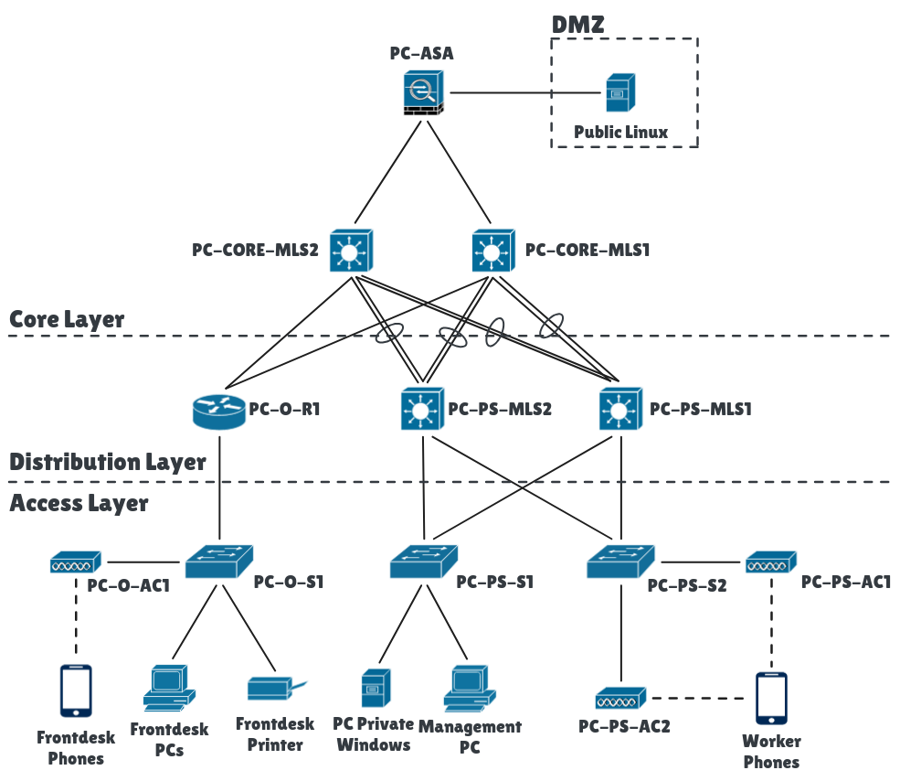

==== Eszköz Specifikáció

[cols="1h,1",options="header"]
|===
|Eszköz
|Modell

|PC-ASA
|Cisco ASA 5506-X

|PC-CORE-MLS1
|Cisco 3650

|PC-CORE-MLS2
|Cisco 3650

|PC-O-R1
|Cisco 2911

|PC-PS-MLS1
|Cisco 3650

|PC-PS-MLS1
|Cisco 3650

|PC-O-S1
|Cisco 2960

|PC-PS-S1
|Cisco 2960

|PC-PS-S2
|Cisco 2960
|===

==== Vlanok

[cols="1,1,1",options="header"]
.Vlanok
|===
|Vlan ID    
|Név            
|Hálózat

|Vlan 210   
|WORKERS           
|10.2.10.0/24

|Vlan 220   
|SERVER           
|10.2.20.0/28

|Vlan 230   
|FRONTDESK        
|10.2.30.0/27

|Vlan 331   
|CORE-MANAGEMENT   
|10.2.255.0/25

|Vlan 332   
|PS-MANAGEMENT     
|10.2.255.128/26

|Vlan 333   
|O-MANAGEMENT      
|10.2.255.192/26

|Vlan 291
|INTER-LAYER-1
|10.2.200.0/29

|Vlan 292
|INTER-LAYER-2
|10.2.200.8/29

|Vlan 666   
|TRASH             
|Null 
|===

NOTE: A vlanok, `INTER-LAYER-1` és `INTER-LAYER-2`, a rétegek 
közti kapcsolat érdekében lettek konfigurálva.

==== Etherchannel

Etherchannel protokol be van állítva a `PC-CORE-MLS1`, 
`PC-CORE-MLS2`, `PC-PS-MLS1` és `PC-PS-MLS2` eszközök között, 
az LACP protokol segítségével.

.Etherchannel Kapcsolatok és Szerepek
[cols="1,1,1,1",options="header"]
|===
|Honnan (Aktív)  
|Hova (Passzív)   
|Portok
|Csoport

.2+.^|PC-CORE-MLS1   
|PC-PS-MLS1     
|Gig1/0/11-12   
|1

|PC-PS-MLS2     
|Gig1/0/13-14   
|2

.2+.^|PC-CORE-MLS2   
|PC-PS-MLS1     
|Gig1/0/21-22   
|3

|PC-PS-MLS2     
|Gig1/0/23-24   
|4
|===

==== Access Pointok

Egy access point az Office és 2 access point a Package Storage
helyiségekben van elhelyezve, az alábbi konfigurációkkal:

.Access Pointok
[cols="1,2,1,1,1,1",options="header"]
|===
|Eszköz
|SSID               
|Jelszó
|Hitelesítés
|Titkosítás
|Csatorna

|PC-O-AC1
|PC-Office
|officepa55
.3+.^|WPA2-PSK
.3+.^|AES
|6

|PC-PS-AC1
.2+.^|PC-Package-Storage
.2+.^|storagepa55
|4

|PC-PS-AC2
|8
|===

NOTE: Minden access point a 2.4GHz frekvencián sugároz.

[[pc_ip_sg]]
==== IP Source Guard

NOTE: Ip Source Guard, a port-security protokollal van párosítva,
így a MAC cím szerint is szűrve lesz.

===== Dinamikus

Dinamikus IP Source Guard az alábbi módon van konfigurálva:

.Dinamikus IP Source Guard
[cols="1,1",options="header"]
|===
|Eszköz
|Port

.2+.^|PC-PS-S1
|Fa0/1
|Fa0/24

.2+.^|PC-O-S1
|Fa0/1
|Fa0/24
|===

===== Statikus

Statikus IP Source Guard az alábbi módon van konfigurálva:

.Statikus IP Source Guard
[cols="1,1,1,2,2",options="header"]
|===
|Eszköz
|Port
|IP
|MAC
|Név

|PC-PS-S1
|Fa0/24
|10.2.20.10
|0060.7035.2DB1
|PC Private Windows

|PC-O-S1
|Fa0/24
|10.2.30.2
|00D0.BA5B.5C07
|Frontdesk Printer
|===

==== HSRP

HSRP protokol van beállítva a `PC-PS-MLS1` and `PC-PS-MLS2` eszközök
között. Minden hálózatban az utolsó IP cím a virtuális router címe.

`PC-PS-MLS1` az aktív, míg `PC-PS-MLS2` a passzív.

Ez az alábbi konfigurációkkal lett elérve: 

.HSRP Paraméterek
[cols="1,1,1,1",options="header"]
|===
|Eszköz
|Prioritás
|Verzió
|Kezdeményezés

|PC-PS-MLS1     
|200        
.2+.^|2          
|Igen

|PC-PS-MLS2     
|100        
|Nem
|===

[cols="1,1",options="header"]
.HSRP IPv4 Címek
|===
|Vlanok
|Cím

|WORKERS        
|10.2.10.254 

|SERVER         
|10.2.20.14 

|PS-MANAGEMENT  
|10.2.255.190 
|===

==== DHCPv4
Minden hálózatnak a `PC Private Windows` eszköz a 
DHCP szervere.

[cols="1,1,1,1,1",options="header"]
.IPv4 DHCP Címzés
|===
|Vlanok       
|Cím Tartomány
|Címek Száma
|DNS    
|Default-gateway

|WORKERS
|10.2.10.3-253       
|251             
.3+.^|10.2.20.10
|10.2.10.254

|FRONTDESK
|10.1.30.2-30
|29             
|10.2.30.1

|PS-MANAGEMENT 
|10.2.255.133-189
|57
|10.2.255.190
|===

<<<

[[pc_dhcp_snooping]]
==== DHCP Snooping

DHCP Snooping a kép által illusztrált módon lett konfigurálva:

image::images/pc-dhcp-snooping.png[align="center"]

Ez az állapot az alábbi megbízott portokkal lett elérve:

.DHCP Snooping Megbízott Portok
[cols="1,1",options="header"]
|===
|Eszköz
|Port

.4+.^|PC-CORE-MLS1
|Gig1/0/11
|Gig1/0/12
|Gig1/0/13
|Gig1/0/14

.4+.^|PC-CORE-MLS2
|Gig1/0/11
|Gig1/0/12
|Gig1/0/13
|Gig1/0/14

|PC-O-S1
|Gig0/1

.6+.^|PC-PS-MLS1
|Gig1/0/1
|Gig1/0/2
|Gig1/0/11
|Gig1/0/12
|Gig1/0/21
|Gig1/0/22

.6+.^|PC-PS-MLS2
|Gig1/0/1
|Gig1/0/2
|Gig1/0/13
|Gig1/0/14
|Gig1/0/23
|Gig1/0/24

.3+.^|PC-PS-S1
|Fa0/24
|Gig0/1
|Gig0/2

.2+.^|PC-PS-S2
|Gig0/1
|Gig0/2
|===

<<<

[[pc_arp_inspection]]
==== Dynamic ARP Inspection

DAI az alábbi eszközökön van engedélyezve:

.DAI Eszközök
[cols="1,1",options="header"]
|===
|Eszköz
|Vlanok

|PC-PS-S1
|220,332

|PC-PS-S2
|210

|PC-O-S1
|230
|===

Megbízott portok az alábbi módon vannak konfigurálva:

.DAI Megbízott Portok 
[cols="1,1",options="header"]
|===
|Eszköz
|Port

.2+.^|PC-PS-S1
|Gig0/1
|Gig0/2

.2+.^|PC-PS-S2
|Gig0/1
|Gig0/2

|PC-O-S1
|Gig0/1
|===

<<<

==== OSPF

Hálózat Hírdetés a single-area OSPF protokollal van elérve,
illusztrálva az alábbi diagram alapján:

image::images/pc-ospf.png[align="center"]

NOTE: Etherchannels kapcsolatok egyszerüsítve vannak.

===== Alapértelmezett útvonal

`PC-ASA` eszköz felelős az alapértelmezett útvonal hírdetéséért.
Az alapértelmezett útvonal: `12.12.12.1`.

===== Router-ID

A router azonosítók az alábbi szabályok alapján készülnek:

* Az első három oktet, az OSPF zóna azonosító, ismételve

* Az utolsó oktet, az eszközt azonosító szám, a zónán belül

[cols="1,1,1",options="header"]
.Router-IDk
|===
|Eszköz
|Zóna
|Router-ID

|PC-ASA
.3+.^|0
|0.0.0.3

|PC-CORE-MLS1
|0.0.0.1

|PC-CORE-MLS2
|0.0.0.2

|PC-PS-MLS1
.2+.^|1
|1.1.1.1

|PC-PS-MLS2
|1.1.1.2

|PC-O-R1
|2
|2.2.2.1
|===

===== Passzív Portok

Alapértelmezetten minden port passzív és kézzel aktívra 
kell állítani a kellő portokat.

Aktív portok az alábbiak:

[cols="1,1",options="header"]
.Aktív OSPF Portok
|===
|Eszköz
|Port

.5+.^|PC-CORE-MLS1
|Gig1/0/1
|Gig1/0/5
|Vlan 291
|Vlan 292
|Vlan 331

.5+.^|PC-CORE-MLS2
|Gig1/0/1
|Gig1/0/5
|Vlan 291
|Vlan 292
|Vlan 331

|PC-PS-MLS1
|Vlan 291

|PC-PS-MLS2
|Vlan 292

.2+.^|PC-O-R1
|Gig0/1
|Gig0/2

|===

==== AAA

A AAA RADIUS szerver, a `PC Private Windows` (`10.2.20.10`) eszköz.

Kliensek:

* PC-CORE-MLS1
* PC-CORE-MLS2
* PC-O-R1
* PC-O-S1
* PC-PS-MLS1
* PC-PS-MLS2
* PC-PS-S1
* PC-PS-S2

A jelszó: `aaapa55`

==== Access List

[[pc_ssh]]
===== SSH

Minden hálózati eszköznek, ami SSH-t biztosít, tartalmaznia kell
egy ACL-t ami csak az adott `MANAGEMENT` vlan-t engedi be a VTY
vonalokra.

A Package Center telephely három `MANAGEMENT` vlan-ra van bontva
mert a rétegek között különböző broadcast domain van.

.SSH Hozzáférés
[source]
----
ip access-list standard SSH
    permit 10.2.255.0 0.0.0.255
----

NOTE: A fent említett ACL-t minden VTY vonalon a befelé tekintő
irányba, be kell konfigurálni.

===== Befelé Irányuló Csomagok

Az alábbi ACL beengedi a VPN csomagokat, illetve a `Public Linux`-nak
címzett IPv4 és IPv6, HTTP és HTTPS csomagokat.

[[source]]
----
access-list OUTSIDE-IN extended permit object-group DMZ-SERVICES any object DMZ-PUBLIC-IP
access-list OUTSIDE-IN extended permit object-group DMZ-SERVICES any object DMZ-NETWORK-IPV6
access-list OUTSIDE-IN extended permit ip object REMOTE object LOCAL
----

NOTE: További információért az objektumokkal kapcsolatban,
lásd <<pc_service_objects>> és <<pc_network_objects>>.

Ez az ACL az `OUTSIDE` zónán kell hogy belegyen állítva.

[source]
----
access-group OUTSIDE-IN in interface OUTSIDE
----

==== Tűzfal

===== Zónák

[cols="1,1,1,1,2",options="header"]
|===
|Port
|Zóna
|Biztonsági Szint
|Cím
|Leírás

|Gig1/1
|INSIDE1
|100
|10.2.200.25
|Kapcsolat PC-CORE-MLS1

|Gig1/2
|INSIDE2
|100
|10.2.200.29
|Kapcsolat PC-CORE-MLS2

|Gig1/5
|DMZ
|50
|10.2.250.1
|Kapcsolat Public Linux

|Gig1/8
|OUTSIDE
|0
|12.12.12.2
|Kapcsolat ISP
|===

[[pc_service_objects]]
===== Service Objektumok

A `DMZ-SERVICES` objektum az alábbi paraméterekkel van 
konfigurálva:

* Cél port 80 - HTTP
* Cél port 443 - HTTPS

[[pc_network_objects]]
===== Network Objektumok

[cols="1,1,1",options="header"]
|===
|Név
|Hálózat
|Maszk

|DMZ-NETWORK
|10.2.250.2
|Host

|DMZ-NETWORK-IPV6
|2001:DB8:ACAD:CC01::100
|Host

|DMZ-PUBLIC-IP
|12.12.12.3
|Host

|LAN1
|10.2.0.0 
|255.255.0.0

|LAN2
|10.2.0.0 
|255.255.0.0

|LOCAL
|10.2.0.0
|255.255.0.0

|REMOTE
|10.1.0.0
|255.255.0.0
|===

NOTE: `LAN1` és `LAN2` a `INSIDE1` és `INSIDE2` zónák NATolás érdekében
lettek szétszedve illetve duplikálva.

===== Policy Map

Az alapértelmezett policy map-hez még hozzá lezz adva a http
csomagok ellenörzése.

.Policy Map
[source]
----
policy-map global_policy
 class inspection_default
  inspect dns preset_dns_map
  inspect ftp 
  inspect http 
  inspect tftp
----

===== NAT

====== PAT

PAT van konfigurálva a `INSIDE1` és `INSIDE2` zónáknak.

Külső címük: `12.12.12.2`

====== SNAT

SNAT van konfigurálva a `DMZ` zónának.
 
Külső cím: `12.12.12.3`

==== VPN

Site-to-site VPN van felállítva `HQ-ASA` és `PC-ASA` az
alábbi paraméterekkel:

[cols="1h,1",options="header"]
|===
|Beállítás
|Paraméter

|Kulcs Csere
|IKEv1

|IPsec Protokol
|ESP

|Titkosítás
|AES

|Integritás
|SHA256

|Hitelesítés
|PSK

|Megosztott Kulcs
|vpnpa55

|Diffie-Hellman
|DH2

|Élettartam
|1 Hour

|Pár
|11.11.11.2
|===

===== Transform-set

A transform-set az alábbi módon lett konfigurálva:

.VPN Transform Set
[source]
----
crypto ipsec ikev1 transform-set VPN-SET esp-aes 256 esp-sha-hmac
----

===== ACL

A VPN csomagok észleléséhez az alébbi ACL-t használjuk:

.VPN Traffic
[source]
----
access-list VPN-TRAFFIC extended permit ip object LOCAL object REMOTE
----

NOTE: További információért az objektumokkal kapcsolatban,
lásd <<pc_network_objects>>

[#pc-ip-addressing]
==== IPv4 Címzés

[cols="1,1,1,1",options="header"]
.IPv4 Címzés
|===
|Eszköz
|Port
|Cím
|Default Gateway

.3+.^|PC-ASA
|Gig1/1
|10.2.200.25
|Null

|Gig1/2
|10.2.200.29
|Null

|Gig1/8
|12.12.12.2
|Null

.5+.^|PC-CORE-MLS1
|Gig1/0/1
|10.2.200.26
|Null

|Gig1/0/5
|10.2.200.17
|Null

|Vlan291
|10.2.200.1
|Null

|Vlan292
|10.2.200.9
|Null

|Vlan331
|10.2.255.1
|Null

.5+.^|PC-CORE-MLS2
|Gig1/0/1
|10.2.200.30
|Null

|Gig1/0/5
|10.2.200.21
|Null

|Vlan291
|10.2.200.2
|Null

|Vlan292
|10.2.200.10
|Null

|Vlan331
|10.2.255.2
|Null

.4+.^|PC-PS-MLS1
|Vlan210
|10.2.10.1
|Null

|Vlan220
|10.2.20.1
|Null

|Vlan291
|10.2.200.3
|Null

|VLAN332
|10.2.255.129
|Null

.4+.^|PC-PS-MLS2
|Vlan210
|10.2.10.2
|Null

|Vlan220
|10.2.20.2
|Null

|Vlan292
|10.2.200.11
|Null

|Vlan332
|10.2.255.130
|Null

.4+.^|PC-O-R1
|Gig0/0.230
|10.2.30.1
|Null

|Gig0/0.333
|10.2.255.193
|Null

|Gig0/1
|10.2.200.18
|Null

|Gig0/2
|10.2.200.22
|Null

|PC-PS-S1
|Vlan332
|10.2.255.131
|10.2.255.190

|PC-PS-S2
|Vlan332
|10.2.255.132
|10.2.255.190

|PC-O-S1
|Vlan333
|10.2.255.194
|10.2.255.193

|Public Linux
|Gig0
|10.2.250.2
|10.2.250.1

|PC Private Windows
|Fa0
|10.2.20.10
|10.2.20.14

|Frontdesk Printer
|Fa0
|10.2.30.2
|10.2.30.1

|Management PCs
|Fa0
.4+.^|DHCP
|10.2.255.190

|Frontdesk PCs
|Fa0
|10.2.30.1

|Frontdesk Phones
|Wifi
|10.2.30.1

|Worker Phones
|Wifi
|10.2.10.254
|===

==== IPv6 Címzés

IPv6 címzés csak a `PC-ASA` és `Public Linux` eszközöknek van 
beállítva.

Mivel IPv6 GUA címzés van használva, nincs szükség NAT66 
konfigurálására.

[cols="1,1,2,1,1",options="header"]
.IPv6 Címzés
|===
|Eszköz
|Port
|Cím
|Tipus
|Default Gateway

.2+.^|PC-ASA
|Gig1/8
|2001:DB8:ACAD:CC00::2/56
|GUA
|Null

|Gig1/5
|FE80::1
|Link-Local
|Null

|Public Linux
|Gig0
|2001:DB8:ACAD:CC01::100/64
|GUA
|FE80::1
|===

== Private Windows Szerver (`Package Center`)
Ez a szerver az alábbi szolgáltatásokat nyultja:

- Active Directory
- DNS
- DHCP
- Nyomtató megosztás
- AAA

=== Active Directory

==== Domain 
Domain név: `bitbox.com`.

==== Organizational Unitok
Organizational unitok az alábbi módon vannak konfigurálva:

.Organizational Unitok
[cols="1,1,1",options="header"]
|===
|Név
|Leírás
|Csoport

|FRONTDESK
|Frontdesk eszközök
|Frontdesk Felhasználók

|PS-MANAGEMENT
|Management eszközök
|PS-MANAGEMENT Felhasználók

|WORKERS
|Worker eszközök
|WORKERS Felhasználók
|===

==== Frontdesk Group Policy
Az alábbi Group Policy minden Frontdesk eszközre és felhasználóra vonatkozik:

Felhasználói konfigurációk:

Autómatikus szoftver telepítés:

* Jóváhagyott szoftverek telepítése és frissítése

Nyomtatók: 

* Csak a Frontdesk nyomtatókhoz kap hozzáférést
* Nem adhat hozzá új nyomtatót
* Nem törölhet már létező nyomtatót

Start Menu és Taskbar:

* Nem férhet hozzá:
    ** Control Panel
    ** Beállítások
    ** Run
* Előre beállított Start Menu felosztás
* Taskbar context menu kikapcsolva

Böngésző korlátozások:

* Alapértelmezett lap a cég weboldala
* Tiltott oldalak:
    ** Social media
    ** Szorakoztatás
* Bővítmények és kiegészítők tiltva
* Letöltés tiltva

Control panel és CMD:

* Command prompt tiltva
* Powershell tiltva
* Registry editor tiltva
* Task manager tiltva

Windows beállítások:

* Háttérkép állítása tiltva
* Beállítások elérése tiltva

Gép konfigurációk:

Csatlakoztatható média:

* USB írás és olvasás tiltva

Applikáció kontrol:

* Csomag menedzsment
* Böngésző

* Lokálisan nem csatlakozhat admin fiók

* Jelszó szabályok:
    ** Minimum 12 karakter
    ** Minimum 1 nagy, 1 kicsi és 1 speciális karakter
    ** Jelszó lejárat: 90 nap
    ** Fiók tiltás 5 próba után
    ** Minden hibás próba auditálva

Frissítések:

* Felhasználó nem érheti el
* Minden frissítés munkaidőn kívül, autómatikusan történik

Audit és Monitorozás:

* Audit fiók kizárás
* Audit sikertelen bejelentkezés 
* Audit sikeres bejelentkezés
* Audit fájl megosztás hozzáférés
* Audit fájl rendszer hozzáférés
* Bejelentkezéskor meg kell várni a hálózati kapcsolatot, hogy a legfrissebb
zabálok legyenek aktívak az adott eszközön és hogy a felhasználó biztos ne
lépjen a cached credentials használatával

==== Workers Group policy

Az alábbi Group Policy minden Workers eszközre és felhasználóra
vonatkozik.

Felhasználói konfigurációk:

* Megendedett a médiák kapcsolása,
viszont monitorozva és auditálva van
* Run menu a Start menu-n belül tiltva
* Control panel and beállítások tiltva 
* Csak adott control panel opciók eléthetőek,
mint az eszközök és nyomtatók
* Command prompt, powershell, registry editor and task manager tiltva

Böngésző korlátozások:

* Alapértelmezett lap a cég weboldala
* Tiltott oldalak:
    ** Social media
    ** Szorakoztatás
* Csak fehérlistás bővítmények és kiegészítők
* letöltési mappa monitorozva és auditálva 
* Csak saját nyomtatót használhatnak
* Indításkor a Package management szoftver és 
Scanner szoftver autómatikusan lefut

Gép konfigurációk:

* Applikáció kontrol:
    *** Megengedett:
        ** Package menedzsment szoftver 
        ** Scanner szoftver
        ** Label printing szoftver
        ** Böngésző
    *** Tiltott:
        ** Minden ismeretlen applikáció
* Windows frissítések:
    *** Frissítések elérése tiltva
    *** Frissítések autómatikusan munkaidőn kívül futnak

* Bejelentkezéskor meg kell várni a hálózati kapcsolatot, hogy a legfrissebb
zabálok legyenek aktívak az adott eszközön és hogy a felhasználó biztos ne
lépjen a cached credentials használatával
    *** Audit és Monitorozás:
    *** Audit fiók kizárás
    *** Audit sikertelen bejelentkezés 
    *** Audit sikeres bejelentkezés
    *** Audit fájl megosztás hozzáférés
    *** Audit fájl rendszer hozzáférés
    *** Audit média csatlakoztatása
    *** Audit letöltések mappa
    *** Audit nyomtató hozzáférés

==== PS-MANAGEMENT Group policy

Felhasználó konfigurációk:

* Böngésző kontrol:
    ** Alapértelmezett lap a cég weboldala
    ** Minden weboldal engedélyezett, viszont 
    auditálva és monitorozva
    ** Minden bővítmény és kiegészítő engedélyezett, viszont
    auditálva és monitorozva
    ** Letöltés engedélyezve, viszont auditálva és monitorozva

* Nyomtató hozzáférés:
    ** Hozzáfér minden nyomtatóhoz, viszont auditálva 
    és monitorozva
    ** Nyomtató hozzáadád és törlés, viszont auditálva 
    és monitorozva

Gép konfiguráció:

* Applikáció kontrol:
    *** Megengedett:
        ** Csak szükséges menedzsment szoftver, mint Remote Desktop
    *** tiltott:
        ** Minden ismeretlen szoftver
* Remote Desktop hozzáférés:
    *** Csak `PS-MANAGEMENT` eszközökre csatlakozhat
    *** Csak `PS-MANAGEMENT` eszközök kezdeményezhetnek 
    Remote Desktop kapcsolatot 
* Csatolható média:
    *** Engedélyezett írás és olvasás, viszont auditálva 
    és monitorozva
* Windows Frissítések:
    *** Ütemezhető, viszont csak munkaidőn kívül
* Biztonság:
    *** Felhasználó kontrol:
        ** Minden adminisztrátor a Admin Approval módban fut
        ** Jogosultság emeléskor jelszó kérés
        ** Jelszó kérés Secure Desktop használatákor
* Credintial Guard:
    *** Credential Guard bekapcsolva
    *** Lokális jelszó tárolás tiltva
* Audit és monitorozás:
    *** Audit felhasználó tiltás
    *** Audit sikertelen bejelentkezés
    *** Audit sikeres bejelentkezés
    *** Audit fájl megosztás
    *** Audit fájl rendszer használat
    *** Audit csatolható média használat
    *** Audit letöltés mappa
    *** Audit nyomtató hozzáférés
    *** Audit priviligizált felhasználó tevékenységek

=== DHCP

.DHCP Konfiguráció
[cols="1,1,1,1,1",options="header"]
|===
|Név
|Cím Tartomány
|DNS 
|Domain Név
|Default Gateway

|Frontdesk
|10.1.30.2 - 10.1.30.30
|10.2.20.10
|bitbox.com
|10.2.30.1

|WORKERS
|10.2.10.3 - 10.2.10.253
|10.2.20.10
|bitbox.com
|10.2.10.254

|PS-MANAGEMENT
|10.2.255.133 - 10.2.255.189
|10.2.20.10
|bitbox.com
|10.2.255.190
|===

=== Fájl Backup

Külön lemez a fájlok backup mentésére a szerveren, 
amit csak az adminisztratoroknak van hozzáférése.

Minden megosztott mappa a szerveren, mentve lesz erre a lemenre.
Minden nap munkaidőn kívül fut ez a mentés.

=== Fájl Megosztás

Az Active Directory szabályoknak megfelelően hozzáférést kaphat
az adott felhasználó a szerveren tárolt megosztott mappákhoz.

.Maximum Tárhely Csoportonként
[cols="1,1",options="header"]
|===
|Csoport
|Méret

|FRONTDESK
|2GB

|WORKERS
|5GB

|PS-MANAGEMENT
|10GB
|===

=== AAA

Központosított hitelesítésre a AAA RADIUS protokollt használjuk.

Kliensek:

* PC-CORE-MLS1
* PC-CORE-MLS2
* PC-O-R1
* PC-O-S1
* PC-PS-MLS1
* PC-PS-MLS2
* PC-PS-S1
* PC-PS-S2

Jelszó: `aaapa55`

== Private Windows Szerver (`HQ`) 

Ez a szerver az alábbi szolgátatásokat nyultja:

- Active Directorz
- DNS
- DHCP
- Nyomtató és fájl megosztás
- AAA

=== Active Directory

==== Domain Név
Domain név: `bitbox.com` 

==== Organizational Unitok
Az organizational unitok az alábbiak:

.Organizational Unitok
[cols="1,1,1",options="header"]
|===
|Név
|Leírás
|Csoport

|Accounting
|Accounting eszközök
|Accounting felhasználók

|Developers
|Developer eszközök
|Developer felhasználók

|Frontdesk
|Frontdesk eszközök
|Frontdesk felhasználók

|HR
|HR eszközök
|HR felhasználók

|Management
|Management eszközök
|Management felhasználók

|Marketing
|Marketing eszközök
|Marketing felhasználók
|===

==== Accounting Group policy
Ez a szabályzat az `Accounting` szervezeti egység minden felhasználójára és eszközére vonatkozik.

User Configuration:

* Start Menu & Taskbar:
    ** Run menü elérésének eltávolítása a Start Menu-ből
    ** Taskbar és Start Menu módosításának letiltása

* Control Panel és Settings elérésének letiltása

* Csak bizonyos Control Panel elemek engedélyezése, mint például a Devices and Printers és a Programs and Features

* Command Prompt, PowerShell, Registry Editor és Task Manager elérésének letiltása.

* Browser korlátozások:
    ** Kezdőlap beállítása a vállalati rendszerre
    ** Hozzáférés engedélyezése minden webhelyhez, de a hozzáférés monitorozása és naplózása
    ** Csak a fehérlistán szereplő bővítmények és pluginok engedélyezése
    ** Fájlok letöltésének letiltása
    ** Developer tools elérésének letiltása a böngészőben

* Printer elérés:
    ** Hozzáférés engedélyezése csak az Accounting területén található megosztott nyomtatóhoz
    ** Nyomtatók hozzáadásának és eltávolításának letiltása

Computer Configuration:

* Application control:
    *** Engedélyezett:
        ** Accounting szoftver
        ** Browser
    *** Tiltott:
        ** Ismeretlen alkalmazások tiltása, amelyek nincsenek kifejezetten engedélyezve

* Removable media:
    ** Minden cserélhető tárolóeszköz-osztály elérésének tiltása az adatszivárgás és a kártevők USB-eszközökön keresztüli bejutásának megakadályozása érdekében.

* Windows Updates:
    ** Felhasználói hozzáférés letiltása a frissítésekhez
    ** Minden frissítés automatikusan települ munkaidőn kívül

* Security Hardening:
    ** User Account Control engedélyezése:
        *** Minden adminisztrátor futtatása Admin Approval Mode-ban
        *** Hitelesítési adatok kérése emelt szintű jogosultság igénylésekor

* Credential Guard:
    ** Credential Guard engedélyezése a hitelesítési adatok ellopása elleni védelem érdekében (pl. Pass-the-Hash és Pass-the-Ticket), a felhasználói hitelesítő adatok izolálásával és védelmével biztonságos környezetben.
    ** Jelszavak helyi eszközön történő tárolásának tiltása a hitelesítő adatok ellopásának megakadályozására az eszköz kompromittálódása esetén.

* Auditing & Monitoring:
    ** Fiók zárolásának naplózása (Audit account lockout)
    ** Sikertelen bejelentkezési kísérletek naplózása
    ** Sikeres bejelentkezések naplózása
    ** Fájlmegosztás elérésének naplózása
    ** Fájlrendszer elérésének naplózása
    ** Privileged User tevékenységek naplózása, mint például a bizalmas fájlokhoz és mappákhoz való hozzáférés, valamint az adminisztrációs eszközök használata.

=== Frontdesk Group policy

Ez a szabályzat a `FRONTDESK` szervezeti egység minden felhasználójára és eszközére vonatkozik.

User Configuration:

Automatikus szoftvertelepítés:

* A vállalati rendszerszoftver telepítése minden Frontdesk PC-re és annak naprakészen tartása

Printers: 

* Hozzáférés engedélyezése csak a Frontdesk nyomtatóhoz
* Új nyomtatók hozzáadásának letiltása
* Nyomtatók eltávolításának letiltása

Start Menu & Taskbar:

* Hozzáférés eltávolítása:
    ** Control Panel
    ** Settings
    ** Run
* Start Menu elrendezés rögzítése (adminisztrátor által előre meghatározott)
* Taskbar helyi menüjének letiltása

Browser korlátozások:

* Kezdőlap beállítása a vállalati rendszerre
* Hozzáférés letiltása a következő webhelyekhez:
    ** Közösségi média
    ** Szórakozás
* Bővítmények és pluginok letiltása
* Fájlok letöltésének letiltása

Control Panel & CMD:

* Command Prompt elérésének letiltása
* PowerShell elérésének letiltása
* Registry Editor elérésének letiltása
* Task Manager elérésének letiltása

Windows Settings:

* Asztali háttérkép módosításának letiltása
* Settings elérésének letiltása

Computer Configuration:

Removable Media:

* USB tárolóeszközök olvasásának és írásának letiltása

Application Control:

* Csomagkezelő szoftver
* Browser

* Helyi adminisztrátori hozzáférés letiltása a felhasználók számára
* Minimális jelszókövetelmények:
    ** Minimum 12 karakter hosszúság
    ** Tartalmaznia kell nagybetűket, kisbetűket, számokat és speciális karaktereket
    ** Jelszó lejárata 90 naponta
    ** Fiók zárolása 5 sikertelen bejelentkezési kísérlet után
    ** Minden sikertelen kísérlet naplózásra kerül

Updates:

* Felhasználói hozzáférés letiltása a frissítésekhez
* Minden frissítés automatikusan települ munkaidőn kívül

Auditing & Monitoring:

* Fiók zárolásának naplózása
* Sikertelen bejelentkezési kísérletek naplózása
* Sikeres bejelentkezések naplózása
* Fájlmegosztás elérésének naplózása
* Fájlrendszer elérésének naplózása
* Bejelentkezéskor várjon a hálózatra, mielőtt engedélyezné a felhasználó bejelentkezését, hogy biztosítsa a legfrissebb szabályzatok alkalmazását, és hogy a felhasználó ne gyorsítótárazott hitelesítő adatokkal jelentkezzen be, ami biztonsági kockázatot jelenthet, ha a felhasználó más eszközt használ, vagy ha a fiókja kompromittálódott.

=== Management Group policy

Ez a szabályzat a `Management` szervezeti egység minden felhasználójára és eszközére vonatkozik.

User Configuration:

* Browser Control:
    ** Kezdőlap beállítása a vállalati rendszerre
    ** Hozzáférés engedélyezése minden webhelyhez, de a hozzáférés monitorozása és naplózása
    ** Bővítmények és pluginok engedélyezése, de a hozzáférés monitorozása és naplózása
    ** Fájlok letöltésének engedélyezése, de a letöltési könyvtár beállítása egy monitorozott és naplózott mappára

* Printer elérés:
    ** Hozzáférés engedélyezése minden nyomtatóhoz, de a hozzáférés monitorozása és naplózása
    ** Nyomtatók hozzáadásának és eltávolításának engedélyezése, de a hozzáférés monitorozása és naplózása

Computer Configuration:

* Application control:
    *** Engedélyezett:
        ** Csak a MANAGEMENT csapat számára szükséges menedzsment szoftverek engedélyezése, mint például távoli asztali szoftverek, monitorozó szoftverek és menedzsment konzolok.
    *** Tiltott:
        ** Ismeretlen alkalmazások tiltása, amelyek nincsenek kifejezetten engedélyezve
* Remote Desktop Access:
    *** Csak a `MANAGEMENT` szervezeti egységben lévő eszközökhöz engedélyezett a távoli asztali hozzáférés
    *** Csak a `MANAGEMENT` szervezeti egységben lévő felhasználók számára engedélyezett távoli asztali munkamenetek indítása
* Removable Media:
    *** Hozzáférés engedélyezése a cserélhető adathordozókhoz, de az monitorozva és naplózva van
* Windows Updates:
    *** Felhasználó számára engedélyezett a frissítések ütemezése, de minden frissítést munkaidőn kívül kell telepíteni
    *** A frissítések azonban automatikusan vannak konfigurálva
* Security Hardening:
    *** User Account Control engedélyezése:
        ** Minden adminisztrátor futtatása Admin Approval Mode-ban
        ** Hitelesítési adatok kérése emelt szintű jogosultság igénylésekor
        ** Hitelesítési adatok kérése a biztonságos asztalon (secure desktop)
* Credential Guard:
    *** Credential Guard engedélyezése a hitelesítési adatok ellopása elleni védelem érdekében (pl. Pass-the-Hash és Pass-the-Ticket), a felhasználói hitelesítő adatok izolálásával és védelmével biztonságos környezetben.
    *** Jelszavak helyi eszközön történő tárolásának tiltása a hitelesítő adatok ellopásának megakadályozására az eszköz kompromittálódása esetén.
* Auditing & Monitoring:
    *** Fiók zárolásának naplózása
    *** Sikertelen bejelentkezési kísérletek naplózása
    *** Sikeres bejelentkezések naplózása
    *** Fájlmegosztás elérésének naplózása
    *** Fájlrendszer elérésének naplózása
    *** Cserélhető adathordozók elérésének naplózása
    *** Böngésző letöltési mappájának tevékenységének naplózása
    *** Nyomtató elérésének naplózása
    *** Privileged User tevékenységek naplózása, mint például a bizalmas fájlokhoz és mappákhoz való hozzáférés, adminisztrációs eszközök használata, valamint a felhasználói fiókok és csoporttagságok módosítása.

=== Developers Group policy

Ez a szabályzat a `Developers` szervezeti egység minden felhasználójára és eszközére vonatkozik.

User Configuration:

* A Control Panel és a Settings elérésének engedélyezése, hogy a fejlesztők módosíthassák a fejlesztési célokhoz szükséges beállításokat, de a bizalmas beállításokhoz (például felhasználói fiókok és csoporttagságok) való hozzáférés monitorozása és naplózása.

* A Command Prompt, PowerShell és Registry Editor elérésének engedélyezése fejlesztési célokra, de a bizalmas parancsokhoz és regisztrációs kulcsokhoz való hozzáférés monitorozása és naplózása.

* A Task Manager engedélyezve van a fejlesztők számára, hogy monitorozhassák alkalmazásaikat és folyamataikat, de a hozzáférés monitorozva és naplózva van.

* Browser Control:
    ** Kezdőlap beállítása a vállalati rendszerre
    ** Hozzáférés engedélyezése minden webhelyhez, de a hozzáférés monitorozása és naplózása
    ** Bővítmények és pluginok engedélyezése, de a hozzáférés monitorozása és naplózása
    ** Fájlok letöltésének engedélyezése, de a letöltési könyvtár beállítása egy monitorozott és naplózott mappára

Computer Configuration:

* Application control:
    *** Engedélyezett:
        ** Szükséges fejlesztői szoftverek engedélyezése, mint például IDE-k, kódszerkesztők, verziókezelő szoftverek és tesztelő eszközök.
    *** Tiltott:
        ** Ismeretlen alkalmazások tiltása, amelyek nincsenek kifejezetten engedélyezve

* Removable Media:
    ** Hozzáférés engedélyezése a cserélhető adathordozókhoz, de az monitorozva és naplózva van az adatszivárgás és a kártevők USB-eszközökön keresztüli bejutásának megakadályozása érdekében.

* PowerShell Control:
    ** A PowerShell Script Block logging engedélyezve van a PowerShell tevékenységek monitorozása és naplózása érdekében, amelyeket a támadók rosszindulatú célokra használhatnak fel.

* Windows Updates:
    ** A frissítések automatikusan vannak konfigurálva.
    ** A felhasználók értesítést kapnak a telepítés előtt.
    ** A frissítések munkaidőn kívüli telepítésre vannak ütemezve a zavarás minimalizálása érdekében.

* Security Hardening:
    ** User Account Control engedélyezése:
        *** Minden adminisztrátor futtatása Admin Approval Mode-ban
        *** Hitelesítési adatok kérése emelt szintű jogosultság igénylésekor

* Credential Guard:
    ** Credential Guard engedélyezése a hitelesítési adatok ellopása elleni védelem érdekében (pl. Pass-the-Hash és Pass-the-Ticket), a felhasználói hitelesítő adatok izolálásával és védelmével biztonságos környezetben.
    ** Jelszavak helyi eszközön történő tárolásának tiltása a hitelesítő adatok ellopásának megakadályozására az eszköz kompromittálódása esetén.

* Auditing & Monitoring:
    ** Fiók zárolásának naplózása
    ** Sikertelen bejelentkezési kísérletek naplózása
    ** Sikeres bejelentkezések naplózása
    ** Fájlmegosztás elérésének naplózása
    ** Fájlrendszer elérésének naplózása
    ** Folyamatok létrehozásának és leállításának naplózása
    ** PowerShell tevékenység naplózása script block logging segítségével
    ** Control Panel és Settings elérésének naplózása, különös tekintettel a bizalmas beállításokra, mint például a felhasználói fiókok és csoporttagságok.

=== Marketing Group policy

Ez a szabályzat a `Marketing` szervezeti egység minden felhasználójára és eszközére vonatkozik.

User Configuration:

* A Control Panel és a Settings elérésének engedélyezése, hogy a marketing csapat módosíthassa a munkájához szükséges beállításokat, de a bizalmas beállításokhoz (például felhasználói fiókok és csoporttagságok) való hozzáférés monitorozása és naplózása.

* A Command Prompt és PowerShell elérésének engedélyezése marketing célokra, de a bizalmas parancsokhoz való hozzáférés monitorozása és naplózása.

* A Registry Editor és a Task Manager elérésének letiltása a jogosulatlan módosítások és a folyamatok monitorozásának megakadályozása érdekében.

* Browser Control:
    ** Kezdőlap beállítása a vállalati rendszerre
    ** Hozzáférés engedélyezése minden webhelyhez, de a hozzáférés monitorozása és naplózása
    ** Bővítmények és pluginok engedélyezése, de a hozzáférés monitorozása és naplózása
    ** Fájlok letöltésének engedélyezése, de a letöltési könyvtár beállítása egy monitorozott és naplózott mappára
    ** Developer tools elérésének engedélyezése a böngészőben, hogy a marketing csapat elemezhesse a weboldalakat és hibákat háríthasson el, de a hozzáférés monitorozása és naplózása.

* Printer elérés:
    ** Hozzáférés engedélyezése a `MARKETING` szervezeti egység összes nyomtatójához.
    ** Nyomtatók hozzáadásának és eltávolításának engedélyezése, de a hozzáférés monitorozása és naplózása

Computer Configuration:

* Application control:
    *** Engedélyezett:
        ** Szükséges marketing szoftverek engedélyezése, mint például grafikai tervező szoftverek, videószerkesztő szoftverek és közösségi média kezelő eszközök.
    *** Tiltott:
        ** Ismeretlen alkalmazások tiltása, amelyek nincsenek kifejezetten engedélyezve

* Removable Media:
    ** Hozzáférés engedélyezése a cserélhető adathordozókhoz, de az monitorozva és naplózva van az adatszivárgás és a kártevők USB-eszközökön keresztüli bejutásának megakadályozása érdekében.

* Windows Updates:
    ** A frissítések automatikusan vannak konfigurálva, és munkaidőn kívül települnek, hogy ne zavarják a marketing csapatot a munkájuk során.

* Security Hardening:
    ** User Account Control engedélyezése:
        *** Minden adminisztrátor futtatása Admin Approval Mode-ban
        *** Hitelesítési adatok kérése emelt szintű jogosultság igénylésekor

* Credential Guard:
    ** Credential Guard engedélyezése a hitelesítési adatok ellopása elleni védelem érdekében (pl. Pass-the-Hash és Pass-the-Ticket), a felhasználói hitelesítő adatok izolálásával és védelmével biztonságos környezetben.
    ** Jelszavak helyi eszközön történő tárolásának tiltása a hitelesítő adatok ellopásának megakadályozására az eszköz kompromittálódása esetén.

* Auditing & Monitoring:
    ** Fiók zárolásának naplózása
    ** Sikertelen bejelentkezési kísérletek naplózása
    ** Sikeres bejelentkezések naplózása
    ** Fájlmegosztás elérésének naplózása
    ** Fájlrendszer elérésének naplózása
    ** Folyamatok létrehozásának és leállításának naplózása
    ** PowerShell tevékenység naplózása script block logging segítségével
    ** Control Panel és Settings elérésének naplózása, különös tekintettel a bizalmas beállításokra, mint például a felhasználói fiókok és csoporttagságok.

=== HR Group policy

Ez a szabályzat a `HR` szervezeti egység minden felhasználójára és eszközére vonatkozik.

User Configuration:

* Start Menu & Taskbar:
    ** Run menü elérésének eltávolítása a Start Menu-ből
    ** Taskbar és Start Menu módosításának letiltása

* Control Panel:
    ** Control Panel és Settings elérésének letiltása
    ** Csak bizonyos Control Panel elemek engedélyezése, mint például a Devices and Printers és a Programs and Features

* Command Prompt, PowerShell, Registry Editor és Task Manager elérésének letiltása.

* Browser korlátozások:
    ** Kezdőlap beállítása a vállalati rendszerre
    ** Hozzáférés engedélyezése minden webhelyhez, de a hozzáférés monitorozása és naplózása
    ** Csak a fehérlistán szereplő bővítmények és pluginok engedélyezése
    ** Fájlok letöltésének letiltása
    ** Developer tools elérésének letiltása a böngészőben

* Printer elérés:
    ** Hozzáférés engedélyezése csak a HR területén található megosztott nyomtatóhoz
    ** Nyomtatók hozzáadásának és eltávolításának letiltása

Computer Configuration:

* Application control:
    *** Engedélyezett:
        ** HR szoftver
        ** Browser
    *** Tiltott:
        ** Ismeretlen alkalmazások tiltása, amelyek nincsenek kifejezetten engedélyezve

* Removable media:
    ** Minden cserélhető tárolóeszköz-osztály elérésének tiltása az adatszivárgás és a kártevők USB-eszközökön keresztüli bejutásának megakadályozása érdekében.

* Windows Updates:
    ** Felhasználói hozzáférés letiltása a frissítésekhez
    ** Minden frissítés automatikusan települ munkaidőn kívül

* Security Hardening:
    ** User Account Control engedélyezése:
        *** Minden adminisztrátor futtatása Admin Approval Mode-ban
        *** Hitelesítési adatok kérése emelt szintű jogosultság igénylésekor

* Credential Guard:
    ** Credential Guard engedélyezése a hitelesítési adatok ellopása elleni védelem érdekében (pl. Pass-the-Hash és Pass-the-Ticket), a felhasználói hitelesítő adatok izolálásával és védelmével biztonságos környezetben.
    ** Jelszavak helyi eszközön történő tárolásának tiltása a hitelesítő adatok ellopásának megakadályozására az eszköz kompromittálódása esetén.

* Auditing & Monitoring:
    ** Fiók zárolásának naplózása
    ** Sikertelen bejelentkezési kísérletek naplózása
    ** Sikeres bejelentkezések naplózása
    ** Fájlmegosztás elérésének naplózása
    ** Fájlrendszer elérésének naplózása
    * Bejelentkezéskor várjon a hálózatra, mielőtt engedélyezné a felhasználó bejelentkezését, hogy biztosítsa a legfrissebb szabályzatok alkalmazását, és hogy a felhasználó ne gyorsítótárazott hitelesítő adatokkal jelentkezzen be, ami biztonsági kockázatot jelenthet, ha a felhasználó más eszközt használ, vagy ha a fiókja kompromittálódott.

=== DHCP

.DHCP Konfiguráció
[cols="1,1,1,1,1",options="header"]
|===
|Név
|Cím Tartomány
|DNS
|Domain Név
|Default Gateway

|HQ-DEVELOPERS
|10.1.10.3 - 10.1.10.29
|10.2.20.10
|bitbox.com
|10.1.10.30

|HQ-HR
|10.1.20.3 - 10.1.20.60
|10.2.20.10
|bitbox.com
|10.1.20.62

|HQ-ACCOUNTING
|10.1.30.3 - 10.1.30.28
|10.2.20.10
|bitbox.com
|10.1.30.30

|HQ-MARKETING
|10.1.40.3 - 10.1.40.12
|10.2.20.10
|bitbox.com
|10.1.40.14

|HQ-FRONTDESK
|10.1.60.3 - 10.1.60.12
|10.2.20.10
|bitbox.com
|10.1.60.14

|HQ-MANAGEMENT
|10.1.255.17 - 10.1.255.29
|10.2.20.10
|bitbox.com
|10.1.255.30
|===

=== Fájl Backup

Külön lemez a fájlok backup mentésére a szerveren, 
amit csak az adminisztratoroknak van hozzáférése.

Minden megosztott mappa a szerveren, mentve lesz erre a lemenre.
Minden nap munkaidőn kívül fut ez a mentés.

=== Fájl Megosztás

Az Active Directory szabályoknak megfelelően hozzáférést kaphat
az adott felhasználó a szerveren tárolt megosztott mappákhoz.

.Maximum Tárhely Csoportonként
[cols="1,1",options="header"]
|===
|Csoport
|Méret

|Accounting
|5GB

|HR
|5GB

|Marketing
|10GB

|Developers
|20GB

|Management
|20GB

|Frontdesk
|2GB
|===

=== AAA

Központosított hitelesítésre a AAA RADIUS protokollt használjuk.

Kliensek:

* HQ-CORE-MLS1
* HQ-CORE-MLS2
* HQ-O-R1
* HQ-O-S1
* HQ-PS-MLS1
* HQ-PS-MLS2
* HQ-PS-S1
* HQ-PS-S2

Jelszó: `aaapa55`

== Public Linux Server (`Package Center`) 

Ez a szerver a cég weblapját szolgáltatja, erre az Nginx programot használjuk.
A szervert egy DMZ be helyeztük, amit csak a `PC-ASA` tűzfalon keresztül lehet
elérni.

.Nginx Paraméterek
[cols="1,1",options="header"]
|===
|Beállítás
|Paraméter

|Port
|80

|Domain Név
|bitbox.com

|Root Lokáció
|/var/www/

|Log Lokáció
|/var/log/nginx
|===

<<<

== Remote Package Storage

=== Hálózat

A Remote Package Storage telephely csak egy
SOHO router-ből áll, ami wifi-t szolgáltat a helyi dolgozóknak
és direkt kapcsolatban van az ISP-vel.

==== Topológia

image::images/rps-topology.png[align="center"]

==== LAN

Ez a telephely csak a `10.3.0.0/24` hálózatot hírdeti.

==== Wifi

.Wifi
[cols="1,1,1,1",options="header"]
|===
|SSID               
|Jelszó
|Hitelesítés
|Titkosítás

|Warehouse
|warehousepa55
|WPA2 Personal
|AES
|===

==== DHCPv4

DHCP szerver: `SOHO Router`

[cols="1,1,1,1",options="header"]
.IPv4 DHCP Címzés
|===
|Cím Tartomány
|Címek Száma
|DNS    
|Default-gateway

|10.3.0.2-254       
|253             
|8.8.8.8
|10.3.0.1
|===

==== IPv4 Címzés

[cols="1,1,1,1",options="header"]
.IPv4 Címzés
|===
|Eszköz
|Port
|Cím
|Default Gateway

.2+.^|SOHO Router
|Internet
|13.13.13.2
|Null

|LAN
|10.3.0.1
|Null

|Worker Phones
|Wifi
|DHCP
|10.3.0.1
|===

== Hálózat Programozás (Necop)
A Necop program, egy TUI felülettel felszerelt hálózat
konfigurációs program ami képes elérketőség teszt-re és
konfiguráció mentésre egy TFTP szerverre.

NOTE: Tesztelésre, lásd a videót

[#device_response]
=== Eszköz Válaszok
Minden gombnak négy statusza van amik szín alapján jelzik
a művelet állapotát, ezek:

- *Szürke*: Alapértelmezett
- *Narancs*: Tölt
- *Zöld*: Sikeres
- *Piros*: Sikertelen

NOTE: A művelet folyamata közben megjelenik ez töltést
jelző indikátor

A felület két tab-ra van felbontva, melyeket az alábbi sekciókban lehet
megtekinteni:

=== Devices Tab

A `Devices` felületen az eszközök elérhetőségét lehet tesztelni 

=== TFTP Tab

A `TFTP` felületen az eszközök konfigurációját lehet lementeni egy adott
TFTP szerverre.

==== Válaszok
Az eddig kifejezett állapotokon felül (<<device_response>>),
a `TFTP` felületen, ha a művelet sikeresen lefutott, akkor az írt byte-ok
mennyiségét is kiírja a zöld jelzésen felül.

=== Eszköz Regisztráció
Eszközöket a `resources/devices.txt` fájlban lehet regisztrálni,
egy `,`-vel elválasztva.

A következő paramétereket kell megadni:

- *Lokáció*
- *Hostnév*
- *IPv4 Cím*

*Format:* `<Lokáció>,<Hostnév>,<IPv4 Cím>`
 
=== Kilépő felület
Ha a felhasználó beakarja csukni a felületet viszont van még futó 
művelet, egy várakozó képernyőre kerül ahol meg kell vérni a műveletek
végét.

[appendix]
== Tesztelés
=== Hálózat
==== DHCP, Vlan és IPv4 (`HQ`)
Az alábbi teszt a különböző vlanok és DHCP működését mutatja be.

A tesztelt eszközök az alábbiak:

[cols="1h,1,1",options="header"]
|===
|Eszköz
|Vlan
|Várt Hálózat

|Frontdesk PC
|FRONTDESK (V160)
|10.1.60.0/28

|Management PC
|MANAGEMENT (V333)
|10.1.255.0/27
|===

.Frontdesk PC
image::images/1-fepc.png[align="center"]

.Management PC
image::images/1-mapc.png[align="center"]

==== Wifi (`Package Center`)
Az alábbi teszt a Wifi műküdését mutatja be.

.Wifi Kapcsolat
image::images/2-ph.png[align="center"]

.DHCP Bemutatás
image::images/2-ph-2.png[align="center"]

==== HSRP (`HQ`)
Az alábbi teszt a HSRP működését mutatja be, amikor az
aktív router meghibásodik.

.HQ-R1 Be
image::images/3-ma-1.png[align="center"]

.HQ-R1 Ki
image::images/3-ma-2.png[align="center"]

==== ACL (`Package Center`)
Az alábbi teszt az SSH ACL működését mutatja be, ahol csak a 
`MANAGEMENT` vlan csatlakozhat.

.MANAGEMENT Vlan
image::images/4-ma.png[align="center"]

.FRONTDESK Vlan
image::images/4-fe.png[align="center"]

==== R-PVST+ és Etherchannel (`HQ`)
Az alábbi teszt a második rétegbeli redundanciát mutatja be.

A Kapcsolat a `Management PC` és a `HQ-R1` között folyik.

.Sztandard
image::images/5-ma-1.png[align="center"]

.HQ-F2-S2 Fa0/1 Ki
image::images/5-ma-2.png[align="center"]

.HQ-F2-S2 Gig0/1 Ki
image::images/5-ma-3.png[align="center"]

.HQ-S2 Fa0/24 Ki
image::images/5-ma-4.png[align="center"]

==== PAT, SNAT és Statikus Irányítás (`Package Center`)
Az alábbi teszt a NAT protokol működését mutatja be.

A `Public Linux` eszköz vártan a `12.12.12.3` IP címet veszi fel, míg
a `PC-CORE-MLS1` eszköz vártan a `12.12.12.2` IP címet veszi fel.

Statikus irányítás a csomag sikeres kifelé irányítása alapján tesztelhető.

.SNAT
image::images/6-li.png[align="center"]

.PAT
image::images/6-mls.png[align="center"]

==== Dinamikus irányítás (`HQ`)
Az alábbi teszt a redundáns útvonalakat mutatja be.

.HQ-R1 Be
image::images/7-r1.png[align="center"]

.HQ-R1 Ki
image::images/7-r2.png[align="center"]

==== WAN (`HQ` & `Package Center`)
Az alábbi teszt a telephelyek közötti kapcsolatot mutatja be.

.WAN
image::images/8-asa.png[align="center"]

==== VPN (`HQ` & `Package Center`)
Az alábbi teszt a telephelyek közötti VPN kapcsolatot mutatja be. 

.VPN
image::images/9-vpn.png[align="center"]

==== Tűzfal (`Remote Package Storage` & `Package Center`)
Az alábbi teszt a DMZ be való irányítást mutatja be, ahol
csak HTTP és HTTPS csomagok mehetnek át.

.HTTP
image::images/10-li.png[align="center"]

.Ping
image::images/10-li-2.png[align="center"]

==== IPv6 (`Package Center`)
Az alábbi teszt az IPv6 működését mutatja be a DMZ hálózaton belül.

.IPv6
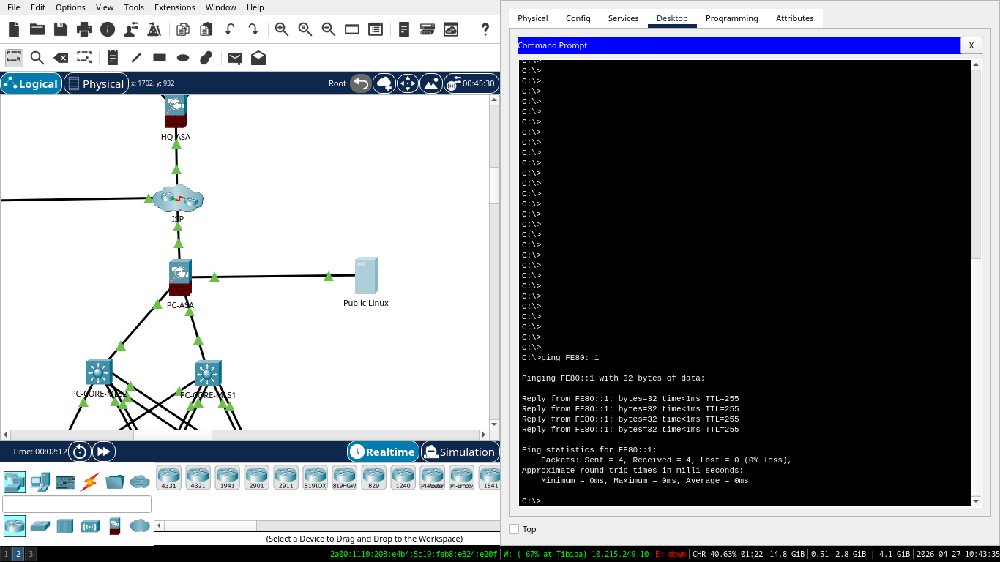

=== Weboldal Teszt

Az alábbi teszt a webszerver sikeres elérését teszteli egy külsö kliens által
és a weblap megjelenik.

A teszt sikeresen lefutott.

=== Szerver Teszt

==== Active Directory Teszt

Az alábbi teszt egy kliens sikeres tartományba lépését mutatja be.
Emellett némely group policy beállítást is illusztrálunk.

NOTE: A felhasználó megpróbál belépni a Management csoportba.

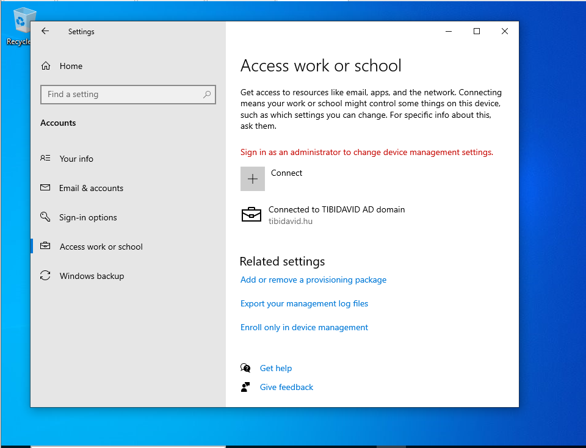

NOTE: A felhasználó sikeresen belép a Management csoportba.

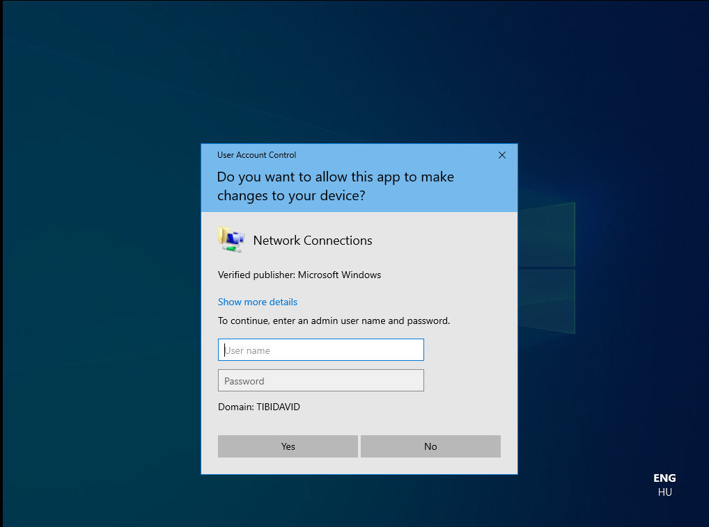

NOTE: A "Jade Boss" felhasználó megpróbál hálózati beállításokat
állítani és adminisztrator jogok kér az eszköz.

==== DHCP Teszt

Az alábbi teszt a DCHP szerver működését mutatja be.

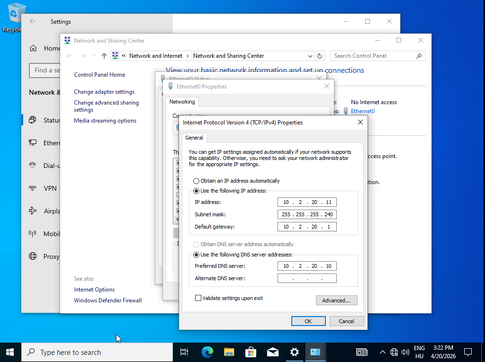

NOTE: Statikus IP cím beállítása.

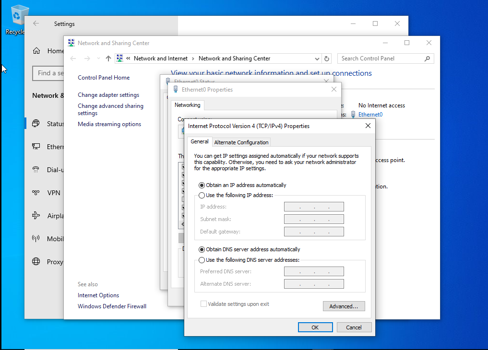

NOTE: IP cím DHCP-re állítása és a kérés kezdeményezése.

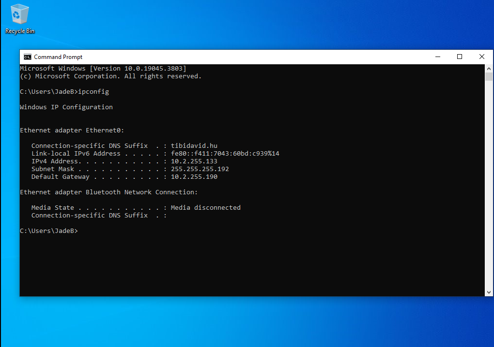

NOTE: A kliens sikeresen kapott IP címet a DHCP szerver által.

==== File Backup Teszt

Az alábbi teszt a megosztott mappák autómatikus, munkaidőn kívüli,
mentését mutatja be, egy külön lemezre.

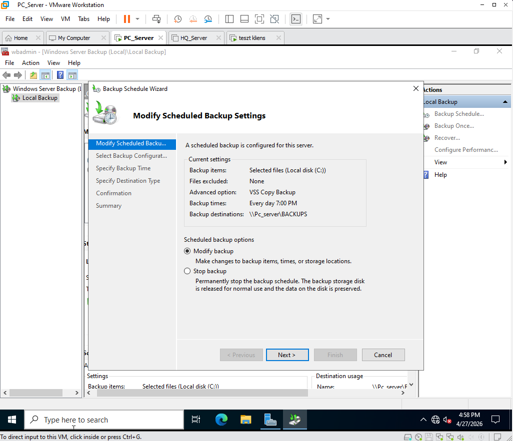

NOTE: Az autómatikus mentés minden nap este 7 kor kerül sorra.

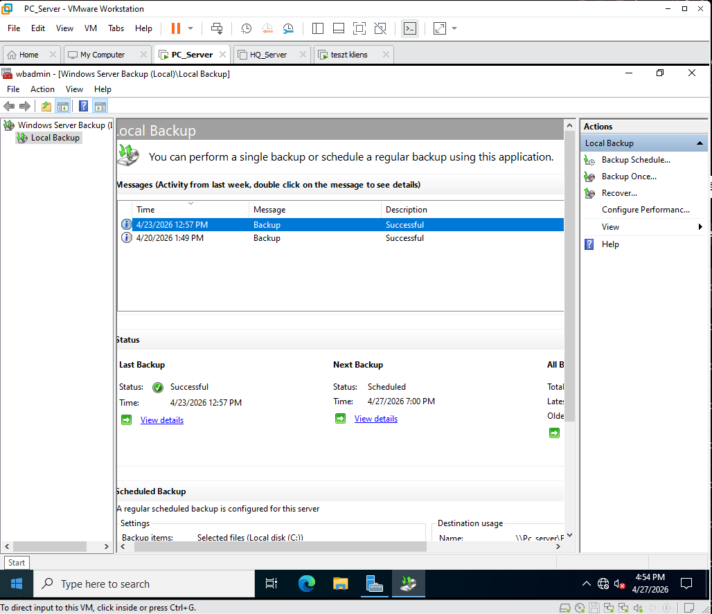

NOTE: A mentés sikeresen lefutott.

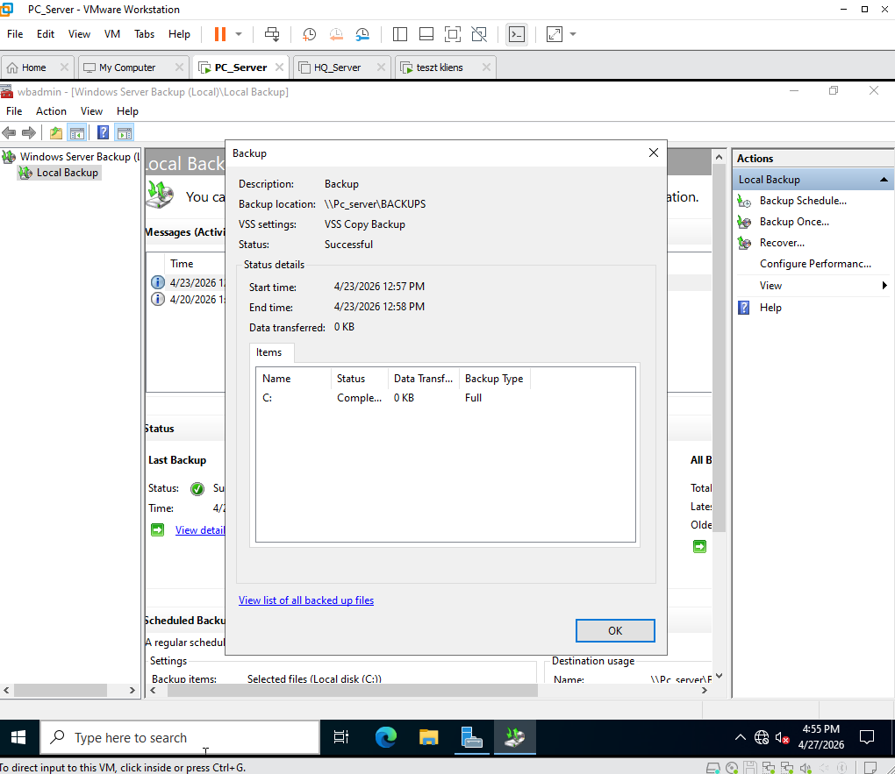

NOTE: Legutóbbi biztonsági mentés részletei.

==== Autómatikus Frissítés Teszt

Az alábbi teszt az autómatikus frissítések sikeres 
ütemezését mutatja be, munkaidőn kívül.

A rendszeren lévő programok sikeresen lefrissűltek.

[appendix]
== Hálózati Eszköz Konfigurációk
=== HQ
==== HQ-ASA
.Konfiguráció
[source]
----
: Saved
:
ASA Version 9.6(1)
!
hostname HQ-ASA
enable password DzaLrtot/vx63hrf encrypted
names
!
interface GigabitEthernet1/1
 nameif INSIDE1
 security-level 100
 ip address 10.1.200.1 255.255.255.252
!
interface GigabitEthernet1/2
 nameif INSIDE2
 security-level 100
 ip address 10.1.200.5 255.255.255.252
!
interface GigabitEthernet1/3
 no nameif
 no security-level
 no ip address
 shutdown
!
interface GigabitEthernet1/4
 no nameif
 no security-level
 no ip address
 shutdown
!
interface GigabitEthernet1/5
 no nameif
 no security-level
 no ip address
 shutdown
!
interface GigabitEthernet1/6
 no nameif
 no security-level
 no ip address
 shutdown
!
interface GigabitEthernet1/7
 no nameif
 no security-level
 no ip address
 shutdown
!
interface GigabitEthernet1/8
 nameif OUTSIDE
 security-level 0
 ip address 11.11.11.2 255.255.255.252
!
interface Management1/1
 management-only
 no nameif
 no security-level
 no ip address
 shutdown
!
object network LAN1
 subnet 10.1.0.0 255.255.0.0
 nat (INSIDE1,OUTSIDE) dynamic interface
object network LAN2
 subnet 10.1.0.0 255.255.0.0
 nat (INSIDE2,OUTSIDE) dynamic interface
object network LOCAL
 subnet 10.1.0.0 255.255.0.0
object network REMOTE
 subnet 10.2.0.0 255.255.0.0
!
route OUTSIDE 0.0.0.0 0.0.0.0 11.11.11.1 1
!
access-list VPN-TRAFFIC extended permit ip object LOCAL object REMOTE
access-list OUTSIDE-IN extended permit ip object REMOTE object LOCAL
!
!
access-group OUTSIDE-IN in interface OUTSIDE
!
!
class-map inspection_default
 match default-inspection-traffic
!
policy-map type inspect dns preset_dns_map
 parameters
  message-length maximum 512
policy-map global_policy
 class inspection_default
  inspect dns preset_dns_map
  inspect ftp 
  inspect tftp 
!
service-policy global_policy global
!
telnet timeout 5
ssh timeout 5
!
!
crypto ipsec ikev1 transform-set VPN-SET esp-aes 256 esp-sha-hmac
!
crypto map omap 10 match address VPN-TRAFFIC
crypto map omap 10 set peer 12.12.12.2 
crypto map omap 10 set ikev1 transform-set VPN-SET 
crypto map omap interface OUTSIDE
crypto ikev1 enable OUTSIDE
crypto ikev1 policy 10
 encr aes
 authentication pre-share
 group 2
 lifetime 3600
!
tunnel-group 12.12.12.2 type ipsec-l2l
tunnel-group 12.12.12.2 ipsec-attributes
 ikev1 pre-shared-key vpnpa55
!
router ospf 1
 router-id 0.0.0.1
 log-adjacency-changes
 network 10.1.200.0 255.255.255.252 area 0
 network 10.1.200.4 255.255.255.252 area 0
 default-information originate
!
----

==== HQ-R1
.Konfiguráció
[source]
----
Building configuration...

Current configuration : 3211 bytes
!
version 15.1
no service timestamps log datetime msec
no service timestamps debug datetime msec
service password-encryption
!
hostname HQ-R1
!
!
!
enable secret 5 $1$mERr$STCVvBm3rx8XD5gcSxKFC/
!
!
!
!
!
aaa new-model
!
aaa authentication login default group radius local-case 
!
!
!
!
!
!
!
ip cef
no ipv6 cef
!
!
!
username admin privilege 15 secret 5 $1$mERr$YDWMoxSY4R79.r8uptM1C0
!
!
license udi pid CISCO2911/K9 sn FTX1524DDFG-
!
!
!
!
!
!
!
!
!
ip ssh version 2
ip ssh authentication-retries 2
ip ssh time-out 30
no ip domain-lookup
ip domain-name bitbox.hu
!
!
spanning-tree mode pvst
!
!
!
!
!
!
interface GigabitEthernet0/0
 no ip address
 duplex auto
 speed auto
 shutdown
!
interface GigabitEthernet0/1
 no ip address
 duplex auto
 speed auto
!
interface GigabitEthernet0/1.110
 encapsulation dot1Q 110
 ip address 10.1.10.1 255.255.255.224
 ip helper-address 10.1.50.5
 standby version 2
 standby 0 ip 10.1.10.30
 standby priority 200
 standby preempt
!
interface GigabitEthernet0/1.120
 encapsulation dot1Q 120
 ip address 10.1.20.1 255.255.255.192
 ip helper-address 10.1.50.5
 standby version 2
 standby 0 ip 10.1.20.62
 standby priority 200
 standby preempt
!
interface GigabitEthernet0/1.130
 encapsulation dot1Q 130
 ip address 10.1.30.1 255.255.255.224
 ip helper-address 10.1.50.5
 standby version 2
 standby 0 ip 10.1.30.30
 standby priority 200
 standby preempt
!
interface GigabitEthernet0/1.140
 encapsulation dot1Q 140
 ip address 10.1.40.1 255.255.255.240
 ip helper-address 10.1.50.5
 standby version 2
 standby 0 ip 10.1.40.14
 standby priority 200
 standby preempt
!
interface GigabitEthernet0/1.150
 encapsulation dot1Q 150
 ip address 10.1.50.1 255.255.255.248
 ip helper-address 10.1.50.5
 standby version 2
 standby 0 ip 10.1.50.6
 standby priority 200
 standby preempt
!
interface GigabitEthernet0/1.160
 encapsulation dot1Q 160
 ip address 10.1.60.1 255.255.255.240
 ip helper-address 10.1.50.5
 standby version 2
 standby 0 ip 10.1.60.14
 standby priority 200
 standby preempt
!
interface GigabitEthernet0/1.333
 encapsulation dot1Q 333
 ip address 10.1.255.1 255.255.255.224
 ip helper-address 10.1.50.5
 standby version 2
 standby 0 ip 10.1.255.30
 standby priority 200
 standby preempt
!
interface GigabitEthernet0/2
 ip address 10.1.200.2 255.255.255.252
 duplex auto
 speed auto
!
interface Vlan1
 no ip address
 shutdown
!
router ospf 1
 router-id 1.1.1.1
 log-adjacency-changes
 passive-interface default
 no passive-interface GigabitEthernet0/2
 network 10.1.10.0 0.0.0.31 area 0
 network 10.1.20.0 0.0.0.63 area 0
 network 10.1.30.0 0.0.0.31 area 0
 network 10.1.40.0 0.0.0.15 area 0
 network 10.1.50.0 0.0.0.7 area 0
 network 10.1.60.0 0.0.0.15 area 0
 network 10.1.255.0 0.0.0.31 area 0
 network 10.1.200.0 0.0.0.31 area 0
!
ip classless
!
ip flow-export version 9
!
!
ip access-list standard SSH
 permit 10.1.255.0 0.0.0.31
!
no cdp run
!
!
radius server 10.1.50.5
 address ipv4 10.1.50.5 auth-port 1645
 key aaapa55
!
!
!
line con 0
 login authentication default
!
line aux 0
!
line vty 0 4
 access-class SSH in
 login authentication default
 transport input ssh
line vty 5 15
 access-class SSH in
 login authentication default
 transport input ssh
!
!
!
end
----

==== HQ-R2
.Konfiguráció
[source]
----
Building configuration...

Current configuration : 2937 bytes
!
version 15.1
no service timestamps log datetime msec
no service timestamps debug datetime msec
service password-encryption
!
hostname HQ-R2
!
!
!
enable secret 5 $1$mERr$STCVvBm3rx8XD5gcSxKFC/
!
!
!
!
!
aaa new-model
!
aaa authentication login default group radius local-case 
!
!
!
!
!
!
!
ip cef
no ipv6 cef
!
!
!
username admin privilege 15 secret 5 $1$mERr$YDWMoxSY4R79.r8uptM1C0
!
!
license udi pid CISCO2911/K9 sn FTX1524M1OR-
!
!
!
!
!
!
!
!
!
ip ssh version 2
ip ssh authentication-retries 2
ip ssh time-out 30
no ip domain-lookup
ip domain-name bitbox.hu
!
!
spanning-tree mode pvst
!
!
!
!
!
!
interface GigabitEthernet0/0
 no ip address
 duplex auto
 speed auto
 shutdown
!
interface GigabitEthernet0/1
 no ip address
 duplex auto
 speed auto
!
interface GigabitEthernet0/1.110
 encapsulation dot1Q 110
 ip address 10.1.10.2 255.255.255.224
 ip helper-address 10.1.50.5
 standby version 2
 standby 0 ip 10.1.10.30
!
interface GigabitEthernet0/1.120
 encapsulation dot1Q 120
 ip address 10.1.20.2 255.255.255.192
 ip helper-address 10.1.50.5
 standby version 2
 standby 0 ip 10.1.20.62
!
interface GigabitEthernet0/1.130
 encapsulation dot1Q 130
 ip address 10.1.30.2 255.255.255.224
 ip helper-address 10.1.50.5
 standby version 2
 standby 0 ip 10.1.30.30
!
interface GigabitEthernet0/1.140
 encapsulation dot1Q 140
 ip address 10.1.40.2 255.255.255.240
 ip helper-address 10.1.50.5
 standby version 2
 standby 0 ip 10.1.40.14
!
interface GigabitEthernet0/1.150
 encapsulation dot1Q 150
 ip address 10.1.50.2 255.255.255.248
 ip helper-address 10.1.50.5
 standby version 2
 standby 0 ip 10.1.50.6
!
interface GigabitEthernet0/1.160
 encapsulation dot1Q 160
 ip address 10.1.60.2 255.255.255.240
 ip helper-address 10.1.50.5
 standby version 2
 standby 0 ip 10.1.60.14
!
interface GigabitEthernet0/1.333
 encapsulation dot1Q 333
 ip address 10.1.255.2 255.255.255.224
 ip helper-address 10.1.50.5
 standby version 2
 standby 0 ip 10.1.255.30
!
interface GigabitEthernet0/2
 ip address 10.1.200.6 255.255.255.252
 duplex auto
 speed auto
!
interface Vlan1
 no ip address
 shutdown
!
router ospf 1
 router-id 1.1.1.2
 log-adjacency-changes
 passive-interface default
 no passive-interface GigabitEthernet0/2
 network 10.1.200.4 0.0.0.3 area 0
 network 10.1.10.0 0.0.0.31 area 0
 network 10.1.20.0 0.0.0.63 area 0
 network 10.1.30.0 0.0.0.31 area 0
 network 10.1.40.0 0.0.0.15 area 0
 network 10.1.50.0 0.0.0.7 area 0
 network 10.1.60.0 0.0.0.15 area 0
 network 10.1.255.0 0.0.0.31 area 0
!
ip classless
!
ip flow-export version 9
!
!
ip access-list standard SSH
 permit 10.1.255.0 0.0.0.31
!
no cdp run
!
!
radius server 10.1.50.5
 address ipv4 10.1.50.5 auth-port 1645
 key aaapa55
!
!
!
line con 0
 login authentication default
!
line aux 0
!
line vty 0 4
 access-class SSH in
 login authentication default
 transport input ssh
line vty 5 15
 access-class SSH in
 login authentication default
 transport input ssh
!
!
!
end
----

==== HQ-S1
.Konfiguráció
[source]
----
Building configuration...

Current configuration : 5917 bytes
!
version 15.0
no service timestamps log datetime msec
no service timestamps debug datetime msec
service password-encryption
!
hostname HQ-S1
!
enable secret 5 $1$mERr$STCVvBm3rx8XD5gcSxKFC/
!
!
!
!
!
aaa new-model
!
aaa authentication dot1x default group radius 
aaa authentication login default group radius local-case 
!
!
!
!
ip ssh version 2
ip ssh authentication-retries 2
ip ssh time-out 30
no ip domain-lookup
ip domain-name bitbox.hu
!
username admin secret 5 $1$mERr$YDWMoxSY4R79.r8uptM1C0
!
ip arp inspection vlan 150
ip arp inspection validate src-mac dst-mac ip
!
ip source binding 00D0.9756.36C6 vlan 150 10.1.50.5 interface gigabitethernet0/2
!
ip dhcp snooping
!
dot1x system-auth-control
spanning-tree mode rapid-pvst
spanning-tree extend system-id
spanning-tree vlan 110,120,130,140,150,160,333,666 priority 24576
spanning-tree loopguard default
!
interface Port-channel1
 switchport trunk native vlan 666
 switchport trunk allowed vlan 110,120,130,140,150,160,333
 switchport mode trunk
 switchport nonegotiate
!
interface FastEthernet0/1
 switchport trunk native vlan 666
 switchport trunk allowed vlan 110,120,130,140,150,160,333
 ip arp inspection trust
 ip dhcp snooping trust
 ip dhcp snooping limit rate 20
 switchport mode trunk
 switchport nonegotiate
 spanning-tree guard root
!
interface FastEthernet0/2
 switchport access vlan 666
 switchport mode access
 switchport nonegotiate
 shutdown
!
interface FastEthernet0/3
 switchport access vlan 666
 switchport mode access
 switchport nonegotiate
 shutdown
!
interface FastEthernet0/4
 switchport access vlan 666
 switchport mode access
 switchport nonegotiate
 shutdown
!
interface FastEthernet0/5
 switchport access vlan 666
 switchport mode access
 switchport nonegotiate
 shutdown
!
interface FastEthernet0/6
 switchport access vlan 666
 switchport mode access
 switchport nonegotiate
 shutdown
!
interface FastEthernet0/7
 switchport access vlan 666
 switchport mode access
 switchport nonegotiate
 shutdown
!
interface FastEthernet0/8
 switchport access vlan 666
 switchport mode access
 switchport nonegotiate
 shutdown
!
interface FastEthernet0/9
 switchport access vlan 666
 switchport mode access
 switchport nonegotiate
 shutdown
!
interface FastEthernet0/10
 switchport access vlan 666
 switchport mode access
 switchport nonegotiate
 shutdown
!
interface FastEthernet0/11
 switchport trunk native vlan 666
 switchport trunk allowed vlan 110,120,130,140,150,160,333
 ip arp inspection trust
 ip dhcp snooping trust
 ip dhcp snooping limit rate 20
 switchport mode trunk
 switchport nonegotiate
 spanning-tree guard root
!
interface FastEthernet0/12
 switchport trunk native vlan 666
 switchport trunk allowed vlan 110,120,130,140,150,160,333
 ip arp inspection trust
 ip dhcp snooping trust
 ip dhcp snooping limit rate 20
 switchport mode trunk
 switchport nonegotiate
 spanning-tree guard root
!
interface FastEthernet0/13
 switchport access vlan 666
 switchport mode access
 switchport nonegotiate
 shutdown
!
interface FastEthernet0/14
 switchport access vlan 666
 switchport mode access
 switchport nonegotiate
 shutdown
!
interface FastEthernet0/15
 switchport access vlan 666
 switchport mode access
 switchport nonegotiate
 shutdown
!
interface FastEthernet0/16
 switchport access vlan 666
 switchport mode access
 switchport nonegotiate
 shutdown
!
interface FastEthernet0/17
 switchport access vlan 666
 switchport mode access
 switchport nonegotiate
 shutdown
!
interface FastEthernet0/18
 switchport access vlan 666
 switchport mode access
 switchport nonegotiate
 shutdown
!
interface FastEthernet0/19
 switchport access vlan 666
 switchport mode access
 switchport nonegotiate
 shutdown
!
interface FastEthernet0/20
 switchport access vlan 666
 switchport mode access
 switchport nonegotiate
 shutdown
!
interface FastEthernet0/21
 switchport trunk native vlan 666
 switchport trunk allowed vlan 110,120,130,140,150,160,333
 ip arp inspection trust
 ip dhcp snooping trust
 ip dhcp snooping limit rate 20
 switchport mode trunk
 switchport nonegotiate
 spanning-tree guard root
!
interface FastEthernet0/22
 switchport trunk native vlan 666
 switchport trunk allowed vlan 110,120,130,140,150,160,333
 ip arp inspection trust
 ip dhcp snooping trust
 ip dhcp snooping limit rate 20
 switchport mode trunk
 switchport nonegotiate
 spanning-tree guard root
!
interface FastEthernet0/23
 switchport trunk native vlan 666
 switchport trunk allowed vlan 110,120,130,140,150,160,333
 ip arp inspection trust
 ip dhcp snooping trust
 ip dhcp snooping limit rate 20
 switchport mode trunk
 switchport nonegotiate
 channel-group 1 mode active
 spanning-tree link-type point-to-point
!
interface FastEthernet0/24
 switchport trunk native vlan 666
 switchport trunk allowed vlan 110,120,130,140,150,160,333
 ip arp inspection trust
 ip dhcp snooping trust
 ip dhcp snooping limit rate 20
 switchport mode trunk
 switchport nonegotiate
 channel-group 1 mode active
 spanning-tree link-type point-to-point
!
interface GigabitEthernet0/1
 switchport trunk native vlan 666
 switchport trunk allowed vlan 110,120,130,140,150,160,333
 ip arp inspection trust
 ip dhcp snooping trust
 ip dhcp snooping limit rate 20
 switchport mode trunk
 switchport nonegotiate
 spanning-tree portfast
 spanning-tree bpduguard enable
!
interface GigabitEthernet0/2
 switchport access vlan 150
 ip dhcp snooping trust
 ip dhcp snooping limit rate 20
 switchport mode access
 switchport nonegotiate
 switchport port-security aging time 5
 spanning-tree portfast
 spanning-tree bpduguard enable
 ip verify source port-security
!
interface Vlan1
 no ip address
 shutdown
!
interface Vlan333
 ip address 10.1.255.3 255.255.255.224
!
ip default-gateway 10.1.255.30
!
no cdp run
!
radius-server host 10.1.50.5 auth-port 1645 key aaapa55
!
!
!
ip access-list standard SSH
 permit 10.1.255.0 0.0.0.31
line con 0
 login authentication default
!
line vty 0 4
 access-class SSH in
 login authentication default
 transport input ssh
line vty 5 15
 access-class SSH in
 login authentication default
 transport input ssh
!
!
!
!
end
----

==== HQ-S2
.Konfiguráció
[source]
----
Building configuration...

Current configuration : 5557 bytes
!
version 15.0
no service timestamps log datetime msec
no service timestamps debug datetime msec
service password-encryption
!
hostname HQ-S2
!
enable secret 5 $1$mERr$STCVvBm3rx8XD5gcSxKFC/
!
!
!
!
!
aaa new-model
!
aaa authentication login default group radius local-case 
!
!
!
!
ip ssh version 2
ip ssh authentication-retries 2
ip ssh time-out 30
ip domain-name bitbox.hu
!
username admin secret 5 $1$mERr$YDWMoxSY4R79.r8uptM1C0
!
!
ip dhcp snooping
!
spanning-tree mode rapid-pvst
spanning-tree extend system-id
spanning-tree vlan 110,120,130,140,150,160,333,666 priority 28672
spanning-tree loopguard default
!
interface Port-channel1
 switchport trunk native vlan 666
 switchport trunk allowed vlan 110,120,130,140,150,160,333
 switchport mode trunk
 switchport nonegotiate
!
interface FastEthernet0/1
 switchport trunk native vlan 666
 switchport trunk allowed vlan 110,120,130,140,150,160,333
 ip dhcp snooping trust
 ip dhcp snooping limit rate 20
 switchport mode trunk
 switchport nonegotiate
 spanning-tree guard root
!
interface FastEthernet0/2
 switchport access vlan 666
 switchport trunk native vlan 666
 switchport trunk allowed vlan 110,120,130,140,150,333
 switchport mode access
 switchport nonegotiate
 shutdown
!
interface FastEthernet0/3
 switchport access vlan 666
 switchport mode access
 switchport nonegotiate
 shutdown
!
interface FastEthernet0/4
 switchport access vlan 666
 switchport mode access
 switchport nonegotiate
 shutdown
!
interface FastEthernet0/5
 switchport access vlan 666
 switchport mode access
 switchport nonegotiate
 shutdown
!
interface FastEthernet0/6
 switchport access vlan 666
 switchport mode access
 switchport nonegotiate
 shutdown
!
interface FastEthernet0/7
 switchport access vlan 666
 switchport mode access
 switchport nonegotiate
 shutdown
!
interface FastEthernet0/8
 switchport access vlan 666
 switchport mode access
 switchport nonegotiate
 shutdown
!
interface FastEthernet0/9
 switchport access vlan 666
 switchport mode access
 switchport nonegotiate
 shutdown
!
interface FastEthernet0/10
 switchport access vlan 666
 switchport mode access
 switchport nonegotiate
 shutdown
!
interface FastEthernet0/11
 switchport trunk native vlan 666
 switchport trunk allowed vlan 110,120,130,140,150,160,333
 ip dhcp snooping trust
 ip dhcp snooping limit rate 20
 switchport mode trunk
 switchport nonegotiate
 spanning-tree guard root
!
interface FastEthernet0/12
 switchport trunk native vlan 666
 switchport trunk allowed vlan 110,120,130,140,150,160,333
 ip dhcp snooping trust
 ip dhcp snooping limit rate 20
 switchport mode trunk
 switchport nonegotiate
 spanning-tree guard root
!
interface FastEthernet0/13
 switchport access vlan 666
 switchport mode access
 switchport nonegotiate
 shutdown
!
interface FastEthernet0/14
 switchport access vlan 666
 switchport mode access
 switchport nonegotiate
 shutdown
!
interface FastEthernet0/15
 switchport access vlan 666
 switchport mode access
 switchport nonegotiate
 shutdown
!
interface FastEthernet0/16
 switchport access vlan 666
 switchport mode access
 switchport nonegotiate
 shutdown
!
interface FastEthernet0/17
 switchport access vlan 666
 switchport mode access
 switchport nonegotiate
 shutdown
!
interface FastEthernet0/18
 switchport access vlan 666
 switchport mode access
 switchport nonegotiate
 shutdown
!
interface FastEthernet0/19
 switchport access vlan 666
 switchport mode access
 switchport nonegotiate
 shutdown
!
interface FastEthernet0/20
 switchport access vlan 666
 switchport mode access
 switchport nonegotiate
 shutdown
!
interface FastEthernet0/21
 switchport trunk native vlan 666
 switchport trunk allowed vlan 110,120,130,140,150,160,333
 ip dhcp snooping trust
 ip dhcp snooping limit rate 20
 switchport mode trunk
 switchport nonegotiate
 spanning-tree guard root
!
interface FastEthernet0/22
 switchport trunk native vlan 666
 switchport trunk allowed vlan 110,120,130,140,150,160,333
 ip dhcp snooping trust
 ip dhcp snooping limit rate 20
 switchport mode trunk
 switchport nonegotiate
 spanning-tree guard root
!
interface FastEthernet0/23
 switchport trunk native vlan 666
 switchport trunk allowed vlan 110,120,130,140,150,160,333
 ip dhcp snooping trust
 ip dhcp snooping limit rate 20
 switchport mode trunk
 switchport nonegotiate
 channel-group 1 mode passive
 spanning-tree link-type point-to-point
!
interface FastEthernet0/24
 switchport trunk native vlan 666
 switchport trunk allowed vlan 110,120,130,140,150,160,333
 ip dhcp snooping trust
 ip dhcp snooping limit rate 20
 switchport mode trunk
 switchport nonegotiate
 channel-group 1 mode passive
 spanning-tree link-type point-to-point
!
interface GigabitEthernet0/1
 switchport trunk native vlan 666
 switchport trunk allowed vlan 110,120,130,140,150,160,333
 ip dhcp snooping trust
 ip dhcp snooping limit rate 20
 switchport mode trunk
 switchport nonegotiate
 spanning-tree portfast
 spanning-tree bpduguard enable
!
interface GigabitEthernet0/2
 switchport access vlan 666
 ip dhcp snooping trust
 ip dhcp snooping limit rate 20
 switchport mode access
 switchport nonegotiate
 shutdown
!
interface Vlan1
 no ip address
 shutdown
!
interface Vlan333
 ip address 10.1.255.4 255.255.255.224
!
ip default-gateway 10.1.255.30
!
no cdp run
!
radius-server host 10.1.50.5 auth-port 1645 key aaapa55
!
!
!
ip access-list standard SSH
 permit 10.1.255.0 0.0.0.31
line con 0
 login authentication default
!
line vty 0 4
 access-class SSH in
 login authentication default
 transport input ssh
line vty 5 15
 access-class SSH in
 login authentication default
 transport input ssh
!
!
!
!
end
----

==== HQ-F0-S1
.Konfiguráció
[source]
----
Building configuration...

Current configuration : 5159 bytes
!
version 15.0
no service timestamps log datetime msec
no service timestamps debug datetime msec
service password-encryption
!
hostname HQ-F0-S1
!
enable secret 5 $1$mERr$STCVvBm3rx8XD5gcSxKFC/
!
!
!
!
!
aaa new-model
!
aaa authentication dot1x default group radius 
aaa authentication login default group radius local-case 
!
!
!
!
ip ssh version 2
ip ssh authentication-retries 2
ip ssh time-out 30
no ip domain-lookup
ip domain-name bitbox.hu
!
username admin secret 5 $1$mERr$YDWMoxSY4R79.r8uptM1C0
!
ip arp inspection vlan 160
ip arp inspection validate src-mac dst-mac ip
!
ip source binding 0003.E4D8.BC6D vlan 160 10.1.60.13 interface fastethernet0/24
!
ip dhcp snooping
!
dot1x system-auth-control
spanning-tree mode rapid-pvst
spanning-tree extend system-id
spanning-tree loopguard default
!
interface FastEthernet0/1
 switchport trunk native vlan 666
 switchport trunk allowed vlan 110,120,130,140,150,160,333
 ip arp inspection trust
 ip dhcp snooping trust
 ip dhcp snooping limit rate 20
 switchport mode trunk
 switchport nonegotiate
!
interface FastEthernet0/2
 switchport trunk native vlan 666
 switchport trunk allowed vlan 110,120,130,140,150,160,333
 ip arp inspection trust
 ip dhcp snooping trust
 ip dhcp snooping limit rate 20
 switchport mode trunk
 switchport nonegotiate
!
interface FastEthernet0/3
 switchport access vlan 666
 switchport mode access
 switchport nonegotiate
 shutdown
!
interface FastEthernet0/4
 switchport access vlan 666
 switchport mode access
 switchport nonegotiate
 shutdown
!
interface FastEthernet0/5
 switchport access vlan 666
 switchport mode access
 switchport nonegotiate
 shutdown
!
interface FastEthernet0/6
 switchport access vlan 666
 switchport mode access
 switchport nonegotiate
 shutdown
!
interface FastEthernet0/7
 switchport access vlan 666
 switchport mode access
 switchport nonegotiate
 shutdown
!
interface FastEthernet0/8
 switchport access vlan 666
 switchport mode access
 switchport nonegotiate
 shutdown
!
interface FastEthernet0/9
 switchport access vlan 666
 switchport mode access
 switchport nonegotiate
 shutdown
!
interface FastEthernet0/10
 switchport access vlan 160
 switchport mode access
 switchport nonegotiate
 switchport port-security
 switchport port-security maximum 2
 switchport port-security violation restrict 
 switchport port-security aging time 5
 authentication port-control auto
 dot1x pae authenticator
 spanning-tree portfast
 spanning-tree bpduguard enable
 ip verify source port-security
!
interface FastEthernet0/11
 switchport access vlan 160
 switchport mode access
 switchport nonegotiate
 switchport port-security
 switchport port-security maximum 2
 switchport port-security violation restrict 
 switchport port-security aging time 5
 authentication port-control auto
 dot1x pae authenticator
 spanning-tree portfast
 spanning-tree bpduguard enable
 ip verify source port-security
!
interface FastEthernet0/12
 switchport access vlan 666
 switchport mode access
 switchport nonegotiate
 shutdown
!
interface FastEthernet0/13
 switchport access vlan 666
 switchport mode access
 switchport nonegotiate
 shutdown
!
interface FastEthernet0/14
 switchport access vlan 666
 switchport mode access
 switchport nonegotiate
 shutdown
!
interface FastEthernet0/15
 switchport access vlan 666
 switchport mode access
 switchport nonegotiate
 shutdown
!
interface FastEthernet0/16
 switchport access vlan 666
 switchport mode access
 switchport nonegotiate
 shutdown
!
interface FastEthernet0/17
 switchport access vlan 666
 switchport mode access
 switchport nonegotiate
 shutdown
!
interface FastEthernet0/18
 switchport access vlan 666
 switchport mode access
 switchport nonegotiate
 shutdown
!
interface FastEthernet0/19
 switchport access vlan 666
 switchport mode access
 switchport nonegotiate
 shutdown
!
interface FastEthernet0/20
 switchport access vlan 666
 switchport mode access
 switchport nonegotiate
 shutdown
!
interface FastEthernet0/21
 switchport access vlan 666
 switchport mode access
 switchport nonegotiate
 shutdown
!
interface FastEthernet0/22
 switchport access vlan 666
 switchport mode access
 switchport nonegotiate
 shutdown
!
interface FastEthernet0/23
 switchport access vlan 666
 switchport mode access
 switchport nonegotiate
 shutdown
!
interface FastEthernet0/24
 switchport access vlan 160
 switchport mode access
 switchport nonegotiate
 switchport port-security
 switchport port-security mac-address sticky 
 switchport port-security aging time 5
 spanning-tree portfast
 spanning-tree bpduguard enable
 ip verify source port-security
!
interface GigabitEthernet0/1
 switchport access vlan 666
 switchport trunk native vlan 666
 switchport trunk allowed vlan 110,120,130,140,333
 switchport mode access
 switchport nonegotiate
 shutdown
!
interface GigabitEthernet0/2
 switchport access vlan 666
 switchport mode access
 switchport nonegotiate
 shutdown
!
interface Vlan1
 no ip address
 shutdown
!
interface Vlan333
 ip address 10.1.255.5 255.255.255.224
!
ip default-gateway 10.1.255.30
!
no cdp run
!
radius-server host 10.1.50.5 auth-port 1645 key aaapa55
!
!
!
ip access-list standard SSH
 permit 10.1.255.0 0.0.0.31
line con 0
 login authentication default
!
line vty 0 4
 access-class SSH in
 login authentication default
 transport input ssh
line vty 5 15
 access-class SSH in
 login authentication default
 transport input ssh
!
!
!
!
end
----

==== HQ-F1-S1
.Konfiguráció
[source]
----
Building configuration...

Current configuration : 5060 bytes
!
version 15.0
no service timestamps log datetime msec
no service timestamps debug datetime msec
service password-encryption
!
hostname HQ-F1-S1
!
enable secret 5 $1$mERr$STCVvBm3rx8XD5gcSxKFC/
!
!
!
!
!
aaa new-model
!
aaa authentication dot1x default group radius 
aaa authentication login default group radius local-case 
!
!
!
!
ip ssh version 2
ip ssh authentication-retries 2
ip ssh time-out 30
no ip domain-lookup
ip domain-name bitbox.hu
!
username admin secret 5 $1$mERr$YDWMoxSY4R79.r8uptM1C0
!
ip arp inspection vlan 110,130,140
ip arp inspection validate src-mac dst-mac ip
!
ip dhcp snooping
!
dot1x system-auth-control
spanning-tree mode rapid-pvst
spanning-tree extend system-id
spanning-tree loopguard default
!
interface FastEthernet0/1
 switchport trunk native vlan 666
 switchport trunk allowed vlan 110,120,130,140,150,160,333
 ip arp inspection trust
 ip dhcp snooping trust
 ip dhcp snooping limit rate 20
 switchport mode trunk
 switchport nonegotiate
!
interface FastEthernet0/2
 switchport trunk native vlan 666
 switchport trunk allowed vlan 110,120,130,140,150,160,333
 ip arp inspection trust
 ip dhcp snooping trust
 ip dhcp snooping limit rate 20
 switchport mode trunk
 switchport nonegotiate
!
interface FastEthernet0/3
 switchport access vlan 666
 switchport mode access
 switchport nonegotiate
 shutdown
!
interface FastEthernet0/4
 switchport access vlan 666
 switchport mode access
 switchport nonegotiate
 shutdown
!
interface FastEthernet0/5
 switchport access vlan 666
 switchport mode access
 switchport nonegotiate
 shutdown
!
interface FastEthernet0/6
 switchport access vlan 666
 switchport mode access
 switchport nonegotiate
 shutdown
!
interface FastEthernet0/7
 switchport access vlan 666
 switchport mode access
 switchport nonegotiate
 shutdown
!
interface FastEthernet0/8
 switchport access vlan 666
 switchport mode access
 switchport nonegotiate
 shutdown
!
interface FastEthernet0/9
 switchport access vlan 666
 switchport mode access
 switchport nonegotiate
 shutdown
!
interface FastEthernet0/10
 switchport access vlan 140
 switchport mode access
 switchport nonegotiate
 switchport port-security
 switchport port-security maximum 2
 switchport port-security violation restrict 
 switchport port-security aging time 5
 authentication port-control auto
 dot1x pae authenticator
 spanning-tree portfast
 spanning-tree bpduguard enable
 ip verify source port-security
!
interface FastEthernet0/11
 switchport access vlan 666
 switchport mode access
 switchport nonegotiate
 shutdown
!
interface FastEthernet0/12
 switchport access vlan 666
 switchport mode access
 switchport nonegotiate
 shutdown
!
interface FastEthernet0/13
 switchport access vlan 666
 switchport mode access
 switchport nonegotiate
 shutdown
!
interface FastEthernet0/14
 switchport access vlan 666
 switchport mode access
 switchport nonegotiate
 shutdown
!
interface FastEthernet0/15
 switchport access vlan 666
 switchport mode access
 switchport nonegotiate
 shutdown
!
interface FastEthernet0/16
 switchport access vlan 130
 switchport mode access
 switchport nonegotiate
 switchport port-security
 switchport port-security maximum 2
 switchport port-security violation restrict 
 switchport port-security aging time 5
 authentication port-control auto
 dot1x pae authenticator
 spanning-tree portfast
 spanning-tree bpduguard enable
 ip verify source port-security
!
interface FastEthernet0/17
 switchport access vlan 666
 switchport mode access
 switchport nonegotiate
 shutdown
!
interface FastEthernet0/18
 switchport access vlan 666
 switchport mode access
 switchport nonegotiate
 shutdown
!
interface FastEthernet0/19
 switchport access vlan 666
 switchport mode access
 switchport nonegotiate
 shutdown
!
interface FastEthernet0/20
 switchport access vlan 666
 switchport mode access
 switchport nonegotiate
 shutdown
!
interface FastEthernet0/21
 switchport access vlan 666
 switchport mode access
 switchport nonegotiate
 shutdown
!
interface FastEthernet0/22
 switchport access vlan 666
 switchport mode access
 switchport nonegotiate
 shutdown
!
interface FastEthernet0/23
 switchport access vlan 666
 switchport mode access
 switchport nonegotiate
 shutdown
!
interface FastEthernet0/24
 switchport access vlan 666
 switchport mode access
 switchport nonegotiate
 shutdown
!
interface GigabitEthernet0/1
 switchport trunk native vlan 666
 switchport trunk allowed vlan 110,120,130,140,150,160,333
 ip arp inspection trust
 ip dhcp snooping trust
 ip dhcp snooping limit rate 20
 switchport mode trunk
 switchport nonegotiate
!
interface GigabitEthernet0/2
 switchport access vlan 666
 switchport mode access
 switchport nonegotiate
 shutdown
!
interface Vlan1
 no ip address
 shutdown
!
interface Vlan333
 ip address 10.1.255.6 255.255.255.224
!
ip default-gateway 10.1.255.30
!
no cdp run
!
radius-server host 10.1.50.5 auth-port 1645 key aaapa55
!
!
!
ip access-list standard SSH
 permit 10.1.255.0 0.0.0.31
line con 0
 login authentication default
!
line vty 0 4
 access-class SSH in
 login authentication default
 transport input ssh
line vty 5 15
 access-class SSH in
 login authentication default
 transport input ssh
!
!
!
!
end
----

==== HQ-F1-S2
.Konfiguráció
[source]
----
Building configuration...

Current configuration : 5044 bytes
!
version 15.0
no service timestamps log datetime msec
no service timestamps debug datetime msec
service password-encryption
!
hostname HQ-F1-S2
!
enable secret 5 $1$mERr$STCVvBm3rx8XD5gcSxKFC/
!
!
!
!
!
aaa new-model
!
aaa authentication dot1x default group radius 
aaa authentication login default group radius local-case 
!
!
!
!
ip ssh version 2
ip ssh authentication-retries 2
ip ssh time-out 30
no ip domain-lookup
ip domain-name bitbox.hu
!
username admin secret 5 $1$mERr$YDWMoxSY4R79.r8uptM1C0
!
ip arp inspection vlan 110,130,140
ip arp inspection validate src-mac dst-mac ip
!
ip source binding 0010.1199.6748 vlan 130 10.1.30.29 interface fastethernet0/20
ip source binding 0010.1166.7675 vlan 140 10.1.40.13 interface fastethernet0/24
!
ip dhcp snooping
!
dot1x system-auth-control
spanning-tree mode rapid-pvst
spanning-tree extend system-id
spanning-tree loopguard default
!
interface FastEthernet0/1
 switchport trunk native vlan 666
 switchport trunk allowed vlan 110,120,130,140,150,160,333
 ip arp inspection trust
 ip dhcp snooping trust
 ip dhcp snooping limit rate 20
 switchport mode trunk
 switchport nonegotiate
!
interface FastEthernet0/2
 switchport trunk native vlan 666
 switchport trunk allowed vlan 110,120,130,140,150,160,333
 ip arp inspection trust
 ip dhcp snooping trust
 ip dhcp snooping limit rate 20
 switchport mode trunk
 switchport nonegotiate
!
interface FastEthernet0/3
 switchport access vlan 666
 switchport mode access
 switchport nonegotiate
 shutdown
!
interface FastEthernet0/4
 switchport access vlan 666
 switchport mode access
 switchport nonegotiate
 shutdown
!
interface FastEthernet0/5
 switchport access vlan 666
 switchport mode access
 switchport nonegotiate
 shutdown
!
interface FastEthernet0/6
 switchport access vlan 666
 switchport mode access
 switchport nonegotiate
 shutdown
!
interface FastEthernet0/7
 switchport access vlan 666
 switchport mode access
 switchport nonegotiate
 shutdown
!
interface FastEthernet0/8
 switchport access vlan 666
 switchport mode access
 switchport nonegotiate
 shutdown
!
interface FastEthernet0/9
 switchport access vlan 666
 switchport mode access
 switchport nonegotiate
 shutdown
!
interface FastEthernet0/10
 switchport access vlan 110
 switchport mode access
 switchport nonegotiate
 switchport port-security maximum 2
 switchport port-security violation restrict 
 switchport port-security aging time 5
 authentication port-control auto
 dot1x pae authenticator
 spanning-tree portfast
 spanning-tree bpduguard enable
 ip verify source port-security
!
interface FastEthernet0/11
 switchport access vlan 666
 switchport mode access
 switchport nonegotiate
 shutdown
!
interface FastEthernet0/12
 switchport access vlan 666
 switchport mode access
 switchport nonegotiate
 shutdown
!
interface FastEthernet0/13
 switchport access vlan 666
 switchport mode access
 switchport nonegotiate
 shutdown
!
interface FastEthernet0/14
 switchport access vlan 666
 switchport mode access
 switchport nonegotiate
 shutdown
!
interface FastEthernet0/15
 switchport access vlan 666
 switchport mode access
 switchport nonegotiate
 shutdown
!
interface FastEthernet0/16
 switchport access vlan 666
 switchport mode access
 switchport nonegotiate
 shutdown
!
interface FastEthernet0/17
 switchport access vlan 666
 switchport mode access
 switchport nonegotiate
 shutdown
!
interface FastEthernet0/18
 switchport access vlan 666
 switchport mode access
 switchport nonegotiate
 shutdown
!
interface FastEthernet0/19
 switchport access vlan 666
 switchport mode access
 switchport nonegotiate
 shutdown
!
interface FastEthernet0/20
 switchport access vlan 130
 switchport mode access
 switchport nonegotiate
 switchport port-security mac-address sticky 
 switchport port-security aging time 5
 spanning-tree portfast
 spanning-tree bpduguard enable
 ip verify source port-security
!
interface FastEthernet0/21
 switchport access vlan 666
 switchport mode access
 switchport nonegotiate
 shutdown
!
interface FastEthernet0/22
 switchport access vlan 666
 switchport mode access
 switchport nonegotiate
 shutdown
!
interface FastEthernet0/23
 switchport access vlan 666
 switchport mode access
 switchport nonegotiate
 shutdown
!
interface FastEthernet0/24
 switchport access vlan 140
 switchport mode access
 switchport nonegotiate
 switchport port-security mac-address sticky 
 switchport port-security aging time 5
 spanning-tree portfast
 spanning-tree bpduguard enable
 ip verify source port-security
!
interface GigabitEthernet0/1
 switchport trunk native vlan 666
 switchport trunk allowed vlan 110,120,130,140,150,160,333
 ip arp inspection trust
 ip dhcp snooping trust
 ip dhcp snooping limit rate 20
 switchport mode trunk
 switchport nonegotiate
!
interface GigabitEthernet0/2
 switchport access vlan 666
 switchport mode access
 switchport nonegotiate
 shutdown
!
interface Vlan1
 no ip address
 shutdown
!
interface Vlan333
 ip address 10.1.255.7 255.255.255.224
!
ip default-gateway 10.1.255.30
!
no cdp run
!
radius-server host 10.1.50.5 auth-port 1645 key aaapa55
!
!
!
ip access-list standard SSH
 permit 10.1.255.0 0.0.0.31
line con 0
 login authentication default
!
line vty 0 4
 access-class SSH in
 login authentication default
 transport input ssh
line vty 5 15
 access-class SSH in
 login authentication default
 transport input ssh
!
!
!
!
end

----

==== HQ-F2-S1
.Konfiguráció
[source]
----
Building configuration...

Current configuration : 4778 bytes
!
version 15.0
no service timestamps log datetime msec
no service timestamps debug datetime msec
service password-encryption
!
hostname HQ-F2-S1
!
enable secret 5 $1$mERr$STCVvBm3rx8XD5gcSxKFC/
!
!
!
!
!
aaa new-model
!
aaa authentication dot1x default group radius 
aaa authentication login default group radius local-case 
!
!
!
!
ip ssh version 2
ip ssh authentication-retries 2
ip ssh time-out 30
no ip domain-lookup
ip domain-name bitbox.hu
!
username admin secret 5 $1$mERr$YDWMoxSY4R79.r8uptM1C0
!
ip arp inspection vlan 120,333
ip arp inspection validate src-mac dst-mac ip
!
ip dhcp snooping
!
dot1x system-auth-control
spanning-tree mode rapid-pvst
spanning-tree extend system-id
spanning-tree loopguard default
!
interface FastEthernet0/1
 switchport trunk native vlan 666
 switchport trunk allowed vlan 110,120,130,140,150,160,333
 ip arp inspection trust
 ip dhcp snooping trust
 ip dhcp snooping limit rate 20
 switchport mode trunk
 switchport nonegotiate
!
interface FastEthernet0/2
 switchport trunk native vlan 666
 switchport trunk allowed vlan 110,120,130,140,150,160,333
 ip arp inspection trust
 ip dhcp snooping trust
 ip dhcp snooping limit rate 20
 switchport mode trunk
 switchport nonegotiate
!
interface FastEthernet0/3
 switchport access vlan 666
 switchport mode access
 switchport nonegotiate
 shutdown
!
interface FastEthernet0/4
 switchport access vlan 666
 switchport mode access
 switchport nonegotiate
 shutdown
!
interface FastEthernet0/5
 switchport access vlan 666
 switchport mode access
 switchport nonegotiate
 shutdown
!
interface FastEthernet0/6
 switchport access vlan 666
 switchport mode access
 switchport nonegotiate
 shutdown
!
interface FastEthernet0/7
 switchport access vlan 666
 switchport mode access
 switchport nonegotiate
 shutdown
!
interface FastEthernet0/8
 switchport access vlan 666
 switchport mode access
 switchport nonegotiate
 shutdown
!
interface FastEthernet0/9
 switchport access vlan 666
 switchport mode access
 switchport nonegotiate
 shutdown
!
interface FastEthernet0/10
 switchport access vlan 120
 switchport mode access
 switchport nonegotiate
 switchport port-security maximum 2
 switchport port-security violation restrict 
 switchport port-security aging time 5
 authentication port-control auto
 dot1x pae authenticator
 spanning-tree portfast
 spanning-tree bpduguard enable
 ip verify source port-security
!
interface FastEthernet0/11
 switchport access vlan 666
 switchport mode access
 switchport nonegotiate
 shutdown
!
interface FastEthernet0/12
 switchport access vlan 666
 switchport mode access
 switchport nonegotiate
 shutdown
!
interface FastEthernet0/13
 switchport access vlan 666
 switchport mode access
 switchport nonegotiate
 shutdown
!
interface FastEthernet0/14
 switchport access vlan 666
 switchport mode access
 switchport nonegotiate
 shutdown
!
interface FastEthernet0/15
 switchport access vlan 666
 switchport mode access
 switchport nonegotiate
 shutdown
!
interface FastEthernet0/16
 switchport access vlan 666
 switchport mode access
 switchport nonegotiate
 shutdown
!
interface FastEthernet0/17
 switchport access vlan 666
 switchport mode access
 switchport nonegotiate
 shutdown
!
interface FastEthernet0/18
 switchport access vlan 666
 switchport mode access
 switchport nonegotiate
 shutdown
!
interface FastEthernet0/19
 switchport access vlan 666
 switchport mode access
 switchport nonegotiate
 shutdown
!
interface FastEthernet0/20
 switchport access vlan 666
 switchport mode access
 switchport nonegotiate
 shutdown
!
interface FastEthernet0/21
 switchport access vlan 666
 switchport mode access
 switchport nonegotiate
 shutdown
!
interface FastEthernet0/22
 switchport access vlan 666
 switchport mode access
 switchport nonegotiate
 shutdown
!
interface FastEthernet0/23
 switchport access vlan 666
 switchport mode access
 switchport nonegotiate
 shutdown
!
interface FastEthernet0/24
 switchport access vlan 666
 switchport mode access
 switchport nonegotiate
 shutdown
!
interface GigabitEthernet0/1
 switchport trunk native vlan 666
 switchport trunk allowed vlan 110,120,130,140,150,160,333
 ip arp inspection trust
 ip dhcp snooping trust
 ip dhcp snooping limit rate 20
 switchport mode trunk
 switchport nonegotiate
!
interface GigabitEthernet0/2
 switchport access vlan 666
 switchport mode access
 switchport nonegotiate
 shutdown
!
interface Vlan1
 no ip address
 shutdown
!
interface Vlan333
 ip address 10.1.255.8 255.255.255.224
!
ip default-gateway 10.1.255.30
!
no cdp run
!
radius-server host 10.1.50.5 auth-port 1645 key aaapa55
!
!
!
ip access-list standard SSH
 permit 10.1.255.0 0.0.0.31
line con 0
 login authentication default
!
line vty 0 4
 access-class SSH in
 login authentication default
 transport input ssh
line vty 5 15
 access-class SSH in
 login authentication default
 transport input ssh
!
!
!
!
end

----

==== HQ-F2-S2
.Konfiguráció
[source]
----
Building configuration...

Current configuration : 4925 bytes
!
version 15.0
no service timestamps log datetime msec
no service timestamps debug datetime msec
service password-encryption
!
hostname HQ-F2-S2
!
enable secret 5 $1$mERr$STCVvBm3rx8XD5gcSxKFC/
!
!
!
!
!
aaa new-model
!
aaa authentication dot1x default group radius 
aaa authentication login default group radius local-case 
!
!
!
!
ip ssh version 2
ip ssh authentication-retries 2
ip ssh time-out 30
no ip domain-lookup
ip domain-name bitbox.hu
!
username admin secret 5 $1$mERr$YDWMoxSY4R79.r8uptM1C0
!
ip arp inspection vlan 120,333
ip arp inspection validate src-mac dst-mac ip
!
ip source binding 0006.2ACE.3B8A vlan 120 10.1.20.61 interface fastethernet0/24
!
ip dhcp snooping
!
dot1x system-auth-control
spanning-tree mode rapid-pvst
spanning-tree extend system-id
spanning-tree loopguard default
!
interface FastEthernet0/1
 switchport trunk native vlan 666
 switchport trunk allowed vlan 110,120,130,140,150,160,333
 ip arp inspection trust
 ip dhcp snooping trust
 ip dhcp snooping limit rate 20
 switchport mode trunk
 switchport nonegotiate
!
interface FastEthernet0/2
 switchport trunk native vlan 666
 switchport trunk allowed vlan 110,120,130,140,150,160,333
 ip arp inspection trust
 ip dhcp snooping trust
 ip dhcp snooping limit rate 20
 switchport mode trunk
 switchport nonegotiate
!
interface FastEthernet0/3
 switchport access vlan 666
 switchport mode access
 switchport nonegotiate
 shutdown
!
interface FastEthernet0/4
 switchport access vlan 666
 switchport mode access
 switchport nonegotiate
 shutdown
!
interface FastEthernet0/5
 switchport access vlan 666
 switchport mode access
 switchport nonegotiate
 shutdown
!
interface FastEthernet0/6
 switchport access vlan 666
 switchport mode access
 switchport nonegotiate
 shutdown
!
interface FastEthernet0/7
 switchport access vlan 666
 switchport mode access
 switchport nonegotiate
 shutdown
!
interface FastEthernet0/8
 switchport access vlan 666
 switchport mode access
 switchport nonegotiate
 shutdown
!
interface FastEthernet0/9
 switchport access vlan 666
 switchport mode access
 switchport nonegotiate
 shutdown
!
interface FastEthernet0/10
 switchport access vlan 333
 switchport mode access
 switchport nonegotiate
 switchport port-security maximum 2
 switchport port-security violation restrict 
 switchport port-security aging time 5
 authentication port-control auto
 dot1x pae authenticator
 spanning-tree portfast
 spanning-tree bpduguard enable
 ip verify source port-security
!
interface FastEthernet0/11
 switchport access vlan 666
 switchport mode access
 switchport nonegotiate
 shutdown
!
interface FastEthernet0/12
 switchport access vlan 666
 switchport mode access
 switchport nonegotiate
 shutdown
!
interface FastEthernet0/13
 switchport access vlan 666
 switchport mode access
 switchport nonegotiate
 shutdown
!
interface FastEthernet0/14
 switchport access vlan 666
 switchport mode access
 switchport nonegotiate
 shutdown
!
interface FastEthernet0/15
 switchport access vlan 666
 switchport mode access
 switchport nonegotiate
 shutdown
!
interface FastEthernet0/16
 switchport access vlan 666
 switchport mode access
 switchport nonegotiate
 shutdown
!
interface FastEthernet0/17
 switchport access vlan 666
 switchport mode access
 switchport nonegotiate
 shutdown
!
interface FastEthernet0/18
 switchport access vlan 666
 switchport mode access
 switchport nonegotiate
 shutdown
!
interface FastEthernet0/19
 switchport access vlan 666
 switchport mode access
 switchport nonegotiate
 shutdown
!
interface FastEthernet0/20
 switchport access vlan 666
 switchport mode access
 switchport nonegotiate
!
interface FastEthernet0/21
 switchport access vlan 666
 switchport mode access
 switchport nonegotiate
 shutdown
!
interface FastEthernet0/22
 switchport access vlan 666
 switchport mode access
 switchport nonegotiate
 shutdown
!
interface FastEthernet0/23
 switchport access vlan 666
 switchport mode access
 switchport nonegotiate
 shutdown
!
interface FastEthernet0/24
 switchport access vlan 120
 switchport mode access
 switchport nonegotiate
 switchport port-security
 switchport port-security mac-address sticky 
 switchport port-security aging time 5
 spanning-tree portfast
 spanning-tree bpduguard enable
 ip verify source port-security
!
interface GigabitEthernet0/1
 switchport trunk native vlan 666
 switchport trunk allowed vlan 110,120,130,140,150,160,333
 ip arp inspection trust
 ip dhcp snooping trust
 ip dhcp snooping limit rate 20
 switchport mode trunk
 switchport nonegotiate
!
interface GigabitEthernet0/2
 switchport access vlan 666
 switchport mode access
 switchport nonegotiate
 shutdown
!
interface Vlan1
 no ip address
 shutdown
!
interface Vlan333
 ip address 10.1.255.9 255.255.255.224
!
ip default-gateway 10.1.255.30
!
no cdp run
!
radius-server host 10.1.50.5 auth-port 1645 key aaapa55
!
!
!
ip access-list standard SSH
 permit 10.1.255.0 0.0.0.31
line con 0
 login authentication default
!
line vty 0 4
 access-class SSH in
 login authentication default
 transport input ssh
line vty 5 15
 access-class SSH in
 login authentication default
 transport input ssh
!
!
!
!
end
----

=== Package Center
==== PC-ASA
.Konfiguráció
[source]
----
: Saved
:
ASA Version 9.6(1)
!
hostname PC-ASA
enable password DzaLrtot/vx63hrf encrypted
names
!
interface GigabitEthernet1/1
 nameif INSIDE1
 security-level 100
 ip address 10.2.200.25 255.255.255.252
!
interface GigabitEthernet1/2
 nameif INSIDE2
 security-level 100
 ip address 10.2.200.29 255.255.255.252
!
interface GigabitEthernet1/3
 no nameif
 no security-level
 no ip address
 shutdown
!
interface GigabitEthernet1/4
 no nameif
 no security-level
 no ip address
 shutdown
!
interface GigabitEthernet1/5
 nameif DMZ
 security-level 50
 ip address 10.2.250.1 255.255.255.252
 ipv6 enable
!
interface GigabitEthernet1/6
 no nameif
 no security-level
 no ip address
 shutdown
!
interface GigabitEthernet1/7
 no nameif
 no security-level
 no ip address
 shutdown
!
interface GigabitEthernet1/8
 nameif OUTSIDE
 security-level 0
 ip address 12.12.12.2 255.255.255.248
 ipv6 address 2001:DB8:ACAD:CC00::2/56
 ipv6 enable
!
interface Management1/1
 management-only
 no nameif
 no security-level
 no ip address
 shutdown
!
object network DMZ-NETWORK
 host 10.2.250.2
 nat (DMZ,OUTSIDE) static 12.12.12.3
object network DMZ-NETWORK-IPV6
 host 2001:DB8:ACAD:CC01::100
object network DMZ-PUBLIC-IP
 host 12.12.12.3
object-group service DMZ-SERVICES
 description SERVICES ALLOWED TO ENTER THE DMZ
 service-object tcp destination eq 80
 service-object tcp destination eq 443
object network LAN1
 subnet 10.2.0.0 255.255.0.0
 nat (INSIDE1,OUTSIDE) dynamic interface
 description LAN THROUGH PC-CORE-MLS1
object network LAN2
 subnet 10.2.0.0 255.255.0.0
 nat (INSIDE2,OUTSIDE) dynamic interface
 description LAN THROUGH PC-CORE-MLS2
object network LOCAL
 subnet 10.2.0.0 255.255.0.0
object network REMOTE
 subnet 10.1.0.0 255.255.0.0
!
route OUTSIDE 0.0.0.0 0.0.0.0 12.12.12.1 1
!
access-list OUTSIDE-IN extended permit object-group DMZ-SERVICES any object DMZ-PUBLIC-IP
access-list OUTSIDE-IN extended permit object-group DMZ-SERVICES any object DMZ-NETWORK-IPV6
access-list OUTSIDE-IN extended permit ip object REMOTE object LOCAL
access-list VPN-TRAFFIC extended permit ip object LOCAL object REMOTE
!
!
access-group OUTSIDE-IN in interface OUTSIDE
!
!
class-map inspection_default
 match default-inspection-traffic
!
policy-map type inspect dns preset_dns_map
 parameters
  message-length maximum 512
policy-map global_policy
 class inspection_default
  inspect dns preset_dns_map
  inspect ftp 
  inspect http 
  inspect tftp 
!
service-policy global_policy global
!
telnet timeout 5
ssh timeout 5
!
!
crypto ipsec ikev1 transform-set VPN-SET esp-aes 256 esp-sha-hmac
!
crypto map omap 10 match address VPN-TRAFFIC
crypto map omap 10 set peer 11.11.11.2 
crypto map omap 10 set ikev1 transform-set VPN-SET 
crypto map omap interface OUTSIDE
crypto ikev1 enable OUTSIDE
crypto ikev1 policy 10
 encr aes
 authentication pre-share
 group 2
 lifetime 3600
!
tunnel-group 11.11.11.2 type ipsec-l2l
tunnel-group 11.11.11.2 ipsec-attributes
 ikev1 pre-shared-key vpnpa55
!
router ospf 1
 router-id 0.0.0.3
 log-adjacency-changes
 network 10.2.200.24 255.255.255.252 area 0
 network 10.2.200.28 255.255.255.252 area 0
 default-information originate
!
----

==== PC-CORE-MLS1
.Konfiguráció
[source]
----
Building configuration...

Current configuration : 5620 bytes
!
version 16.3.2
no service timestamps log datetime msec
no service timestamps debug datetime msec
service password-encryption
!
hostname PC-CORE-MLS1
!
!
enable secret 5 $1$mERr$STCVvBm3rx8XD5gcSxKFC/
!
!
!
!
!
aaa new-model
!
aaa authentication login default group radius local-case 
!
!
!
!
!
!
!
no ip cef
ip routing
!
no ipv6 cef
!
!
!
username admin privilege 15 secret 5 $1$mERr$YDWMoxSY4R79.r8uptM1C0
!
!
!
!
!
!
!
!
!
ip dhcp snooping
!
ip ssh version 2
ip ssh authentication-retries 2
ip ssh time-out 30
no ip domain-lookup
ip domain-name bitbox.hu
!
!
spanning-tree mode pvst
!
!
!
!
!
!
interface Port-channel1
 switchport access vlan 291
 switchport mode access
 switchport nonegotiate
!
interface Port-channel2
 switchport access vlan 292
 switchport mode access
 switchport nonegotiate
!
interface GigabitEthernet1/0/1
 no switchport
 ip address 10.2.200.26 255.255.255.252
 duplex auto
 speed auto
!
interface GigabitEthernet1/0/2
 switchport access vlan 666
 switchport mode access
 switchport nonegotiate
 shutdown
!
interface GigabitEthernet1/0/3
 switchport access vlan 666
 switchport mode access
 switchport nonegotiate
 shutdown
!
interface GigabitEthernet1/0/4
 switchport access vlan 666
 switchport mode access
 switchport nonegotiate
 shutdown
!
interface GigabitEthernet1/0/5
 no switchport
 ip address 10.2.200.17 255.255.255.252
 duplex auto
 speed auto
!
interface GigabitEthernet1/0/6
 switchport access vlan 666
 switchport mode access
 switchport nonegotiate
 shutdown
!
interface GigabitEthernet1/0/7
 switchport access vlan 666
 switchport mode access
 switchport nonegotiate
 shutdown
!
interface GigabitEthernet1/0/8
 switchport access vlan 666
 switchport mode access
 switchport nonegotiate
 shutdown
!
interface GigabitEthernet1/0/9
 switchport access vlan 666
 switchport mode access
 switchport nonegotiate
 shutdown
!
interface GigabitEthernet1/0/10
 switchport access vlan 666
 switchport mode access
 switchport nonegotiate
 shutdown
!
interface GigabitEthernet1/0/11
 ip dhcp snooping trust
 ip dhcp snooping limit rate 20
 switchport access vlan 291
 switchport mode access
 switchport nonegotiate
 channel-group 1 mode active
!
interface GigabitEthernet1/0/12
 ip dhcp snooping trust
 ip dhcp snooping limit rate 20
 switchport access vlan 291
 switchport mode access
 switchport nonegotiate
 channel-group 1 mode active
!
interface GigabitEthernet1/0/13
 ip dhcp snooping trust
 ip dhcp snooping limit rate 20
 switchport access vlan 292
 switchport mode access
 switchport nonegotiate
 channel-group 2 mode active
!
interface GigabitEthernet1/0/14
 ip dhcp snooping trust
 ip dhcp snooping limit rate 20
 switchport access vlan 292
 switchport mode access
 switchport nonegotiate
 channel-group 2 mode active
!
interface GigabitEthernet1/0/15
 switchport access vlan 666
 switchport mode access
 switchport nonegotiate
 shutdown
!
interface GigabitEthernet1/0/16
 switchport access vlan 666
 switchport mode access
 switchport nonegotiate
 shutdown
!
interface GigabitEthernet1/0/17
 switchport access vlan 666
 switchport mode access
 switchport nonegotiate
 shutdown
!
interface GigabitEthernet1/0/18
 switchport access vlan 666
 switchport mode access
 switchport nonegotiate
 shutdown
!
interface GigabitEthernet1/0/19
 switchport access vlan 666
 switchport mode access
 switchport nonegotiate
 shutdown
!
interface GigabitEthernet1/0/20
 switchport access vlan 666
 switchport mode access
 switchport nonegotiate
 shutdown
!
interface GigabitEthernet1/0/21
 switchport access vlan 666
 switchport mode access
 switchport nonegotiate
 shutdown
!
interface GigabitEthernet1/0/22
 switchport access vlan 666
 switchport mode access
 switchport nonegotiate
 shutdown
!
interface GigabitEthernet1/0/23
 switchport access vlan 666
 switchport mode access
 switchport nonegotiate
 shutdown
!
interface GigabitEthernet1/0/24
 switchport access vlan 666
 switchport mode access
 switchport nonegotiate
 shutdown
!
interface GigabitEthernet1/1/1
 switchport access vlan 666
 switchport mode access
 switchport nonegotiate
 shutdown
!
interface GigabitEthernet1/1/2
 switchport access vlan 666
 switchport mode access
 switchport nonegotiate
 shutdown
!
interface GigabitEthernet1/1/3
 switchport access vlan 666
 switchport mode access
 switchport nonegotiate
 shutdown
!
interface GigabitEthernet1/1/4
 switchport access vlan 666
 switchport mode access
 switchport nonegotiate
 shutdown
!
interface Vlan1
 no ip address
 shutdown
!
interface Vlan291
 mac-address 0001.4317.b501
 ip address 10.2.200.1 255.255.255.248
!
interface Vlan292
 mac-address 0001.4317.b502
 ip address 10.2.200.9 255.255.255.248
!
interface Vlan331
 mac-address 0001.4317.b503
 ip address 10.2.255.1 255.255.255.128
!
router ospf 1
 router-id 0.0.0.1
 log-adjacency-changes
 passive-interface default
 no passive-interface GigabitEthernet1/0/1
 no passive-interface GigabitEthernet1/0/5
 no passive-interface Vlan291
 no passive-interface Vlan292
 no passive-interface Vlan331
 network 10.2.200.0 0.0.0.7 area 0
 network 10.2.200.8 0.0.0.7 area 0
 network 10.2.200.16 0.0.0.3 area 0
 network 10.2.200.24 0.0.0.3 area 0
 network 10.2.255.0 0.0.0.127 area 0
!
ip classless
!
ip flow-export version 9
!
!
ip access-list standard SSH
 permit 10.2.255.0 0.0.0.255
!
no cdp run
!
!
radius server RADIUS
 address ipv4 10.2.20.10 auth-port 1645
 key aaapa55
!
!
!
line con 0
 login authentication default
!
line aux 0
!
line vty 0 4
 access-class SSH in
 login authentication default
 transport input ssh
line vty 5 15
 access-class SSH in
 login authentication default
 transport input ssh
!
!
!
!
end
----

==== PC-CORE-MLS2
.Konfiguráció
[source]
----
Building configuration...

Current configuration : 5621 bytes
!
version 16.3.2
no service timestamps log datetime msec
no service timestamps debug datetime msec
service password-encryption
!
hostname PC-CORE-MLS2
!
!
enable secret 5 $1$mERr$STCVvBm3rx8XD5gcSxKFC/
!
!
!
!
!
aaa new-model
!
aaa authentication login default group radius local-case 
!
!
!
!
!
!
!
no ip cef
ip routing
!
no ipv6 cef
!
!
!
username admin privilege 15 secret 5 $1$mERr$YDWMoxSY4R79.r8uptM1C0
!
!
!
!
!
!
!
!
!
ip dhcp snooping
!
ip ssh version 2
ip ssh authentication-retries 2
ip ssh time-out 30
no ip domain-lookup
ip domain-name bitbox.hu
!
!
spanning-tree mode pvst
!
!
!
!
!
!
interface Port-channel3
 switchport access vlan 291
 switchport mode access
 switchport nonegotiate
!
interface Port-channel4
 switchport access vlan 292
 switchport mode access
 switchport nonegotiate
!
interface GigabitEthernet1/0/1
 no switchport
 ip address 10.2.200.30 255.255.255.252
 duplex auto
 speed auto
!
interface GigabitEthernet1/0/2
 switchport access vlan 666
 switchport mode access
 switchport nonegotiate
 shutdown
!
interface GigabitEthernet1/0/3
 switchport access vlan 666
 switchport mode access
 switchport nonegotiate
 shutdown
!
interface GigabitEthernet1/0/4
 switchport access vlan 666
 switchport mode access
 switchport nonegotiate
 shutdown
!
interface GigabitEthernet1/0/5
 no switchport
 ip address 10.2.200.21 255.255.255.252
 duplex auto
 speed auto
!
interface GigabitEthernet1/0/6
 switchport access vlan 666
 switchport mode access
 switchport nonegotiate
 shutdown
!
interface GigabitEthernet1/0/7
 switchport access vlan 666
 switchport mode access
 switchport nonegotiate
 shutdown
!
interface GigabitEthernet1/0/8
 switchport access vlan 666
 switchport mode access
 switchport nonegotiate
 shutdown
!
interface GigabitEthernet1/0/9
 switchport access vlan 666
 switchport mode access
 switchport nonegotiate
 shutdown
!
interface GigabitEthernet1/0/10
 switchport access vlan 666
 switchport mode access
 switchport nonegotiate
 shutdown
!
interface GigabitEthernet1/0/11
 ip dhcp snooping trust
 ip dhcp snooping limit rate 20
 switchport access vlan 666
 switchport mode access
 switchport nonegotiate
 shutdown
!
interface GigabitEthernet1/0/12
 ip dhcp snooping trust
 ip dhcp snooping limit rate 20
 switchport access vlan 666
 switchport mode access
 switchport nonegotiate
 shutdown
!
interface GigabitEthernet1/0/13
 ip dhcp snooping trust
 ip dhcp snooping limit rate 20
 switchport access vlan 666
 switchport mode access
 switchport nonegotiate
 shutdown
!
interface GigabitEthernet1/0/14
 ip dhcp snooping trust
 ip dhcp snooping limit rate 20
 switchport access vlan 666
 switchport mode access
 switchport nonegotiate
 shutdown
!
interface GigabitEthernet1/0/15
 switchport access vlan 666
 switchport mode access
 switchport nonegotiate
 shutdown
!
interface GigabitEthernet1/0/16
 switchport access vlan 666
 switchport mode access
 switchport nonegotiate
 shutdown
!
interface GigabitEthernet1/0/17
 switchport access vlan 666
 switchport mode access
 switchport nonegotiate
 shutdown
!
interface GigabitEthernet1/0/18
 switchport access vlan 666
 switchport mode access
 switchport nonegotiate
 shutdown
!
interface GigabitEthernet1/0/19
 switchport access vlan 666
 switchport mode access
 switchport nonegotiate
 shutdown
!
interface GigabitEthernet1/0/20
 switchport access vlan 666
 switchport mode access
 switchport nonegotiate
 shutdown
!
interface GigabitEthernet1/0/21
 switchport access vlan 291
 switchport mode access
 switchport nonegotiate
 channel-group 3 mode active
!
interface GigabitEthernet1/0/22
 switchport access vlan 291
 switchport mode access
 switchport nonegotiate
 channel-group 3 mode active
!
interface GigabitEthernet1/0/23
 switchport access vlan 292
 switchport mode access
 switchport nonegotiate
 channel-group 4 mode active
!
interface GigabitEthernet1/0/24
 switchport access vlan 292
 switchport mode access
 switchport nonegotiate
 channel-group 4 mode active
!
interface GigabitEthernet1/1/1
 switchport access vlan 666
 switchport mode access
 switchport nonegotiate
 shutdown
!
interface GigabitEthernet1/1/2
 switchport access vlan 666
 switchport mode access
 switchport nonegotiate
 shutdown
!
interface GigabitEthernet1/1/3
 switchport access vlan 666
 switchport mode access
 switchport nonegotiate
 shutdown
!
interface GigabitEthernet1/1/4
 switchport access vlan 666
 switchport mode access
 switchport nonegotiate
 shutdown
!
interface Vlan1
 no ip address
 shutdown
!
interface Vlan291
 mac-address 0001.6459.5201
 ip address 10.2.200.2 255.255.255.248
!
interface Vlan292
 mac-address 0001.6459.5202
 ip address 10.2.200.10 255.255.255.248
!
interface Vlan331
 mac-address 0001.6459.5203
 ip address 10.2.255.2 255.255.255.128
!
router ospf 1
 router-id 0.0.0.2
 log-adjacency-changes
 passive-interface default
 no passive-interface GigabitEthernet1/0/1
 no passive-interface GigabitEthernet1/0/5
 no passive-interface Vlan291
 no passive-interface Vlan292
 no passive-interface Vlan331
 network 10.2.200.0 0.0.0.7 area 0
 network 10.2.200.8 0.0.0.7 area 0
 network 10.2.200.20 0.0.0.3 area 0
 network 10.2.200.28 0.0.0.3 area 0
 network 10.2.255.0 0.0.0.127 area 0
!
ip classless
!
ip flow-export version 9
!
!
ip access-list standard SSH
 permit 10.2.255.0 0.0.0.255
!
no cdp run
!
!
radius server RADIUS
 address ipv4 10.2.20.10 auth-port 1645
 key aaapa55
!
!
!
line con 0
 login authentication default
!
line aux 0
!
line vty 0 4
 access-class SSH in
 login authentication default
 transport input ssh
line vty 5 15
 access-class SSH in
 login authentication default
 transport input ssh
!
!
!
!
end
----

==== PC-PS-MLS1
.Konfiguráció
[source]
----
Building configuration...

Current configuration : 6031 bytes
!
version 16.3.2
no service timestamps log datetime msec
no service timestamps debug datetime msec
service password-encryption
!
hostname PC-PS-MLS1
!
!
enable secret 5 $1$mERr$STCVvBm3rx8XD5gcSxKFC/
!
!
!
!
!
aaa new-model
!
aaa authentication login default group radius local-case 
!
!
!
!
!
!
!
no ip cef
ip routing
!
no ipv6 cef
!
!
!
username admin privilege 15 secret 5 $1$mERr$YDWMoxSY4R79.r8uptM1C0
!
!
!
!
!
!
!
!
!
ip dhcp snooping
!
ip ssh version 2
ip ssh authentication-retries 2
ip ssh time-out 30
no ip domain-lookup
ip domain-name bitbox.hu
!
!
spanning-tree mode pvst
!
!
!
!
!
!
interface Port-channel1
 switchport access vlan 291
 switchport mode access
 switchport nonegotiate
!
interface Port-channel3
 switchport access vlan 291
 switchport mode access
 switchport nonegotiate
!
interface GigabitEthernet1/0/1
 ip dhcp snooping trust
 ip dhcp snooping limit rate 20
 switchport trunk native vlan 666
 switchport trunk allowed vlan 210,220,332
 switchport mode trunk
 switchport nonegotiate
!
interface GigabitEthernet1/0/2
 ip dhcp snooping trust
 ip dhcp snooping limit rate 20
 switchport trunk native vlan 666
 switchport trunk allowed vlan 210,220,332
 switchport mode trunk
 switchport nonegotiate
!
interface GigabitEthernet1/0/3
 switchport access vlan 666
 switchport mode access
 switchport nonegotiate
 shutdown
!
interface GigabitEthernet1/0/4
 switchport access vlan 666
 switchport mode access
 switchport nonegotiate
 shutdown
!
interface GigabitEthernet1/0/5
 switchport access vlan 666
 switchport mode access
 switchport nonegotiate
 shutdown
!
interface GigabitEthernet1/0/6
 switchport access vlan 666
 switchport mode access
 switchport nonegotiate
 shutdown
!
interface GigabitEthernet1/0/7
 switchport access vlan 666
 switchport mode access
 switchport nonegotiate
 shutdown
!
interface GigabitEthernet1/0/8
 switchport access vlan 666
 switchport mode access
 switchport nonegotiate
 shutdown
!
interface GigabitEthernet1/0/9
 switchport access vlan 666
 switchport mode access
 switchport nonegotiate
 shutdown
!
interface GigabitEthernet1/0/10
 switchport access vlan 666
 switchport mode access
 switchport nonegotiate
 shutdown
!
interface GigabitEthernet1/0/11
 ip dhcp snooping trust
 ip dhcp snooping limit rate 20
 switchport access vlan 291
 switchport mode access
 switchport nonegotiate
 channel-group 1 mode passive
!
interface GigabitEthernet1/0/12
 ip dhcp snooping trust
 ip dhcp snooping limit rate 20
 switchport access vlan 291
 switchport mode access
 switchport nonegotiate
 channel-group 1 mode passive
!
interface GigabitEthernet1/0/13
 switchport access vlan 666
 switchport mode access
 switchport nonegotiate
 shutdown
!
interface GigabitEthernet1/0/14
 switchport access vlan 666
 switchport mode access
 switchport nonegotiate
 shutdown
!
interface GigabitEthernet1/0/15
 switchport access vlan 666
 switchport mode access
 switchport nonegotiate
 shutdown
!
interface GigabitEthernet1/0/16
 switchport access vlan 666
 switchport mode access
 switchport nonegotiate
 shutdown
!
interface GigabitEthernet1/0/17
 switchport access vlan 666
 switchport mode access
 switchport nonegotiate
 shutdown
!
interface GigabitEthernet1/0/18
 switchport access vlan 666
 switchport mode access
 switchport nonegotiate
 shutdown
!
interface GigabitEthernet1/0/19
 switchport access vlan 666
 switchport mode access
 switchport nonegotiate
 shutdown
!
interface GigabitEthernet1/0/20
 switchport access vlan 666
 switchport mode access
 switchport nonegotiate
 shutdown
!
interface GigabitEthernet1/0/21
 ip dhcp snooping trust
 ip dhcp snooping limit rate 20
 switchport access vlan 291
 switchport mode access
 switchport nonegotiate
 channel-group 3 mode passive
!
interface GigabitEthernet1/0/22
 ip dhcp snooping trust
 ip dhcp snooping limit rate 20
 switchport access vlan 291
 switchport mode access
 switchport nonegotiate
 channel-group 3 mode passive
!
interface GigabitEthernet1/0/23
 switchport access vlan 666
 switchport mode access
 switchport nonegotiate
 shutdown
!
interface GigabitEthernet1/0/24
 switchport access vlan 666
 switchport mode access
 switchport nonegotiate
 shutdown
!
interface GigabitEthernet1/1/1
 switchport access vlan 666
 switchport mode access
 switchport nonegotiate
 shutdown
!
interface GigabitEthernet1/1/2
 switchport access vlan 666
 switchport mode access
 switchport nonegotiate
 shutdown
!
interface GigabitEthernet1/1/3
 switchport access vlan 666
 switchport mode access
 switchport nonegotiate
 shutdown
!
interface GigabitEthernet1/1/4
 switchport access vlan 666
 switchport mode access
 switchport nonegotiate
 shutdown
!
interface Vlan1
 no ip address
 shutdown
!
interface Vlan210
 mac-address 0003.e417.c201
 ip address 10.2.10.1 255.255.255.0
 ip helper-address 10.2.20.10
 standby version 2
 standby 0 ip 10.2.10.254
 standby 0 priority 200
 standby 0 preempt
!
interface Vlan220
 mac-address 0003.e417.c202
 ip address 10.2.20.1 255.255.255.240
 standby version 2
 standby 1 ip 10.2.20.14
 standby 1 priority 200
 standby 1 preempt
!
interface Vlan291
 mac-address 0003.e417.c203
 ip address 10.2.200.3 255.255.255.248
!
interface Vlan332
 mac-address 0003.e417.c204
 ip address 10.2.255.129 255.255.255.192
 ip helper-address 10.2.20.10
 standby version 2
 standby 2 ip 10.2.255.190
 standby 2 priority 200
 standby 2 preempt
!
router ospf 1
 log-adjacency-changes
 passive-interface default
 no passive-interface Vlan291
 network 10.2.10.0 0.0.0.255 area 1
 network 10.2.20.0 0.0.0.15 area 1
 network 10.2.255.128 0.0.0.63 area 1
 network 10.2.200.0 0.0.0.7 area 0
!
ip classless
!
ip flow-export version 9
!
!
ip access-list standard SSH
 permit 10.2.255.0 0.0.0.255
!
no cdp run
!
!
radius server RADIUS
 address ipv4 10.2.20.10 auth-port 1645
 key aaapa55
!
!
!
line con 0
 login authentication default
!
line aux 0
!
line vty 0 4
 access-class SSH in
 login authentication default
 transport input ssh
line vty 5 15
 access-class SSH in
 login authentication default
 transport input ssh
!
!
!
!
end
----

==== PC-PS-MLS2
.Konfiguráció
[source]
----
Building configuration...

Current configuration : 5862 bytes
!
version 16.3.2
no service timestamps log datetime msec
no service timestamps debug datetime msec
service password-encryption
!
hostname PC-PS-MLS2
!
!
enable secret 5 $1$mERr$STCVvBm3rx8XD5gcSxKFC/
!
!
!
!
!
aaa new-model
!
aaa authentication login default group radius local-case 
!
!
!
!
!
!
!
no ip cef
ip routing
!
no ipv6 cef
!
!
!
username admin privilege 15 secret 5 $1$mERr$YDWMoxSY4R79.r8uptM1C0
!
!
!
!
!
!
!
!
!
ip dhcp snooping
!
ip ssh version 2
ip ssh authentication-retries 2
ip ssh time-out 30
no ip domain-lookup
ip domain-name bitbox.hu
!
!
spanning-tree mode pvst
!
!
!
!
!
!
interface Port-channel2
 switchport access vlan 292
 switchport mode access
 switchport nonegotiate
!
interface Port-channel4
 switchport access vlan 292
 switchport mode access
 switchport nonegotiate
!
interface GigabitEthernet1/0/1
 ip dhcp snooping trust
 ip dhcp snooping limit rate 20
 switchport trunk native vlan 666
 switchport trunk allowed vlan 210,220,332
 switchport mode trunk
 switchport nonegotiate
!
interface GigabitEthernet1/0/2
 ip dhcp snooping trust
 ip dhcp snooping limit rate 20
 switchport trunk native vlan 666
 switchport trunk allowed vlan 210,220,332
 switchport mode trunk
 switchport nonegotiate
!
interface GigabitEthernet1/0/3
 switchport access vlan 666
 switchport mode access
 switchport nonegotiate
 shutdown
!
interface GigabitEthernet1/0/4
 switchport access vlan 666
 switchport mode access
 switchport nonegotiate
 shutdown
!
interface GigabitEthernet1/0/5
 switchport access vlan 666
 switchport mode access
 switchport nonegotiate
 shutdown
!
interface GigabitEthernet1/0/6
 switchport access vlan 666
 switchport mode access
 switchport nonegotiate
 shutdown
!
interface GigabitEthernet1/0/7
 switchport access vlan 666
 switchport mode access
 switchport nonegotiate
 shutdown
!
interface GigabitEthernet1/0/8
 switchport access vlan 666
 switchport mode access
 switchport nonegotiate
 shutdown
!
interface GigabitEthernet1/0/9
 switchport access vlan 666
 switchport mode access
 switchport nonegotiate
 shutdown
!
interface GigabitEthernet1/0/10
 switchport access vlan 666
 switchport mode access
 switchport nonegotiate
 shutdown
!
interface GigabitEthernet1/0/11
 switchport access vlan 666
 switchport mode access
 switchport nonegotiate
 shutdown
!
interface GigabitEthernet1/0/12
 switchport access vlan 666
 switchport mode access
 switchport nonegotiate
 shutdown
!
interface GigabitEthernet1/0/13
 ip dhcp snooping trust
 ip dhcp snooping limit rate 20
 switchport access vlan 292
 switchport mode access
 switchport nonegotiate
 channel-group 2 mode passive
!
interface GigabitEthernet1/0/14
 ip dhcp snooping trust
 ip dhcp snooping limit rate 20
 switchport access vlan 292
 switchport mode access
 switchport nonegotiate
 channel-group 2 mode passive
!
interface GigabitEthernet1/0/15
 switchport access vlan 666
 switchport mode access
 switchport nonegotiate
 shutdown
!
interface GigabitEthernet1/0/16
 switchport access vlan 666
 switchport mode access
 switchport nonegotiate
 shutdown
!
interface GigabitEthernet1/0/17
 switchport access vlan 666
 switchport mode access
 switchport nonegotiate
 shutdown
!
interface GigabitEthernet1/0/18
 switchport access vlan 666
 switchport mode access
 switchport nonegotiate
 shutdown
!
interface GigabitEthernet1/0/19
 switchport access vlan 666
 switchport mode access
 switchport nonegotiate
 shutdown
!
interface GigabitEthernet1/0/20
 switchport access vlan 666
 switchport mode access
 switchport nonegotiate
 shutdown
!
interface GigabitEthernet1/0/21
 switchport access vlan 666
 switchport mode access
 switchport nonegotiate
 shutdown
!
interface GigabitEthernet1/0/22
 switchport access vlan 666
 switchport mode access
 switchport nonegotiate
 shutdown
!
interface GigabitEthernet1/0/23
 ip dhcp snooping trust
 ip dhcp snooping limit rate 20
 switchport access vlan 292
 switchport mode access
 switchport nonegotiate
 channel-group 4 mode passive
!
interface GigabitEthernet1/0/24
 ip dhcp snooping trust
 ip dhcp snooping limit rate 20
 switchport access vlan 292
 switchport mode access
 switchport nonegotiate
 channel-group 4 mode passive
!
interface GigabitEthernet1/1/1
 switchport access vlan 666
 switchport mode access
 switchport nonegotiate
 shutdown
!
interface GigabitEthernet1/1/2
 switchport access vlan 666
 switchport mode access
 switchport nonegotiate
 shutdown
!
interface GigabitEthernet1/1/3
 switchport access vlan 666
 switchport mode access
 switchport nonegotiate
 shutdown
!
interface GigabitEthernet1/1/4
 switchport access vlan 666
 switchport mode access
 switchport nonegotiate
 shutdown
!
interface Vlan1
 no ip address
 shutdown
!
interface Vlan210
 mac-address 00e0.a353.3501
 ip address 10.2.10.2 255.255.255.0
 standby version 2
 standby 0 ip 10.2.10.254
!
interface Vlan220
 mac-address 00e0.a353.3502
 ip address 10.2.20.2 255.255.255.240
 standby version 2
 standby 1 ip 10.2.20.14
!
interface Vlan292
 mac-address 00e0.a353.3503
 ip address 10.2.200.11 255.255.255.248
!
interface Vlan332
 mac-address 00e0.a353.3504
 ip address 10.2.255.130 255.255.255.192
 standby version 2
 standby 2 ip 10.2.255.190
!
router ospf 1
 router-id 1.1.1.2
 log-adjacency-changes
 passive-interface default
 no passive-interface Vlan292
 network 10.2.10.0 0.0.0.255 area 1
 network 10.2.20.0 0.0.0.15 area 1
 network 10.2.255.128 0.0.0.63 area 1
 network 10.2.200.8 0.0.0.7 area 0
!
ip classless
!
ip flow-export version 9
!
!
ip access-list standard SSH
 permit 10.2.255.0 0.0.0.255
!
no cdp run
!
!
radius server RADIUS
 address ipv4 10.2.20.10 auth-port 1645
 key aaapa55
!
!
!
line con 0
 login authentication default
!
line aux 0
!
line vty 0 4
 access-class SSH in
 login authentication default
 transport input ssh
line vty 5 15
 access-class SSH in
 login authentication default
 transport input ssh
!
!
!
!
end
----

==== PC-O-R1
.Konfiguráció
[source]
----
Building configuration...

Current configuration : 1895 bytes
!
version 15.1
no service timestamps log datetime msec
no service timestamps debug datetime msec
service password-encryption
!
hostname PC-O-R1
!
!
!
enable secret 5 $1$mERr$STCVvBm3rx8XD5gcSxKFC/
!
!
!
!
!
aaa new-model
!
aaa authentication login default group radius local-case 
!
!
!
!
!
!
!
ip cef
no ipv6 cef
!
!
!
username admin privilege 15 secret 5 $1$mERr$YDWMoxSY4R79.r8uptM1C0
!
!
license udi pid CISCO2911/K9 sn FTX1524D2T4-
!
!
!
!
!
!
!
!
!
ip ssh version 2
ip ssh authentication-retries 2
ip ssh time-out 30
no ip domain-lookup
ip domain-name bitbox.hu
!
!
spanning-tree mode pvst
!
!
!
!
!
!
interface GigabitEthernet0/0
 no ip address
 duplex auto
 speed auto
!
interface GigabitEthernet0/0.230
 encapsulation dot1Q 230
 ip address 10.2.30.1 255.255.255.224
 ip helper-address 10.2.20.10
!
interface GigabitEthernet0/0.333
 encapsulation dot1Q 333
 ip address 10.2.255.193 255.255.255.192
!
interface GigabitEthernet0/1
 ip address 10.2.200.18 255.255.255.252
 duplex auto
 speed auto
!
interface GigabitEthernet0/2
 ip address 10.2.200.22 255.255.255.252
 duplex auto
 speed auto
!
interface Vlan1
 no ip address
 shutdown
!
router ospf 1
 router-id 2.2.2.1
 log-adjacency-changes
 passive-interface default
 no passive-interface GigabitEthernet0/1
 no passive-interface GigabitEthernet0/2
 network 10.2.200.16 0.0.0.3 area 0
 network 10.2.200.20 0.0.0.3 area 0
 network 10.2.255.192 0.0.0.63 area 2
 network 10.2.30.0 0.0.0.31 area 2
!
ip classless
!
ip flow-export version 9
!
!
ip access-list standard SSH
 permit 10.2.255.0 0.0.0.255
!
no cdp run
!
!
radius server 10.2.20.10
 address ipv4 10.2.20.10 auth-port 1645
 key aaapa55
!
!
!
line con 0
 login authentication default
!
line aux 0
!
line vty 0 4
 access-class SSH in
 login authentication default
 transport input ssh
line vty 5 15
 access-class SSH in
 login authentication default
 transport input ssh
!
!
!
end
----

==== PC-O-S1
.Konfiguráció
[source]
----
Building configuration...

Current configuration : 4542 bytes
!
version 15.0
no service timestamps log datetime msec
no service timestamps debug datetime msec
service password-encryption
!
hostname PC-O-S1
!
enable secret 5 $1$mERr$STCVvBm3rx8XD5gcSxKFC/
!
!
!
!
!
aaa new-model
!
aaa authentication dot1x default group radius 
aaa authentication login default group radius local-case 
!
!
!
!
ip ssh version 2
ip ssh authentication-retries 2
ip ssh time-out 30
no ip domain-lookup
ip domain-name bitbox.hu
!
username admin secret 5 $1$mERr$YDWMoxSY4R79.r8uptM1C0
!
ip arp inspection vlan 230
ip arp inspection validate src-mac dst-mac ip
!
ip source binding 00D0.BA5B.5C07 vlan 230 10.2.30.2 interface fastethernet0/24
!
ip dhcp snooping
!
dot1x system-auth-control
spanning-tree mode pvst
spanning-tree extend system-id
!
interface FastEthernet0/1
 switchport access vlan 230
 switchport mode access
 switchport nonegotiate
 switchport port-security maximum 2
 switchport port-security violation restrict 
 switchport port-security aging time 5
 authentication port-control auto
 dot1x pae authenticator
 ip verify source port-security
!
interface FastEthernet0/2
 switchport access vlan 666
 switchport mode access
 switchport nonegotiate
 shutdown
!
interface FastEthernet0/3
 switchport access vlan 666
 switchport mode access
 switchport nonegotiate
 shutdown
!
interface FastEthernet0/4
 switchport access vlan 666
 switchport mode access
 switchport nonegotiate
 shutdown
!
interface FastEthernet0/5
 switchport access vlan 666
 switchport mode access
 switchport nonegotiate
 shutdown
!
interface FastEthernet0/6
 switchport access vlan 666
 switchport mode access
 switchport nonegotiate
 shutdown
!
interface FastEthernet0/7
 switchport access vlan 666
 switchport mode access
 switchport nonegotiate
 shutdown
!
interface FastEthernet0/8
 switchport access vlan 666
 switchport mode access
 switchport nonegotiate
 shutdown
!
interface FastEthernet0/9
 switchport access vlan 666
 switchport mode access
 switchport nonegotiate
 shutdown
!
interface FastEthernet0/10
 switchport access vlan 666
 switchport mode access
 switchport nonegotiate
 shutdown
!
interface FastEthernet0/11
 switchport access vlan 666
 switchport mode access
 switchport nonegotiate
 shutdown
!
interface FastEthernet0/12
 switchport access vlan 666
 switchport mode access
 switchport nonegotiate
 shutdown
!
interface FastEthernet0/13
 switchport access vlan 666
 switchport mode access
 switchport nonegotiate
 shutdown
!
interface FastEthernet0/14
 switchport access vlan 666
 switchport mode access
 switchport nonegotiate
 shutdown
!
interface FastEthernet0/15
 switchport access vlan 666
 switchport mode access
 switchport nonegotiate
 shutdown
!
interface FastEthernet0/16
 switchport access vlan 666
 switchport mode access
 switchport nonegotiate
 shutdown
!
interface FastEthernet0/17
 switchport access vlan 666
 switchport mode access
 switchport nonegotiate
 shutdown
!
interface FastEthernet0/18
 switchport access vlan 666
 switchport mode access
 switchport nonegotiate
 shutdown
!
interface FastEthernet0/19
 switchport access vlan 666
 switchport mode access
 switchport nonegotiate
 shutdown
!
interface FastEthernet0/20
 switchport access vlan 666
 switchport mode access
 switchport nonegotiate
 shutdown
!
interface FastEthernet0/21
 switchport access vlan 666
 switchport mode access
 switchport nonegotiate
 shutdown
!
interface FastEthernet0/22
 switchport access vlan 666
 switchport mode access
 switchport nonegotiate
 shutdown
!
interface FastEthernet0/23
 switchport access vlan 666
 switchport mode access
 switchport nonegotiate
 shutdown
!
interface FastEthernet0/24
 switchport access vlan 230
 switchport mode access
 switchport nonegotiate
 switchport port-security mac-address sticky 
 switchport port-security aging time 5
 ip verify source port-security
!
interface GigabitEthernet0/1
 switchport trunk native vlan 666
 switchport trunk allowed vlan 230,333
 ip arp inspection trust
 ip dhcp snooping trust
 ip dhcp snooping limit rate 20
 switchport mode trunk
 switchport nonegotiate
!
interface GigabitEthernet0/2
 switchport access vlan 230
 switchport mode access
 switchport nonegotiate
 switchport port-security mac-address sticky 
 switchport port-security aging time 5
!
interface Vlan1
 no ip address
 shutdown
!
interface Vlan333
 ip address 10.2.255.194 255.255.255.192
!
no cdp run
!
radius-server host 10.2.20.10 auth-port 1645 key aaapa55
!
!
!
ip access-list standard SSH
 permit 10.2.255.0 0.0.0.255
line con 0
 login
!
line vty 0 4
 access-class SSH in
 login authentication default
 transport input ssh
line vty 5 15
 access-class SSH in
 login authentication default
 transport input ssh
!
!
!
!
end
----

==== PC-PS-S1
.Konfiguráció
[source]
----
Building configuration...

Current configuration : 4684 bytes
!
version 15.0
no service timestamps log datetime msec
no service timestamps debug datetime msec
service password-encryption
!
hostname PC-PS-S1
!
enable secret 5 $1$mERr$STCVvBm3rx8XD5gcSxKFC/
!
!
!
!
!
aaa new-model
!
aaa authentication dot1x default group radius 
aaa authentication login default group radius local-case 
!
!
!
!
ip ssh version 2
ip ssh authentication-retries 2
ip ssh time-out 30
no ip domain-lookup
ip domain-name bitbox.hu
!
username admin secret 5 $1$mERr$YDWMoxSY4R79.r8uptM1C0
!
ip arp inspection vlan 220,332
ip arp inspection validate src-mac dst-mac ip
!
ip source binding 0060.7035.2DB1 vlan 220 10.2.20.10 interface fastethernet0/24
!
ip dhcp snooping
!
dot1x system-auth-control
spanning-tree mode pvst
spanning-tree extend system-id
!
interface FastEthernet0/1
 switchport access vlan 332
 switchport mode access
 switchport nonegotiate
 switchport port-security maximum 2
 switchport port-security violation restrict 
 switchport port-security aging time 5
 authentication port-control auto
 dot1x pae authenticator
 ip verify source port-security
!
interface FastEthernet0/2
 switchport access vlan 666
 switchport mode access
 switchport nonegotiate
 shutdown
!
interface FastEthernet0/3
 switchport access vlan 666
 switchport mode access
 switchport nonegotiate
 shutdown
!
interface FastEthernet0/4
 switchport access vlan 666
 switchport mode access
 switchport nonegotiate
 shutdown
!
interface FastEthernet0/5
 switchport access vlan 666
 switchport mode access
 switchport nonegotiate
 shutdown
!
interface FastEthernet0/6
 switchport access vlan 666
 switchport mode access
 switchport nonegotiate
 shutdown
!
interface FastEthernet0/7
 switchport access vlan 666
 switchport mode access
 switchport nonegotiate
 shutdown
!
interface FastEthernet0/8
 switchport access vlan 666
 switchport mode access
 switchport nonegotiate
 shutdown
!
interface FastEthernet0/9
 switchport access vlan 666
 switchport mode access
 switchport nonegotiate
 shutdown
!
interface FastEthernet0/10
 switchport access vlan 666
 switchport mode access
 switchport nonegotiate
 shutdown
!
interface FastEthernet0/11
 switchport access vlan 666
 switchport mode access
 switchport nonegotiate
 shutdown
!
interface FastEthernet0/12
 switchport access vlan 666
 switchport mode access
 switchport nonegotiate
 shutdown
!
interface FastEthernet0/13
 switchport access vlan 666
 switchport mode access
 switchport nonegotiate
 shutdown
!
interface FastEthernet0/14
 switchport access vlan 666
 switchport mode access
 switchport nonegotiate
 shutdown
!
interface FastEthernet0/15
 switchport access vlan 666
 switchport mode access
 switchport nonegotiate
 shutdown
!
interface FastEthernet0/16
 switchport access vlan 666
 switchport mode access
 switchport nonegotiate
 shutdown
!
interface FastEthernet0/17
 switchport access vlan 666
 switchport mode access
 switchport nonegotiate
 shutdown
!
interface FastEthernet0/18
 switchport access vlan 666
 switchport mode access
 switchport nonegotiate
 shutdown
!
interface FastEthernet0/19
 switchport access vlan 666
 switchport mode access
 switchport nonegotiate
 shutdown
!
interface FastEthernet0/20
 switchport access vlan 666
 switchport mode access
 switchport nonegotiate
 shutdown
!
interface FastEthernet0/21
 switchport access vlan 666
 switchport mode access
 switchport nonegotiate
 shutdown
!
interface FastEthernet0/22
 switchport access vlan 666
 switchport mode access
 switchport nonegotiate
 shutdown
!
interface FastEthernet0/23
 switchport access vlan 666
 switchport mode access
 switchport nonegotiate
 shutdown
!
interface FastEthernet0/24
 switchport access vlan 220
 ip dhcp snooping trust
 ip dhcp snooping limit rate 20
 switchport mode access
 switchport nonegotiate
 switchport port-security mac-address 0060.7035.2DB1
 switchport port-security aging time 5
 ip verify source port-security
!
interface GigabitEthernet0/1
 switchport trunk native vlan 666
 switchport trunk allowed vlan 220,332
 ip arp inspection trust
 ip dhcp snooping trust
 ip dhcp snooping limit rate 20
 switchport mode trunk
 switchport nonegotiate
!
interface GigabitEthernet0/2
 switchport trunk native vlan 666
 switchport trunk allowed vlan 220,332
 ip arp inspection trust
 ip dhcp snooping trust
 ip dhcp snooping limit rate 20
 switchport mode trunk
 switchport nonegotiate
!
interface Vlan1
 no ip address
 shutdown
!
interface Vlan332
 ip address 10.2.255.131 255.255.255.192
!
ip default-gateway 10.2.255.190
!
no cdp run
!
radius-server host 10.2.20.10 auth-port 1645 key aaapa55
!
!
!
ip access-list standard SSH
 permit 10.2.255.0 0.0.0.255
line con 0
 login
!
line vty 0 4
 access-class SSH in
 login authentication default
 transport input ssh
line vty 5 15
 access-class SSH in
 login authentication default
 transport input ssh
!
!
!
!
end
----

==== PC-PS-S2
.Konfiguráció
[source]
----
Building configuration...

Current configuration : 4449 bytes
!
version 15.0
no service timestamps log datetime msec
no service timestamps debug datetime msec
service password-encryption
!
hostname PC-PS-S2
!
enable secret 5 $1$mERr$STCVvBm3rx8XD5gcSxKFC/
!
!
!
!
!
aaa new-model
!
aaa authentication login default group radius local-case 
!
!
!
!
ip ssh version 2
ip ssh authentication-retries 2
ip ssh time-out 30
no ip domain-lookup
ip domain-name bitbox.hu
!
username admin secret 5 $1$mERr$YDWMoxSY4R79.r8uptM1C0
!
ip arp inspection vlan 210
ip arp inspection validate src-mac dst-mac ip
!
ip dhcp snooping
!
spanning-tree mode pvst
spanning-tree extend system-id
!
interface FastEthernet0/1
 switchport access vlan 210
 switchport mode access
 switchport nonegotiate
 switchport port-security mac-address sticky 
 switchport port-security aging time 5
!
interface FastEthernet0/2
 switchport access vlan 210
 switchport mode access
 switchport nonegotiate
 switchport port-security mac-address sticky 
 switchport port-security aging time 5
!
interface FastEthernet0/3
 switchport access vlan 666
 switchport mode access
 switchport nonegotiate
 shutdown
!
interface FastEthernet0/4
 switchport access vlan 666
 switchport mode access
 switchport nonegotiate
 shutdown
!
interface FastEthernet0/5
 switchport access vlan 666
 switchport mode access
 switchport nonegotiate
 shutdown
!
interface FastEthernet0/6
 switchport access vlan 666
 switchport mode access
 switchport nonegotiate
 shutdown
!
interface FastEthernet0/7
 switchport access vlan 666
 switchport mode access
 switchport nonegotiate
 shutdown
!
interface FastEthernet0/8
 switchport access vlan 666
 switchport mode access
 switchport nonegotiate
 shutdown
!
interface FastEthernet0/9
 switchport access vlan 666
 switchport mode access
 switchport nonegotiate
 shutdown
!
interface FastEthernet0/10
 switchport access vlan 666
 switchport mode access
 switchport nonegotiate
 shutdown
!
interface FastEthernet0/11
 switchport access vlan 666
 switchport mode access
 switchport nonegotiate
 shutdown
!
interface FastEthernet0/12
 switchport access vlan 666
 switchport mode access
 switchport nonegotiate
 shutdown
!
interface FastEthernet0/13
 switchport access vlan 666
 switchport mode access
 switchport nonegotiate
 shutdown
!
interface FastEthernet0/14
 switchport access vlan 666
 switchport mode access
 switchport nonegotiate
 shutdown
!
interface FastEthernet0/15
 switchport access vlan 666
 switchport mode access
 switchport nonegotiate
 shutdown
!
interface FastEthernet0/16
 switchport access vlan 666
 switchport mode access
 switchport nonegotiate
 shutdown
!
interface FastEthernet0/17
 switchport access vlan 666
 switchport mode access
 switchport nonegotiate
 shutdown
!
interface FastEthernet0/18
 switchport access vlan 666
 switchport mode access
 switchport nonegotiate
 shutdown
!
interface FastEthernet0/19
 switchport access vlan 666
 switchport mode access
 switchport nonegotiate
 shutdown
!
interface FastEthernet0/20
 switchport access vlan 666
 switchport mode access
 switchport nonegotiate
 shutdown
!
interface FastEthernet0/21
 switchport access vlan 666
 switchport mode access
 switchport nonegotiate
 shutdown
!
interface FastEthernet0/22
 switchport access vlan 666
 switchport mode access
 switchport nonegotiate
 shutdown
!
interface FastEthernet0/23
 switchport access vlan 666
 switchport mode access
 switchport nonegotiate
 shutdown
!
interface FastEthernet0/24
 switchport access vlan 666
 switchport mode access
 switchport nonegotiate
 shutdown
!
interface GigabitEthernet0/1
 switchport trunk native vlan 666
 switchport trunk allowed vlan 210,332
 ip arp inspection trust
 ip dhcp snooping trust
 ip dhcp snooping limit rate 20
 switchport mode trunk
 switchport nonegotiate
!
interface GigabitEthernet0/2
 switchport trunk native vlan 666
 switchport trunk allowed vlan 210,332
 ip arp inspection trust
 ip dhcp snooping trust
 ip dhcp snooping limit rate 20
 switchport mode trunk
 switchport nonegotiate
!
interface Vlan1
 no ip address
 shutdown
!
interface Vlan332
 ip address 10.2.255.132 255.255.255.192
!
ip default-gateway 10.2.255.190
!
no cdp run
!
radius-server host 10.2.20.10 auth-port 1645 key aaapa55
!
!
!
ip access-list standard SSH
 permit 10.2.255.0 0.0.0.255
line con 0
 login
!
line vty 0 4
 access-class SSH in
 login authentication default
 transport input ssh
line vty 5 15
 access-class SSH in
 login authentication default
 transport input ssh
!
!
!
!
end
----

[appendix]
== Hálózat Programozás (Necop)
=== Fájlok
==== main.py

*Lokáció*: `necop/main.py`

.Forrás Kód
[source, python]
----
"""Main file responsable for program init."""

from modules.frontend.base import Base

def main():
    app = Base()
    app.run()

if __name__ == "__main__":
    main()
----

==== Források
===== devices.txt
*Lokáció*: `necop/resources/devices.txt`

.Registered Devices
[source]
----
Head Quarters,HQ-R1,10.1.255.1
Head Quarters,HQ-R2,10.1.255.2
Head Quarters,HQ-S1,10.1.255.3
Head Quarters,HQ-S2,10.1.255.4
Head Quarters,HQ-F0-S1,10.1.255.5
Head Quarters,HQ-F1-S1,10.1.255.6
Head Quarters,HQ-F1-S2,10.1.255.7
Head Quarters,HQ-F2-S1,10.1.255.8
Head Quarters,HQ-F2-S2,10.1.255.9
Package Center,PC-CORE-MLS1,10.2.255.1
Package Center,PC-CORE-MLS2,10.2.255.2
Package Center,PC-PS-MLS1,10.2.255.129
Package Center,PC-PS-MLS2,10.2.255.130
Package Center,PC-PS-S1,10.2.255.131
Package Center,PC-PS-S2,10.2.255.132
Package Center,PC-O-R1,10.2.255.193
Package Center,PC-O-R1,10.2.255.194
----

==== Modulok

===== resources.py

*Lokáció*: `necop/modules/resources.py`

.Forrás Kód
[source, python]
----
"""Responsable for data storage to avoid unnecessary read operations."""

from . import files

class Resources:
    def __init__(
            self, 
            user = {
                "username": "AAAadmin",
                "password": "AAAadminpa55",
            },
            enable_password = "enpa55"
        ):

        self.update_devices()
        self.user = user
        self.enable_password = enable_password
        self.tftp_server = "10.1.50.5"

    def update_devices(self):
        """Calls the file reader from the files module."""
        self.devices = files.read_devices()

    def gen_conn_infos(self):
        """Generates the necessary connection information and returns it."""
        conn_infos = []

        for device in self.devices:
            conn_infos.append({
                "general_info": device,
                "thread_info": {
                    "device_type": "cisco_ios",
                    "host": device["ip"],
                    "username": self.user["username"],
                    "password": self.user["password"]
                }
            })

        return conn_infos

    def update_user(self, username, password):
        """Updates the user."""
        self.user["username"] = username
        self.user["password"] = password

    def update_enable_password(self, enable_password):
        """Updates the enable password."""
        self.enable_password = enable_password

resources = Resources()
----

===== files.py

*Lokáció*: `necop/modules/files.py`

.Forrás Kód
[source, python]
----
"""This module is responsable for handling file reading and writing."""

def read_devices():
    """Read all the device informations out into a dictionary.
    Returns: Dict containing the names and ip addresses
    """

    devices = []
    file = open('resources/devices.txt', 'r') 

    lines = file.read().splitlines()

    for line in lines:
        location, name, ip = line.split(',')

        device = {
            "location": location,
            "name": name,
            "ip": ip,
        }

        devices.append(device)

    file.close()

    return devices
----

===== network.py

*Lokáció*: `necop/modules/network.py`

.Forrás Kód
[source, python]
----
"""Network device connection and configuration handling."""

from netmiko.exceptions import NetmikoTimeoutException
from ..resources import resources

import os
from netmiko import ConnectHandler

async def save_to_tftp(hostname, ip):
    device = {
            "device_type": "cisco_ios",
            "host": ip,
            "username": resources.user["username"],
            "password": resources.user["password"],
            "secret": resources.enable_password
    }

    try:
        conn = ConnectHandler(**device)
    except NetmikoTimeoutException:
        return (False, "Null")

    conn.enable()

    response = conn.send_command_timing(
        command_string="copy running-config tftp:",
        strip_command=False,
        strip_prompt=False
    )

    if "Address or name of remote host" in response:
        response = conn.send_command_timing(
            command_string=resources.tftp_server,
            strip_command=False,
            strip_prompt=False
        )

    if "Destination filename" in response:
        response = conn.send_command_timing(
            command_string=f"{hostname.lower()}-confg",
            strip_command=False,
            strip_prompt=False,
            last_read=5.0,
            read_timeout=120.0
        )

    conn.disconnect()

    if "!" in response:
        bytes_uploaded = str(response)\
                            .splitlines()[2]\
                            .split()[0]

        return (True, bytes_uploaded)

    return (False, "Null")

async def is_up(count, host):
    response = os.system(f"ping -c {count} {host} >/dev/null")

    return not bool(response)
----

===== frontend/base.py

*Lokáció*: `necop/modules/frontend/base.py`

.Forrás Kód
[source, python]
----
"""File responsable for frontend"""

from .devices import Devices
from .tftp import TFTP

from textual.app import (
    App,
    ComposeResult,
)
from textual.widgets import (
    Footer, 
    Header,
    Static, 
    TabbedContent,
    TabPane,
    Label,
    LoadingIndicator
)
from textual.worker import WorkerCancelled
from textual.compose import compose
import asyncio

class Base(App):
    """A Textual app to manage network configurations."""

    BINDINGS = [("q", "quit", "Quit")]
    
    CSS_PATH = "style.tcss"

    """
    def get_system_commands(self, screen: Screen) -> Iterable[SystemCommand]:
        yield from super().get_system_commands(screen)  
        yield SystemCommand(
            "Devices",
            "Show currently registered devices",
            self.devices
        )
    """
        
    def compose(self) -> ComposeResult:
        """Create child widgets for the app."""
            
        yield Header()
        yield Footer()

        with TabbedContent():
            with TabPane("Devices", id="devices",):
                yield Devices()
            with TabPane("TFTP", id="tftp"):
                yield TFTP()

    def on_mount(self) -> None:
        self.theme = "catppuccin-frappe"

    async def action_quit(self) -> None:
        widgets = compose(self, self.cleanup_screen())
        await self.mount_all(widgets)

        await self.workers.wait_for_complete()
        
        self.exit()

    def cleanup_screen(self) -> ComposeResult:
        with Static(classes="cleanup-container default-bg"):
            yield Static()
            yield LoadingIndicator()
            with Static():
                yield Label("Waiting for worker completion")
----

===== frontend/devices.py

*Lokáció*: `necop/modules/frontend/devices.py`

.Forrás Kód
[source, python]
----
"""Responsable for the Devices panel"""

from ..resources import resources
from ..network import is_up

from textual.app import ComposeResult
from textual.containers import (
    Container,
    Horizontal,
    Vertical
)
from textual.widgets import (
    Label,
    Button,
    LoadingIndicator,
    Static
)
from textual import work
 
class Devices(Container):
    CSS_PATH = "style.tcss"

    def compose(self) -> ComposeResult:
        with Vertical(id="device-base-container"):
            with Horizontal(classes="device-container lighter-default-border"):
                yield Label("Lokáció", classes="device-info")
                yield Label("Hostname", classes="device-info")
                yield Label("IPv4 address", classes="device-info")
                yield Static(classes="device-indicator-container")
                yield Button(
                    "Test All",
                    classes="device-test",
                    id=f"all",
                )
            for id, device in enumerate(resources.devices):
                with Horizontal(classes="device-container light-default-border", id=f"device-{id}-container"):
                    yield Label(device["location"], classes="device-info", id=f"device-{id}-location")
                    yield Label(device["name"], classes="device-info", id=f"device-{id}-hostname")
                    yield Label(device["ip"], classes="device-info", id=f"device-{id}-ip")
                    with Static(classes="device-indicator-container"):
                        yield LoadingIndicator(classes="device-test-indicator display-off", id=f"device-{id}-indicator")
                    yield Button(
                        "Test",
                        classes="device-test",
                        id=f"device-{id}-button",
                    )

    async def on_button_pressed(self, event: Button.Pressed) -> None:
        button_id = str(event.button.id)

        if button_id != "all":
            id = button_id.split("-")[1]
            self.test_device(id)
        else:
            for id in range(len(resources.devices)):
                self.test_device(id)

    @work(thread=True)
    async def test_device(self, id):
        container = self.query_one(f"#device-{id}-container", Horizontal)
        indicator = self.query_one(f"#device-{id}-indicator", LoadingIndicator)
        ip = self.query_one(f"#device-{id}-ip", Label).content

        container.set_classes("device-container warning-border")
        indicator.set_classes("device-test-indicator display-on")

        if await is_up(2, ip):
            container.add_class("success-border")
        else:
            container.add_class("error-border")

        indicator.set_classes("test-indicator display-off")
----

===== frontend/tftp.py

*Lokáció*: `necop/modules/frontend/devices.py`

.Forrás Kód
[source, python]
----
"""Responsable for the TFTP"""

from ..resources import resources
from ..network import save_to_tftp

from textual.app import ComposeResult
from textual.containers import (
    Container,
    Horizontal,
    Vertical
)
from textual.widgets import (
    Label,
    Button,
    LoadingIndicator,
    Static
)
from textual import work
 
class TFTP(Container):
    CSS_PATH = "style.tcss"

    def compose(self) -> ComposeResult:
        with Vertical(id="device-base-container"):
            with Horizontal(classes="device-container lighter-default-border"):
                yield Label("Lokáció", classes="device-info")
                yield Label("Hostname", classes="device-info")
                yield Label("IPv4 address", classes="device-info")
                yield Static(classes="device-indicator-container")
                yield Button(
                    "Save All",
                    classes="device-test",
                    id=f"all",
                )
            for id, device in enumerate(resources.devices):
                with Horizontal(classes="device-container light-default-border", id=f"tftp-{id}-container"):
                    yield Label(device["location"], classes="device-info", id=f"tftp-{id}-location")
                    yield Label(device["name"], classes="device-info", id=f"tftp-{id}-hostname")
                    yield Label(device["ip"], classes="device-info", id=f"tftp-{id}-ip")
                    with Static(classes="device-indicator-container"):
                        yield Label(classes=f"display-off byte-info", id=f"tftp-{id}-bytes")
                        yield LoadingIndicator(classes="device-test-indicator display-off", id=f"tftp-{id}-indicator")
                    yield Button(
                        "Save",
                        classes="device-test",
                        id=f"tftp-{id}-button",
                    )

    async def on_button_pressed(self, event: Button.Pressed) -> None:
        button_id = str(event.button.id)

        if button_id != "all":
            id = button_id.split("-")[1]
            self.save_device(id)
        else:
            for id in range(len(resources.devices)):
                self.save_device(id)

    @work(thread=True)
    async def save_device(self, id):
        container = self.query_one(f"#tftp-{id}-container", Horizontal)
        indicator = self.query_one(f"#tftp-{id}-indicator", LoadingIndicator)
        bytes_label = self.query_one(f"#tftp-{id}-bytes", Label)
        hostname = self.query_one(f"#tftp-{id}-hostname", Label).content

        ip = resources.devices[int(id)]["ip"]

        container.set_classes("device-container warning-border")
        indicator.set_classes("device-test-indicator display-on")
        bytes_label.set_classes("display-off byte-info")

        status, bytes_str = await save_to_tftp(hostname, ip)

        indicator.set_classes("device-test-indicator display-off")

        if status:
            bytes_label.update(bytes_str+" Bytes")
            bytes_label.set_classes("display-on byte-info")

            container.add_class("success-border")
        else:
            container.add_class("error-border")
----

===== frontend/style.tcss

*Lokáció*: `necop/modules/frontend/style.tcss`

.CSS
[source, scss]
----
$warning: #e5c890;
$success: #a6d189;
$error: #ea999c;
$blue: #81c8be;
$default: #303446;
$light-default: #414559;
$lighter-default: #51576d;

#device-base-container {
    height: 100%;
    width: 100%;
    overflow-y: auto;
}

#device-base-container:first-child>Static {
    height: 100%;
    width: 2fr;
}

.device-indicator-container {
    height: 100%;
    width: 1fr;
}

.device-indicator-container>LoadingIndicator {
    color: $warning;
}

.cleanup-container {
    position: absolute;
    offset-y: 1;
    height: 100h;
    width: 100w;
}

.cleanup-container>Static {
    height: 2fr;
    width: 100%;
}

.cleanup-container>Static>Label {
    height: 100%;
    width: 100%;
    text-style: bold;
    content-align: center top;
}

.cleanup-container>LoadingIndicator {
    height: 1fr;
    width: 100%;
    color: $blue;
}

.device-container {
    height: 5;
    width: 100%;

    border: solid #df8e1d;

    margin: 0 1;
    padding: 0 1;
}

.device-info {
    height: 1;
    width: 1fr;

    margin: 1 0;
}

.byte-info {
    margin: 1 0;
}

.device-test {
    height: 3;
    min-width: 1;
    width: 12; 
}

.warning-bg {
    background: $warning;
}

.success-bg {
    background: $success;
}

.error-bg {
    background: $error;
}

.default-bg {
    background: $default;
}

.light-default-bg {
    background: $light-default;
}

.lighter-default-bg {
    background: $lighter-default;
}

.warning-border {
    border: solid $warning;
}

.success-border {
    border: solid $success;
}

.error-border {
    border: solid $error;
}

.default-border {
    border: solid $default;
}

.light-default-border {
    border: solid $light-default;
}

.lighter-default-border {
    border: solid $lighter-default;
}

.display-on {
    display: block;
}

.display-off {
    display: none;
}
----
